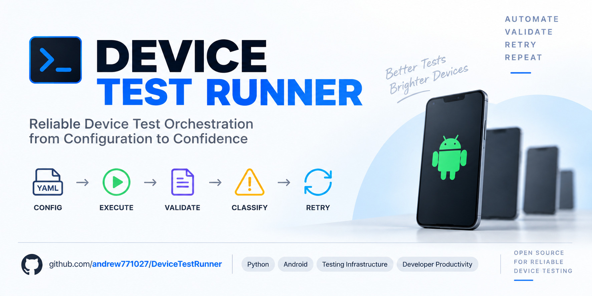

<p align="center">
  
</p>

# Device Test Runner

Device Test Runner 是一個針對 **Device Validation Domain** 設計的測試流程執行器。

它負責載入測試設定、執行測試生命週期、控制外部 commands 或 scripts、保存並驗證執行 artifacts，以及依照 policy 重試 command 或 artifact validation 失敗的步驟。目前也支援 per-step timeout 與 Python API cancellation；後續將延伸至 recorder lifecycle，以及 controller／worker 架構。

Device Test Runner 的定位不是取代既有的硬體測試腳本，而是在既有工具之上提供一層統一的 **orchestration layer**。

---

## Overview

在 Device Validation Lab 中，一個測試流程通常包含：

1. 準備裝置與環境
2. Flash device build
3. 啟動 recorder
4. 執行 test scenario
5. 停止 recorder
6. 收集測試輸出
7. 驗證 artifacts
8. 產生測試報告
9. 清理測試環境

這些流程可能由不同的 Bash、Python、ADB、Fastboot、Appium 或其他工具完成。

Device Test Runner 將這些既有工具組合成一致的測試生命週期，並統一管理：

* Execution order
* Step status
* Retry
* stdout
* stderr
* Artifacts
* Validation
* Cleanup
* Execution summary

目前 runtime v1.6.0 已完成 lifecycle orchestration、artifact validation、selective retry、required／optional artifact 與 cancellation foundation。呼叫端可透過 `CancellationToken` 取消一般工作及 retry delay，報告以 `CANCELLED` 區分取消與失敗。Process-tree cleanup、CLI signal 接線、例外下的完整 cleanup guarantees、recorder lifecycle 和 distributed execution 仍待完成。

---

## Project Goals

Device Test Runner 的主要目標包括：

* 使用 YAML 定義 device test scenario
* 將 runner 與 domain scripts 分離
* 支援完整 test lifecycle
* 使用 subprocess 執行既有 scripts 和 commands
* 統一管理 stdout、stderr、report 和 measurement artifacts
* 即使測試失敗，也能正確執行 teardown
* 提供 artifact validation
* 支援 recorder 與 scenario 的協作
* 建立可追蹤的 execution report
* 未來支援 remote worker 與 controller／worker 架構
* 未來支援 keyword-driven test definition

---

## Design Principles

### Orchestration over Domain Logic

Device Test Runner 負責測試流程控制，不負責所有硬體測試細節。

例如：

* Flash script 負責實際刷機
* Recorder 負責實際量測
* Scenario script 負責操作裝置
* Parser 負責解析量測結果
* Device Test Runner 負責安排執行順序、處理錯誤並保存結果

### Configuration-Driven

測試流程透過 YAML configuration 定義，避免將每個 test case 寫死在 runner 裡。

### Artifact-First

每次測試執行都應保留足夠資訊，讓失敗可以被追蹤與重現。

### Failure-Aware Lifecycle

即使 setup 或 scenario 失敗，teardown、recorder stop 和 artifact finalization 仍應盡可能執行。

### Incremental Evolution

專案先建立可靠的單機 runner，再逐步延伸到 remote execution 和 distributed architecture。

---

## Current Architecture

```text
YAML Configuration
        ↓
Config Loader
        ↓
RunnerConfig
        ↓
DeviceTestRunner
        ├── Lifecycle Orchestration
        ├── CancellationToken
        ├── RetryPolicy
        ├── SubprocessExecutor
        ├── ArtifactManager
        ├── ArtifactValidator
        └── JsonReporter
                ↓
       result.json / per-attempt logs / validation results
```

Device Test Runner 的核心資料流：

```text
Config
  ↓
Runner
  ↓
Executor
  ↓
StepResult
  ↓
ArtifactManager
        ↓
RunResult / result.json
```

詳細架構說明請參考：

* [Architecture v1.6.0](docs/architecture/architecture_v1.6.0.md)
* [Test Matrix v1.6.0](docs/test_matrix/test_matrix_v1.6.0.md)
* [Acceptance Criteria v1.6.0](docs/acceptance_criteria/acceptance_criteria_v1.6.0.md)
* [Definition of Done v1.6.0](docs/definition_of_done/definition_of_done_v1.6.0.md)
* [Roadmap](docs/roadmap.md)

---

## Test Lifecycle

目前 Device Test Runner 使用以下生命週期：

```text
global_setup
    ↓
setup
    ↓
scenario
    ↓
teardown
    ↓
global_teardown
```

各階段用途：

| Stage             | Responsibility        |
| ----------------- | --------------------- |
| `global_setup`    | 整次測試執行前的一次性環境準備       |
| `setup`           | Test case 執行前的裝置與環境設定 |
| `scenario`        | 執行主要測試內容              |
| `teardown`        | 清理單一 test case 產生的狀態  |
| `global_teardown` | 整次測試執行完成後的最終清理        |

階段失敗時，Runner 依下列規則路由：

| 失敗位置 | 後續行為 |
| --- | --- |
| `global_setup` | 停止當前 stage，跳過 `setup`、`scenario` 與 `teardown`，仍執行 `global_teardown` |
| `setup` | 停止當前 stage，跳過 `scenario`，仍執行 `teardown` 與 `global_teardown` |
| `scenario` | 停止當前 stage 的剩餘 steps，仍執行 `teardown` 與 `global_teardown` |
| `teardown` | 記錄失敗但繼續執行該 stage 的剩餘 steps，之後執行 `global_teardown` |
| `global_teardown` | 記錄失敗但繼續執行該 stage 的剩餘 steps |

上述為一般失敗路由。v1.6.0 進入 setup 區塊後，即使 setup／scenario 取消，仍執行兩個 cleanup stages；run 開始前或 global_setup 取消時只執行 global_teardown。如果 global_setup 成功後、進入 setup 區塊前已觀察到取消，也會跳過 teardown。Cleanup attempt 使用新的 token；這些是受控流程的 best effort，不涵蓋未處理 Python exception 或 KeyboardInterrupt。

最終 `summary.status` 以 `CANCELLED` 優先；沒有取消時，failed step、skipped step 或 required artifact failure 任一存在即為 `FAILED`，其餘為 `PASSED`。

未來 recorder lifecycle 會與 scenario 協作：

```text
start recorder
    ↓
wait until recorder is ready
    ↓
execute scenario
    ↓
stop recorder
    ↓
collect recorder artifacts
```

---

## Project Structure

```text
DeviceTestRunner/
├── README.md
├── CHANGELOG.md
├── main.py
├── pyproject.toml
├── configs/
│   └── sample.yaml
├── docs/
│   ├── architecture/
│   ├── acceptance_criteria/
│   ├── definition_of_done/
│   ├── test_matrix/
│   └── roadmap.md
├── runner/
│   ├── artifact.py
│   ├── artifact_validator.py
│   ├── cancellation.py
│   ├── config.py
│   ├── executor.py
│   ├── models.py
│   ├── reporter.py
│   ├── retry.py
│   └── runner.py
└── tests/
    ├── test_artifact_validator.py
    ├── test_retry.py
    └── ...
```

實際目錄可能隨版本演進調整。

---

## Configuration Example

以下是一個簡化的 YAML configuration：

```yaml
test_case:
  id: power_idle_test
  name: Power Idle Test
  description: Measure device power consumption during idle state.

device:
  serial: ABC123
  product: pixel
  build: build_12345

retry:
  max_attempts: 3
  delay_seconds: 1
  retry_on:
    - timeout
    - device_offline
    - artifact_missing

lifecycle:
  global_setup:
    steps:
      - name: check_environment
        type: command
        command: echo "Check environment"
        timeout_second: 30

  setup:
    steps:
      - name: check_device
        type: command
        command: adb -s ABC123 get-state
        timeout_second: 30

  scenario:
    steps:
      - name: run_idle_scenario
        type: command
        command: |
          printf "timestamp,power\n1,110\n" > result.csv
        timeout_second: 300

  teardown:
    steps:
      - name: restore_device
        type: command
        command: adb -s ABC123 shell input keyevent HOME
        timeout_second: 30

  global_teardown:
    steps:
      - name: finalize
        type: command
        command: echo "Finalize test run"
        timeout_second: 30

artifact:
  output_dir: artifacts
  validation:
    rules:
      - name: check_result_exists
        type: exists
        path: result.csv

      - name: check_result_content
        type: csv_content
        path: result.csv
        after_step: run_idle_scenario
        required: true
        required_columns:
          - timestamp
          - power
        min_rows: 1
```

`after_step` 將 validation rule 綁定到指定 step，runner 會在該 step 每次 command 成功後立即驗證。`required` 預設為 `true`：required rule 失敗會使 attempt 失敗，且只有 failure type 出現在 `retry.retry_on`、尚未達 `max_attempts` 時才重試；`required: false` 的失敗仍寫入 report，但不影響 step 或 run 狀態。Lifecycle 結束後會再次對所有規則執行 final validation，包括有 `after_step` 的規則。YAML 未設定 `retry_on` 時預設為空清單，因此不重試；`none`、`cancelled` 與未知值會被拒絕。直接使用 Python `RetryConfig()` 的預設清單不同，詳見 v1.6.0 Architecture。

---

## Requirements

目前專案主要使用：

* Python 3.10+
* Standard library
* PyYAML
* pytest

專案刻意減少第三方 dependencies，讓核心 orchestration 邏輯保持清楚，並將學習重點放在：

* Python design
* subprocess
* process lifecycle
* test lifecycle
* artifact management
* error handling
* distributed systems

---

## Installation

先安裝 Python 3.10+ 與 Poetry 2.x。Poetry 安裝方式請參考 [官方安裝說明](https://python-poetry.org/docs/#installation)。

Clone repository：

```bash
git clone git@github.com:andrew771027/DeviceTestRunner.git
cd DeviceTestRunner
```

使用 Poetry 安裝專案與 dependencies：

```bash
poetry install
```

Poetry 會管理 virtual environment，並依 `poetry.lock` 安裝鎖定版本的 dependencies。pytest、pytest-cov 與 pre-commit 會一併安裝。

後續指令透過 `poetry run` 在專案環境執行，無需手動啟用 virtual environment。詳見 [Poetry 使用說明](https://python-poetry.org/docs/basic-usage/)。

---

## Running the Tests

執行所有測試：

```bash
poetry run pytest
```

顯示較完整輸出：

```bash
poetry run pytest -v
```

只執行 retry 相關測試：

```bash
poetry run pytest -m retry
```

只執行 cancellation 標記測試（不等同完整 suite）：

```bash
poetry run pytest -m cancelled
```

只執行 artifact 相關測試：

```bash
poetry run pytest -m artifact
```

---

本機驗證（2026-09-12，Python 3.14）：`.venv/bin/python -m pytest -q` → **153 passed in 39.39s**。150 個測試函式皆有 Given／When／Then 說明；參數化後共 153 個案例。

## Running Device Test Runner

使用目前的 entry point 執行：

```bash
poetry run python main.py --config configs/sample.yaml
```

`configs/sample.yaml` 是示範流程，目前不能視為全數通過的範例。2026-09-12 以暫存 output directory 執行得到 `FAILED`：`run_unstable_command` 的 process error 未列入 sample 的 `retry_on`，後續一步被跳過，且五項 required artifact rules 失敗。詳細結果見 [Definition of Done](docs/definition_of_done/definition_of_done_v1.6.0.md)。

未來 CLI 預計提供：

```bash
device-test-runner run configs/sample.yaml
device-test-runner validate configs/sample.yaml
device-test-runner report show artifacts/<run-id>/result.json
```

---

## Cancellation (Python API)

取消由呼叫端持有 token 並呼叫 `cancel()`；`main.py` 尚未將 Ctrl+C／SIGTERM 轉為 token cancellation。以下示範沿用載入的 configuration，在兩秒後提出取消請求：

```python
from pathlib import Path
from threading import Timer

from runner.artifact import ArtifactManager
from runner.artifact_validator import ArtifactValidator
from runner.cancellation import CancellationToken
from runner.config import ConfigLoader
from runner.executor import SubprocessExecutor
from runner.failure import FailureClassifier
from runner.reporter import JsonReporter
from runner.runner import DeviceTestRunner

config = ConfigLoader().load("configs/sample.yaml")
classifier = FailureClassifier()
runner = DeviceTestRunner(
    executor=SubprocessExecutor(Path.cwd(), classifier),
    artifact_manager=ArtifactManager(config.artifact.output_dir),
    artifact_validator=ArtifactValidator(),
    failure_classifier=classifier,
    reporter=JsonReporter(),
    show_console_output=False,
)
token = CancellationToken()
timer = Timer(2.0, token.cancel)
timer.start()
try:
    result = runner.run(config, cancellation_token=token)
    print(result.summary.status)
finally:
    timer.cancel()
    timer.join()
```

Executor 以 0.1 秒 polling 檢查取消與 timeout，對直接子程序 terminate、等待兩秒後必要時 kill。尚未處理整棵 process tree，後代程序持有 stdout／stderr pipe 時，完成時間可能延長；上述 timer 不是兩秒內返回的保證。Cancelled attempt 不做 attempt validation 或 retry，但 run 最後仍驗證所有 artifacts。

Python 呼叫端需調整 `SubprocessExecutor.execute(..., cancellation_token=...)`，以及手動建構 result dataclasses 時的新欄位。`run(config)` 仍可不傳 token。完整差異見 [Architecture](docs/architecture/architecture_v1.6.0.md)。

---

## Artifact Output

每次測試執行會建立獨立的 run directory。

範例：

```text
artifacts/
└── power_idle_test_20260722_223000/
    ├── result.json
    ├── global_setup/
    │   └── check_environment/
    │       ├── attempt_1.stdout.log
    │       └── attempt_1.stderr.log
    ├── scenario/
    │   └── run_idle_scenario/
    │       ├── attempt_1.stdout.log
    │       ├── attempt_1.stderr.log
    │       ├── attempt_2.stdout.log
    │       └── attempt_2.stderr.log
    └── result.csv
```

`result.json` 包含：

* Test case metadata
* Device metadata
* Start time
* End time
* Total duration
* Final status
* Lifecycle stage results
* Step results
* stdout and stderr artifact paths
* Validation results
* Retry information
* Per-attempt failure type, `timed_out` and `cancelled`
* Metadata `cancel_requested` and summary `cancelled_steps`

相對路徑的 artifact validation rule 會以該次 run directory 為基準解析。每一次 retry 都有獨立的 stdout／stderr log，避免後一次 attempt 覆蓋先前的診斷資訊。

---

## Example Report

以下是單一步驟、無 artifact rules 的示意資料，並非 sample.yaml 的實際執行報告。

```json
{
  "metadata": {
    "test_case_id": "example_001",
    "test_case_name": "Example",
    "test_case_description": "Print one line.",
    "device_serial": "demo",
    "device_product": "demo",
    "device_build": "demo",
    "runner_version": "1.6.0",
    "started_at": "2026-09-12T00:00:00+00:00",
    "finished_at": "2026-09-12T00:00:01+00:00",
    "cancel_requested": false
  },
  "summary": {
    "status": "PASSED",
    "configured_steps": 1,
    "executed_steps": 1,
    "passed_steps": 1,
    "failed_steps": 0,
    "cancelled_steps": 0,
    "skipped_steps": 0,
    "configured_artifact_rules": 0,
    "passed_artifact_rules": 0,
    "failed_artifact_rules": 0,
    "failed_required_artifact_rules": 0,
    "duration_seconds": 1.0
  },
  "step_results": [
    {
      "stage": "scenario",
      "name": "hello",
      "command": "echo hello",
      "attempts": 1,
      "success": true,
      "cancelled": false,
      "attempt_results": [
        {
          "attempt": 1,
          "success": true,
          "failure_type": "none",
          "timed_out": false,
          "cancelled": false,
          "exit_code": 0,
          "duration_seconds": 0.1,
          "stdout": "hello\n",
          "stderr": "",
          "stdout_log_path": "artifacts/example/scenario/hello/attempt_1.stdout.log",
          "stderr_log_path": "artifacts/example/scenario/hello/attempt_1.stderr.log",
          "error": null,
          "artifact_validation_results": []
        }
      ],
      "duration_seconds": 0.2
    }
  ],
  "artifact_dir": "artifacts/example",
  "artifact_validation_results": []
}
```

結果消費端應以 `summary.status` 判斷 run；`RunResult.passed` 目前只檢查 step success，無法完整反映取消請求或 final artifact failure。`StepAttemptResult.passed` 也只檢查 exit code，請使用 `success` 與 failure flags。

---

## Roadmap

| Version | Topic                        | Status      |
| ------- | ---------------------------- | ----------- |
| v1.0    | Basic YAML Runner            | Completed   |
| v1.1    | Naming and Model Refactoring | Completed   |
| v1.2    | Artifact Management          | Completed   |
| v1.3    | Test Lifecycle               | Completed   |
| v1.3.5  | Command Output Pipeline      | Completed   |
| v1.4    | Artifact Validation          | Completed   |
| v1.4.1  | Validation Improvements      | Completed   |
| v1.5    | Retry Policy                 | Completed   |
| v1.5.1  | Artifact-Aware Retry          | Completed   |
| v1.5.2  | Failure Classification        | Completed   |
| v1.5.3  | Selective Retry and Artifact Criticality | Completed   |
| v1.6.0  | Cancellation Foundation      | Completed |
| v1.6.1  | Safe Process Termination     | Planned     |
| v1.6.2  | Run-level Timeout            | Planned     |
| v1.6.3  | Cancellation-aware Cleanup   | Planned     |
| v1.7.0  | Static Variables             | Planned     |
| v1.7.1  | Environment                  | Planned     |
| v1.7.2  | Runtime Context              | Planned     |
| v1.8    | Recorder Lifecycle           | Planned     |
| v1.9    | Hook and Teardown Guarantees | Planned     |
| v1.10    | Execution Summary            | Planned     |
| v1.11   | Job Model                    | Planned     |
| v1.12   | Batch Runner                 | Planned     |
| v1.13   | Multi-Process Execution      | Planned     |
| v1.14   | Concurrency Limit            | Planned     |
| v1.15   | Resource / Device Lock       | Planned     |
| v2.0    | Controller and Worker        | Future      |

完整版本規劃請參考：

[Device Test Runner Roadmap](docs/roadmap.md)

---

## Keyword-Driven Direction

未來 Device Test Runner 將支援 Keyword-Driven 測試定義。

目標是讓較不熟悉 Python 或 Bash 的 Lab 成員，可以使用高階 domain keywords 組合測試流程。

範例：

```yaml
scenario:
  steps:
    - keyword: flash_device
      arguments:
        image: build_12345.zip

    - keyword: start_power_recorder
      arguments:
        sampling_rate: 1000

    - keyword: set_brightness
      arguments:
        level: 50

    - keyword: play_video
      arguments:
        duration_seconds: 300

    - keyword: stop_power_recorder
```

預計加入：

* KeywordRegistry
* KeywordExecutor
* KeywordDefinition
* KeywordContext
* Domain Keyword Libraries
* Keyword parameter validation
* Keyword documentation generation

YAML 仍會作為底層 scenario definition，Keyword-Driven layer 則建立在 lifecycle 與 executor 之上。

---

## Versioning

本專案預計使用 Semantic Versioning：

```text
MAJOR.MINOR.PATCH
```

例如：

```text
v1.4.0
v1.4.1
v1.5.0
v1.5.1
v1.5.2
v1.5.3
v1.6.0
v2.0.0
```

目前 `DeviceTestRunner.VERSION`、report 與 `pyproject.toml` distribution version 均為 `1.6.0`。

版本規則：

* `MAJOR`：重大架構變更或不相容改動
* `MINOR`：新增向下相容功能
* `PATCH`：Bug fix 或小型改善

例如：

* `v1.4.0`：加入 Artifact Validation
* `v1.4.1`：修正 file size validation
* `v1.5.0`：加入 Retry Policy
* `v1.5.1`：加入 step-scoped Artifact-Aware Retry
* `v1.5.2`：加入可追蹤且可驅動 retry decision 的 Failure Classification
* `v1.5.3`：加入 `retry_on` selective retry 與 required／optional artifact semantics
* `v1.6.0`：加入 cancellation token、可中斷 retry delay 與取消結果
* `v2.0.0`：加入 Controller／Worker architecture

---

## Development Workflow

建議使用簡化版 GitHub Flow：

```text
main
 ├── feature/artifact-validation
 ├── feature/retry-policy
 ├── feature/recorder-lifecycle
 ├── fix/report-status
 └── docs/update-architecture
```

開發流程：

```text
Roadmap
   ↓
GitHub Milestone
   ↓
GitHub Issue
   ↓
Feature Branch
   ↓
Pull Request
   ↓
Merge to main
   ↓
Git Tag
   ↓
GitHub Release
```

Branch naming examples：

```text
feature/artifact-validation
feature/retry-policy
fix/timeout-result
test/add-lifecycle-integration-test
docs/update-roadmap
```

---

## Definition of Done

一個版本完成前，至少應滿足：

* 功能已實作
* Unit tests 通過
* Integration tests 通過
* Example YAML 可以執行
* Error handling 已確認
* Artifacts 可以被保存
* `result.json` 格式已確認
* README 或 docs 已更新
* `CHANGELOG.md` 已更新
* 對應 GitHub Issues 已關閉
* Git tag 已建立
* GitHub Release notes 已建立

---

## Current Development Focus

目前已完成：

1. v1.3 Test Lifecycle
2. v1.3.5 Command Execution & Log Pipeline
3. v1.4／v1.4.1 Artifact Validation
4. v1.5 Retry Policy 與 per-attempt logs
5. v1.5.1 Artifact-Aware Retry 與 per-attempt validation results
6. v1.5.2 Failure Classification 與 failure-aware retry decision
7. v1.5.3 Selective Retry 與 Artifact Criticality
8. v1.6.0 Cancellation Foundation

接下來的優先事項：

1. v1.6.1 Safe Process Termination：process group／child cleanup、stdout／stderr 收尾、retry 前程序清理與 Ctrl+C／SIGINT
2. v1.6.2 Run-level Timeout：`run_timeout_seconds`、逾時轉為取消請求，區分 step 與 run timeout
3. v1.6.3 Cancellation-aware Cleanup：取消後 teardown、獨立 cleanup scope／timeout 與 partial artifact／report policy
4. v1.7.0～v1.7.2 Static Variables、Environment 與 Runtime Context
5. v1.8 Recorder Lifecycle
6. v1.9 Hook and Teardown Guarantees
7. v1.10 Execution Summary
8. Job、batch、concurrency 與 device lock
9. 單機 execution model 穩定後進入 Controller／Worker

目前不優先處理：

* 複雜 Web UI
* Kubernetes deployment
* 大型 message queue
* Microservices 拆分
* 多租戶權限
* 過度抽象的 plugin architecture
* 複雜 distributed scheduling

目前最重要的是建立可靠且可測試的單機 execution lifecycle。

---

## Long-Term Direction

Device Test Runner 預計從單機測試執行器逐步演化為 Device Validation Platform 的核心執行層。

```text
Existing Scripts
       ↓
Device Test Runner
       ↓
Lifecycle Orchestration
       ↓
Artifact Management
       ↓
Artifact Validation
       ↓
Recorder Coordination
       ↓
Remote Worker
       ↓
Controller
       ↓
Device Validation Platform
```

這個專案同時作為以下能力的實作練習：

* Python software design
* Test architecture
* Test lifecycle
* Orchestration
* Process management
* Artifact management
* Reliability engineering
* Distributed systems
* Developer productivity
* Test infrastructure
* Platform engineering

---

## Continuous Integration

This project uses GitHub Actions for continuous integration.

The CI workflow runs automatically on:

- pushes to `main`
- pull requests targeting `main`

The workflow performs the following steps:

1. Checkout the repository
2. Setup Python
3. Install Poetry
4. Install project dependencies
5. Run the pytest test suite

Workflow:

`.github/workflows/ci.yml`

### Run the same checks locally

```bash
poetry install
poetry run pytest
```

---

## Documentation

* [Architecture v1.6.0](docs/architecture/architecture_v1.6.0.md)
* [Definition of Done v1.6.0](docs/definition_of_done/definition_of_done_v1.6.0.md)
* [Test Matrix v1.6.0](docs/test_matrix/test_matrix_v1.6.0.md)
* [Acceptance Criteria v1.6.0](docs/acceptance_criteria/acceptance_criteria_v1.6.0.md)
* [Roadmap](docs/roadmap.md)
* [Changelog](CHANGELOG.md)

---

## Project Status

Device Test Runner 目前仍在持續開發中。

現階段專案重點是建立一個清楚、可靠、可測試的單機 Device Test Runner，並逐步加入實際 Device Validation 所需的 lifecycle、artifact、recorder 與 failure handling 能力。


## Manual Release Documentation Workflow

`.github/workflows/manual.yml` 的 `workflow_dispatch` 接受 `release_version`（如 `1.6.0`，不含 v）、`target_branch`（實際 checkout 與 push 的既有分支）及 `model`。GitHub Actions 的 Use workflow from 選項決定讀取哪個分支的 workflow 定義。

流程先安裝專案、跑 baseline tests，再請 Codex 更新文件與測試說明；驗證 `pytest -q`、`git diff --check` 與 Given／When／Then 行數後，有變更才 commit 並直接 push 到目標分支。這個流程不建立 PR、tag 或 GitHub Release。

Repository secret 名稱為 `OPENAI_API_KEY`，在 CLI invocation 映射成 `CODEX_API_KEY`；`--approve-for-me` 與 `--sandbox` 不同時使用。目標分支需允許這次 push，API 帳戶需有可用額度及模型存取權。
