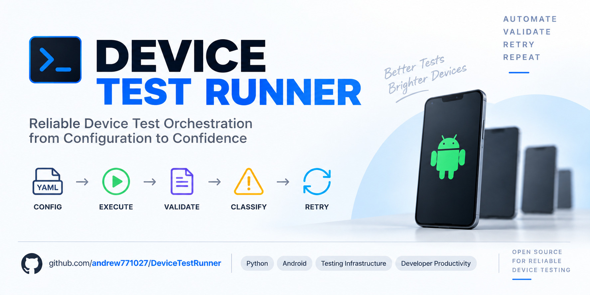

<p align="center">
  
</p>

# Device Test Runner

Device Test Runner 使用 YAML 定義裝置測試流程，執行既有的 Bash、Python、ADB 等命令，並保存每次執行的輸出與 JSON 報告。它負責安排測試步驟、驗證輸出檔案，以及依設定重試失敗步驟；裝置操作仍由你的腳本處理。

目前版本為 **v1.6.3**。支援五階段測試流程、整次執行、清理範圍與步驟逾時、選擇性重試、輸出檔案驗證、程序群組清理與 Ctrl+C 取消。

## 解決的痛點

- 測試命令散落在不同腳本：用 YAML 統一描述準備、測試與清理順序，沿用既有 Bash、Python 或 ADB 命令。
- 命令成功不代表產物正確：檢查檔案是否存在、大小、副檔名、目錄內容，以及 CSV／JSON 內容。
- 偶發失敗難以重現：依失敗類型重試，為每次嘗試保留獨立 stdout／stderr。
- 測試卡住或中途停止：設定逾時、提出取消請求，並依生命週期規則執行清理。
- 人工整理結果費時：每次執行產生獨立目錄與 JSON 報告，供檢查與自動化處理。

## 專案架構

```text
YAML Configuration
        ↓
Config Loader
        ↓
RunnerConfig
        ↓
DeviceTestRunner
        ├── Lifecycle Orchestration
        ├── CleanupScope / scope watchdogs
        ├── CancellationToken
        ├── RetryPolicy
        ├── SubprocessExecutor
        ├── ArtifactManager
        ├── ArtifactValidator
        └── JsonReporter
                ↓
       result.json / per-attempt logs / validation results
```

| 路徑 | 用途 |
| --- | --- |
| `main.py` | CLI 入口，載入設定並啟動測試 |
| `runner/` | 流程控制、命令執行、重試、取消、產物驗證與報告 |
| `configs/` | YAML 設定範例 |
| `scripts/` | 供測試流程呼叫的腳本 |
| `tests/` | 專案自動化測試 |
| `docs/` | 架構、測試、驗收與版本文件 |

詳細介面與執行流程見 [v1.6.3 架構](docs/architecture/architecture_v1.6.3.md)。

## 安裝

需要 Python 3.10+ 與 Poetry 2.x。程序群組清理使用 POSIX signal API；目前本機驗證為 macOS，沒有 Windows 支援驗證。在專案目錄執行：

```bash
git clone https://github.com/andrew771027/DeviceTestRunner.git
cd DeviceTestRunner
poetry install
```

Poetry 會建立虛擬環境，依 `poetry.lock` 安裝專案與開發依賴。後續指令都透過 `poetry run` 執行。

## 快速開始

將以下內容存為 `configs/hello.yaml`。此範例使用 POSIX shell 的 echo，不需要裝置。

```yaml
test_case: {id: hello, name: Hello Runner, description: Print one line.}
device: {serial: demo, product: demo, build: demo}
lifecycle:
  global_setup: {steps: []}
  setup: {steps: []}
  scenario:
    steps:
      - name: hello
        type: command
        command: echo hello
  teardown: {steps: []}
  global_teardown: {steps: []}
artifact:
  output_dir: artifacts
```

在專案根目錄執行：

```bash
poetry run python main.py --config configs/hello.yaml
```

到 `artifacts/` 下當次 run directory 查看 `result.json` 與 stdout／stderr logs。以 `summary.status` 判斷結果：PASSED、FAILED、CANCELLED 或 TIMED_OUT。TIMED_OUT 目前仍回傳 exit code 0，自動化需讀取報告。

完整操作、所有設定欄位的必填／選填、預設值、用途與範例，請閱讀 [使用手冊](docs/user_manual.md)。命令在 run directory 執行；引用專案腳本使用 `$DEVICE_TEST_RUNNER_ROOT`。ADB 等外部工具與裝置需自行準備，`device` 欄位只提供報告資訊。

## 執行專案測試

執行所有測試：

```bash
poetry run pytest
```

顯示較完整輸出：

```bash
poetry run pytest -v
```

只執行 retry 相關測試：

```bash
poetry run pytest -m retry
```

只執行 cancellation 標記測試（不等同完整 suite）：

```bash
poetry run pytest -m cancelled
```

只執行 artifact 相關測試：

```bash
poetry run pytest -m artifact
```

測試工具與撰寫方式見 [測試指南](docs/test_guide.md)；覆蓋範圍與驗證紀錄見 [測試矩陣](docs/test_matrix/test_matrix_v1.6.3.md) 與 [完成條件](docs/definition_of_done/definition_of_done_v1.6.3.md)。

## 持續整合

[CI workflow](.github/workflows/ci.yml) 會在 push 至 `main` 或建立以 `main` 為目標的 pull request 時執行。流程安裝 Python、Poetry 與專案依賴後，執行 pytest。

在本機執行相同的測試：

```bash
poetry install
poetry run pytest
```

## 限制與後續規劃

目前以單機命令流程為主。Recorder 管理、批次與並行執行、controller／worker 遠端執行仍在規劃中；詳細範圍與進度見 [Roadmap](docs/roadmap.md)。

程序清理與平台限制見 [Process Lifecycle](docs/process_lifecycle.md)。執行逾時後的 cleanup 與最終產物驗證可能延長返回時間；自動化整合請讀取報告狀態，`TIMED_OUT` 目前仍會回傳 exit code 0。

維護者提交、發佈與操作手動文件更新 workflow 時，請參閱 [提交與發佈檢查清單](CommitManual.md)。

## 文件

| 文件 | 用途 |
| --- | --- |
| [快速開始](#快速開始) | 建立第一個設定並查看結果 |
| [CHANGELOG](CHANGELOG.md) | 歷史變更與版本差異 |
| [使用手冊](docs/user_manual.md) | 操作步驟、設定欄位、範例與結果判讀 |
| [Roadmap](docs/roadmap.md) | 後續功能與版本規劃 |
| [Process Lifecycle](docs/process_lifecycle.md) | 程序清理行為與限制 |
| [Cancellation-Aware Cleanup](docs/cancellation_aware_cleanup.md) | v1.6.3 cleanup scope、逾時、partial artifacts 與報告優先順序 |
| [提交檢查清單](CommitManual.md) | 提交、發佈與文件維護流程 |
| [架構 v1.6.3](docs/architecture/architecture_v1.6.3.md) | 元件、取消路由、報告欄位與相容性 |
| [測試指南](docs/test_guide.md) | Pytest 工具、fixture、Mock 與各版用法 |
| [測試矩陣 v1.6.3](docs/test_matrix/test_matrix_v1.6.3.md) | 功能對應的測試與覆蓋限制 |
| [驗收條件 v1.6.3](docs/acceptance_criteria/acceptance_criteria_v1.6.3.md) | 可觀察的預期行為 |
| [完成條件 v1.6.3](docs/definition_of_done/definition_of_done_v1.6.3.md) | 驗證紀錄與待完成的發佈項目 |

`docs/` 內的舊版文件保留當時的設計與介面，使用時請確認版本。
