# Device Test Runner Architecture v1.5.1 — Artifact-aware Retry

## 1. 版本定位

Device Test Runner v1.5.1 延續 v1.5.0 的 Retry Policy，但將 Retry Decision 從單純的：

```text
Execution Result
```

擴充為：

```text
Execution Result
+
Artifact Validation Result
```

v1.5.0：

```text
Attempt
    ↓
Command Execution
    ↓
exit_code / timeout / error
    ↓
Retry Decision
```

v1.5.1：

```text
Attempt
    ↓
Command Execution
    ↓
Attempt Artifact Validation
    ↓
Execution Result
+
Artifact Validation Result
    ↓
Retry Decision
```

因此 v1.5.1 可以定位成：

> **Artifact-aware Retry Policy**

核心問題是：

> Command 回傳 `exit_code == 0`，但是預期 Artifact 不存在、內容無效或 Validation Failure 時，Runner 是否應該重新執行？

---

# 2. 為什麼 v1.5.0 還不夠

v1.5.0 的 Retry Decision 主要依賴：

```text
AttemptResult.success
```

例如：

```text
Attempt 1
exit_code = 1
↓
Retry

Attempt 2
exit_code = 0
↓
PASS
```

這可以處理 Process Failure。

但 Device Validation 很常出現另一種 Failure：

```text
Command exit_code = 0

BUT

Expected Artifact Missing
```

例如：

```text
run_power_test.sh
exit_code = 0

power.csv
MISSING
```

如果 Runner 只看：

```python
attempt_result.success
```

會得到：

```text
PASS
```

但實際 Test Output 並沒有產生。

這就是：

```text
Execution Success
!=
Artifact Success
```

---

# 3. v1.5.1 的核心判定

v1.5.1 將 Attempt Success 定義成：

```text
Execution Passed
AND
Attempt Artifact Validation Passed
```

也就是：

```text
Attempt Success
=
Process Success
+
Required Artifact Success
```

流程：

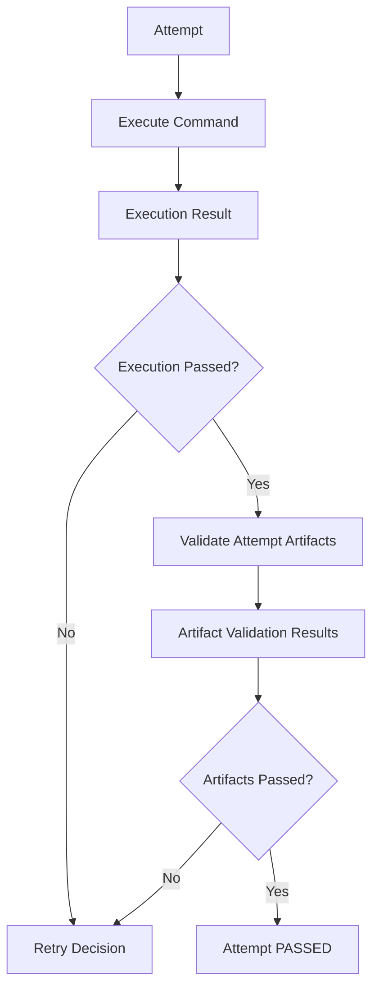

---

# 4. v1.5.0 與 v1.5.1 的差異

v1.5.0：

```text
Process failed?
    ↓
Retry
```

v1.5.1：

```text
Process failed?
OR
Required Artifact invalid?
    ↓
Retry
```

因此：

| Execution | Artifact | Attempt      |
| --------- | -------- | ------------ |
| PASS      | PASS     | PASS         |
| PASS      | FAIL     | FAIL / Retry |
| FAIL      | PASS     | FAIL / Retry |
| FAIL      | FAIL     | FAIL / Retry |

唯一真正完成成功的是：

```text
Execution PASS
AND
Artifact PASS
```

---

# 5. Architecture Evolution

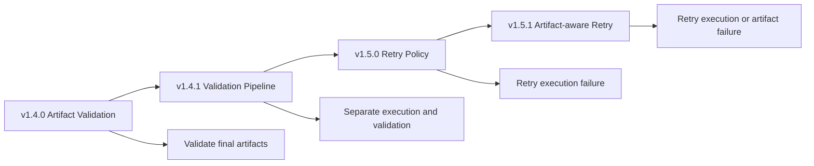

---

# 6. v1.5.1 最重要的架構變化

v1.4.x 的 Artifact Validation 是：

```text
Lifecycle 完成
↓
Artifact Validation
↓
Final Run Status
```

v1.5.1 新增另一種 Validation：

```text
Attempt 完成
↓
Attempt Artifact Validation
↓
Retry Decision
```

因此 v1.5.1 開始出現兩種 Validation Timing：

```text
Attempt-level Validation

Run-level Validation
```

這兩者的用途不同。

---

# 7. Attempt-level Validation

Attempt-level Validation 的目的是：

> 判斷這一次 Attempt 是否真的成功，是否需要 Retry。

例如：

```text
Attempt 1

run_scenario.sh
exit_code = 0

power.csv missing
↓
Attempt FAILED
↓
Retry
```

這不是最終報表 Validation。

它是：

```text
Execution Policy Input
```

也就是 Retry Decision 的一部分。

---

# 8. Run-level Validation

v1.4.x 已經存在的 Validation 仍然保留：

```text
Lifecycle 完成
↓
global_teardown 完成
↓
Final Artifact Validation
↓
ValidationSummary
↓
RunResult.status
```

它回答：

> 整次 Test Run 最終留下來的 Artifact 是否有效？

因此：

```text
Attempt Validation
=
Should retry?

Final Validation
=
Should run pass?
```

這兩個問題不能混為一談。

---

# 9. Validation Timing Architecture

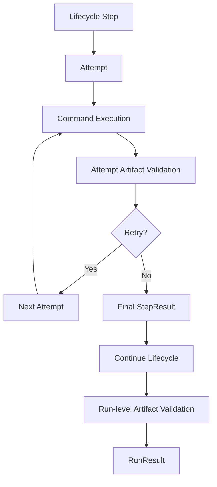

---

# 10. Retry Decision 的 Inputs

v1.5.0：

```text
RetryDecision
← AttemptResult
← RetryPolicy
```

v1.5.1：

```text
RetryDecision
← AttemptResult
← AttemptArtifactValidationResult
← RetryPolicy
```

因此：

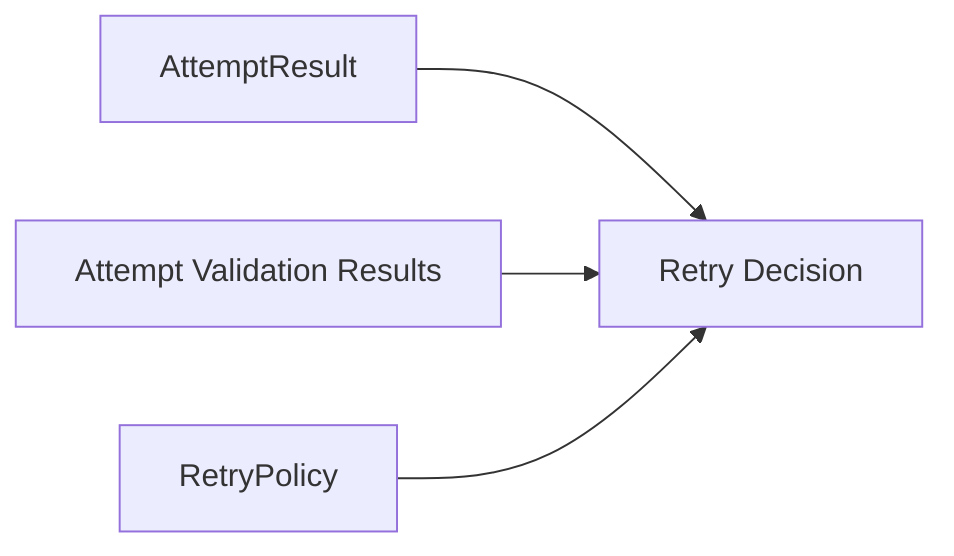

這是 v1.5.1 最核心的 Architecture Change。

---

# 11. 不應讓 ArtifactValidator 自己決定 Retry

不建議：

```python
artifact_validator.validate_and_retry(...)
```

因為：

```text
ArtifactValidator
```

的責任應該仍然只是：

```text
Observe
Validate
Return Result
```

它不應該知道：

```text
max_attempts
retry delay
current attempt
lifecycle stage
```

正確：

```text
ArtifactValidator
↓
ValidationResult
↓
Retry Policy / Retry Decision
```

也就是：

> Validator 提供事實，Policy 做決策。

---

# 12. Policy vs Evidence

這裡可以進一步區分：

```text
Evidence
=
Execution Result
Artifact Validation Result
```

而：

```text
Policy
=
RetryPolicy
```

Decision：

```text
Evidence
+
Policy
↓
Retry Decision
```

這是一個非常重要的架構概念：

> **Result describes what happened. Policy decides what to do next.**

---

# 13. RetryPolicy 的演進

v1.5.0：

```python
@dataclass(frozen=True)
class RetryPolicy:
    max_attempts: int = 1
    delay_seconds: float = 0
```

v1.5.1 可以開始加入：

```python
@dataclass(frozen=True)
class RetryPolicy:
    max_attempts: int = 1
    delay_seconds: float = 0

    retry_on_execution_failure: bool = True
    retry_on_artifact_failure: bool = False
```

預設：

```text
retry_on_execution_failure = True
retry_on_artifact_failure = False
```

可維持 v1.5.0 行為。

若開啟：

```yaml
retry:
  max_attempts: 3
  delay_seconds: 5
  retry_on_artifact_failure: true
```

才啟用 Artifact-aware Retry。

---

# 14. 為什麼 Artifact Retry 建議 Opt-in

不是所有 Artifact Failure 都適合 Retry。

例如：

```text
CSV missing
```

可能是 transient failure。

但：

```text
CSV schema 永遠錯
```

通常再跑三次也不會修好。

又例如：

```text
Parser config 錯誤
```

Retry 完全沒有意義。

因此：

```text
retry_on_artifact_failure
```

最好不是全域預設開啟。

---

# 15. LifecycleStepContent

可以延續 v1.5.0：

```python
@dataclass(frozen=True)
class LifecycleStepContent:
    name: str
    type: str
    command: str
    timeout_second: int
    retry: RetryPolicy = field(
        default_factory=RetryPolicy
    )
```

但問題是：

> 哪些 Artifact Rule 屬於這個 Step？

v1.4.x 的 Artifact Validation Rule 原本主要是 Run-level：

```text
artifact.validations
```

v1.5.1 需要建立：

```text
Step
↔
Attempt Artifact Rules
```

的關係。

---

# 16. Artifact Rule Scope

v1.5.1 很重要的新概念是：

```text
Validation Scope
```

例如：

```text
RUN scope

ATTEMPT scope
```

Run-level Rule：

```text
Lifecycle 完成後驗證
```

Attempt-level Rule：

```text
每次 Attempt 後驗證
並參與 Retry Decision
```

---

# 17. 建議加入 ValidationScope

可以使用 Enum：

```python
from enum import Enum


class ValidationScope(str, Enum):
    RUN = "run"
    ATTEMPT = "attempt"
```

Rule：

```python
@dataclass(frozen=True)
class ArtifactValidationRule:
    path: str
    required: bool = True
    min_size_bytes: int | None = None
    max_size_bytes: int | None = None
    scope: ValidationScope = ValidationScope.RUN
```

舊的 Rule：

```yaml
- path: report.csv
  required: true
```

預設：

```text
scope = run
```

因此維持 backward compatibility。

---

# 18. Attempt-level YAML

例如：

```yaml
artifact:
  output_dir: artifact/sample

  validations:

    - path: power.csv
      required: true
      min_size_bytes: 1024
      scope: attempt

    - path: final_report.json
      required: true
      min_size_bytes: 1
      scope: run
```

這代表：

```text
power.csv
→ 每個 Attempt 完成後驗證
→ 可以參與 Retry

final_report.json
→ 整個 Lifecycle 完成後驗證
→ 不參與 Retry
```

---

# 19. 另一種設計：Rule 掛在 Step

也可以：

```yaml
scenario:
  steps:
    - name: run_power_test

      retry:
        max_attempts: 3
        retry_on_artifact_failure: true

      artifacts:
        - path: power.csv
          required: true
          min_size_bytes: 1024
```

這個模型其實更自然。

因為：

```text
Artifact
```

直接屬於：

```text
產生它的 Step。
```

結構：

```text
LifecycleStepContent
├── command
├── retry
└── artifact_rules
```

---

# 20. v1.5.1 推薦 Step-scoped Artifact Rules

相較於：

```text
ArtifactConfig.validations + scope
```

我更推薦：

```text
Step-scoped Attempt Validation Rules
+
ArtifactConfig Final Run Validation Rules
```

也就是兩層：

```text
LifecycleStepContent
└── validations
    ↓
Attempt Validation

ArtifactConfig
└── validations
    ↓
Final Run Validation
```

原因是語意更清楚。

---

# 21. 建議 Model

```python
@dataclass(frozen=True)
class ArtifactValidationRule:
    path: str
    required: bool = True
    min_size_bytes: int | None = None
    max_size_bytes: int | None = None


@dataclass(frozen=True)
class RetryPolicy:
    max_attempts: int = 1
    delay_seconds: float = 0
    retry_on_execution_failure: bool = True
    retry_on_artifact_failure: bool = False


@dataclass(frozen=True)
class LifecycleStepContent:
    name: str
    type: str
    command: str
    timeout_second: int

    retry: RetryPolicy = field(
        default_factory=RetryPolicy
    )

    validations: List[ArtifactValidationRule] = field(
        default_factory=list
    )
```

現在 Step 本身就描述：

```text
要執行什麼
+
失敗後怎麼 Retry
+
成功後應產生什麼
```

這個 Domain Model 很完整。

---

# 22. Step Model Architecture

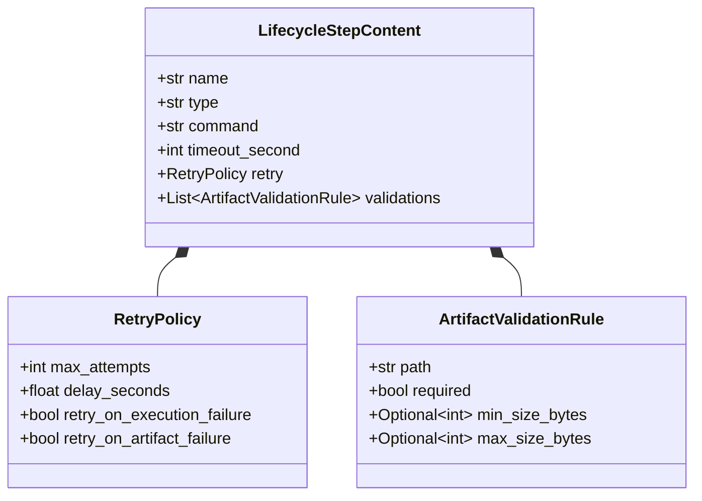

---

# 23. 為什麼 Artifact Rule 掛 Step 很合理

例如：

```text
setup_device
```

產生：

```text
setup.log
```

而：

```text
run_scenario
```

產生：

```text
power.csv
```

如果所有 Artifact Rule 都放：

```text
ArtifactConfig
```

Runner 必須額外知道：

```text
哪個 Artifact 是哪個 Step 產生的？
```

Step-scoped Rule 可以直接表達：

```text
run_scenario
→ expected power.csv
```

這對 Artifact-aware Retry 特別重要。

---

# 24. ArtifactConfig 仍保留 Final Validation

`ArtifactConfig` 不應因此消失。

它仍然可以保存：

```python
@dataclass(frozen=True)
class ArtifactConfig:
    output_dir: str
    validations: List[ArtifactValidationRule] = field(
        default_factory=list
    )
```

這些是：

```text
Final Run-level Artifacts
```

例如：

```text
summary.json
final_power_report.csv
device_dump.zip
```

因此：

```text
Step.validation
=
Attempt-level

ArtifactConfig.validation
=
Run-level
```

形成自然分層。

---

# 25. Attempt Result Model

v1.5.0 的：

```python
AttemptResult
```

現在需要開始包含 Attempt Validation。

推薦：

```python
@dataclass(frozen=True)
class AttemptResult:
    attempt: int

    execution_success: bool

    exit_code: int | None
    duration_seconds: float

    stdout: str
    stderr: str

    validation_results: List[
        ArtifactValidationResult
    ] = field(default_factory=list)

    error: str | None = None

    @property
    def validation_success(self) -> bool:
        return all(
            result.success
            for result in self.validation_results
        )

    @property
    def success(self) -> bool:
        return (
            self.execution_success
            and self.validation_success
        )
```

這是 v1.5.1 最值得注意的 Result Model 演進。

---

# 26. 為什麼區分 execution_success

以前：

```python
AttemptResult.success
```

代表：

```text
Process Execution Success
```

v1.5.1 如果 Artifact Validation 也參與 Attempt Success：

```text
success
```

語意變成：

```text
Overall Attempt Success
```

因此最好明確拆成：

```text
execution_success
validation_success
success
```

其中：

```text
success
=
execution_success
AND
validation_success
```

---

# 27. Attempt Result Hierarchy

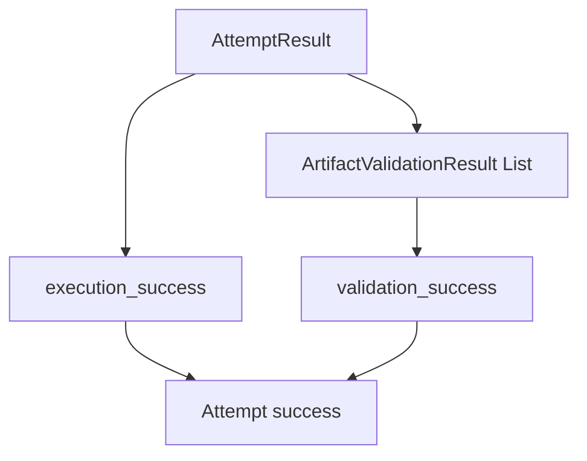

---

# 28. 空 Validation Rules 的語意

如果 Step 沒有：

```text
validations
```

則：

```python
all([])
```

為：

```text
True
```

在這裡反而是合理的。

意思是：

```text
沒有 Artifact requirement
→ Artifact Validation automatically satisfied
```

因此：

```text
Attempt success
=
execution_success
```

保持 v1.5.0 行為。

---

# 29. Attempt Execution Pipeline

v1.5.1 的單次 Attempt 可以拆成：

```text
1. Prepare Attempt Directory
2. Execute Process
3. Finalize Process Output
4. Validate Attempt Artifacts
5. Build AttemptResult
```

流程：

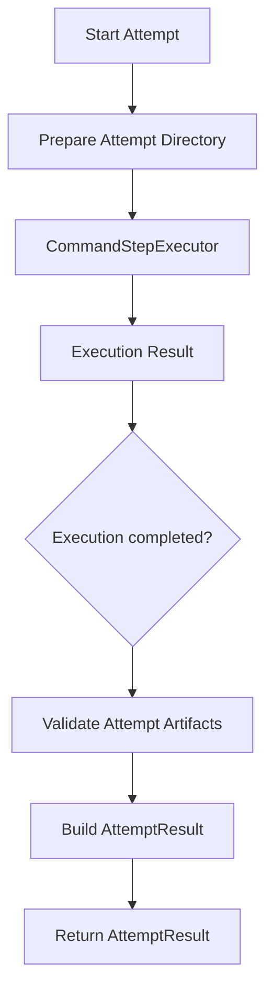

即使 execution failed，是否還要 Validate，可以依需求。

---

# 30. Execution Failure 後要不要 Attempt Validation？

推薦：

```text
可以 Validate 已存在 Artifact。
```

原因與 Run-level Validation 相同。

例如：

```text
Command FAILED
BUT
debug.log exists
```

這仍然是有價值的資訊。

但 Retry Decision 已經知道：

```text
execution_failure = True
```

因此 Artifact Validation 不會把 Attempt 變回成功。

也就是：

```text
Execution FAIL
Artifact PASS
↓
Attempt FAIL
```

---

# 31. Retry Decision Model

可以正式引入：

```python
@dataclass(frozen=True)
class RetryDecision:
    should_retry: bool
    reason: str
```

例如：

```python
RetryDecision(
    should_retry=True,
    reason="artifact_validation_failed",
)
```

或者：

```python
RetryDecision(
    should_retry=False,
    reason="max_attempts_reached",
)
```

v1.5.1 開始引入這個 Model 是合理的，因為 Retry Decision 已經不再只是：

```python
not success
```

而是有多個原因。

---

# 32. Retry Decision Reasons

可以先用簡單字串：

```text
execution_failure
artifact_validation_failure
max_attempts_reached
success
retry_disabled
```

未來再改 Enum。

例如：

```python
class RetryReason(str, Enum):
    EXECUTION_FAILURE = "execution_failure"
    ARTIFACT_FAILURE = "artifact_failure"
    MAX_ATTEMPTS_REACHED = "max_attempts_reached"
```

但 v1.5.1 不一定要急著 Enum 化。

---

# 33. Retry Decision Function

概念：

```python
def should_retry(
    attempt_result: AttemptResult,
    policy: RetryPolicy,
    current_attempt: int,
) -> RetryDecision:

    if attempt_result.success:
        return RetryDecision(
            should_retry=False,
            reason="success",
        )

    if current_attempt >= policy.max_attempts:
        return RetryDecision(
            should_retry=False,
            reason="max_attempts_reached",
        )

    if (
        not attempt_result.execution_success
        and policy.retry_on_execution_failure
    ):
        return RetryDecision(
            should_retry=True,
            reason="execution_failure",
        )

    if (
        not attempt_result.validation_success
        and policy.retry_on_artifact_failure
    ):
        return RetryDecision(
            should_retry=True,
            reason="artifact_validation_failure",
        )

    return RetryDecision(
        should_retry=False,
        reason="retry_policy_rejected",
    )
```

這是 v1.5.1 核心 Policy Logic。

---

# 34. Retry Decision Flow

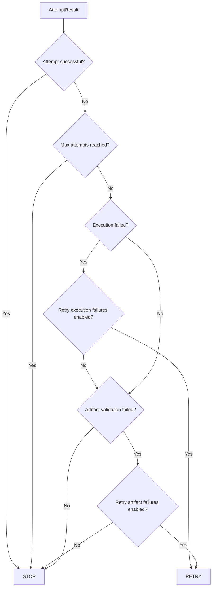

---

# 35. Artifact-aware Retry Example

Step：

```yaml
- name: run_power_test
  type: command
  command: "bash scripts/run_power_test.sh"
  timeout_second: 300

  retry:
    max_attempts: 3
    delay_seconds: 5
    retry_on_execution_failure: true
    retry_on_artifact_failure: true

  validations:
    - path: power.csv
      required: true
      min_size_bytes: 1024
```

---

# 36. Attempt 1

Execution：

```text
exit_code = 0
```

所以：

```text
execution_success = True
```

但：

```text
power.csv missing
```

所以：

```text
validation_success = False
```

因此：

```text
AttemptResult.success = False
```

Policy：

```text
retry_on_artifact_failure = True
```

所以：

```text
RETRY
```

---

# 37. Attempt 2

Execution：

```text
exit_code = 0
```

Artifact：

```text
power.csv
size = 12 KB
```

所以：

```text
execution_success = True
validation_success = True
```

因此：

```text
AttemptResult.success = True
```

Retry Loop 結束。

最終：

```text
StepResult.success = True
attempt_count = 2
```

---

# 38. Artifact-aware Retry Sequence

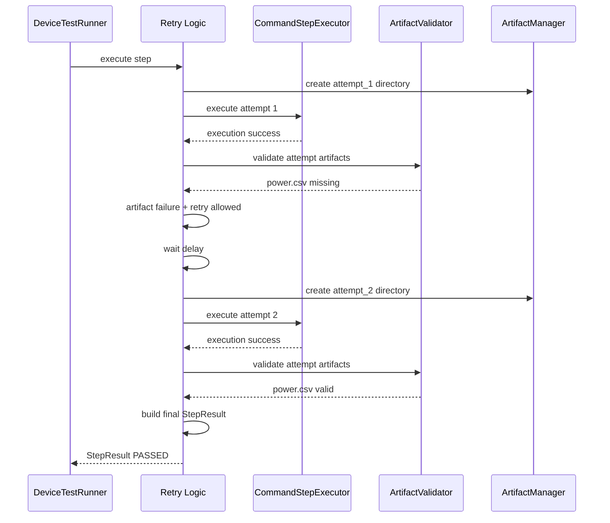

---

# 39. Artifact Directory Structure

Artifact-aware Retry 需要更明確的 Attempt Isolation。

推薦：

```text
artifact/
└── power_001_xxx/
    │
    ├── scenario/
    │   └── run_power_test/
    │       │
    │       ├── attempt_1/
    │       │   ├── stdout.log
    │       │   ├── stderr.log
    │       │   └── power.csv
    │       │
    │       └── attempt_2/
    │           ├── stdout.log
    │           ├── stderr.log
    │           └── power.csv
    │
    └── report.json
```

這裡的關鍵不是只有 log isolation。

而是：

> 每次 Attempt 的 Domain Artifact 也應盡可能隔離。

---

# 40. 為什麼 Attempt Artifact 必須隔離

假設沒有隔離。

Attempt 1：

```text
power.csv
size = 100 bytes
FAIL
```

Attempt 2 開始前沒有刪除舊檔。

Attempt 2：

```text
command 根本沒產生 power.csv
```

但 Validator 看到：

```text
Attempt 1 留下的 power.csv
```

可能誤判：

```text
Artifact exists
```

這叫做：

```text
Stale Artifact
```

是 Artifact-aware Retry 最大的陷阱之一。

---

# 41. Stale Artifact Problem

錯誤流程：

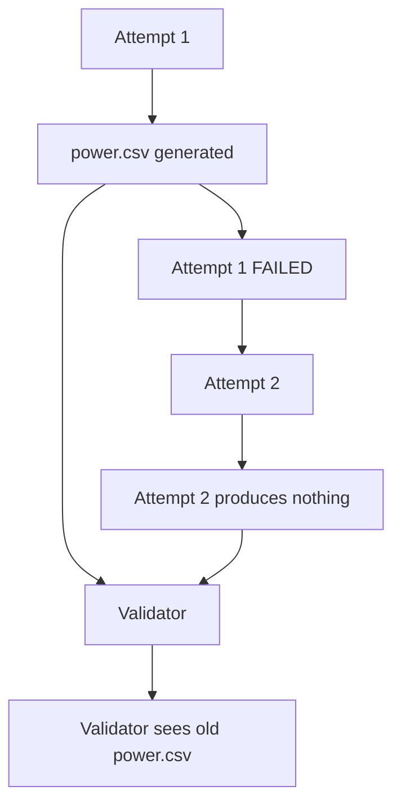

這會造成非常危險的 False Positive。

---

# 42. Attempt Isolation 是 v1.5.1 的核心要求

因此 v1.5.1 建議正式建立：

```text
Attempt Working Directory
```

或：

```text
Attempt Artifact Directory
```

每次 Attempt：

```text
attempt_1/
attempt_2/
attempt_3/
```

Validator 永遠只 Validate：

```text
Current Attempt Directory
```

而不是：

```text
整個 Run Artifact Root
```

---

# 43. Attempt Context

可以考慮增加：

```python
@dataclass(frozen=True)
class AttemptContext:
    stage: str
    step_name: str
    attempt: int
    artifact_dir: str
```

例如：

```python
AttemptContext(
    stage="scenario",
    step_name="run_power_test",
    attempt=2,
    artifact_dir=(
        ".../scenario/run_power_test/attempt_2"
    ),
)
```

它可以交給：

```text
Executor
ArtifactManager
ArtifactValidator
```

讓三者共享同一個 Attempt Scope。

---

# 44. 是否一定需要 AttemptContext？

v1.5.1 不一定需要立刻建立正式 class。

也可以傳：

```python
attempt_dir: Path
```

即可。

但概念上要明確知道：

```text
Attempt
```

現在已經是一個 Execution Scope。

這個 Scope 包含：

```text
Process
Logs
Generated Artifacts
Validation Results
```

---

# 45. Attempt Scope Architecture

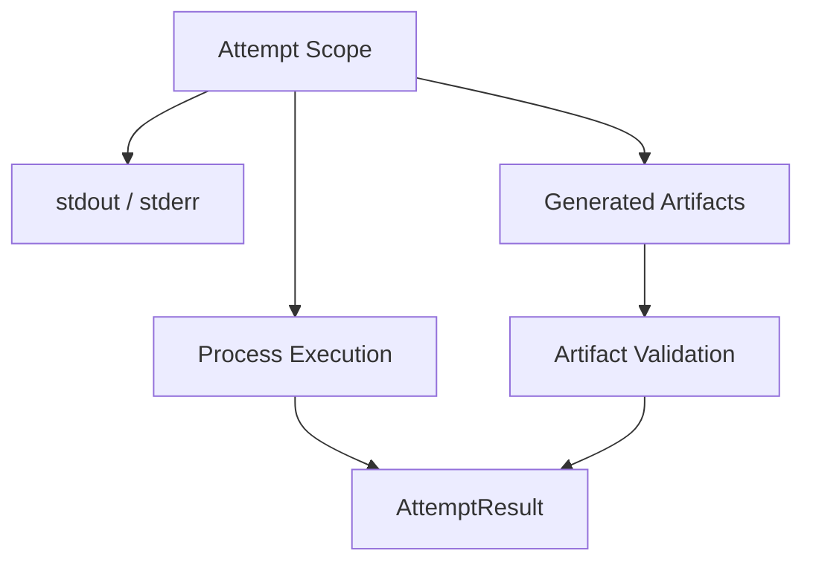

---

# 46. Executor 是否應該知道 ArtifactValidator？

不應該。

正確：

```text
Retry-aware Execution
├── CommandStepExecutor
└── ArtifactValidator
```

錯誤：

```text
CommandStepExecutor
└── ArtifactValidator
```

因為 Executor 的 responsibility 仍然是：

> 執行一次 Process。

而不是：

> 判斷這個 Attempt 是否值得 Retry。

---

# 47. 正確 Component Boundary

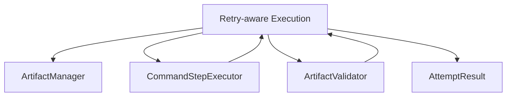

Retry Layer 是真正的 coordination point。

---

# 48. CommandStepExecutor 的輸出

v1.5.0 建議：

```text
CommandStepExecutor
→ AttemptResult
```

到了 v1.5.1 更精確的方式其實是：

```text
CommandStepExecutor
→ ExecutionAttemptResult
```

然後 Retry Layer 再組成：

```text
AttemptResult
=
Execution Result
+
Artifact Validation Result
```

可以新增：

```python
@dataclass(frozen=True)
class ExecutionAttemptResult:
    exit_code: int | None
    success: bool
    duration_seconds: float
    stdout: str
    stderr: str
    error: str | None = None
```

然後：

```python
@dataclass(frozen=True)
class AttemptResult:
    attempt: int
    execution_result: ExecutionAttemptResult
    validation_results: List[ArtifactValidationResult]
```

這在 Domain 上最乾淨。

---

# 49. 是否需要再拆 ExecutionAttemptResult？

從架構純度：

```text
推薦。
```

但從 v1.5.1 scope control：

```text
不一定必須。
```

如果目前已有：

```python
AttemptResult
```

也可以增加：

```python
validation_results
```

保持改動較小。

重點不是 class 數量。

重點是：

> Execution Result 與 Validation Result 的語意不要混掉。

---

# 50. StepResult

最終：

```python
@dataclass(frozen=True)
class StepResult:
    stage: str
    name: str
    command: str
    success: bool
    attempts: List[AttemptResult]
    duration_seconds: float
    error: str | None = None
```

仍然保持：

```text
AttemptResult[]
        ↓
StepResult
```

只有所有 Retry 結束後，才產生 Final StepResult。

---

# 51. Final Step Success

最終：

```text
如果任一 Attempt 成功
→ Step PASS
```

例如：

```text
Attempt 1
Execution PASS
Artifact FAIL

Attempt 2
Execution PASS
Artifact PASS
```

結果：

```text
Step PASS
```

但是：

```text
attempt_count = 2
```

因此仍可知道它不是 First-attempt Success。

---

# 52. Step Failure

如果所有 Attempts：

```text
FAILED
```

不論是：

```text
Execution Failure
```

還是：

```text
Artifact Failure
```

最後：

```text
StepResult.success = False
```

再交回 Lifecycle Runner。

例如：

```text
scenario FAILED
↓
teardown
↓
global_teardown
```

Lifecycle Policy 不需要知道到底是哪一種 Attempt Failure。

---

# 53. Lifecycle 與 Retry Policy 的 Boundary

Lifecycle Runner 只需要知道：

```text
Final StepResult.success
```

Retry Layer 才知道：

```text
Attempt 1
execution fail

Attempt 2
artifact fail

Attempt 3
artifact fail
```

因此：

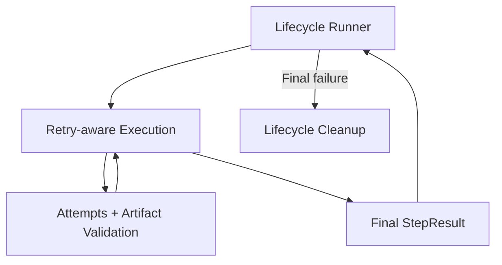

---

# 54. Attempt Validation vs Final Validation

這兩者應該保留不同 Rule Set。

## Attempt Rules

放：

```python
LifecycleStepContent.validations
```

用途：

```text
是否 Retry？
```

---

## Final Rules

放：

```python
ArtifactConfig.validations
```

用途：

```text
整個 Run 是否 PASS？
```

這樣可以避免同一套 Rule 同時扮演兩種責任。

---

# 55. Rule Example

Scenario Step：

```yaml
validations:
  - path: power.csv
    required: true
    min_size_bytes: 1024
```

這個是：

```text
Attempt-level requirement
```

Final Artifact：

```yaml
artifact:
  validations:

    - path: final_summary.json
      required: true

    - path: report.csv
      required: true
      min_size_bytes: 2048
```

這些是：

```text
Run-level requirement
```

---

# 56. Why Two Validation Layers Are Useful

例如每次 Attempt 只需要確認：

```text
raw_power.csv
```

存在。

而 Run 最終還需要：

```text
raw_power.csv
parsed_power.csv
summary.json
```

所以：

```text
Attempt correctness
```

和：

```text
Final run completeness
```

不是完全同一回事。

---

# 57. Retry Delay

流程仍然維持：

```text
Attempt Failure
↓
Retry Decision
↓
delay
↓
Next Attempt
```

Validation 花費時間屬於：

```text
Attempt duration
```

還是：

```text
Step duration
```

建議：

```text
Attempt duration
=
Process execution
+
Attempt validation
```

因為使用者等待這個 Attempt 真正被判斷完成。

---

# 58. Step Duration

例如：

```text
Attempt 1:
Process     30 sec
Validation   1 sec

Delay        5 sec

Attempt 2:
Process     30 sec
Validation   1 sec
```

Step duration：

```text
67 sec
```

也就是：

```text
Attempt durations
+
Retry delays
```

這樣才能真實反映 Retry 對 Lab time 的成本。

---

# 59. Error Classification 的進一步意義

v1.5.1 開始自然形成：

```text
Failure Type
```

例如：

```text
EXECUTION_FAILURE
ARTIFACT_MISSING
ARTIFACT_TOO_SMALL
ARTIFACT_TOO_LARGE
VALIDATION_ERROR
```

Retry Policy 未來就可以：

```text
retry only selected failure types
```

但 v1.5.1 不需要一次全部做完。

這可以成為後續 Retry Policy refinement。

---

# 60. Artifact Failure Reason

ArtifactValidationResult 已經提供：

```text
success
exists
size_bytes
error
```

因此 Retry Decision 可以先只看：

```python
result.success
```

不用解析：

```text
error string
```

這很重要。

不要寫：

```python
if "does not exist" in result.error:
```

Retry Policy 應使用 structured state，而不是 string parsing。

---

# 61. 未來 ValidationFailureType

之後可以演進：

```python
class ArtifactFailureType(str, Enum):
    MISSING = "missing"
    TOO_SMALL = "too_small"
    TOO_LARGE = "too_large"
    INVALID_FORMAT = "invalid_format"
```

然後：

```python
ArtifactValidationResult(
    success=False,
    failure_type=ArtifactFailureType.MISSING,
)
```

v1.5.1 可先保留未來擴充點。

---

# 62. Artifact Cleanup Between Attempts

Attempt Isolation 最理想。

如果暫時無法做到完整 Attempt Directory，也至少必須：

```text
Retry 前刪除該 Step 預期產生的 Artifact。
```

否則 stale artifact 會污染下一次 Validation。

但：

> 隔離比刪除更安全。

原因是刪除本身可能失敗，也會失去上一輪 Debug Artifact。

所以推薦：

```text
attempt_1/
attempt_2/
attempt_3/
```

而不是：

```text
每次清空同一個 directory。
```

---

# 63. ArtifactManager 的演進

v1.5.0：

```python
create_step_log_writer(
    stage,
    step_name,
    attempt,
)
```

v1.5.1 可以提升為：

```python
create_attempt_directory(
    stage,
    step_name,
    attempt,
) -> Path
```

然後：

```python
create_step_log_writer(
    attempt_dir,
)
```

這個 Attempt Directory 不只放：

```text
stdout.log
stderr.log
```

也放：

```text
power.csv
device.log
其他 Domain Artifact
```

---

# 64. Attempt Directory Ownership

推薦：

```text
ArtifactManager
```

負責：

```text
Create attempt directory
Resolve artifact path
Create log writer
```

而：

```text
ArtifactValidator
```

只拿：

```text
attempt_dir + rule
```

進行 read-only validation。

---

# 65. Retry-aware Pipeline

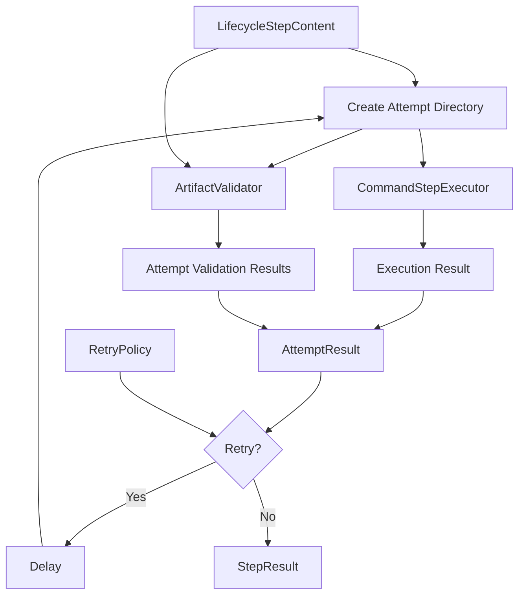

---

# 66. Runner 高階流程不需要變得很亂

即使 v1.5.1 內部增加 Artifact-aware Retry，`run()` 高階流程仍然應該保持：

```python
def run(self, config: RunnerConfig) -> RunResult:

    artifact_dir = self._prepare_run(...)

    step_results = self._execute_lifecycle(
        config,
        artifact_dir,
    )

    validation_results = self._validate_run_artifacts(
        config,
        artifact_dir,
    )

    execution_summary = ...
    validation_summary = ...

    status = ...

    result = RunResult(...)

    self.reporter.write(result)

    return result
```

Artifact-aware Retry 應藏在：

```text
_execute_lifecycle()
        ↓
_execute_step_with_retry()
```

而不是污染最上層 `run()`。

---

# 67. Step Retry Pseudocode

```python
def _execute_step_with_retry(
    self,
    stage: str,
    step: LifecycleStepContent,
    artifact_manager: ArtifactManager,
) -> StepResult:

    attempt_results = []

    step_started_at = time.monotonic()

    for attempt in range(
        1,
        step.retry.max_attempts + 1,
    ):
        attempt_dir = (
            artifact_manager.create_attempt_directory(
                stage=stage,
                step_name=step.name,
                attempt=attempt,
            )
        )

        execution_result = self.executor.execute(
            stage=stage,
            step=step,
            attempt_dir=attempt_dir,
        )

        validation_results = (
            self.artifact_validator.validate_all(
                artifact_dir=attempt_dir,
                rules=step.validations,
            )
        )

        attempt_result = AttemptResult(
            attempt=attempt,
            execution_success=execution_result.success,
            exit_code=execution_result.exit_code,
            duration_seconds=...,
            stdout=execution_result.stdout,
            stderr=execution_result.stderr,
            validation_results=validation_results,
            error=execution_result.error,
        )

        attempt_results.append(
            attempt_result
        )

        decision = self._decide_retry(
            attempt_result=attempt_result,
            policy=step.retry,
            attempt=attempt,
        )

        if not decision.should_retry:
            break

        self._sleep(
            step.retry.delay_seconds
        )

    return self._build_step_result(
        stage=stage,
        step=step,
        attempts=attempt_results,
        duration_seconds=(
            time.monotonic()
            - step_started_at
        ),
    )
```

---

# 68. `validate_all()`

v1.4.x 的 Validator 可能是：

```python
validate(
    artifact_dir,
    rule,
)
```

v1.5.1 可以增加便利方法：

```python
def validate_all(
    self,
    artifact_dir: Path,
    rules: list[ArtifactValidationRule],
) -> list[ArtifactValidationResult]:
    return [
        self.validate(
            artifact_dir=artifact_dir,
            rule=rule,
        )
        for rule in rules
    ]
```

`validate()` 仍然是最小 unit。

---

# 69. Artifact Validation 是否只有 Execution Success 才執行？

建議不要硬限制。

可以：

```text
Execution FAIL
↓
仍驗證已存在 Artifact
```

因為：

```text
partial output
crash dump
debug logs
```

仍可能有價值。

但 Retry Decision 的 Final Attempt Success 永遠是：

```text
Execution PASS
AND
Validation PASS
```

---

# 70. Result Hierarchy

v1.5.1 的 Result Hierarchy：

```text
ArtifactValidationResult[]
        ↓
AttemptResult
        ↓
StepResult
        ↓
ExecutionSummary

Run-level ArtifactValidationResult[]
        ↓
ValidationSummary

ExecutionSummary
+
ValidationSummary
        ↓
RunResult.status
```

圖：

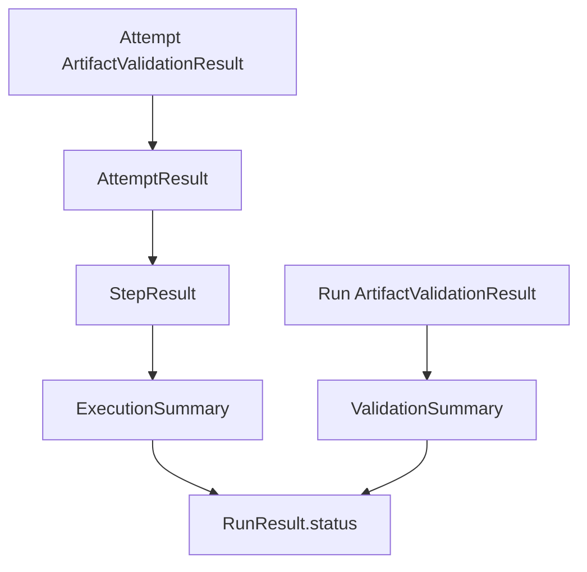

---

# 71. 注意：Attempt Validation Failure 不直接進 ValidationSummary

這一點很重要。

例如：

```text
Attempt 1
Artifact FAIL

Attempt 2
Artifact PASS
```

Step 最終：

```text
PASS
```

那 Attempt 1 的 Validation Failure 是：

```text
Retry History
```

不是：

```text
Final Run-level Validation Failure
```

所以不要把所有 Attempt ValidationResult 丟進：

```text
ValidationSummary
```

否則：

```text
Run 可能最終成功
```

卻因第一次 Attempt 失敗被算：

```text
failed_validations = 1
```

導致最終 Run FAILED。

---

# 72. Attempt Validation 與 Run Validation 要分開統計

因此：

```text
Attempt-level Validation Results
→ AttemptResult

Run-level Validation Results
→ ValidationSummary
```

這是一個重要 Boundary。

未來如果要統計：

```text
artifact_retry_count
artifact_recovered_failures
```

應建立 Retry/Attempt metrics，而不是塞進 Final ValidationSummary。

---

# 73. ExecutionSummary 也只看 Final StepResult

同樣：

```text
Attempt 1 FAILED
Attempt 2 PASSED
```

ExecutionSummary：

```text
passed_steps += 1
failed_steps += 0
```

不應計算：

```text
failed_steps += 1
```

因為 Summary 聚合的是：

```text
Step outcome
```

不是：

```text
Attempt history
```

---

# 74. Observability Value

v1.5.1 可以開始回答：

```text
這個 Step 最終有沒有成功？

一共 Retry 幾次？

Retry 是因為 Process Failure 還是 Artifact Failure？

哪個 Artifact 失敗？

第幾次 Attempt 才恢復？
```

這些資訊非常適合未來做：

```text
Flakiness Analysis
Reliability Metrics
Lab Efficiency Analysis
```

---

# 75. Example Report

```json
{
  "stage": "scenario",
  "name": "run_power_test",
  "success": true,
  "attempt_count": 2,
  "duration_seconds": 65.2,

  "attempts": [
    {
      "attempt": 1,
      "execution_success": true,
      "validation_success": false,
      "success": false,

      "validation_results": [
        {
          "path": "power.csv",
          "success": false,
          "exists": false,
          "size_bytes": null,
          "error": "Required artifact does not exist"
        }
      ]
    },

    {
      "attempt": 2,
      "execution_success": true,
      "validation_success": true,
      "success": true,

      "validation_results": [
        {
          "path": "power.csv",
          "success": true,
          "exists": true,
          "size_bytes": 28420,
          "error": null
        }
      ]
    }
  ]
}
```

這可以直接看到：

```text
Process 從頭到尾其實都成功。

Retry 是 Artifact Failure 觸發的。
```

這就是 v1.5.1 的資訊價值。

---

# 76. Console Output

可以顯示：

```text
[scenario][run_power_test][attempt 1/3]

Execution:
PASSED

Artifact validation:
power.csv: FAILED
Required artifact does not exist

Retry decision:
RETRY

Retrying in 5 seconds...


[scenario][run_power_test][attempt 2/3]

Execution:
PASSED

Artifact validation:
power.csv: PASSED
size=28420 bytes

Attempt:
PASSED
```

使用者可以直接知道 Retry 原因。

---

# 77. Retry Decision Logging

不要只印：

```text
Retrying...
```

建議：

```text
Retrying because artifact validation failed:
power.csv missing
```

或者：

```text
Retrying because execution failed:
exit_code=1
```

這是 Policy Observability。

---

# 78. Artifact-aware Retry 的風險：Non-idempotent Step

即使 Artifact Failure 看起來值得 Retry，也仍然受：

```text
Idempotency
```

影響。

例如：

```text
start_recorder
```

Command execution 成功，但 Recorder 尚未產生 Artifact。

直接 Retry：

```text
start_recorder again
```

可能啟動第二個 Recorder。

因此：

> Artifact-aware Retry 不能取代正確的 Cleanup / Recovery。

這也是之後 Recorder Lifecycle、Hook / Teardown 的重要原因。

---

# 79. Retry 前是否需要 Cleanup？

v1.5.1 基礎版可以：

```text
Attempt complete
↓
process fully terminated
↓
attempt directory finalized
↓
retry
```

但更複雜的 Step 可能需要：

```text
Attempt-specific Cleanup
```

例如：

```text
kill old recorder
clear app state
reconnect adb
```

這可以留到後續：

```text
Retry Hook
Recovery Action
Recorder Lifecycle
```

不建議全部塞進 v1.5.1。

---

# 80. v1.5.1 不應做的事情

為了控制 scope，先不要加入：

```text
Exponential Backoff
Jitter
Recovery Hook
Full Failure Classification
Retry Budget
Circuit Breaker
Device Quarantine
Cross-device Retry
Whole Scenario Retry
Whole Run Retry
```

v1.5.1 聚焦：

```text
Execution Result
+
Attempt Artifact Validation
↓
Retry Decision
```

就足夠。

---

# 81. Test Strategy

v1.5.1 最重要的新 Test：

```text
Execution PASS + Artifact PASS
Execution PASS + Artifact FAIL
Execution FAIL + Artifact PASS
Execution FAIL + Artifact FAIL

Artifact FAIL then Retry Success
Artifact FAIL until Retry Exhausted

Attempt Artifact Isolation
Stale Artifact Prevention

Retry Disabled for Artifact Failure
Retry Enabled for Artifact Failure

Attempt Validation vs Run Validation Separation
```

---

# 82. Execution PASS + Artifact PASS

Expected：

```text
1 Attempt
Step PASS
No Retry
```

---

# 83. Execution PASS + Artifact FAIL + Retry Enabled

Attempt 1：

```text
Execution PASS
Artifact FAIL
```

Policy：

```text
retry_on_artifact_failure=True
max_attempts=3
```

Expected：

```text
Retry Attempt 2
```

---

# 84. Execution PASS + Artifact FAIL + Retry Disabled

Policy：

```text
retry_on_artifact_failure=False
```

Expected：

```text
No Retry
Step FAIL
```

即使：

```text
max_attempts=3
```

也不能 Retry。

因為：

```text
Failure Type 不符合 Policy。
```

---

# 85. Artifact Failure then Recovery

Fake execution：

```text
Attempt 1
execution PASS

Attempt 2
execution PASS
```

Fake validator：

```text
Attempt 1
artifact FAIL

Attempt 2
artifact PASS
```

Expected：

```text
executor called 2 times
validator called 2 times

StepResult.success = True
attempt_count = 2
```

這是 v1.5.1 最核心 Unit Test。

---

# 86. Artifact Retry Exhausted

Policy：

```text
max_attempts=3
retry_on_artifact_failure=True
```

三次：

```text
Execution PASS
Artifact FAIL
```

Expected：

```text
Attempt 1 FAIL
Attempt 2 FAIL
Attempt 3 FAIL

Attempt 4 NOT EXECUTED

Step FAILED
```

---

# 87. Stale Artifact Test

Attempt 1：

```text
attempt_1/power.csv
exists
```

Attempt 2：

```text
attempt_2/power.csv
missing
```

Validator 必須：

```text
FAIL Attempt 2
```

絕不能看到：

```text
attempt_1/power.csv
```

這是 v1.5.1 最重要的 ArtifactManager Test 之一。

---

# 88. Attempt Directory Test

應驗證：

```text
attempt_1 != attempt_2
```

而且：

```text
attempt_1/power.csv
```

不會影響：

```text
attempt_2/power.csv
```

---

# 89. Attempt Validation 不污染 Final ValidationSummary

Scenario：

```text
Attempt 1 Artifact FAIL
Attempt 2 Artifact PASS
```

Final Run Artifacts：

```text
PASS
```

Expected：

```text
Run PASSED
```

如果這個 Test 失敗，表示 Attempt Validation 被錯誤加入 Final ValidationSummary。

---

# 90. Lifecycle Interaction

Artifact Retry Exhausted：

```text
scenario Step FAILED
```

Expected：

```text
remaining scenario steps skipped

teardown executed

global_teardown executed
```

Artifact-aware Retry 不應破壞 v1.3 Lifecycle policy。

---

# 91. Artifact-aware Retry Integration Test

Temporary Script 可以設計：

```bash
#!/bin/bash

COUNT_FILE="$RUN_ROOT/count"

COUNT=0

if [ -f "$COUNT_FILE" ]; then
    COUNT=$(cat "$COUNT_FILE")
fi

COUNT=$((COUNT + 1))
echo "$COUNT" > "$COUNT_FILE"

# Process always succeeds.
echo "command completed"

if [ "$COUNT" -ge 2 ]; then
    echo "timestamp,power" > "$ARTIFACT_DIR/power.csv"
    echo "1,2.5" >> "$ARTIFACT_DIR/power.csv"
fi

exit 0
```

這個 Scenario：

```text
Attempt 1
Process PASS
Artifact missing

Attempt 2
Process PASS
Artifact exists
```

非常適合驗證 Artifact-aware Retry。

---

# 92. Integration Expected

```text
Attempt 1

exit_code = 0
execution_success = True

power.csv missing
validation_success = False

Attempt success = False

Retry
```

第二次：

```text
exit_code = 0
execution_success = True

power.csv exists
validation_success = True

Attempt success = True
```

Final：

```text
Step PASS
attempt_count = 2
Run continues
```

---

# 93. Component Architecture

```mermaid
flowchart LR
    subgraph Configuration
        Step[LifecycleStepContent]
        Policy[RetryPolicy]
        AttemptRules[Attempt Artifact Rules]
        RunRules[Run Artifact Rules]
    end

    subgraph RetryExecution[Retry-aware Execution]
        Retry[Retry Logic]
        Decision[Retry Decision]
    end

    subgraph Mechanism
        Executor[CommandStepExecutor]
        Process[Popen]
    end

    subgraph AttemptValidation
        Validator[ArtifactValidator]
        AttemptValidation[ArtifactValidationResult]
    end

    subgraph Results
        AttemptResult[AttemptResult]
        StepResult[StepResult]
        ExecutionSummary[ExecutionSummary]
    end

    subgraph FinalValidation
        RunValidation[ArtifactValidationResult]
        ValidationSummary[ValidationSummary]
    end

    RunResult[RunResult]

    Step --> Retry
    Policy --> Retry
    AttemptRules --> Retry

    Retry --> Executor
    Executor --> Process

    Retry --> Validator

    Executor --> AttemptResult
    Validator --> AttemptValidation

    AttemptValidation --> AttemptResult
    AttemptResult --> Decision
    Policy --> Decision

    Decision --> Retry

    AttemptResult --> StepResult
    StepResult --> ExecutionSummary

    RunRules --> Validator
    Validator --> RunValidation
    RunValidation --> ValidationSummary

    ExecutionSummary --> RunResult
    ValidationSummary --> RunResult
```

---

# 94. Dependency Boundary

建議仍維持：

```text
models.py
↑
executor.py
artifact.py
validator.py
reporter.py
↑
runner.py
```

其中：

```text
executor.py
```

不知道：

```text
ArtifactValidator
RetryPolicy
Lifecycle policy
```

而：

```text
validator.py
```

不知道：

```text
RetryPolicy
CommandStepExecutor
```

真正讓兩者交會的是：

```text
runner.py
```

或未來：

```text
StepExecutionEngine
```

這個 Orchestration Layer。

---

# 95. 是否該開始抽 StepExecutionEngine？

v1.5.0 還可以把 Retry 放：

```python
DeviceTestRunner._execute_step_with_retry()
```

到了 v1.5.1，這個方法開始同時協調：

```text
Attempt Directory
Executor
ArtifactValidator
RetryPolicy
Retry Decision
AttemptResult
StepResult
```

因此它已經開始有：

```text
StepExecutionEngine
```

的味道。

未來可能變成：

```python
class StepExecutionEngine:

    def execute(
        self,
        stage: str,
        step: LifecycleStepContent,
    ) -> StepResult:
        ...
```

---

# 96. 但 v1.5.1 不一定要立刻抽 Class

如果目前 code 還不大：

```python
_execute_step_with_retry()
```

仍然完全合理。

當：

```text
Retry
Timeout
Cancellation
Recovery
Recorder
Hook
```

開始全部塞進同一個 private method 時，再抽成：

```text
StepExecutionEngine
```

會更自然。

不要為了 Architecture Diagram 而過度抽象。

---

# 97. v1.5.0 與 v1.5.1 比較

| 架構項目                      | v1.5.0              | v1.5.1                        |
| ------------------------- | ------------------- | ----------------------------- |
| Retry input               | Execution failure   | Execution + Artifact failure  |
| RetryPolicy               | 有                   | Artifact-aware                |
| Attempt                   | 有                   | 有                             |
| AttemptResult             | Process result      | Execution + Validation result |
| Artifact validation       | Run-level           | Run-level + Attempt-level     |
| Artifact-aware retry      | 無                   | 有                             |
| Attempt Artifact Rule     | 無                   | 有                             |
| Stale artifact protection | 基本                  | 必須                            |
| Attempt directory         | Log isolation       | Full Artifact isolation       |
| Retry reason              | Execution failure   | Execution / Artifact          |
| Retry Decision            | 簡單                  | 多 evidence                    |
| StepResult                | Attempt aggregation | Validated Attempt aggregation |
| Final ValidationSummary   | 有                   | 仍只統計 Run-level validation     |
| Runner 定位                 | Policy-aware        | Result-aware Policy Engine    |

---

# 98. Version Evolution

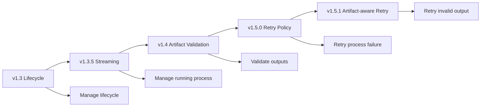

---

# 99. v1.5.1 最重要的 Boundary

這一版最重要的概念不是：

```text
ArtifactValidator 觸發 Retry
```

而是：

```text
ArtifactValidator
↓
提供 Validation Evidence

RetryPolicy
↓
提供 Decision Rules

Retry-aware Execution
↓
做 Decision
```

也就是：

```text
Evidence
+
Policy
=
Decision
```

這比：

```text
if artifact missing:
    retry()
```

乾淨很多。

---

# 100. Architecture Summary

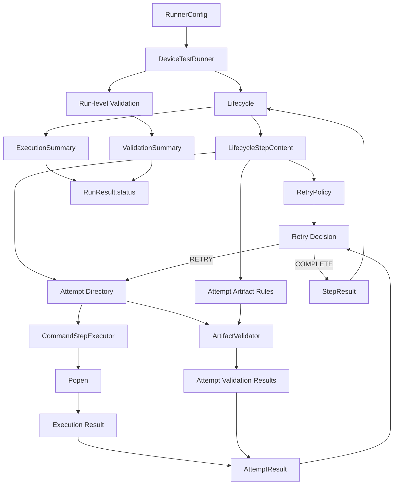

---

# 101. v1.5.1 核心摘要

Device Test Runner v1.5.1 可以濃縮成：

> v1.5.1 將 v1.5.0 的 Retry Decision 從「只觀察 Process Execution Result」擴充為「同時觀察 Execution Result 與 Attempt-level Artifact Validation Result」。每一次 Attempt 都擁有獨立的 Artifact Directory；`CommandStepExecutor` 負責執行單一次 Process，`ArtifactValidator` 負責 read-only 驗證本次 Attempt 所產生的 Artifact，而 Retry-aware Execution Layer 將兩者組合成 `AttemptResult`，再依據 `RetryPolicy` 決定 Retry 或 Complete。

核心資料流：

```text
LifecycleStepContent
        │
        ├── RetryPolicy
        │
        └── Attempt Artifact Rules
        │
        ↓
Attempt
        │
        ├── CommandStepExecutor
        │       ↓
        │   Execution Result
        │
        └── ArtifactValidator
                ↓
        ArtifactValidationResult[]
                │
                ↓
           AttemptResult
                │
                ↓
          Retry Decision
             /       \
        RETRY       COMPLETE
          │             │
     Next Attempt    StepResult
```

同時保留原本的 Run-level Pipeline：

```text
Lifecycle
↓
Final StepResults
↓
global_teardown
↓
Run-level Artifact Validation
↓
ExecutionSummary
+
ValidationSummary
↓
RunResult.status
```

因此 v1.5.1 最重要的架構進化是：

```text
v1.5.0
Failure-aware Retry

        ↓

v1.5.1
Outcome-aware Retry
```

Runner 不再只問：

```text
「Command 有沒有失敗？」
```

而是開始問：

```text
「這次 Attempt 是否真的產生了我們預期的測試成果？」
```

只有在：

```text
Execution Success
AND
Artifact Validation Success
```

同時成立時，Attempt 才真正成功。

而如果 Artifact Failure 被 RetryPolicy 定義為可恢復：

```text
Artifact Failure
↓
Retry Decision
↓
Fresh Attempt Directory
↓
重新執行
↓
重新驗證
```

這就是 Device Test Runner v1.5.1 **Artifact-aware Retry** 的核心架構。
