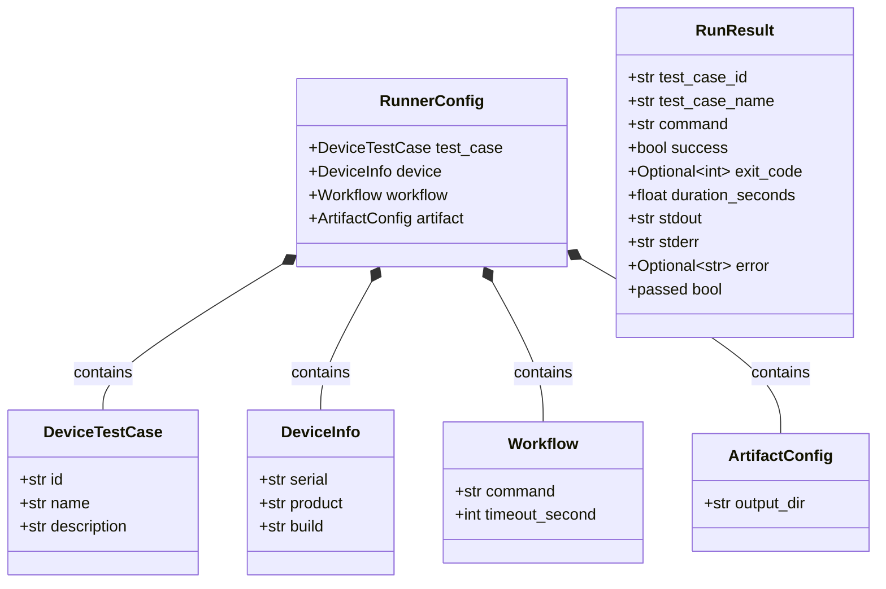
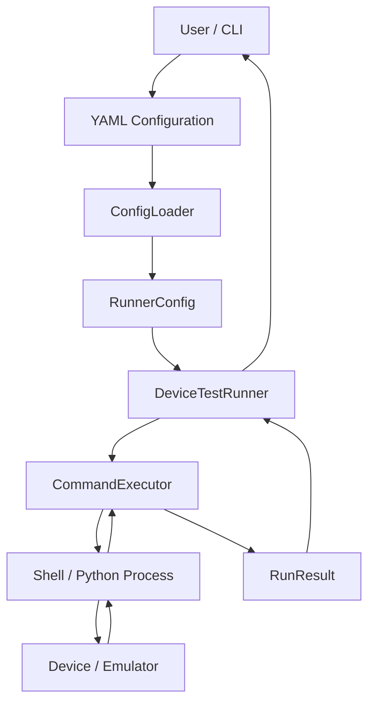
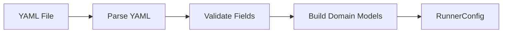
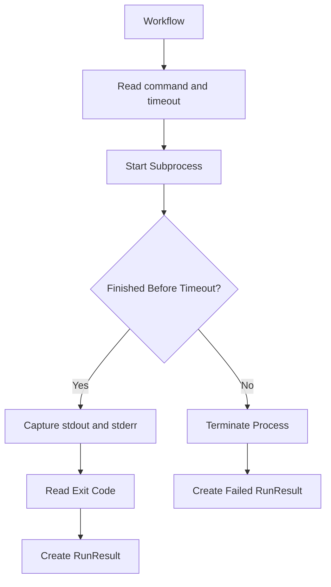
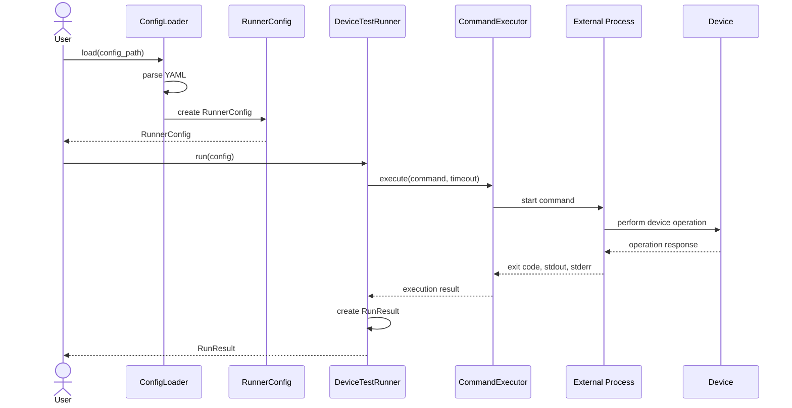
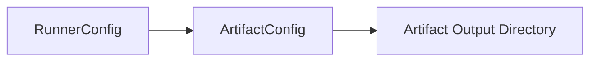
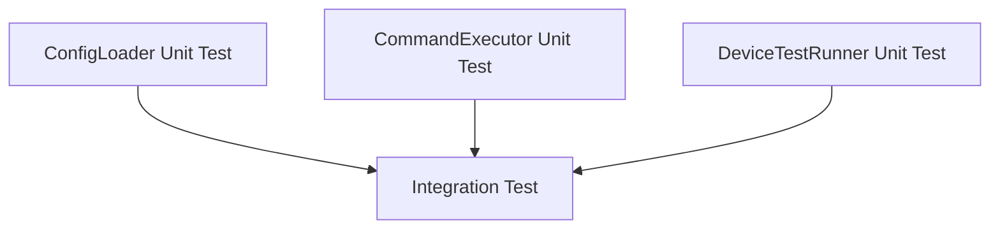
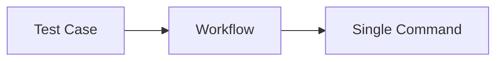
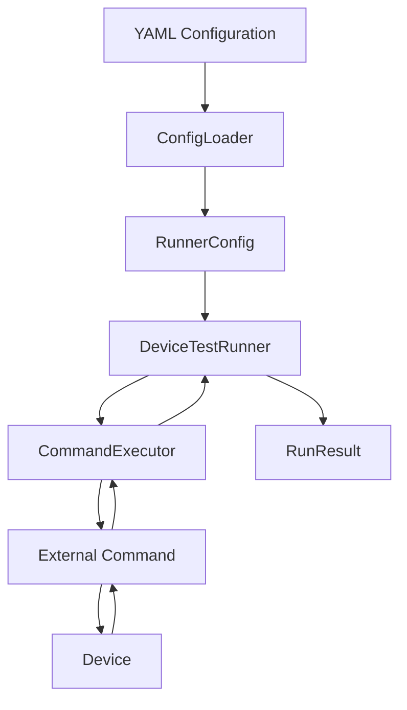

# Device Test Runner Architecture v1.0

## 1. 版本目標

Device Test Runner v1.0 的目標，是建立第一條可以完整執行的 Device Test Runner 資料流：

```text
YAML Configuration
        ↓
ConfigLoader
        ↓
RunnerConfig
        ↓
DeviceTestRunner
        ↓
CommandExecutor
        ↓
External Command
        ↓
RunResult
```

v1.0 先處理一個最小執行單位：

> 一個 Test Case 對應一個 Workflow，一個 Workflow 執行一個 Command。

這個版本尚未將 Workflow 拆成多個 Step。

---

## 2. v1.0 的範圍

v1.0 包含：

* Test Case 基本資訊
* Device 基本資訊
* 單一 Workflow Command
* Command timeout
* Artifact output directory
* Command 執行
* stdout 與 stderr 收集
* exit code 判斷
* 執行時間紀錄
* 統一的 RunResult

v1.0 尚未包含：

* `workflow.steps`
* `WorkflowStep`
* `StepResult`
* 多步驟執行
* fail-fast
* retry
* setup / teardown
* artifact collector
* device allocation
* parallel execution
* remote execution

---

## 3. v1.0 YAML 結構

```yaml
test_case:
  id: power_001
  name: Youtube Playback Power Test
  description: Measure power behavior during Youtube playback

device:
  serial: emulator-5566
  product: pixel
  build: test_build

workflow:
  command: "bash scripts/run_scenario.sh"
  timeout_second: 30

artifact:
  output_dir: artifact/sample_device_config
```

在 v1.0 中，`workflow` 直接包含：

```yaml
command:
timeout_second:
```

此時尚未出現：

```yaml
workflow:
  steps:
```

---

## 4. v1.0 Domain Models

```python
from dataclasses import dataclass
from typing import Optional


@dataclass
class DeviceTestCase:
    id: str
    name: str
    description: str


@dataclass
class DeviceInfo:
    serial: str
    product: str
    build: str


@dataclass
class Workflow:
    command: str
    timeout_second: int


@dataclass
class ArtifactConfig:
    output_dir: str


@dataclass
class RunnerConfig:
    test_case: DeviceTestCase
    device: DeviceInfo
    workflow: Workflow
    artifact: ArtifactConfig


@dataclass
class RunResult:
    test_case_id: str
    test_case_name: str
    command: str
    success: bool
    exit_code: Optional[int]
    duration_seconds: float
    stdout: str
    stderr: str
    error: Optional[str] = None

    @property
    def passed(self) -> bool:
        return self.exit_code == 0
```

v1.0 沒有 `WorkflowStep`，因此執行結果也不需要 `StepResult`。

所有執行資訊直接放在 `RunResult` 中。

---

## 5. Domain Model 結構



`RunnerConfig` 是整個執行流程的主要輸入物件。

```text
RunnerConfig
├── test_case
├── device
├── workflow
└── artifact
```

---

## 6. 系統架構



---

## 7. 模組責任

| 模組                 | 責任                        |
| ------------------ | ------------------------- |
| `ConfigLoader`     | 將 YAML 轉換成 `RunnerConfig` |
| `RunnerConfig`     | 保存完整 Test Case 執行設定       |
| `DeviceTestRunner` | 協調整個執行流程                  |
| `CommandExecutor`  | 執行 Workflow 中的 command    |
| `RunResult`        | 保存完整 Test Case 執行結果       |

---

## 8. 建議目錄結構

```text
device-test-runner/
├── runner/
│   ├── __init__.py
│   ├── config_loader.py
│   ├── executor.py
│   ├── models.py
│   └── runner.py
│
├── configs/
│   └── sample_device_config.yaml
│
├── scripts/
│   └── run_scenario.sh
│
├── artifact/
│   └── sample_device_config/
│
├── tests/
│   ├── test_config_loader.py
│   ├── test_executor.py
│   ├── test_runner.py
│   └── test_integration.py
│
└── docs/
    └── architecture_v1.0.md
```

---

## 9. Configuration Layer

Configuration Layer 負責將 YAML 資料轉換成 Python Domain Model。



例如：

```yaml
device:
  serial: emulator-5566
  product: pixel
  build: test_build
```

會被轉換成：

```python
DeviceInfo(
    serial="emulator-5566",
    product="pixel",
    build="test_build",
)
```

完整 YAML 最後會被轉換成：

```python
RunnerConfig(
    test_case=DeviceTestCase(...),
    device=DeviceInfo(...),
    workflow=Workflow(...),
    artifact=ArtifactConfig(...),
)
```

---

## 10. ConfigLoader 的責任

`ConfigLoader` 負責：

* 讀取 YAML
* 驗證必要欄位
* 建立 `DeviceTestCase`
* 建立 `DeviceInfo`
* 建立 `Workflow`
* 建立 `ArtifactConfig`
* 組成 `RunnerConfig`

ConfigLoader 不負責：

* 執行 command
* 操作 Device
* 建立 subprocess
* 判斷 Test Case 是否成功
* 顯示報表

---

## 11. Execution Layer

v1.0 的 Executor 一次執行整個 Workflow。

```text
Workflow
   ↓
CommandExecutor
   ↓
subprocess
   ↓
RunResult
```

Executor 的輸入是：

```python
Workflow(
    command="bash scripts/run_scenario.sh",
    timeout_second=30,
)
```

Executor 負責：

* 解析 command
* 啟動 subprocess
* 套用 timeout
* 收集 stdout
* 收集 stderr
* 取得 exit code
* 計算 duration
* 處理 timeout 或執行例外

---

## 12. Executor 流程



---

## 13. Orchestration Layer

`DeviceTestRunner` 是 v1.0 的流程協調者。

概念上的 Runner：

```python
class DeviceTestRunner:
    def __init__(self, executor):
        self.executor = executor

    def run(self, config: RunnerConfig) -> RunResult:
        execution_result = self.executor.execute(
            command=config.workflow.command,
            timeout_second=config.workflow.timeout_second,
        )

        return RunResult(
            test_case_id=config.test_case.id,
            test_case_name=config.test_case.name,
            command=config.workflow.command,
            success=execution_result.exit_code == 0,
            exit_code=execution_result.exit_code,
            duration_seconds=execution_result.duration_seconds,
            stdout=execution_result.stdout,
            stderr=execution_result.stderr,
            error=execution_result.error,
        )
```

Runner 負責：

* 接收 `RunnerConfig`
* 取得 Workflow
* 將執行工作交給 Executor
* 將執行資訊與 Test Case 資訊組合
* 建立 `RunResult`

Runner 不應直接操作 `subprocess.run()`。

---

## 14. 執行流程



---

## 15. Result Model

v1.0 的結果只有一層：

```text
RunResult
```

例如：

```python
RunResult(
    test_case_id="power_001",
    test_case_name="Youtube Playback Power Test",
    command="bash scripts/run_scenario.sh",
    success=True,
    exit_code=0,
    duration_seconds=25.4,
    stdout="scenario completed",
    stderr="",
    error=None,
)
```

成功判斷：

```python
@property
def passed(self) -> bool:
    return self.exit_code == 0
```

在 v1.0 中：

```text
一個 RunResult
=
一個 Workflow Command 的結果
=
一個 Test Case 的結果
```

---

## 16. ArtifactConfig 的定位

v1.0 已經定義：

```python
@dataclass
class ArtifactConfig:
    output_dir: str
```

但這個版本可以只將 `output_dir` 視為執行上下文的一部分。



例如：

```yaml
artifact:
  output_dir: artifact/sample_device_config
```

v1.0 可以先確保目錄存在：

```python
Path(config.artifact.output_dir).mkdir(
    parents=True,
    exist_ok=True,
)
```

但以下功能可留到後續版本：

* 自動複製 log
* 收集 screenshot
* 收集 device dump
* 產生 summary report
* artifact manifest
* artifact upload

---

## 17. 測試架構



### ConfigLoader Unit Test

驗證：

```text
YAML
  ↓
RunnerConfig
```

### Executor Unit Test

驗證：

```text
Command
  ↓
CommandExecutor
  ↓
Process Result
```

### Runner Unit Test

使用 Fake Executor 或 Mock Executor，驗證：

* Runner 是否使用 `config.workflow.command`
* Runner 是否使用 `config.workflow.timeout_second`
* Runner 是否建立正確的 `RunResult`

### Integration Test

驗證完整流程：

```text
Temporary YAML
        ↓
ConfigLoader
        ↓
RunnerConfig
        ↓
DeviceTestRunner
        ↓
CommandExecutor
        ↓
Temporary Shell Script
        ↓
RunResult
```

---

## 18. v1.0 的架構限制

v1.0 的 Workflow 只有一個 command：



如果測試流程包含：

```text
setup device
run scenario
collect log
cleanup
```

v1.0 只能將所有動作包進一個 shell script：

```bash
#!/bin/bash

bash scripts/setup_device.sh
bash scripts/run_scenario.sh
bash scripts/collect_log.sh
bash scripts/cleanup.sh
```

Runner 只能知道整個 script 最終成功或失敗，無法知道：

* 哪一個動作失敗
* 每個動作執行多久
* 每個動作的 stdout
* 每個動作的 stderr
* 是否應該停止後續動作
* 哪個步驟可以 retry

因此，v1.1 將 Workflow 改為由多個 `WorkflowStep` 組成。

---

## 19. v1.0 架構摘要



v1.0 建立了 Device Test Runner 的第一個完整骨架：

> YAML 負責描述測試，RunnerConfig 負責統一輸入，DeviceTestRunner 負責流程協調，CommandExecutor 負責外部執行，RunResult 負責統一輸出。

v1.0 的重點不是多步驟能力，而是先建立清楚且可以測試的模組邊界。
