# Device Test Runner Architecture v1.1

## 1. 版本目標

Device Test Runner v1.1 延續 v1.0 的架構，將原本只能執行一個 Command 的 Workflow，擴充成由多個 `WorkflowStep` 組成的 Workflow。

v1.0：

```text
Test Case
   ↓
Workflow
   ↓
Single Command
```

v1.1：

```text
Test Case
   ↓
Workflow
   ├── WorkflowStep 1
   ├── WorkflowStep 2
   └── WorkflowStep N
```

v1.1 的完整資料流：

```text
YAML Configuration
        ↓
ConfigLoader
        ↓
RunnerConfig
        ↓
DeviceTestRunner
        ↓
WorkflowStep
        ↓
CommandExecutor
        ↓
StepResult
        ↓
RunResult
```

---

## 2. v1.1 的主要改變

v1.1 包含兩個核心變更。

### Workflow 支援多個 Step

v1.0：

```yaml
workflow:
  command: "bash scripts/run_scenario.sh"
  timeout_second: 30
```

v1.1：

```yaml
workflow:
  steps:
    - name: setup_device
      type: command
      command: "bash scripts/setup_script.sh"
      timeout_second: 10

    - name: run_scenario
      type: command
      command: "bash scripts/run_scenario.sh"
      timeout_second: 30
```

### 執行結果分成兩層

v1.0：

```text
RunResult
```

v1.1：

```text
RunResult
└── List[StepResult]
```

每個 Workflow Step 都有自己的執行結果，最後再由 `RunResult` 彙整整個 Test Case。

---

## 3. v1.1 YAML Configuration

```yaml
test_case:
  id: power_001
  name: Youtube Playback Power Test
  description: Measure power behavior during Youtube playback

device:
  serial: emulator-5566
  product: pixel
  build: test_build

workflow:
  steps:
    - name: setup_device
      type: command
      command: "bash scripts/setup_script.sh"
      timeout_second: 10

    - name: run_scenario
      type: command
      command: "bash scripts/run_scenario.sh"
      timeout_second: 30

artifact:
  output_dir: artifact/sample_device_config
```

YAML 的四個主要區塊對應四個 Domain Model：

| YAML 區塊     | Python Model     |
| ----------- | ---------------- |
| `test_case` | `DeviceTestCase` |
| `device`    | `DeviceInfo`     |
| `workflow`  | `Workflow`       |
| `artifact`  | `ArtifactConfig` |

其中：

```yaml
workflow.steps
```

會被轉換成：

```python
List[WorkflowStep]
```

---

## 4. v1.1 Domain Models

```python
from dataclasses import dataclass
from typing import List, Optional


@dataclass
class DeviceTestCase:
    id: str
    name: str
    description: str


@dataclass
class DeviceInfo:
    serial: str
    product: str
    build: str


@dataclass
class WorkflowStep:
    name: str
    type: str
    command: str
    timeout_second: int


@dataclass
class Workflow:
    steps: List[WorkflowStep]


@dataclass
class ArtifactConfig:
    output_dir: str


@dataclass
class RunnerConfig:
    test_case: DeviceTestCase
    device: DeviceInfo
    workflow: Workflow
    artifact: ArtifactConfig


@dataclass
class StepResult:
    name: str
    command: str
    success: bool
    exit_code: Optional[int]
    duration_seconds: float
    stdout: str
    stderr: str
    error: Optional[str] = None


@dataclass
class RunResult:
    test_case_id: str
    test_case_name: str
    success: bool
    step_results: List[StepResult]

    @property
    def passed(self) -> bool:
        return all(
            result.exit_code == 0
            for result in self.step_results
        )
```

---

## 5. Domain Model 結構

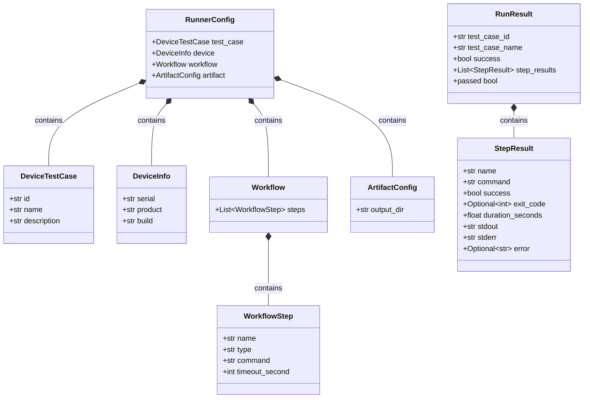

---

## 6. Aggregate 結構

從 Domain Model 的角度來看，v1.1 有兩個主要 Aggregate。

### RunnerConfig Aggregate

```text
RunnerConfig
├── DeviceTestCase
├── DeviceInfo
├── Workflow
│   └── List[WorkflowStep]
└── ArtifactConfig
```

`RunnerConfig` 是完整的執行輸入。

### RunResult Aggregate

```text
RunResult
└── List[StepResult]
```

`RunResult` 是完整的執行輸出。

兩者形成一組對稱關係：

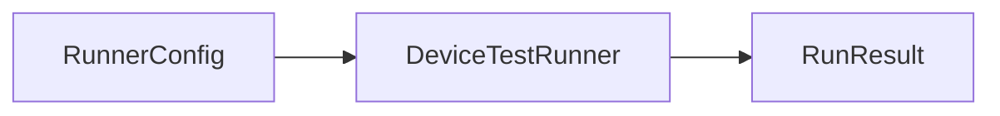

---

## 7. v1.1 系統架構

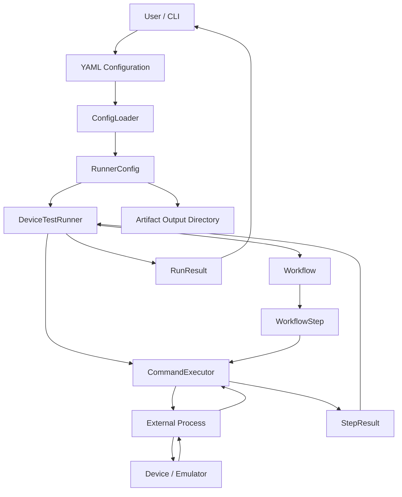

---

## 8. Layered Architecture

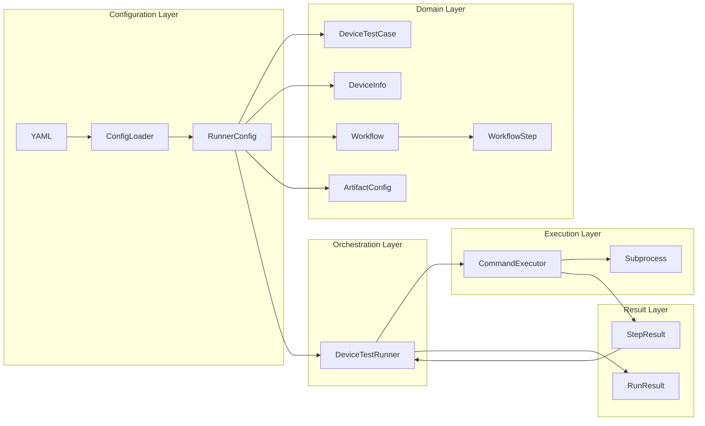

---

## 9. 各元件責任

| 元件                 | 責任                        |
| ------------------ | ------------------------- |
| `ConfigLoader`     | 將 YAML 轉換成 `RunnerConfig` |
| `DeviceTestCase`   | 保存 Test Case 的識別與描述       |
| `DeviceInfo`       | 保存執行目標 Device 資訊          |
| `WorkflowStep`     | 描述一個可以執行的 Workflow Step   |
| `Workflow`         | 保存有順序的 Workflow Steps     |
| `ArtifactConfig`   | 定義 Artifact 輸出位置          |
| `RunnerConfig`     | 聚合完整執行設定                  |
| `DeviceTestRunner` | 控制 Workflow 執行順序          |
| `CommandExecutor`  | 實際執行單一 WorkflowStep       |
| `StepResult`       | 保存單一步驟執行結果                |
| `RunResult`        | 彙整完整 Test Case 結果         |

---

## 10. ConfigLoader 流程

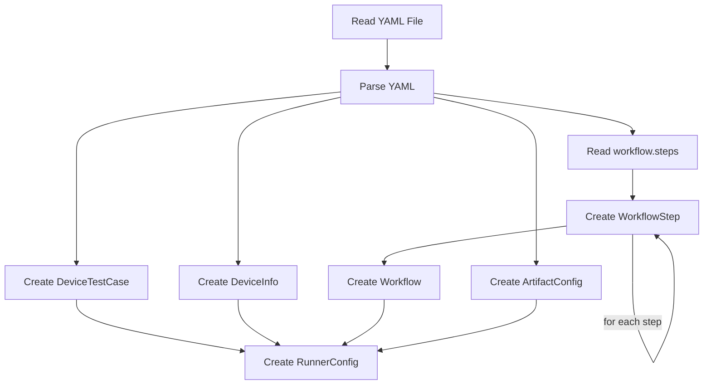

ConfigLoader 必須處理巢狀資料。

例如：

```yaml
workflow:
  steps:
    - name: setup_device
      type: command
      command: "bash scripts/setup_script.sh"
      timeout_second: 10
```

會被轉換成：

```python
Workflow(
    steps=[
        WorkflowStep(
            name="setup_device",
            type="command",
            command="bash scripts/setup_script.sh",
            timeout_second=10,
        )
    ]
)
```

---

## 11. ConfigLoader 的責任邊界

ConfigLoader 負責：

* 讀取 YAML
* 驗證最上層區塊
* 驗證必要欄位
* 建立巢狀 Domain Model
* 將 `workflow.steps` 轉換成 `List[WorkflowStep]`
* 回傳 `RunnerConfig`

ConfigLoader 不負責：

* 執行 WorkflowStep
* 管理 subprocess
* 決定 fail-fast
* 建立 StepResult
* 建立 RunResult
* 寫入 artifact

---

## 12. WorkflowStep 的角色

`WorkflowStep` 是 v1.1 的最小執行單位。

```python
@dataclass
class WorkflowStep:
    name: str
    type: str
    command: str
    timeout_second: int
```

每個欄位的角色：

| 欄位               | 說明                      |
| ---------------- | ----------------------- |
| `name`           | Step 的識別名稱              |
| `type`           | Step 執行類型，目前為 `command` |
| `command`        | 實際執行的 command           |
| `timeout_second` | Step 最大執行時間             |

例如：

```python
WorkflowStep(
    name="setup_device",
    type="command",
    command="bash scripts/setup_script.sh",
    timeout_second=10,
)
```

---

## 13. `type` 欄位的架構意義

v1.1 目前只有：

```yaml
type: command
```

但先保留 `type` 欄位，可以為未來 Executor Registry 建立擴充點。

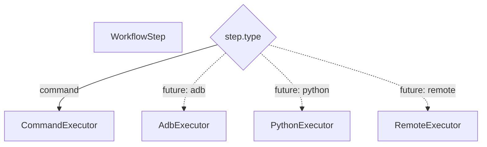

v1.1 暫時不需要實作 Registry。

目前可以只驗證：

```python
if step.type != "command":
    raise ValueError(f"Unsupported step type: {step.type}")
```

---

## 14. CommandExecutor 的責任

v1.1 的 Executor 一次只執行一個 `WorkflowStep`。

```text
WorkflowStep
      ↓
CommandExecutor
      ↓
External Process
      ↓
StepResult
```

Executor 的概念介面：

```python
class CommandExecutor:
    def execute(self, step: WorkflowStep) -> StepResult:
        ...
```

Executor 負責：

* 取得 `step.command`
* 取得 `step.timeout_second`
* 啟動 subprocess
* 收集 stdout
* 收集 stderr
* 取得 exit code
* 計算 duration
* 將 timeout 轉換成失敗結果
* 將執行例外轉換成失敗結果
* 建立 `StepResult`

Executor 不負責：

* 決定 Step 執行順序
* 決定失敗後是否繼續
* 建立 `RunResult`
* 讀取 YAML
* 管理完整 Test Case

---

## 15. Executor 執行流程

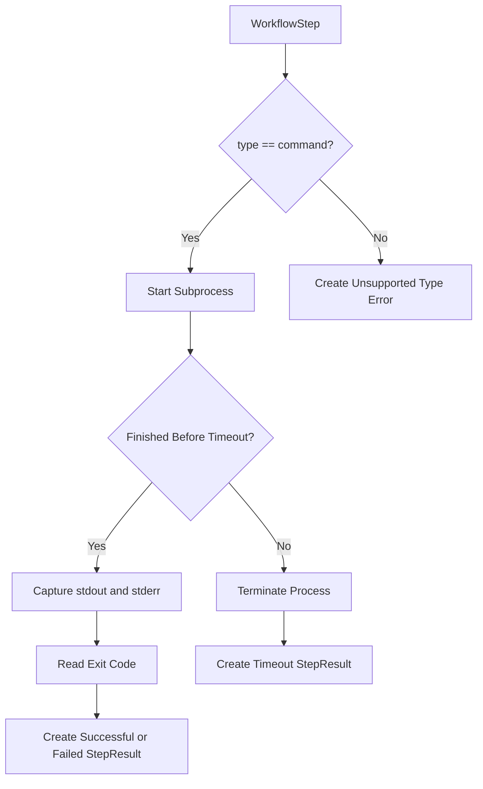

---

## 16. StepResult

每一個 WorkflowStep 都會產生一個 StepResult。

```python
@dataclass
class StepResult:
    name: str
    command: str
    success: bool
    exit_code: Optional[int]
    duration_seconds: float
    stdout: str
    stderr: str
    error: Optional[str] = None
```

成功範例：

```python
StepResult(
    name="setup_device",
    command="bash scripts/setup_script.sh",
    success=True,
    exit_code=0,
    duration_seconds=3.2,
    stdout="device setup completed",
    stderr="",
    error=None,
)
```

失敗範例：

```python
StepResult(
    name="run_scenario",
    command="bash scripts/run_scenario.sh",
    success=False,
    exit_code=1,
    duration_seconds=8.6,
    stdout="",
    stderr="scenario execution failed",
    error=None,
)
```

Timeout 範例：

```python
StepResult(
    name="run_scenario",
    command="bash scripts/run_scenario.sh",
    success=False,
    exit_code=None,
    duration_seconds=30.0,
    stdout="",
    stderr="",
    error="Command timed out after 30 seconds",
)
```

---

## 17. DeviceTestRunner 的責任

`DeviceTestRunner` 是 v1.1 的 Orchestration Layer。

它不直接執行 command，而是：

1. 接收 `RunnerConfig`
2. 取得 `config.workflow.steps`
3. 依序執行每一個 `WorkflowStep`
4. 呼叫 Executor
5. 收集 `StepResult`
6. 根據執行結果決定是否繼續
7. 建立 `RunResult`

---

## 18. Runner 執行流程

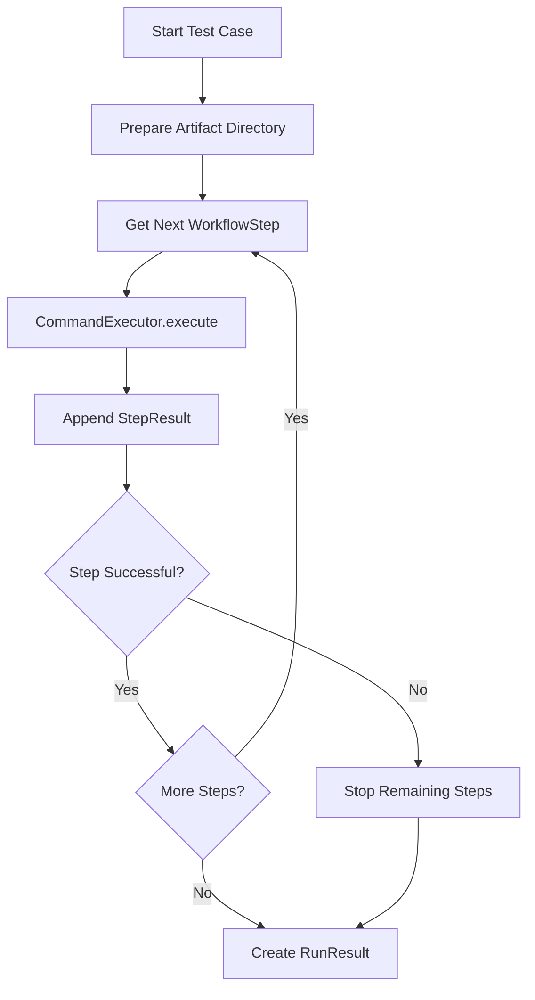

---

## 19. Runner Pseudocode

```python
class DeviceTestRunner:
    def __init__(self, executor):
        self.executor = executor

    def run(self, config: RunnerConfig) -> RunResult:
        step_results = []

        for step in config.workflow.steps:
            step_result = self.executor.execute(step)
            step_results.append(step_result)

            if not step_result.success:
                break

        success = all(
            result.success
            for result in step_results
        )

        return RunResult(
            test_case_id=config.test_case.id,
            test_case_name=config.test_case.name,
            success=success,
            step_results=step_results,
        )
```

這段流程採用 fail-fast：

```text
任何 Step 失敗
      ↓
停止剩餘 Step
      ↓
建立 RunResult
```

---

## 20. Sequence Diagram

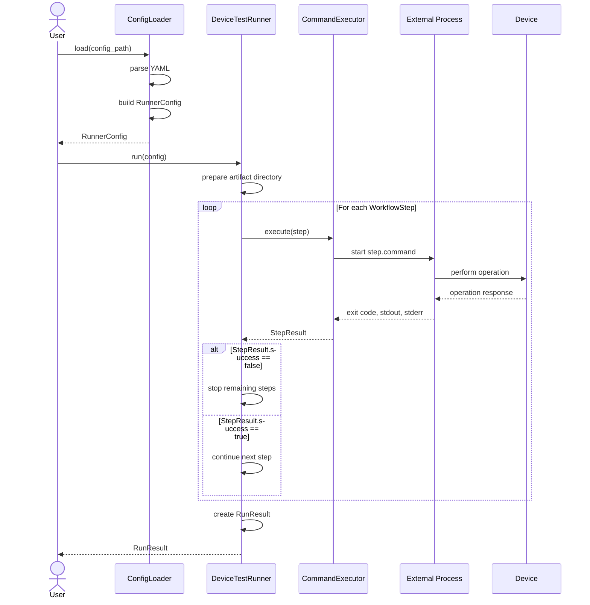

---

## 21. Fail-fast 策略

v1.1 預設採用 fail-fast。

例如：

```text
setup_device       PASSED
run_scenario       FAILED
collect_artifact   NOT EXECUTED
```

流程圖：

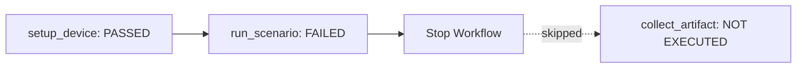

fail-fast 適合有相依關係的 Workflow。

例如：

```text
setup_device
     ↓
run_scenario
```

如果 `setup_device` 失敗，繼續執行 `run_scenario` 通常沒有意義。

---

## 22. RunResult Aggregation

完整 Test Case 的執行結果由多個 `StepResult` 組成。

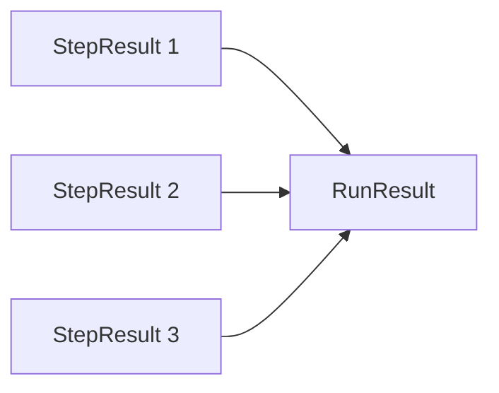

例如：

```python
RunResult(
    test_case_id="power_001",
    test_case_name="Youtube Playback Power Test",
    success=True,
    step_results=[
        StepResult(
            name="setup_device",
            command="bash scripts/setup_script.sh",
            success=True,
            exit_code=0,
            duration_seconds=3.2,
            stdout="setup completed",
            stderr="",
        ),
        StepResult(
            name="run_scenario",
            command="bash scripts/run_scenario.sh",
            success=True,
            exit_code=0,
            duration_seconds=25.7,
            stdout="scenario completed",
            stderr="",
        ),
    ],
)
```

---

## 23. `success` 與 `passed` 的關係

目前 `RunResult` 同時有：

```python
success: bool
```

以及：

```python
@property
def passed(self) -> bool:
    return all(
        result.exit_code == 0
        for result in self.step_results
    )
```

概念上：

* `success` 是建立 RunResult 時保存的狀態
* `passed` 是根據 StepResult 動態計算的狀態

但是兩者可能產生不一致。

例如 timeout：

```python
StepResult(
    success=False,
    exit_code=None,
)
```

此時 `passed` 正確會得到 `False`。

但更一致的寫法是讓 `RunResult.passed` 使用 `StepResult.success`：

```python
@property
def passed(self) -> bool:
    return all(
        result.success
        for result in self.step_results
    )
```

原因是 `success` 可以涵蓋：

* exit code 非 0
* timeout
* command not found
* unsupported step type
* executor exception

因此，建議最終統一為：

```python
@dataclass
class RunResult:
    test_case_id: str
    test_case_name: str
    success: bool
    step_results: List[StepResult]

    @property
    def passed(self) -> bool:
        return all(
            result.success
            for result in self.step_results
        )
```

如果希望只保留單一來源，也可以移除 `success` 欄位：

```python
@dataclass
class RunResult:
    test_case_id: str
    test_case_name: str
    step_results: List[StepResult]

    @property
    def success(self) -> bool:
        return all(
            result.success
            for result in self.step_results
        )

    @property
    def passed(self) -> bool:
        return self.success
```

但如果 v1.1 的既有程式碼已經使用 `success` 欄位，可以先維持原設計。

---

## 24. ArtifactConfig 的角色

```python
@dataclass
class ArtifactConfig:
    output_dir: str
```

ArtifactConfig 描述這次執行產物應該放在哪裡。

```yaml
artifact:
  output_dir: artifact/sample_device_config
```

Runner 可以在執行 Workflow 前建立目錄：

```python
from pathlib import Path


output_dir = Path(config.artifact.output_dir)
output_dir.mkdir(parents=True, exist_ok=True)
```

架構關係：

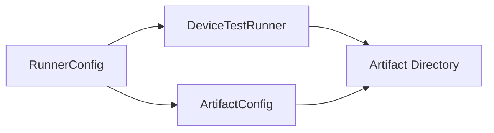

v1.1 可以先處理目錄建立，真正的 Artifact Collector 可留到後續版本。

---

## 25. DeviceInfo 的角色

```python
@dataclass
class DeviceInfo:
    serial: str
    product: str
    build: str
```

v1.1 的 `DeviceInfo` 主要作為執行上下文。

```text
RunnerConfig
    ↓
DeviceInfo
    ├── serial
    ├── product
    └── build
```

目前 WorkflowStep 的 command 已經是完整字串：

```yaml
command: "bash scripts/setup_script.sh"
```

因此 v1.1 不一定需要自動將 Device serial 注入 command。

後續版本可以考慮：

```yaml
command: "adb -s {device.serial} shell getprop"
```

再由 Runner 或 Command Builder 進行參數替換。

但這不屬於 v1.1 的核心功能。

---

## 26. 建議目錄結構

```text
device-test-runner/
├── runner/
│   ├── __init__.py
│   ├── config_loader.py
│   ├── executor.py
│   ├── models.py
│   └── runner.py
│
├── configs/
│   └── sample_device_config.yaml
│
├── scripts/
│   ├── setup_script.sh
│   └── run_scenario.sh
│
├── artifact/
│   └── sample_device_config/
│
├── tests/
│   ├── test_models.py
│   ├── test_config_loader.py
│   ├── test_executor.py
│   ├── test_runner.py
│   └── test_integration.py
│
└── docs/
    ├── architecture_v1.0.md
    └── architecture_v1.1.md
```

---

## 27. 測試架構

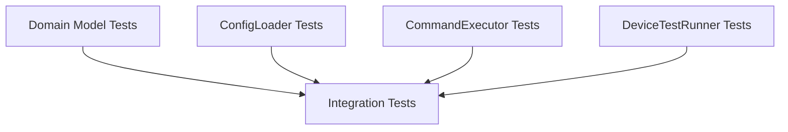

---

## 28. Domain Model Tests

驗證：

* `Workflow` 是否保存多個 `WorkflowStep`
* `StepResult` 是否正確保存執行資訊
* `RunResult.passed` 是否正確判斷整體結果

例如：

```text
Step 1 success = True
Step 2 success = True
          ↓
RunResult.passed = True
```

以及：

```text
Step 1 success = True
Step 2 success = False
          ↓
RunResult.passed = False
```

---

## 29. ConfigLoader Tests

驗證完整 YAML 是否正確轉換：

```text
YAML
 ├── test_case
 ├── device
 ├── workflow.steps
 └── artifact
          ↓
RunnerConfig
```

特別需要驗證：

* `config.test_case.id`
* `config.device.serial`
* `config.workflow.steps` 長度
* 第一個 Step 的 name
* 第二個 Step 的 command
* 每個 Step 的 timeout
* `config.artifact.output_dir`

---

## 30. Executor Tests

每個 Executor Test 只關注一個 WorkflowStep。

```text
WorkflowStep
      ↓
CommandExecutor
      ↓
StepResult
```

測試情境包括：

* command 成功
* command exit code 非 0
* command timeout
* command 不存在
* stderr 收集
* duration 計算
* unsupported type

---

## 31. Runner Tests

Runner Test 應使用 Fake Executor，避免真的啟動 subprocess。

驗證：

* Steps 是否按照 YAML 順序執行
* Executor 是否收到正確的 WorkflowStep
* 每個 StepResult 是否加入結果列表
* Step 失敗後是否停止
* RunResult 是否包含 Test Case ID
* RunResult 是否包含 Test Case Name
* RunResult.success 是否正確

---

## 32. Integration Test

Integration Test 驗證完整資料流：

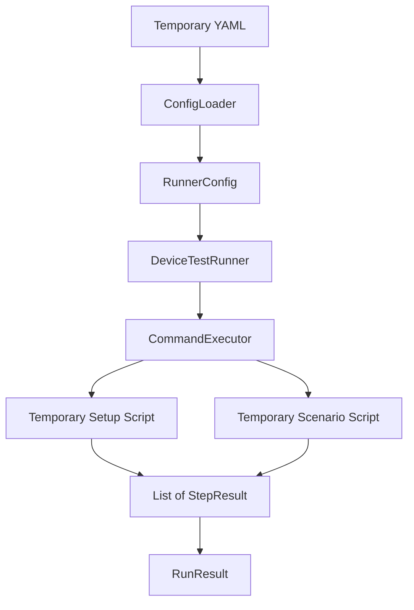

完整測試流程：

```text
temporary YAML
      ↓
ConfigLoader.load()
      ↓
RunnerConfig
      ↓
DeviceTestRunner.run()
      ↓
CommandExecutor.execute()
      ↓
temporary shell scripts
      ↓
StepResult list
      ↓
RunResult
```

---

## 33. v1.0 與 v1.1 比較

| 架構項目            | v1.0               | v1.1                 |
| --------------- | ------------------ | -------------------- |
| Test Case Model | `DeviceTestCase`   | `DeviceTestCase`     |
| Device Model    | `DeviceInfo`       | `DeviceInfo`         |
| 主設定 Model       | `RunnerConfig`     | `RunnerConfig`       |
| Workflow 結構     | 單一 command         | `List[WorkflowStep]` |
| Step Model      | 無                  | `WorkflowStep`       |
| Step Result     | 無                  | `StepResult`         |
| 整體結果            | `RunResult`        | `RunResult`          |
| Executor 輸入     | Workflow / command | `WorkflowStep`       |
| Executor 輸出     | 執行結果               | `StepResult`         |
| Runner 執行方式     | 執行一次               | 依序執行多個 Step          |
| 失敗定位            | Test Case 層級       | Step 層級              |
| fail-fast       | 不需要                | 支援                   |
| ArtifactConfig  | 有                  | 有                    |

---

## 34. v1.1 架構價值

v1.1 的主要價值不是單純把 YAML 改成 List。

真正的架構變化是：

```text
一個大 Script
```

被拆成：

```text
多個有名稱、有 timeout、有結果的 WorkflowStep
```

因此系統開始具備 Workflow Orchestration 的基本能力：

* 步驟有順序
* 步驟可以獨立執行
* 步驟可以獨立紀錄
* 步驟可以獨立判斷成功或失敗
* Runner 可以控制失敗後的行為
* RunResult 可以顯示具體失敗位置

---

## 35. v1.1 架構摘要

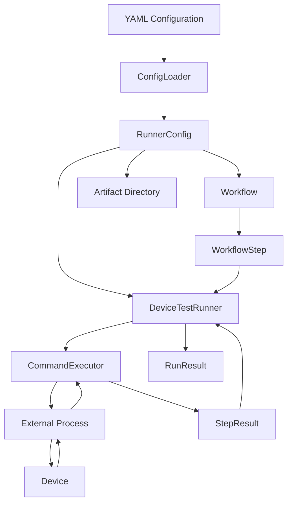

Device Test Runner v1.1 的核心架構可以濃縮為：

> `RunnerConfig` 統一描述 Test Case、Device、Workflow 與 Artifact；`DeviceTestRunner` 依序協調 `WorkflowStep`；`CommandExecutor` 執行單一步驟並產生 `StepResult`；最後由 `RunResult` 彙整完整 Test Case 的執行結果。
