# Device Test Runner Architecture v1.2

## 1. 版本目標

Device Test Runner v1.2 延續 v1.1 的多步驟 Workflow 架構，開始處理測試執行後產生的資料與檔案。

v1.1 解決的是：

> Runner 如何依序執行多個 WorkflowStep，並彙整成 RunResult。

v1.2 解決的是：

> 執行結果如何被保存、組織與輸出，讓每一次 Test Run 都可以被追蹤與分析。

v1.2 的主要新增元件：

* `ArtifactManager`
* `JsonReporter`
* 每次執行獨立的 Run Directory
* 每個 Step 的 stdout 檔案
* 每個 Step 的 stderr 檔案
* `report.json`
* 執行 metadata

完整資料流：

```text
YAML Configuration
        ↓
ConfigLoader
        ↓
RunnerConfig
        ↓
DeviceTestRunner
        ↓
WorkflowStep
        ↓
CommandStepExecutor
        ↓
StepResult
        ↓
ArtifactManager
        ├── stdout.log
        ├── stderr.log
        └── run directory
        ↓
RunResult
        ↓
JsonReporter
        ↓
report.json
```

---

# 2. v1.2 的主要改變

## 2.1 v1.1 的執行結果只存在記憶體中

在 v1.1 中，Runner 執行完成後會回傳：

```python
RunResult(
    test_case_id="power_001",
    test_case_name="Youtube Playback Power Test",
    success=True,
    step_results=[...],
)
```

但這些資料主要存在 Python process 的記憶體中。

當 process 結束後，如果沒有另外處理，以下資訊可能消失：

* stdout
* stderr
* Step 執行時間
* exit code
* Test Case 結果
* 失敗原因
* Device 資訊
* Build 資訊
* 執行時間點

v1.2 開始將這些資訊保存成 Artifact。

---

## 2.2 每一次 Run 都建立獨立目錄

v1.2 不直接把所有檔案寫在：

```text
artifact/sample_device_config/
```

而是在 output directory 下，為每一次執行建立獨立的 Run Directory。

例如：

```text
artifact/sample_device_config/
└── power_001_20260718_213015/
    ├── report.json
    ├── setup_device_stdout.log
    ├── setup_device_stderr.log
    ├── run_scenario_stdout.log
    └── run_scenario_stderr.log
```

這樣每次執行都能保留自己的結果，不會覆蓋上一輪測試。

---

# 3. v1.2 YAML Configuration

v1.2 沿用 v1.1 的 YAML 格式：

```yaml
test_case:
  id: power_001
  name: Youtube Playback Power Test
  description: Measure power behavior during Youtube playback

device:
  serial: emulator-5566
  product: pixel
  build: test_build

workflow:
  steps:
    - name: setup_device
      type: command
      command: "bash scripts/setup_script.sh"
      timeout_second: 10

    - name: run_scenario
      type: command
      command: "bash scripts/run_scenario.sh"
      timeout_second: 30

artifact:
  output_dir: artifact/sample_device_config
```

v1.2 沒有修改 Configuration Domain Model。

原因是 Artifact 功能的重點不是增加新的 YAML 欄位，而是開始真正使用：

```yaml
artifact:
  output_dir:
```

---

# 4. Domain Models

v1.2 沿用目前的 Models：

```python
from dataclasses import dataclass
from typing import List, Optional


@dataclass
class DeviceTestCase:
    id: str
    name: str
    description: str


@dataclass
class DeviceInfo:
    serial: str
    product: str
    build: str


@dataclass
class WorkflowStep:
    name: str
    type: str
    command: str
    timeout_second: int


@dataclass
class Workflow:
    steps: List[WorkflowStep]


@dataclass
class ArtifactConfig:
    output_dir: str


@dataclass
class RunnerConfig:
    test_case: DeviceTestCase
    device: DeviceInfo
    workflow: Workflow
    artifact: ArtifactConfig


@dataclass
class StepResult:
    name: str
    command: str
    success: bool
    exit_code: Optional[int]
    duration_seconds: float
    stdout: str
    stderr: str
    error: Optional[str] = None


@dataclass
class RunResult:
    test_case_id: str
    test_case_name: str
    success: bool
    step_results: List[StepResult]

    @property
    def passed(self) -> bool:
        return all(
            result.success
            for result in self.step_results
        )
```

v1.2 的重點不是增加新的 Domain Model，而是讓既有 Model 可以被保存成 Artifact。

---

# 5. v1.2 系統架構

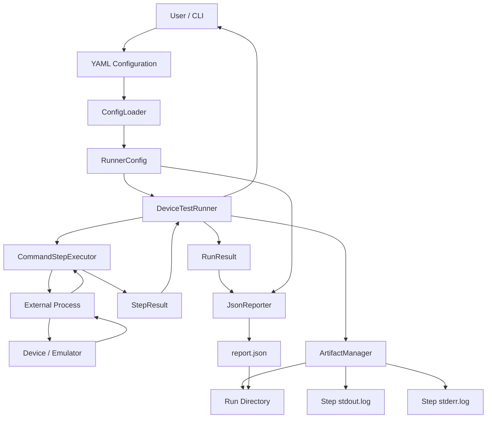

---

# 6. Layered Architecture

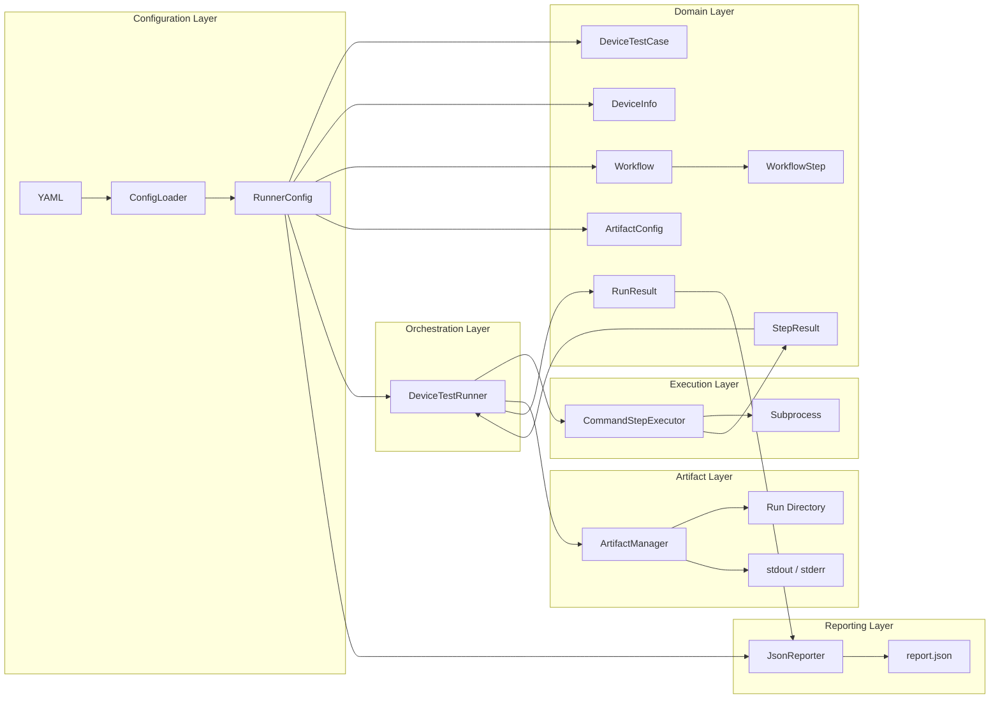

---

# 7. 核心元件責任

| 元件                    | 責任                                         |
| --------------------- | ------------------------------------------ |
| `ConfigLoader`        | 將 YAML 轉換成 RunnerConfig                    |
| `RunnerConfig`        | 描述完整 Test Run 設定                           |
| `DeviceTestRunner`    | 協調 Workflow、Executor、Artifact 與 Reporter   |
| `CommandStepExecutor` | 執行單一 WorkflowStep                          |
| `ArtifactManager`     | 建立 Run Directory 並保存檔案                     |
| `JsonReporter`        | 將 RunnerConfig 與 RunResult 輸出為 report.json |
| `StepResult`          | 描述單一 Step 的執行結果                            |
| `RunResult`           | 彙整整個 Test Case 的結果                         |

---

# 8. v1.2 類別關係圖

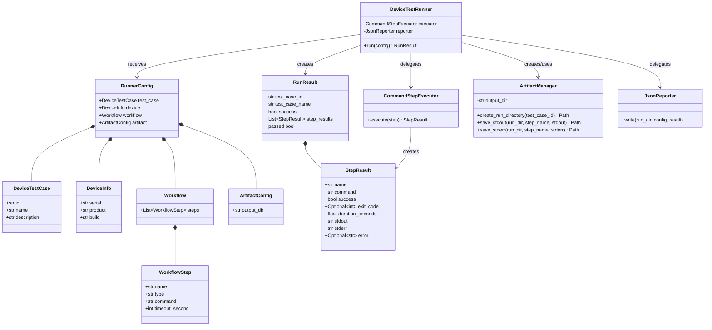

---

# 9. DeviceTestRunner 的角色變化

## v1.1

在 v1.1 中，Runner 的主要工作是：

```text
iterate steps
    ↓
execute step
    ↓
collect StepResult
    ↓
create RunResult
```

## v1.2

在 v1.2 中，Runner 的工作增加為：

```text
create run directory
        ↓
iterate steps
        ↓
execute step
        ↓
save stdout
        ↓
save stderr
        ↓
collect StepResult
        ↓
create RunResult
        ↓
write report.json
```

因此，v1.2 的 Runner 已經不只是 Workflow Orchestrator，也開始協調 Artifact 與 Report。

---

# 10. DeviceTestRunner 執行流程

概念程式碼：

```python
from runner.artifact import ArtifactManager
from runner.executor import CommandStepExecutor
from runner.models import RunnerConfig, RunResult
from runner.reporter import JsonReporter


class DeviceTestRunner:
    def __init__(
        self,
        executor: CommandStepExecutor,
        reporter: JsonReporter,
    ):
        self.executor = executor
        self.reporter = reporter

    def run(self, config: RunnerConfig) -> RunResult:
        artifact_manager = ArtifactManager(
            output_dir=config.artifact.output_dir
        )

        run_dir = artifact_manager.create_run_directory(
            test_case_id=config.test_case.id
        )

        step_results = []

        for step in config.workflow.steps:
            result = self.executor.execute(step=step)
            step_results.append(result)

            artifact_manager.save_stdout(
                run_dir=run_dir,
                step_name=step.name,
                stdout=result.stdout,
            )

            artifact_manager.save_stderr(
                run_dir=run_dir,
                step_name=step.name,
                stderr=result.stderr,
            )

            if not result.success:
                break

        success = all(
            result.success
            for result in step_results
        )

        run_result = RunResult(
            test_case_id=config.test_case.id,
            test_case_name=config.test_case.name,
            success=success,
            step_results=step_results,
        )

        self.reporter.write(
            run_dir=run_dir,
            config=config,
            result=run_result,
        )

        return run_result
```

---

# 11. Runner Activity Diagram

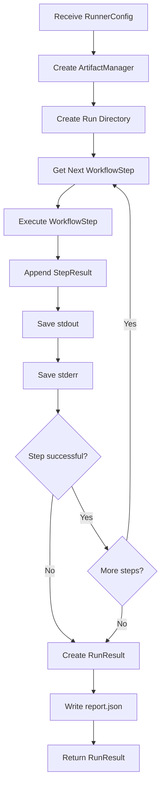

---

# 12. Sequence Diagram

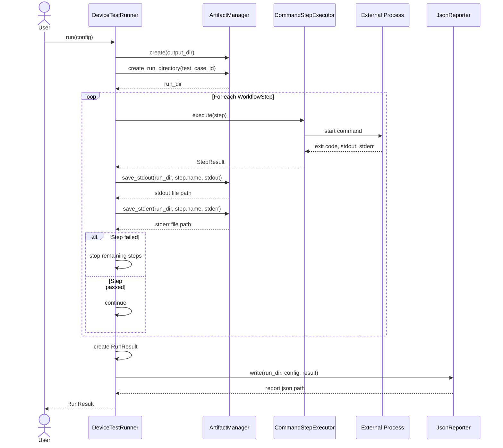

---

# 13. ArtifactManager

`ArtifactManager` 封裝所有檔案系統操作。

概念介面：

```python
from pathlib import Path


class ArtifactManager:
    def __init__(self, output_dir: str):
        self.output_dir = Path(output_dir)

    def create_run_directory(
        self,
        test_case_id: str,
    ) -> Path:
        ...

    def save_stdout(
        self,
        run_dir: Path,
        step_name: str,
        stdout: str,
    ) -> Path:
        ...

    def save_stderr(
        self,
        run_dir: Path,
        step_name: str,
        stderr: str,
    ) -> Path:
        ...
```

ArtifactManager 負責：

* 建立 artifact root directory
* 建立每次執行的 Run Directory
* 產生安全且一致的檔名
* 保存 stdout
* 保存 stderr
* 回傳建立後的檔案路徑

ArtifactManager 不負責：

* 執行 WorkflowStep
* 判斷 Step 成功或失敗
* 建立 RunResult
* 決定是否 fail-fast
* 決定 report.json 的資料格式

---

# 14. 為什麼需要 ArtifactManager

如果 Runner 直接操作檔案：

```python
with open(...):
    ...

Path(...).mkdir(...)
```

Runner 會同時承擔：

* Workflow orchestration
* subprocess coordination
* file path generation
* directory creation
* file writing
* filename sanitization

這會讓 Runner 的責任越來越多。

加入 ArtifactManager 後：

```text
DeviceTestRunner
    ↓ delegates
ArtifactManager
    ↓
File System
```

Runner 只需要表達：

```python
artifact_manager.save_stdout(...)
```

不需要知道實際的 `open()`、encoding 或 directory 建立細節。

---

# 15. Run Directory 設計

建議 Run Directory 包含：

```text
{test_case_id}_{timestamp}
```

例如：

```text
power_001_20260718_213015
```

完整路徑：

```text
artifact/sample_device_config/
└── power_001_20260718_213015/
```

時間戳記可以使用：

```text
YYYYMMDD_HHMMSS
```

優點：

* 避免不同 Run 互相覆蓋
* 可以依時間排序
* 可以快速知道 Test Case ID
* 適合人工瀏覽
* 未來容易上傳至 Artifact Server

---

# 16. Artifact Directory 結構

v1.2 建議輸出：

```text
artifact/
└── sample_device_config/
    └── power_001_20260718_213015/
        ├── report.json
        ├── setup_device_stdout.log
        ├── setup_device_stderr.log
        ├── run_scenario_stdout.log
        └── run_scenario_stderr.log
```

如果 Step 名稱為：

```yaml
name: setup_device
```

則 ArtifactManager 產生：

```text
setup_device_stdout.log
setup_device_stderr.log
```

---

# 17. Artifact 命名規則

Step name 最終會成為檔名，因此需要考慮特殊字元。

例如：

```yaml
name: Setup Device / Clear Logs
```

不能直接安全地作為所有作業系統的檔名。

ArtifactManager 可以進行簡單正規化：

```text
Setup Device / Clear Logs
        ↓
setup_device_clear_logs
```

概念函式：

```python
def sanitize_name(name: str) -> str:
    return (
        name.strip()
        .lower()
        .replace(" ", "_")
        .replace("/", "_")
    )
```

v1.2 不需要建立複雜的命名系統，但 ArtifactManager 應該集中負責這個問題。

---

# 18. stdout 與 stderr 為什麼分開

每個 StepResult 已經包含：

```python
stdout: str
stderr: str
```

但 v1.2 仍將兩者獨立保存：

```text
setup_device_stdout.log
setup_device_stderr.log
```

原因是 stdout 與 stderr 的語意不同。

stdout 通常包含：

* 正常執行訊息
* command output
* scenario progress
* parser output
* device information

stderr 通常包含：

* error message
* warning
* stack trace
* command failure
* shell error

分開保存可以讓除錯更容易，也符合 subprocess 原始輸出模型。

---

# 19. JsonReporter

`JsonReporter` 負責將結構化資料輸出為：

```text
report.json
```

概念介面：

```python
class JsonReporter:
    def write(
        self,
        run_dir,
        config: RunnerConfig,
        result: RunResult,
    ):
        ...
```

Reporter 負責：

* 將 Domain Model 轉換成 dictionary
* 建立 report payload
* 加入 metadata
* 將內容序列化成 JSON
* 寫入 report.json

Reporter 不負責：

* 建立 Run Directory
* 執行 command
* 保存 stdout
* 保存 stderr
* 控制 Workflow 順序

---

# 20. ArtifactManager 與 JsonReporter 的差異

兩者都會寫檔案，但責任不一樣。

## ArtifactManager

負責：

```text
檔案放在哪裡
目錄如何建立
stdout/stderr 如何保存
```

## JsonReporter

負責：

```text
report.json 裡面要寫什麼
資料結構如何組織
Model 如何轉換成 JSON
```

架構關係：

```mermaid
flowchart LR
    Runner[DeviceTestRunner]
    Artifact[ArtifactManager]
    Reporter[JsonReporter]
    FileSystem[File System]

    Runner --> Artifact : manage paths and logs
    Runner --> Reporter : generate structured report
    Artifact --> FileSystem
    Reporter --> FileSystem
```

---

# 21. report.json 建議結構

v1.2 的 report.json 可以分成四個主要區塊：

```json
{
  "metadata": {},
  "test_case": {},
  "device": {},
  "result": {}
}
```

完整範例：

```json
{
  "metadata": {
    "schema_version": "1.2",
    "run_id": "power_001_20260718_213015",
    "started_at": "2026-07-18T21:30:15+08:00",
    "completed_at": "2026-07-18T21:30:43+08:00",
    "duration_seconds": 28.0
  },
  "test_case": {
    "id": "power_001",
    "name": "Youtube Playback Power Test",
    "description": "Measure power behavior during Youtube playback"
  },
  "device": {
    "serial": "emulator-5566",
    "product": "pixel",
    "build": "test_build"
  },
  "result": {
    "success": true,
    "status": "PASSED",
    "steps": [
      {
        "name": "setup_device",
        "type": "command",
        "command": "bash scripts/setup_script.sh",
        "success": true,
        "exit_code": 0,
        "duration_seconds": 2.5,
        "stdout_file": "setup_device_stdout.log",
        "stderr_file": "setup_device_stderr.log",
        "error": null
      },
      {
        "name": "run_scenario",
        "type": "command",
        "command": "bash scripts/run_scenario.sh",
        "success": true,
        "exit_code": 0,
        "duration_seconds": 25.5,
        "stdout_file": "run_scenario_stdout.log",
        "stderr_file": "run_scenario_stderr.log",
        "error": null
      }
    ]
  }
}
```

---

# 22. Metadata 的定位

Metadata 不是單純的 summary。

Metadata 描述的是：

> 這份 report 本身，以及這一次執行的識別與時間背景。

例如：

```json
"metadata": {
  "schema_version": "1.2",
  "run_id": "power_001_20260718_213015",
  "started_at": "2026-07-18T21:30:15+08:00",
  "completed_at": "2026-07-18T21:30:43+08:00",
  "duration_seconds": 28.0
}
```

Metadata 適合放：

* schema version
* run ID
* started time
* completed time
* total duration
* runner version
* host name
* execution environment

Metadata 不適合重複放：

* Test Case name
* Device serial
* Step results
* stdout
* stderr

這些資訊應該放在各自的 Domain 區塊。

---

# 23. report.json 的資料分類

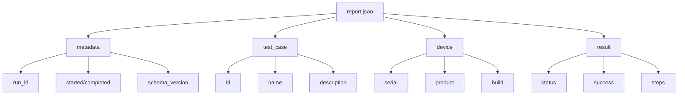

---

# 24. report.json 不建議直接保存完整 stdout

`StepResult` 中有完整的：

```python
stdout
stderr
```

但是 report.json 不建議再次保存完整內容。

否則同一份資料會同時存在：

```text
report.json
setup_device_stdout.log
setup_device_stderr.log
```

可能造成：

* report.json 過大
* 資料重複
* log 中若有大量內容，JSON 難以閱讀
* parser 處理成本增加

較好的方式是 report.json 只保存檔案參考：

```json
{
  "stdout_file": "setup_device_stdout.log",
  "stderr_file": "setup_device_stderr.log"
}
```

也就是：

```text
report.json = index / structured summary
log files = raw execution output
```

---

# 25. RunResult 與 report.json 的差異

`RunResult` 是 Runtime Domain Object：

```python
RunResult
```

它服務 Python 程式內部。

`report.json` 是 Persistent Representation：

```json
{}
```

它服務：

* 人工檢查
* CI 系統
* Dashboard
* Parser
* 歷史分析
* Result Aggregator

兩者不是完全相同的東西。

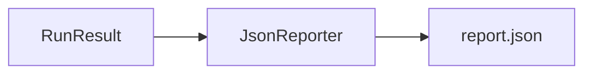

Reporter 的角色，就是將 Runtime Model 轉換成適合長期保存的格式。

---

# 26. RunResult.success 與 passed

目前 RunResult 定義：

```python
@dataclass
class RunResult:
    test_case_id: str
    test_case_name: str
    success: bool
    step_results: List[StepResult]

    @property
    def passed(self) -> bool:
        return all(
            result.success
            for result in self.step_results
        )
```

這裡有兩個相近概念：

```text
success
passed
```

兩者如果同時存在，可能發生狀態不一致。

例如：

```python
RunResult(
    success=True,
    step_results=[
        StepResult(success=False, ...)
    ],
)
```

此時：

```text
result.success == True
result.passed == False
```

v1.2 可以暫時維持目前設計，但建議逐步統一。

方案一：保留 `success` 欄位，移除 `passed`

```python
@dataclass
class RunResult:
    test_case_id: str
    test_case_name: str
    success: bool
    step_results: List[StepResult]
```

方案二：將 `success` 改為 property

```python
@dataclass
class RunResult:
    test_case_id: str
    test_case_name: str
    step_results: List[StepResult]

    @property
    def success(self) -> bool:
        return (
            len(self.step_results) > 0
            and all(
                result.success
                for result in self.step_results
            )
        )

    @property
    def passed(self) -> bool:
        return self.success
```

對 v1.2 而言，建議至少讓 reporter 使用同一個來源：

```python
status = "PASSED" if run_result.success else "FAILED"
```

不要一部分使用 `success`，另一部分使用 `passed`。

---

# 27. 空 Workflow 的成功判斷

Python 中：

```python
all([])
```

結果是：

```python
True
```

因此目前：

```python
all(result.success for result in self.step_results)
```

在沒有任何 StepResult 時，會判定成功。

但對 Device Test Runner 而言：

```text
沒有執行任何 Step
```

通常不應該代表 Test Passed。

較安全的判斷：

```python
@property
def passed(self) -> bool:
    return (
        len(self.step_results) > 0
        and all(
            result.success
            for result in self.step_results
        )
    )
```

這不是 Artifact 功能本身，但 v1.2 開始產生正式 report.json 後，結果判斷需要更嚴謹。

---

# 28. Fail-fast 與 Artifact

v1.2 仍然沿用 v1.1 的 fail-fast。

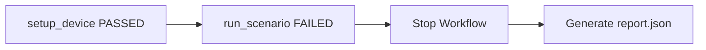

即使 Step 失敗，Runner 仍然必須：

* 保存失敗 Step 的 stdout
* 保存失敗 Step 的 stderr
* 將 StepResult 加入 RunResult
* 產生 report.json
* 回傳 RunResult

也就是：

> Step 失敗會停止 Workflow，但不能中止報告與 Artifact 產生。

---

# 29. Reporter 應該在最後執行

正確流程：

```text
execute steps
    ↓
collect results
    ↓
build RunResult
    ↓
write report.json
```

而不是每完成一個 Step 就覆寫完整 report。

v1.2 可以先採用最簡單的 final report：


未來如果需要處理 process crash，再考慮 incremental report 或 event log。

---

# 30. Error Handling

v1.2 開始涉及檔案系統，因此錯誤來源增加。

## Executor Error

例如：

* command not found
* timeout
* non-zero exit code
* permission denied

應轉換成：

```python
StepResult(
    success=False,
    ...
)
```

## Artifact Error

例如：

* output directory 無法建立
* disk full
* permission denied
* invalid filename

Artifact Error 不等同於 Test Step Failure。

例如 Test Scenario 成功，但 report.json 無法寫入：

```text
Test execution: PASSED
Artifact persistence: FAILED
```

v1.2 可以先讓 Artifact Error 向上拋出，讓呼叫端知道這次執行結果沒有被完整保存。

不要默默忽略：

```python
try:
    save_file()
except Exception:
    pass
```

這樣會讓使用者誤以為 Artifact 已經成功產生。

---

# 31. ArtifactManager 的生命週期

目前設計是在 `run()` 中建立：

```python
artifact_manager = ArtifactManager(
    output_dir=config.artifact.output_dir
)
```

優點：

* 每次 Run 可以有不同 output directory
* ArtifactManager 與 RunnerConfig 綁定自然
* Runner 建構時不需要知道 output path

架構：

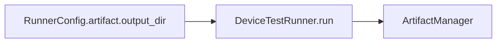

這個設計適合 v1.2。

未來如果 ArtifactManager 需要：

* cloud storage
* fake implementation
* dependency injection
* artifact upload

可以再將 ArtifactManager 注入 Runner。

v1.2 不需要提前過度抽象。

---

# 32. JsonReporter 使用 Dependency Injection

目前 Reporter 由 Runner constructor 注入：

```python
class DeviceTestRunner:
    def __init__(
        self,
        executor: CommandStepExecutor,
        reporter: JsonReporter,
    ):
        self.executor = executor
        self.reporter = reporter
```

這樣做的價值：

* Runner 不需要自己建立 JsonReporter
* Unit Test 可以使用 FakeReporter
* 未來可以替換不同 Reporter
* Reporter 與 Runner 解耦

例如未來可能有：

```text
JsonReporter
ConsoleReporter
JUnitReporter
HtmlReporter
```

v1.2 雖然只實作 JsonReporter，但注入介面已經建立了擴充空間。

---

# 33. Reporter 擴充方向

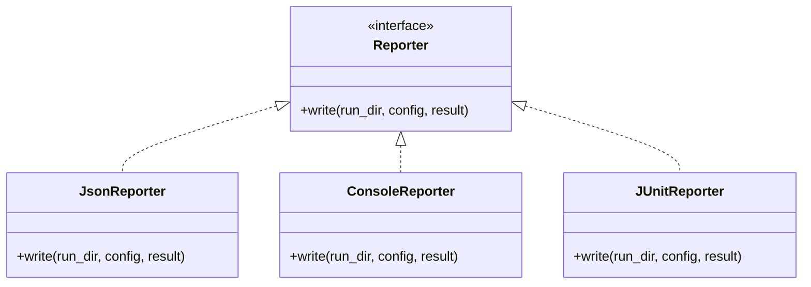

v1.2 不一定需要正式建立 Reporter interface。

目前先保持：

```python
JsonReporter
```

即可。

當第二種 Reporter 真正出現時，再抽象成 Protocol 或 ABC 會比較合理。

---

# 34. 建議目錄結構

```text
device-test-runner/
├── runner/
│   ├── __init__.py
│   ├── artifact.py
│   ├── config_loader.py
│   ├── executor.py
│   ├── models.py
│   ├── reporter.py
│   └── runner.py
│
├── configs/
│   └── sample_device_config.yaml
│
├── scripts/
│   ├── setup_script.sh
│   └── run_scenario.sh
│
├── artifact/
│   └── sample_device_config/
│       └── power_001_20260718_213015/
│           ├── report.json
│           ├── setup_device_stdout.log
│           ├── setup_device_stderr.log
│           ├── run_scenario_stdout.log
│           └── run_scenario_stderr.log
│
├── tests/
│   ├── test_artifact_manager.py
│   ├── test_config_loader.py
│   ├── test_executor.py
│   ├── test_models.py
│   ├── test_reporter.py
│   ├── test_runner.py
│   └── test_integration.py
│
└── docs/
    ├── architecture_v1.0.md
    ├── architecture_v1.1.md
    └── architecture_v1.2.md
```

---

# 35. 測試架構

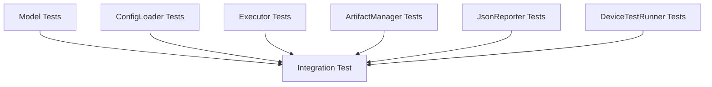

---

# 36. ArtifactManager Unit Tests

ArtifactManager 應測試：

* output directory 不存在時可以建立
* Run Directory 可以成功建立
* 不同 Run 不會使用相同目錄
* stdout 可以正確寫入
* stderr 可以正確寫入
* UTF-8 內容可以正確寫入
* 空 stdout 可以建立空檔案
* Step name 可以轉換成安全檔名

使用 pytest 的 `tmp_path`：

```python
def test_save_stdout(tmp_path):
    manager = ArtifactManager(output_dir=str(tmp_path))

    run_dir = manager.create_run_directory(
        test_case_id="power_001"
    )

    output_file = manager.save_stdout(
        run_dir=run_dir,
        step_name="setup_device",
        stdout="setup completed",
    )

    assert output_file.exists()
    assert output_file.read_text(
        encoding="utf-8"
    ) == "setup completed"
```

---

# 37. JsonReporter Unit Tests

JsonReporter 應測試：

* report.json 可以建立
* JSON 可以被重新讀取
* metadata 存在
* test_case 資訊正確
* device 資訊正確
* result.success 正確
* Step 數量正確
* stdout_file 與 stderr_file 正確
* error 為 null 時能正確序列化
* Unicode 內容可以保留

例如：

```python
def test_write_report(tmp_path):
    reporter = JsonReporter()

    report_path = reporter.write(
        run_dir=tmp_path,
        config=config,
        result=run_result,
    )

    data = json.loads(
        report_path.read_text(encoding="utf-8")
    )

    assert data["test_case"]["id"] == "power_001"
    assert data["result"]["success"] is True
```

---

# 38. Runner Unit Tests

Runner Test 應使用：

* Fake Executor
* Fake Reporter
* Temporary Artifact Directory

驗證：

* Runner 建立 Run Directory
* Step 按順序執行
* stdout 被保存
* stderr 被保存
* 失敗時停止後續 Step
* RunResult 正確
* Reporter 最後被呼叫
* Reporter 收到正確的 config
* Reporter 收到正確的 RunResult

---

# 39. Integration Test

v1.2 的 Integration Test 驗證完整流程：

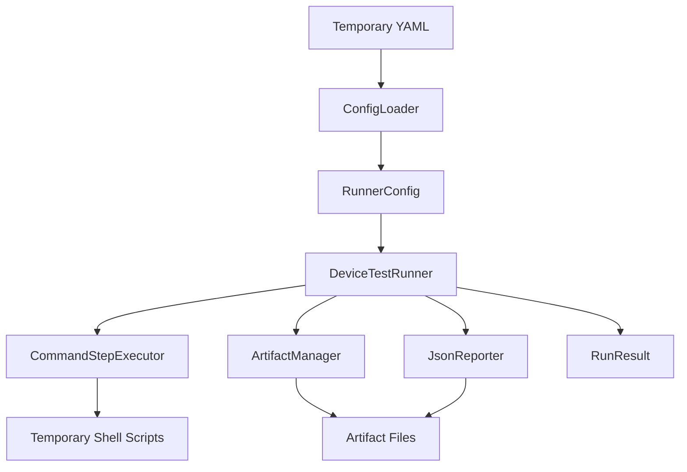

Integration Test 最後應驗證：

```text
RunResult exists
report.json exists
stdout files exist
stderr files exist
report content matches RunResult
```

---

# 40. v1.1 與 v1.2 比較

| 架構項目            | v1.1          | v1.2   |
| --------------- | ------------- | ------ |
| RunnerConfig    | 有             | 沿用     |
| WorkflowStep    | 有             | 沿用     |
| StepResult      | 有             | 沿用     |
| RunResult       | 有             | 沿用     |
| 多步驟執行           | 有             | 沿用     |
| fail-fast       | 有             | 沿用     |
| ArtifactConfig  | 只有設定          | 開始實際使用 |
| Run Directory   | 無             | 有      |
| stdout 落盤       | 無             | 有      |
| stderr 落盤       | 無             | 有      |
| ArtifactManager | 無             | 有      |
| JsonReporter    | 無或尚未完整使用      | 有      |
| report.json     | 無             | 有      |
| metadata        | 無             | 有      |
| 執行歷史            | process 結束後消失 | 可保留    |

---

# 41. v1.2 的架構價值

v1.1 已經可以正確執行 Workflow，但比較像：

```text
執行工具
```

v1.2 開始變成：

```text
可追蹤的 Test Runner
```

因為一個成熟的 Test Runner 不只需要知道：

```text
現在執行成功或失敗
```

還需要回答：

```text
是哪一個 Test Case？
在哪一台 Device？
使用哪一個 Build？
什麼時間執行？
每個 Step 執行多久？
哪一個 Step 失敗？
stdout 是什麼？
stderr 是什麼？
結果檔案放在哪裡？
```

ArtifactManager 與 JsonReporter 讓這些資訊可以被保存與重現。

---

# 42. v1.2 的責任分離

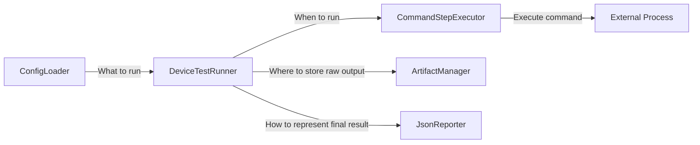

可以用一句話描述每個元件：

```text
ConfigLoader：把設定讀進來。
DeviceTestRunner：控制執行流程。
CommandStepExecutor：執行 command。
ArtifactManager：保存原始檔案。
JsonReporter：產生結構化報告。
```

---

# 43. v1.2 尚未處理的問題

v1.2 專注於基本 Artifact 與 Reporting，因此仍不處理：

* setup / teardown 的正式生命週期
* teardown 必須永遠執行
* retry
* continue-on-failure
* Step dependency
* Artifact Collector Plugin
* Parser integration
* Recorder lifecycle
* Device state validation
* process cleanup
* remote execution
* parallel execution
* Controller / Worker
* database
* web dashboard
* artifact upload
* notification

這些功能不應一次全部加入 v1.2。

v1.2 的核心應保持在：

```text
執行
→ 收集
→ 保存
→ 報告
```

---

# 44. v1.2 架構摘要

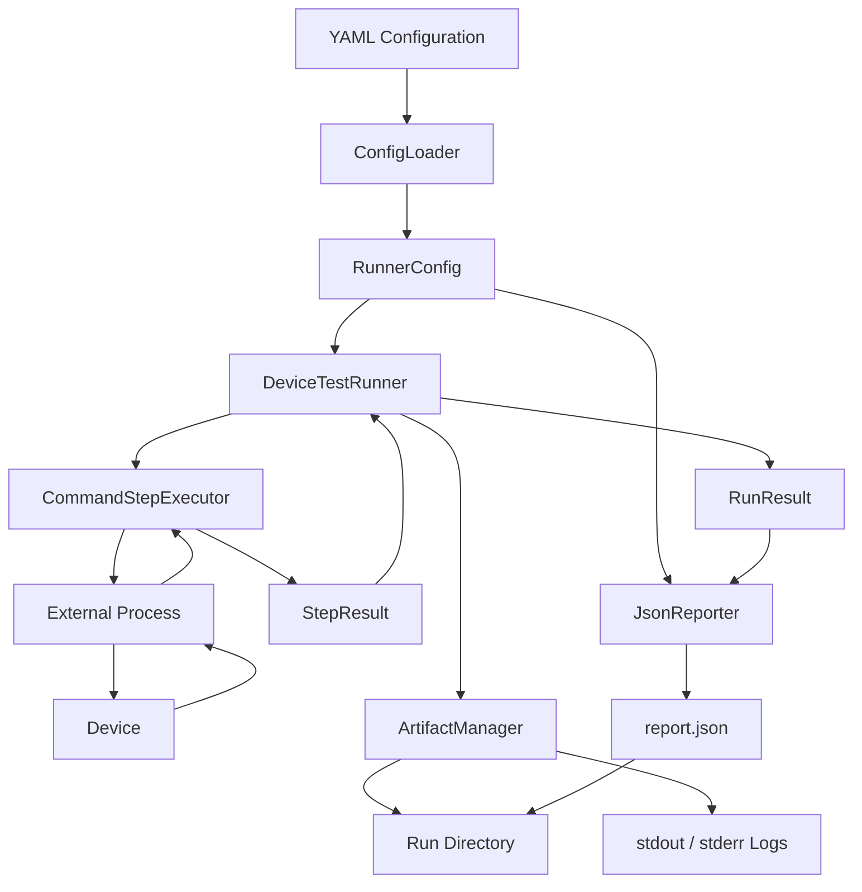

Device Test Runner v1.2 的核心架構可以濃縮成：

> `DeviceTestRunner` 依序執行 `WorkflowStep`，由 `CommandStepExecutor` 產生 `StepResult`；`ArtifactManager` 將每個 Step 的原始 stdout 與 stderr 保存到獨立 Run Directory；`JsonReporter` 再將 `RunnerConfig`、`RunResult` 與執行 metadata 彙整成 `report.json`。

v1.2 是 Device Test Runner 從「可以執行 Workflow」走向「可以保存、追蹤與分析每一次 Test Run」的重要版本。
