# Device Test Runner Architecture v1.3

## 1. 版本定位

Device Test Runner v1.3 的核心目標，是將 v1.2 的線性 Workflow 擴充成具有明確階段語意的 **Test Lifecycle**。

v1.2 的執行概念：

```text
WorkflowStep 1
    ↓
WorkflowStep 2
    ↓
WorkflowStep 3
```

v1.3 的執行概念：

```text
global_setup
    ↓
setup
    ↓
scenario
    ↓
teardown
    ↓
global_teardown
```

因此，v1.3 不再只是：

> 依序執行一組 command。

而是：

> 依照 Test Lifecycle 的階段規則，協調測試準備、情境執行與資源清理。

v1.3 同時加入：

* Lifecycle stage
* Stage-aware `StepResult`
* Immutable configuration models
* Run metadata
* Execution summary
* Configured / executed / skipped 統計
* Artifact directory reference

---

# 2. v1.3 的架構演進

## v1.1：多步驟 Workflow

```text
RunnerConfig
└── Workflow
    └── List[WorkflowStep]
```

Runner 只知道一組有順序的步驟。

---

## v1.2：Artifact 與 Report

```text
WorkflowStep
    ↓
StepResult
    ↓
ArtifactManager
    ↓
report.json
```

Runner 開始保存 stdout、stderr 與執行報告。

---

## v1.3：Lifecycle Orchestration

```text
RunnerConfig
└── LifecycleConfig
    ├── global_setup
    ├── setup
    ├── scenario
    ├── teardown
    └── global_teardown
```

每一個 Stage 包含：

```text
LifecycleSteps
└── List[LifecycleStepContent]
```

每一個結果則明確記錄所屬 Stage：

```python
StepResult(
    stage="setup",
    name="prepare_device",
    ...
)
```

---

# 3. v1.3 Domain Model

```python
from dataclasses import dataclass, field
from typing import List, Optional


@dataclass(frozen=True)
class DeviceTestCase:
    id: str
    name: str
    description: str


@dataclass(frozen=True)
class DeviceInfo:
    serial: str
    product: str
    build: str


@dataclass(frozen=True)
class LifecycleStepContent:
    name: str
    type: str
    command: str
    timeout_second: int


@dataclass(frozen=True)
class LifecycleSteps:
    steps: List[LifecycleStepContent] = field(default_factory=list)


@dataclass(frozen=True)
class LifecycleConfig:
    global_setup: LifecycleSteps = field(default_factory=LifecycleSteps)
    setup: LifecycleSteps = field(default_factory=LifecycleSteps)
    scenario: LifecycleSteps = field(default_factory=LifecycleSteps)
    teardown: LifecycleSteps = field(default_factory=LifecycleSteps)
    global_teardown: LifecycleSteps = field(default_factory=LifecycleSteps)


@dataclass(frozen=True)
class ArtifactConfig:
    output_dir: str


@dataclass(frozen=True)
class RunnerConfig:
    test_case: DeviceTestCase
    device: DeviceInfo
    lifecycle: LifecycleConfig
    artifact: ArtifactConfig


@dataclass(frozen=True)
class StepResult:
    stage: str
    name: str
    command: str
    success: bool
    exit_code: Optional[int]
    duration_seconds: float
    stdout: str
    stderr: str
    error: Optional[str] = None

    @property
    def passed(self) -> bool:
        return self.exit_code == 0


@dataclass(frozen=True)
class RunMetadata:
    test_case_id: str
    test_case_name: str
    test_case_description: str
    device_serial: str
    device_product: str
    device_build: str
    runner_version: str
    started_at: str
    finished_at: str


@dataclass(frozen=True)
class ExecutionSummary:
    status: str
    configured_steps: int
    executed_steps: int
    passed_steps: int
    failed_steps: int
    skipped_steps: int
    duration_seconds: float


@dataclass(frozen=True)
class RunResult:
    metadata: RunMetadata
    summary: ExecutionSummary
    step_results: List[StepResult]
    artifact_dir: str | None = None

    @property
    def passed(self) -> bool:
        return all(
            result.exit_code == 0
            for result in self.step_results
        )
```

---

# 4. Aggregate 結構

v1.3 有兩個主要 Aggregate。

## RunnerConfig Aggregate

```text
RunnerConfig
├── DeviceTestCase
├── DeviceInfo
├── LifecycleConfig
│   ├── global_setup: LifecycleSteps
│   │   └── List[LifecycleStepContent]
│   ├── setup: LifecycleSteps
│   │   └── List[LifecycleStepContent]
│   ├── scenario: LifecycleSteps
│   │   └── List[LifecycleStepContent]
│   ├── teardown: LifecycleSteps
│   │   └── List[LifecycleStepContent]
│   └── global_teardown: LifecycleSteps
│       └── List[LifecycleStepContent]
└── ArtifactConfig
```

`RunnerConfig` 描述：

> 這次 Test Run 要在哪一台 Device 上，以哪些 Lifecycle 階段與步驟執行，以及 Artifact 應輸出到哪裡。

---

## RunResult Aggregate

```text
RunResult
├── RunMetadata
├── ExecutionSummary
├── List[StepResult]
└── artifact_dir
```

`RunResult` 描述：

> 這次 Test Run 在什麼環境執行、執行了哪些步驟、整體狀態如何，以及 Artifact 保存在哪裡。

---

# 5. Class Diagram

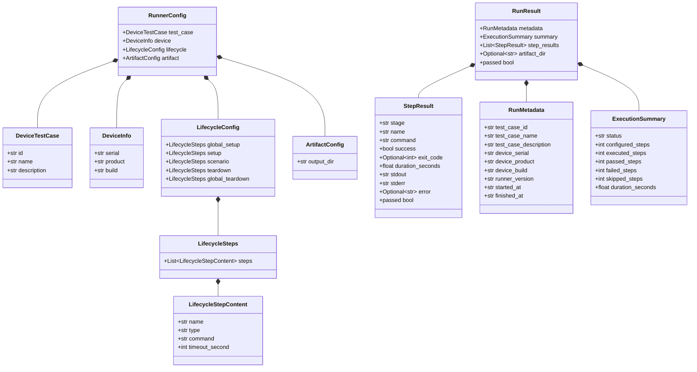

---

# 6. Lifecycle Stage 設計

v1.3 定義五個固定 Stage：

| Stage             | 用途                  |
| ----------------- | ------------------- |
| `global_setup`    | 整次 Test Run 的全域準備   |
| `setup`           | Scenario 執行前的測試準備   |
| `scenario`        | 主要測試內容              |
| `teardown`        | Scenario 後的資源清理     |
| `global_teardown` | 整次 Test Run 最後的全域清理 |

完整流程：


---

# 7. 各 Stage 的 Domain 語意

## global_setup

適合放整次 Run 只需要做一次的準備。

例如：

```text
建立 Artifact Directory
驗證測試工具存在
確認 Device 可被偵測
清理舊的背景程序
初始化共用環境
```

YAML 概念：

```yaml
global_setup:
  steps:
    - name: verify_device_connection
      type: command
      command: "adb devices"
      timeout_second: 10
```

---

## setup

適合放這個 Test Case 或 Scenario 執行前的準備。

例如：

```text
設定 Device 狀態
清除 log
安裝 APK
切換網路環境
設定亮度
啟動必要服務
```

---

## scenario

Scenario 是主要被測試的行為。

例如：

```text
播放 YouTube
執行 benchmark
啟動 Camera recording
執行 Appium scenario
產生 power workload
```

這是 Test Case 的核心內容。

---

## teardown

Teardown 用來清理 Scenario 造成的狀態。

例如：

```text
停止 App
停止 recorder
關閉測試服務
清除暫存檔
回復 Device 設定
```

Teardown 通常應該在 Scenario 失敗後仍然執行。

---

## global_teardown

Global teardown 是整個 Test Run 最後的全域清理。

例如：

```text
停止所有背景程序
收集最後的 Device 狀態
關閉共用 recorder
產生最終檔案
釋放 Device lock
```

即使前面的 Stage 失敗，通常也應盡可能執行。

---

# 8. 為什麼不用單一 Workflow

v1.2 的線性 Workflow 可以表達：

```yaml
steps:
  - setup_device
  - run_scenario
  - stop_process
```

但 Runner 無法知道：

```text
setup_device 是準備階段
run_scenario 是主測試
stop_process 是清理階段
```

所有 Step 在架構上完全相同。

v1.3 將 Step 放入 Stage 後，Runner 可以根據 Stage 使用不同的執行政策。

例如：

```text
setup 失敗
    ↓
scenario 不執行
    ↓
teardown 仍可能需要執行
    ↓
global_teardown 必須盡量執行
```

這是 Test Lifecycle 與普通 Workflow 最大的不同。

---

# 9. Lifecycle Orchestration Policy

v1.3 的 Runner 不應只做單純的巢狀迴圈：

```python
for stage in stages:
    for step in stage.steps:
        execute(step)
```

還必須決定：

* Stage 失敗後是否停止
* 哪些 Stage 被 skip
* teardown 是否仍執行
* global_teardown 是否仍執行
* skipped_steps 如何計算
* 最終 status 如何聚合

建議的基本政策：

| 失敗位置                 | 後續行為                                            |
| -------------------- | ----------------------------------------------- |
| `global_setup` 失敗    | skip setup、scenario；執行 global_teardown          |
| `setup` 失敗           | skip scenario；執行 teardown、global_teardown       |
| `scenario` 失敗        | 停止剩餘 scenario steps；執行 teardown、global_teardown |
| `teardown` 失敗        | 繼續 global_teardown                              |
| `global_teardown` 失敗 | 結束 Run，標記 FAILED                                |

---

# 10. Lifecycle Activity Diagram

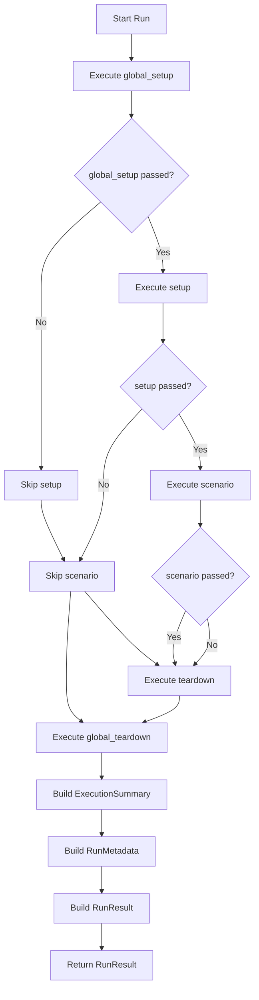

---

# 11. Stage 與 Step 的分離

v1.3 使用兩層結構：

```python
LifecycleSteps
└── List[LifecycleStepContent]
```

而不是直接：

```python
global_setup: List[LifecycleStepContent]
```

這個包裝層有幾個價值。

## 統一 YAML 結構

每一個 Stage 都可以維持：

```yaml
setup:
  steps:
    - ...
```

而不是：

```yaml
setup:
  - ...
```

---

## 未來可以擴充 Stage Policy

未來 `LifecycleSteps` 可以增加：

```python
@dataclass(frozen=True)
class LifecycleSteps:
    steps: List[LifecycleStepContent]
    continue_on_failure: bool = False
    required: bool = False
    timeout_second: Optional[int] = None
```

目前 v1.3 還沒有這些欄位，但包裝層已經預留擴充位置。

---

## 避免 Mutable Default

這段程式使用：

```python
field(default_factory=list)
```

而不是：

```python
steps: List[LifecycleStepContent] = []
```

原因是直接使用 `[]` 會讓不同 instance 共用同一個 list。

正確方式：

```python
@dataclass(frozen=True)
class LifecycleSteps:
    steps: List[LifecycleStepContent] = field(
        default_factory=list
    )
```

每個 `LifecycleSteps` instance 都會取得自己的 list。

---

# 12. `frozen=True` 的架構意義

v1.3 的所有 Model 都使用：

```python
@dataclass(frozen=True)
```

這代表 dataclass 建立後，欄位不能被重新指定。

例如：

```python
config.device.serial = "new-device"
```

會拋出：

```text
FrozenInstanceError
```

這表示 v1.3 將 Model 定位為：

> 執行期間不可任意修改的資料快照。

---

## Configuration Immutability

`RunnerConfig` 是從 YAML 建立的執行設定。

一旦開始執行後，不應在流程中被修改：

```text
YAML
    ↓
RunnerConfig snapshot
    ↓
Runner execution
```

這可以避免執行到一半時：

* Device serial 被修改
* Step command 被修改
* timeout 被修改
* Artifact path 被修改
* Lifecycle steps 被替換

---

## Result Immutability

`StepResult`、`RunMetadata`、`ExecutionSummary` 與 `RunResult` 也都是執行結果快照。

結果建立後應視為不可變的歷史紀錄。

```text
Execution
    ↓
Result snapshot
    ↓
Report / Artifact
```

---

## Frozen Dataclass 的限制

`frozen=True` 是淺層不可變。

例如：

```python
lifecycle_steps.steps.append(new_step)
```

其中 `steps` 還是普通的 `list`，因此 list 本身仍然可以被修改。

也就是：

```text
不能重新指定 steps 欄位
但可能仍可以修改 steps 內部內容
```

若未來需要真正不可變，可以改用：

```python
tuple[LifecycleStepContent, ...]
```

例如：

```python
@dataclass(frozen=True)
class LifecycleSteps:
    steps: tuple[LifecycleStepContent, ...] = ()
```

但在 v1.3，使用 `List` 對教學與 YAML 轉換較直觀，可以先維持目前設計。

---

# 13. RunnerConfig 的角色

v1.3 的 `RunnerConfig`：

```python
@dataclass(frozen=True)
class RunnerConfig:
    test_case: DeviceTestCase
    device: DeviceInfo
    lifecycle: LifecycleConfig
    artifact: ArtifactConfig
```

它不再包含：

```python
workflow: Workflow
```

而改為：

```python
lifecycle: LifecycleConfig
```

這是一個重要的 Domain Language 變化。

v1.2：

```text
Runner 執行 Workflow
```

v1.3：

```text
Runner 管理 Test Lifecycle
```

---

# 14. LifecycleStepContent 的角色

```python
@dataclass(frozen=True)
class LifecycleStepContent:
    name: str
    type: str
    command: str
    timeout_second: int
```

它描述一個 Step 的執行內容，但不保存 Stage。

因為 Stage 是由它所在的 `LifecycleConfig` 欄位決定：

```python
config.lifecycle.setup.steps
```

代表這些 Step 的 Stage 是：

```text
setup
```

因此不需要在 Configuration 中重複保存：

```python
stage="setup"
```

---

## Config 與 Result 的差異

Configuration：

```python
LifecycleStepContent(
    name="prepare_device",
    ...
)
```

Result：

```python
StepResult(
    stage="setup",
    name="prepare_device",
    ...
)
```

原因是當 Step 執行完成後，它已經離開原本的 Lifecycle 結構。

因此 `StepResult` 需要保存 `stage`，才能知道結果來自哪一個階段。

---

# 15. StepResult 的角色

```python
@dataclass(frozen=True)
class StepResult:
    stage: str
    name: str
    command: str
    success: bool
    exit_code: Optional[int]
    duration_seconds: float
    stdout: str
    stderr: str
    error: Optional[str] = None
```

相較於 v1.2，最重要的新增欄位是：

```python
stage: str
```

現在可以區分：

```text
setup.prepare_device
scenario.run_youtube
teardown.stop_youtube
```

而不只是：

```text
prepare_device
run_youtube
stop_youtube
```

---

# 16. StepResult 的 Identity

一個 Step 的完整識別可以視為：

```text
{stage}.{name}
```

例如：

```text
global_setup.verify_device
setup.prepare_power_test
scenario.youtube_playback
teardown.stop_application
global_teardown.release_device
```

這也適合用於 Artifact 檔名：

```text
setup_prepare_power_test_stdout.log
setup_prepare_power_test_stderr.log
```

而不是只使用 Step name。

原因是不同 Stage 可能有相同名稱：

```yaml
setup:
  steps:
    - name: clear_logs

teardown:
  steps:
    - name: clear_logs
```

若只使用：

```text
clear_logs_stdout.log
```

檔案可能互相覆蓋。

因此 v1.3 Artifact 命名建議包含：

```text
stage + step_name
```

---

# 17. StepResult.success 與 passed

目前 StepResult 同時有：

```python
success: bool
```

以及：

```python
@property
def passed(self) -> bool:
    return self.exit_code == 0
```

大部分正常 subprocess 情境下，兩者會一致：

```text
exit_code == 0
success == True
```

但在 timeout 或 Executor exception 時：

```python
exit_code = None
success = False
```

`passed` 仍然會得到 `False`。

不過更一致的設計是：

```python
@property
def passed(self) -> bool:
    return self.success
```

因為 `success` 可以統一涵蓋：

* exit code 為 0
* exit code 非 0
* timeout
* command not found
* unsupported step type
* Executor internal error

建議避免兩個不同的 success source。

目前版本若已經完成，可以先維持原 Model，但 Runner、Summary 與 Reporter 應統一使用 `success`，不要部分使用 `exit_code`、部分使用 `success`。

---

# 18. CommandStepExecutor

Executor 一次執行一個 `LifecycleStepContent`。

概念介面：

```python
class CommandStepExecutor:
    def execute(
        self,
        stage: str,
        step: LifecycleStepContent,
    ) -> StepResult:
        ...
```

完整資料流：

```text
stage
+
LifecycleStepContent
        ↓
CommandStepExecutor
        ↓
subprocess
        ↓
StepResult
```

Executor 需要從 Runner 接收 `stage`，因為 `LifecycleStepContent` 本身不包含 stage。

---

# 19. Executor Activity Diagram

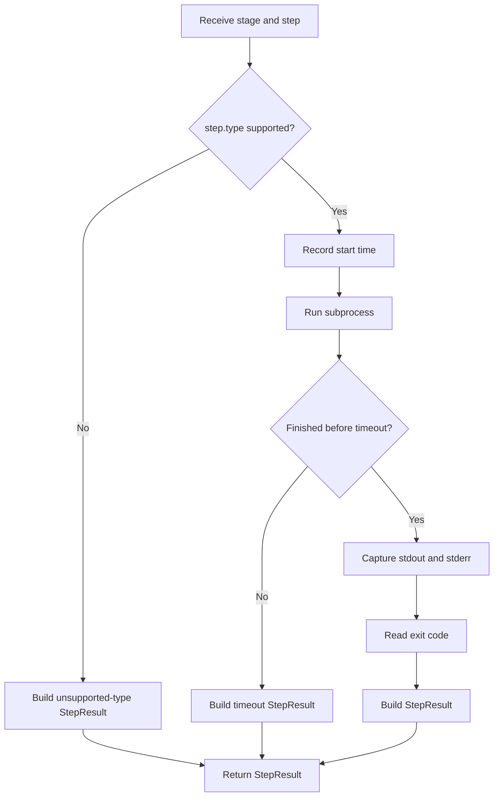

---

# 20. Lifecycle Runner 的角色

v1.3 的 `DeviceTestRunner` 是完整的 Lifecycle Orchestrator。

它負責：

1. 接收 `RunnerConfig`
2. 建立 Artifact Directory
3. 記錄 `started_at`
4. 計算 configured steps
5. 依 Stage 順序執行
6. 將 Stage 傳入 Executor
7. 收集 `StepResult`
8. 套用 Stage failure policy
9. 計算 skipped steps
10. 建立 `ExecutionSummary`
11. 記錄 `finished_at`
12. 建立 `RunMetadata`
13. 建立 `RunResult`
14. 輸出 Artifact 與 Report

---

# 21. 建議的 Runner 結構

```python
class DeviceTestRunner:
    def run(self, config: RunnerConfig) -> RunResult:
        started_at = self.clock.now()
        step_results = []

        configured_steps = self._count_configured_steps(
            config.lifecycle
        )

        self._run_lifecycle(
            lifecycle=config.lifecycle,
            step_results=step_results,
        )

        finished_at = self.clock.now()

        summary = self._build_summary(
            configured_steps=configured_steps,
            step_results=step_results,
            started_at=started_at,
            finished_at=finished_at,
        )

        metadata = self._build_metadata(
            config=config,
            started_at=started_at,
            finished_at=finished_at,
        )

        return RunResult(
            metadata=metadata,
            summary=summary,
            step_results=step_results,
            artifact_dir=artifact_dir,
        )
```

`run()` 應該表達高階流程，不應塞入所有細節。

具體工作可拆成私有方法：

```text
_count_configured_steps()
_execute_stage()
_build_metadata()
_build_summary()
_save_artifacts()
```

---

# 22. Stage Execution 抽象

建議 Runner 提供：

```python
def _execute_stage(
    self,
    stage_name: str,
    lifecycle_steps: LifecycleSteps,
) -> list[StepResult]:
    ...
```

概念實作：

```python
def _execute_stage(
    self,
    stage_name: str,
    lifecycle_steps: LifecycleSteps,
) -> list[StepResult]:
    results = []

    for step in lifecycle_steps.steps:
        result = self.executor.execute(
            stage=stage_name,
            step=step,
        )

        results.append(result)

        if not result.success:
            break

    return results
```

這樣五個 Stage 可以共用同一套執行邏輯。

---

# 23. Stage Mapping

Runner 可以先建立固定 Stage 順序：

```python
stages = [
    ("global_setup", config.lifecycle.global_setup),
    ("setup", config.lifecycle.setup),
    ("scenario", config.lifecycle.scenario),
    ("teardown", config.lifecycle.teardown),
    ("global_teardown", config.lifecycle.global_teardown),
]
```

但不能只用單純 `for`，因為不同 Stage 的 failure policy 不相同。

例如：

```python
normal_stages = [
    ("global_setup", lifecycle.global_setup),
    ("setup", lifecycle.setup),
    ("scenario", lifecycle.scenario),
]

cleanup_stages = [
    ("teardown", lifecycle.teardown),
    ("global_teardown", lifecycle.global_teardown),
]
```

概念上可以拆成：

```text
Main Lifecycle
├── global_setup
├── setup
└── scenario

Cleanup Lifecycle
├── teardown
└── global_teardown
```

---

# 24. Main Flow 與 Cleanup Flow

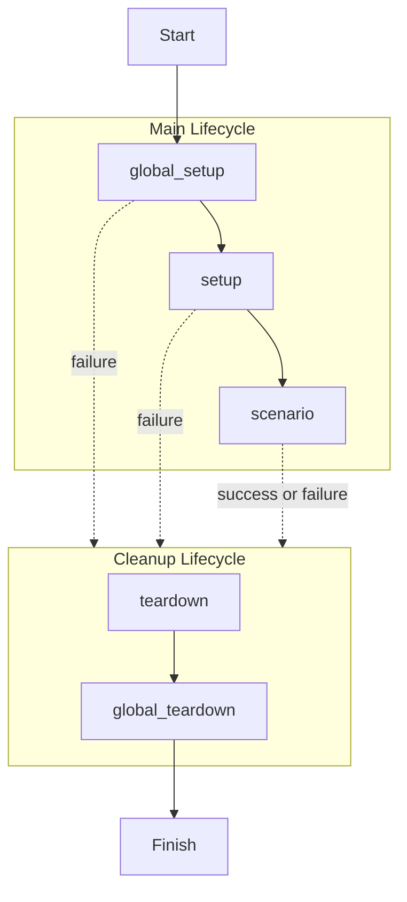

這個分法很重要。

普通 fail-fast Workflow 常見邏輯：

```text
任何 Step 失敗
→ 全部停止
```

Lifecycle Runner 則應該是：

```text
主要階段失敗
→ 停止後續主要工作
→ 仍進入 Cleanup Lifecycle
```

---

# 25. Configured Steps 計算

`ExecutionSummary.configured_steps` 表示 YAML 中總共設定了多少個 Step。

計算方式：

```python
configured_steps = sum(
    len(stage.steps)
    for stage in [
        lifecycle.global_setup,
        lifecycle.setup,
        lifecycle.scenario,
        lifecycle.teardown,
        lifecycle.global_teardown,
    ]
)
```

例如：

```text
global_setup: 1
setup: 2
scenario: 3
teardown: 1
global_teardown: 1
```

則：

```text
configured_steps = 8
```

---

# 26. Executed Steps

`executed_steps` 表示真正進入 Executor 的 Step 數量。

```python
executed_steps = len(step_results)
```

例如：

```text
configured_steps = 8
executed_steps = 5
```

代表有 3 個 Step 因為前面失敗或 Lifecycle policy 而沒有被執行。

---

# 27. Passed 與 Failed Steps

建議使用 `StepResult.success`：

```python
passed_steps = sum(
    result.success
    for result in step_results
)

failed_steps = sum(
    not result.success
    for result in step_results
)
```

Python 中：

```text
True == 1
False == 0
```

因此可以直接用 `sum()` 計數。

更明確的寫法：

```python
passed_steps = sum(
    1
    for result in step_results
    if result.success
)

failed_steps = sum(
    1
    for result in step_results
    if not result.success
)
```

---

# 28. Skipped Steps

```python
skipped_steps = configured_steps - executed_steps
```

例如：

```text
configured_steps = 8
executed_steps = 5
skipped_steps = 3
```

但這個計算的語意是：

> 所有沒有被 Executor 執行的 Configured Steps，都被視為 skipped。

這適合 v1.3。

未來如果需要知道具體哪一些 Step 被跳過，可以增加：

```python
SkippedStep
```

或增加 Step status：

```text
PASSED
FAILED
SKIPPED
```

目前 v1.3 使用 Summary 層級統計即可。

---

# 29. ExecutionSummary

```python
@dataclass(frozen=True)
class ExecutionSummary:
    status: str
    configured_steps: int
    executed_steps: int
    passed_steps: int
    failed_steps: int
    skipped_steps: int
    duration_seconds: float
```

它的定位是：

> 將完整 StepResult 列表聚合成容易閱讀與查詢的統計資訊。

---

## Summary 與 StepResult 的差異

`StepResult` 是詳細紀錄：

```text
每個 Step 發生什麼事？
```

`ExecutionSummary` 是整體聚合：

```text
整次 Run 的狀態如何？
```

架構關係：

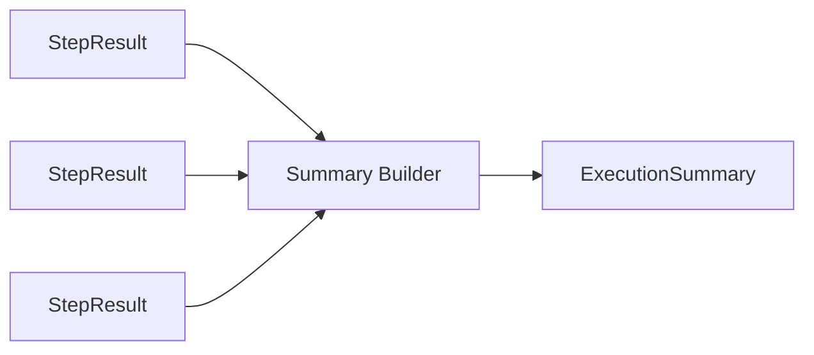

---

# 30. Summary Invariants

ExecutionSummary 的數值應符合：

```text
executed_steps
=
passed_steps + failed_steps
```

以及：

```text
configured_steps
=
executed_steps + skipped_steps
```

因此應滿足：

```text
configured_steps
=
passed_steps + failed_steps + skipped_steps
```

這些可以作為 Unit Test assertion。

例如：

```python
assert (
    summary.executed_steps
    == summary.passed_steps + summary.failed_steps
)

assert (
    summary.configured_steps
    == summary.executed_steps + summary.skipped_steps
)
```

---

# 31. Summary Status

`ExecutionSummary.status` 建議使用固定值：

```text
PASSED
FAILED
```

v1.3 暫時不需要增加太多狀態。

基本判定：

```python
status = (
    "PASSED"
    if failed_steps == 0
    and executed_steps > 0
    else "FAILED"
)
```

但如果 Cleanup Step 失敗，也應算整體失敗。

例如：

```text
scenario: PASSED
teardown: FAILED
```

最終：

```text
status = FAILED
```

因為 Test Lifecycle 沒有完整成功。

---

# 32. RunMetadata

```python
@dataclass(frozen=True)
class RunMetadata:
    test_case_id: str
    test_case_name: str
    test_case_description: str
    device_serial: str
    device_product: str
    device_build: str
    runner_version: str
    started_at: str
    finished_at: str
```

`RunMetadata` 將執行上下文從 `RunnerConfig` 中抽取出來，形成執行當下的快照。

它回答：

```text
執行的是哪一個 Test Case？
執行在哪一台 Device？
使用哪一個 Build？
使用哪個 Runner Version？
什麼時候開始？
什麼時候結束？
```

---

# 33. 為什麼 RunResult 不直接保存 RunnerConfig

一種設計可以是：

```python
@dataclass
class RunResult:
    config: RunnerConfig
    ...
```

但 v1.3 使用：

```python
metadata: RunMetadata
```

有幾個好處。

## 保存執行快照

`RunnerConfig` 是輸入設定；`RunMetadata` 是實際執行紀錄。

兩者語意不同。

---

## Reporter 比較容易序列化

`RunMetadata` 已經整理成扁平結構：

```python
metadata.device_serial
metadata.runner_version
```

不需要 Reporter 再深入巢狀 Config。

---

## 將 Input Model 與 Output Model 分開

```text
RunnerConfig = 執行前輸入
RunMetadata = 執行後紀錄
```

這是明確的 Input / Output Boundary。

---

# 34. Metadata Builder

Runner 可以提供：

```python
def _build_metadata(
    self,
    config: RunnerConfig,
    started_at: str,
    finished_at: str,
) -> RunMetadata:
    return RunMetadata(
        test_case_id=config.test_case.id,
        test_case_name=config.test_case.name,
        test_case_description=config.test_case.description,
        device_serial=config.device.serial,
        device_product=config.device.product,
        device_build=config.device.build,
        runner_version=self.runner_version,
        started_at=started_at,
        finished_at=finished_at,
    )
```

這個轉換屬於 Runner orchestration 或 Result Builder 的責任。

---

# 35. RunResult

v1.3 的 `RunResult`：

```python
@dataclass(frozen=True)
class RunResult:
    metadata: RunMetadata
    summary: ExecutionSummary
    step_results: List[StepResult]
    artifact_dir: str | None = None
```

它不再直接保存：

```python
test_case_id
test_case_name
success
```

而是改成分層結構：

```text
metadata → 執行上下文
summary → 執行統計
step_results → 詳細結果
artifact_dir → 實體輸出位置
```

這比 v1.2 的 RunResult 更適合正式 report。

---

# 36. RunResult 結構圖

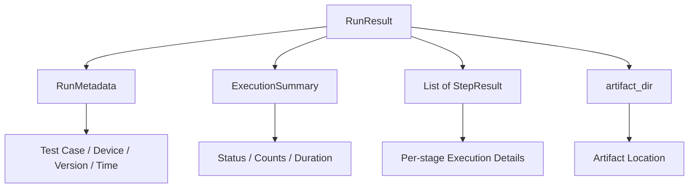

---

# 37. RunResult.passed 的注意事項

目前：

```python
@property
def passed(self) -> bool:
    return all(
        result.exit_code == 0
        for result in self.step_results
    )
```

這有兩個值得注意的地方。

## 空結果問題

Python：

```python
all([])
```

結果為：

```python
True
```

如果完全沒有 Step 被執行，例如 global setup 前就發生 Runner internal error，可能會得到：

```text
RunResult.passed == True
```

這通常不符合 Test Runner 語意。

---

## 與 Summary Status 可能不一致

RunResult 已經有：

```python
summary.status
```

若 `passed` 重新從 StepResult 計算，可能產生兩個狀態來源。

例如：

```text
summary.status = FAILED
passed = True
```

理論上不應發生，但如果 Builder 邏輯有 bug，就可能不一致。

---

## 建議

較一致的方式：

```python
@property
def passed(self) -> bool:
    return self.summary.status == "PASSED"
```

如此：

```text
ExecutionSummary.status
```

成為 Run-level status 的單一來源。

Step-level 判斷則使用：

```python
StepResult.success
```

這樣責任比較清楚：

```text
StepResult.success → 單一步驟結果
ExecutionSummary.status → 整體執行結果
RunResult.passed → Summary 的便利介面
```

---

# 38. Artifact Directory

`RunResult` 新增：

```python
artifact_dir: str | None = None
```

這表示 RunResult 不只描述邏輯結果，也提供 Artifact 的實體位置。

例如：

```python
RunResult(
    ...,
    artifact_dir=(
        "artifact/sample_device_config/"
        "power_001_20260722_213015"
    ),
)
```

若 Artifact 尚未建立或執行失敗：

```python
artifact_dir=None
```

---

# 39. Artifact Directory Structure

v1.3 建議加入 Stage 名稱：

```text
artifact/
└── sample_device_config/
    └── power_001_20260722_213015/
        ├── report.json
        │
        ├── global_setup/
        │   ├── verify_device_stdout.log
        │   └── verify_device_stderr.log
        │
        ├── setup/
        │   ├── prepare_device_stdout.log
        │   └── prepare_device_stderr.log
        │
        ├── scenario/
        │   ├── run_youtube_stdout.log
        │   └── run_youtube_stderr.log
        │
        ├── teardown/
        │   ├── stop_youtube_stdout.log
        │   └── stop_youtube_stderr.log
        │
        └── global_teardown/
            ├── release_device_stdout.log
            └── release_device_stderr.log
```

這比所有檔案放在同一層更能表達 Lifecycle。

---

# 40. ArtifactManager 的角色

v1.3 的 ArtifactManager 應支援 Stage-aware path。

概念介面：

```python
class ArtifactManager:
    def create_run_directory(
        self,
        test_case_id: str,
    ) -> str:
        ...

    def save_step_output(
        self,
        artifact_dir: str,
        result: StepResult,
    ) -> None:
        ...
```

ArtifactManager 可以使用：

```python
result.stage
result.name
```

產生路徑：

```text
{artifact_dir}/{stage}/{step_name}_stdout.log
{artifact_dir}/{stage}/{step_name}_stderr.log
```

---

# 41. report.json 結構

v1.3 的 RunResult 已經很接近 report.json 結構。

建議輸出：

```json
{
  "metadata": {
    "test_case_id": "power_001",
    "test_case_name": "Youtube Playback Power Test",
    "test_case_description": "Measure power behavior during Youtube playback",
    "device_serial": "emulator-5566",
    "device_product": "pixel",
    "device_build": "test_build",
    "runner_version": "1.3",
    "started_at": "2026-07-22T21:30:15+08:00",
    "finished_at": "2026-07-22T21:31:05+08:00"
  },
  "summary": {
    "status": "PASSED",
    "configured_steps": 5,
    "executed_steps": 5,
    "passed_steps": 5,
    "failed_steps": 0,
    "skipped_steps": 0,
    "duration_seconds": 50.0
  },
  "step_results": [
    {
      "stage": "global_setup",
      "name": "verify_device",
      "command": "adb devices",
      "success": true,
      "exit_code": 0,
      "duration_seconds": 1.2,
      "stdout_file": "global_setup/verify_device_stdout.log",
      "stderr_file": "global_setup/verify_device_stderr.log",
      "error": null
    }
  ],
  "artifact_dir": "artifact/sample_device_config/power_001_20260722_213015"
}
```

---

# 42. ConfigLoader 的變化

v1.2 的 ConfigLoader 讀取：

```text
workflow.steps
```

v1.3 改為讀取：

```text
lifecycle.global_setup.steps
lifecycle.setup.steps
lifecycle.scenario.steps
lifecycle.teardown.steps
lifecycle.global_teardown.steps
```

概念流程：

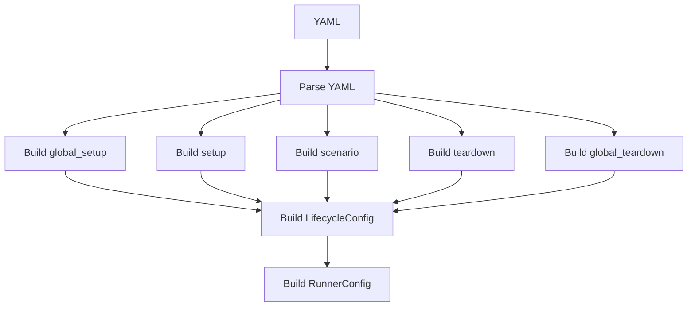

---

# 43. 空 Stage 的處理

因為 `LifecycleConfig` 使用：

```python
field(default_factory=LifecycleSteps)
```

每個 Stage 都可以省略。

例如 YAML 只有：

```yaml
lifecycle:
  scenario:
    steps:
      - name: run_test
        type: command
        command: "bash scripts/run_test.sh"
        timeout_second: 30
```

ConfigLoader 可以建立：

```text
global_setup.steps = []
setup.steps = []
scenario.steps = [run_test]
teardown.steps = []
global_teardown.steps = []
```

Runner 不需要對缺少 Stage 的情況做特殊判斷，只需要執行空 list。

這降低了 Runner 中的分支數量。

---

# 44. 建議 YAML 結構

```yaml
test_case:
  id: power_001
  name: Youtube Playback Power Test
  description: Measure power behavior during Youtube playback

device:
  serial: emulator-5566
  product: pixel
  build: test_build

lifecycle:
  global_setup:
    steps:
      - name: verify_device
        type: command
        command: "adb devices"
        timeout_second: 10

  setup:
    steps:
      - name: prepare_device
        type: command
        command: "bash scripts/setup_device.sh"
        timeout_second: 30

  scenario:
    steps:
      - name: run_youtube_playback
        type: command
        command: "bash scripts/run_scenario.sh"
        timeout_second: 300

  teardown:
    steps:
      - name: stop_youtube
        type: command
        command: "bash scripts/stop_scenario.sh"
        timeout_second: 30

  global_teardown:
    steps:
      - name: collect_device_state
        type: command
        command: "bash scripts/collect_device_state.sh"
        timeout_second: 30

artifact:
  output_dir: artifact/sample_device_config
```

---

# 45. Sequence Diagram

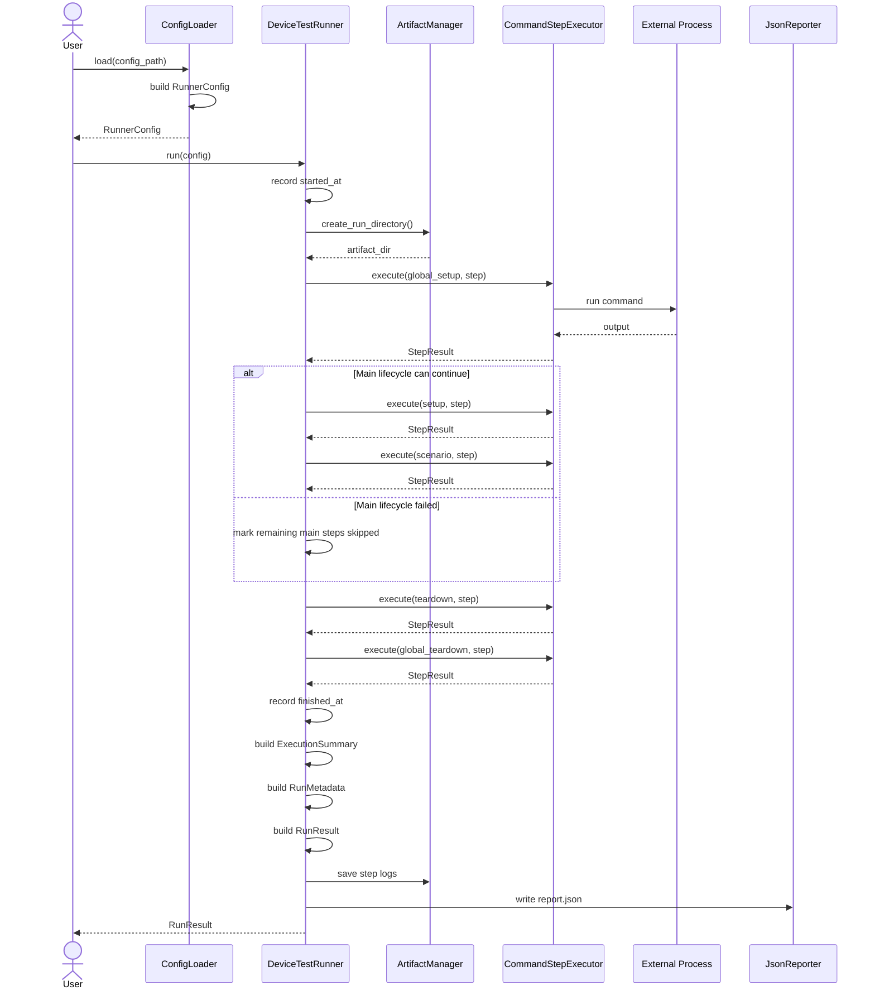

---

# 46. Component Diagram

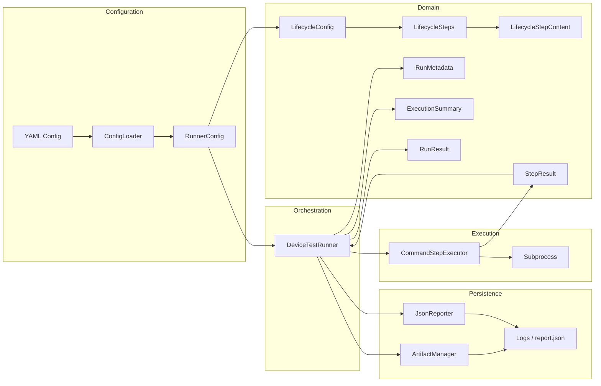

---

# 47. Error Propagation

v1.3 必須區分三種失敗。

## Step Failure

例如：

```text
command exit code = 1
timeout
command not found
```

表達為：

```python
StepResult(success=False, ...)
```

Runner 根據 Stage policy 決定後續流程。

---

## Cleanup Failure

例如：

```text
scenario PASSED
teardown FAILED
```

整體仍應標記：

```text
FAILED
```

因為 Lifecycle 沒有完整完成。

---

## Runner Infrastructure Failure

例如：

```text
Artifact directory 無法建立
Reporter 無法寫入
Config 結構異常
```

這不一定能用普通 StepResult 表達。

v1.3 可以先讓這些 exception 向上拋出，但不能靜默忽略。

未來可再增加：

```text
INFRA_ERROR
```

或：

```python
RunError
```

---

# 48. 建議目錄結構

```text
device-test-runner/
├── runner/
│   ├── __init__.py
│   ├── artifact.py
│   ├── config_loader.py
│   ├── executor.py
│   ├── models.py
│   ├── reporter.py
│   └── runner.py
│
├── configs/
│   └── sample_device_config.yaml
│
├── scripts/
│   ├── verify_device.sh
│   ├── setup_device.sh
│   ├── run_scenario.sh
│   ├── teardown_scenario.sh
│   └── collect_device_state.sh
│
├── artifact/
│   └── sample_device_config/
│       └── power_001_20260722_213015/
│           ├── report.json
│           ├── global_setup/
│           ├── setup/
│           ├── scenario/
│           ├── teardown/
│           └── global_teardown/
│
├── tests/
│   ├── test_artifact_manager.py
│   ├── test_config_loader.py
│   ├── test_executor.py
│   ├── test_models.py
│   ├── test_reporter.py
│   ├── test_runner.py
│   └── test_integration.py
│
└── docs/
    ├── architecture_v1.0.md
    ├── architecture_v1.1.md
    ├── architecture_v1.2.md
    └── architecture_v1.3.md
```

---

# 49. 測試架構

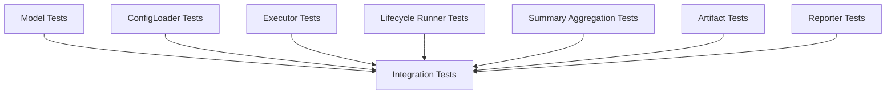

---

# 50. Model Tests

應驗證：

* `LifecycleSteps` 每個 instance 都有獨立 list
* `LifecycleConfig` 缺少 Stage 時會建立空 `LifecycleSteps`
* frozen dataclass 無法重新指定欄位
* `StepResult.passed`
* `RunResult.passed`
* `ExecutionSummary` 統計 invariants

例如：

```python
def test_lifecycle_steps_use_independent_lists():
    first = LifecycleSteps()
    second = LifecycleSteps()

    assert first.steps is not second.steps
```

---

# 51. ConfigLoader Tests

應驗證：

* `workflow` 已被改為 `lifecycle`
* 五個 Stage 都能正確載入
* 缺少 Stage 時建立空 `LifecycleSteps`
* 每個 Stage 可以包含多個 Step
* Step 順序保持不變
* `timeout_second` 正確解析
* `RunnerConfig` 為完整巢狀 Model

資料流：

```text
YAML lifecycle
    ↓
LifecycleConfig
    ↓
RunnerConfig
```

---

# 52. Executor Tests

Executor Test 應驗證：

* stage 被寫入 StepResult
* command 成功
* exit code 非 0
* timeout
* exception
* stdout
* stderr
* duration
* unsupported step type

例如：

```python
result = executor.execute(
    stage="scenario",
    step=step,
)

assert result.stage == "scenario"
```

---

# 53. Lifecycle Runner Tests

Runner Test 是 v1.3 最重要的測試。

應至少涵蓋以下情境。

## 全部成功

```text
global_setup → setup → scenario → teardown → global_teardown
```

全部執行。

---

## global_setup 失敗

```text
global_setup FAILED
setup SKIPPED
scenario SKIPPED
global_teardown EXECUTED
```

是否執行 teardown，要由既定 policy 決定並保持一致。

---

## setup 失敗

```text
setup FAILED
scenario SKIPPED
teardown EXECUTED
global_teardown EXECUTED
```

---

## scenario 失敗

```text
scenario FAILED
remaining scenario steps SKIPPED
teardown EXECUTED
global_teardown EXECUTED
```

---

## teardown 失敗

```text
teardown FAILED
global_teardown 仍然 EXECUTED
```

---

## global_teardown 失敗

```text
整體 Run FAILED
```

---

# 54. Summary Tests

應驗證：

```text
configured_steps
executed_steps
passed_steps
failed_steps
skipped_steps
duration_seconds
status
```

以及：

```python
assert (
    configured_steps
    == executed_steps + skipped_steps
)

assert (
    executed_steps
    == passed_steps + failed_steps
)
```

---

# 55. Integration Test

v1.3 Integration Test 應驗證完整資料流：

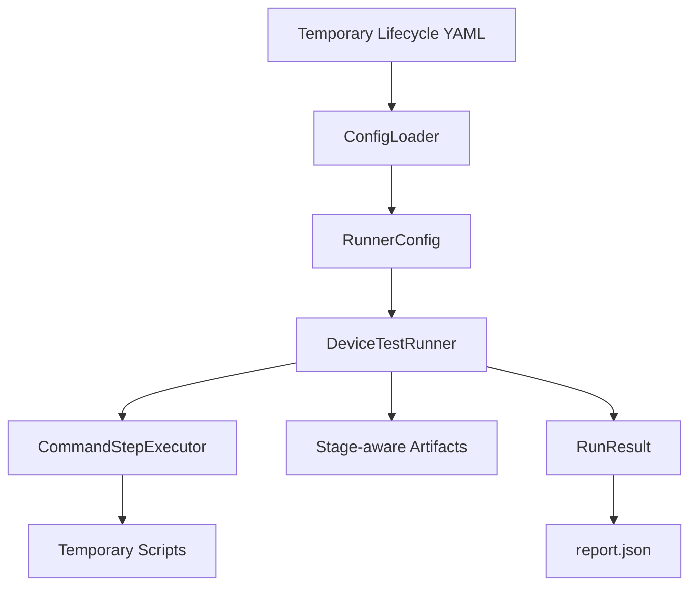

應驗證：

* Lifecycle Stage 順序正確
* 每個 StepResult 有 stage
* Failure policy 正確
* Teardown lifecycle 正確
* Summary 正確
* Metadata 正確
* Artifact directory 存在
* Stage log directory 存在
* report.json 與 RunResult 一致

---

# 56. v1.2 與 v1.3 比較

| 架構項目              | v1.2                  | v1.3                     |
| ----------------- | --------------------- | ------------------------ |
| 主執行結構             | Workflow              | Lifecycle                |
| Step Model        | `WorkflowStep`        | `LifecycleStepContent`   |
| Step 容器           | `Workflow.steps`      | `LifecycleSteps.steps`   |
| 階段語意              | 無                     | 五個固定 Stage               |
| Setup / Teardown  | 只是普通 Step             | 正式 Lifecycle Stage       |
| StepResult.stage  | 無                     | 有                        |
| RunnerConfig      | 包含 workflow           | 包含 lifecycle             |
| Run metadata      | Reporter 組裝           | 正式 `RunMetadata`         |
| Execution summary | 簡單結果                  | 正式 `ExecutionSummary`    |
| configured steps  | 無                     | 有                        |
| executed steps    | 無                     | 有                        |
| skipped steps     | 無                     | 有                        |
| Artifact path     | Reporter 外部資訊         | `RunResult.artifact_dir` |
| Immutability      | 不一定                   | 全部 frozen dataclass      |
| Runner 定位         | Workflow Orchestrator | Lifecycle Orchestrator   |

---

# 57. v1.3 的架構價值

v1.3 的價值不只是多了五個欄位。

真正的改變是 Runner 開始理解：

```text
哪些步驟是準備
哪些步驟是主要測試
哪些步驟是清理
失敗後哪些步驟應停止
哪些清理步驟仍必須執行
```

這代表 Device Test Runner 從：

```text
Sequential Command Runner
```

進一步成為：

```text
Lifecycle-aware Test Runner
```

---

# 58. v1.3 架構摘要

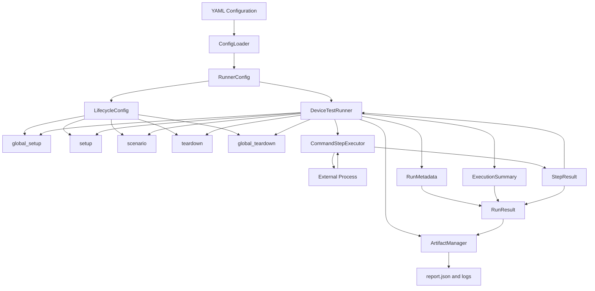

Device Test Runner v1.3 的核心架構可以濃縮為：

> `RunnerConfig` 使用 `LifecycleConfig` 描述五個 Test Lifecycle Stage；`DeviceTestRunner` 根據不同 Stage 的失敗政策協調執行；`CommandStepExecutor` 將 `LifecycleStepContent` 轉換成帶有 Stage 資訊的 `StepResult`；最後由 `RunMetadata`、`ExecutionSummary` 與所有 `StepResult` 組成不可變的 `RunResult`，並將結果保存至 Artifact Directory。

v1.3 是 Device Test Runner 正式從「依序執行測試腳本」走向「管理完整 Test Lifecycle」的版本。
