# Device Test Runner Architecture v1.3.5

## 1. 版本定位

Device Test Runner v1.3.5 延續 v1.3 的 Test Lifecycle 架構。

v1.3 已經完成：

* `global_setup`
* `setup`
* `scenario`
* `teardown`
* `global_teardown`
* Stage-aware `StepResult`
* `RunMetadata`
* `ExecutionSummary`
* `RunResult`
* Artifact Directory
* Lifecycle failure policy

v1.3.5 不再改動 Lifecycle Domain Model，而是升級 **Command Execution 與 Log Pipeline**。

v1.3 的 Executor 比較接近：

```text
啟動 Command
    ↓
等待 Command 結束
    ↓
一次取得 stdout / stderr
    ↓
建立 StepResult
```

v1.3.5 改為：

```text
啟動 Child Process
    ↓
stdout 即時串流
stderr 即時串流
    ↓
同步顯示於 Terminal
同步寫入 Artifact Log
    ↓
等待 Process 結束或 Timeout
    ↓
建立 StepResult
```

v1.3.5 的主要目標是：

> 在外部腳本執行期間，即時看到 stdout 與 stderr，同時將完整輸出保存到 Artifact，而不是等待 Command 結束後才一次取得結果。

---

# 2. v1.3.5 的主要改變

v1.3.5 的核心改變包括：

* 使用 `subprocess.Popen`
* 使用 `stdout=subprocess.PIPE`
* 使用 `stderr=subprocess.PIPE`
* 即時讀取 stdout
* 即時讀取 stderr
* stdout 與 stderr 分別由 Reader Thread 處理
* 主執行緒管理 Process lifecycle
* 執行中同步顯示 log
* 執行中同步寫入 Artifact
* Timeout 時終止 Child Process
* 等待 Reader Thread 完成
* 將完整 stdout / stderr 組裝進 `StepResult`

整體可以概括為：

```text
v1.3
Lifecycle Orchestration

v1.3.5
Lifecycle Orchestration
+
Streaming Process Execution
+
Concurrent Log Collection
```

---

# 3. Domain Model 是否改變

v1.3.5 沿用 v1.3 的 Domain Model：

```text
RunnerConfig
├── DeviceTestCase
├── DeviceInfo
├── LifecycleConfig
│   ├── global_setup
│   ├── setup
│   ├── scenario
│   ├── teardown
│   └── global_teardown
└── ArtifactConfig
```

執行輸出仍然是：

```text
RunResult
├── RunMetadata
├── ExecutionSummary
├── List[StepResult]
└── artifact_dir
```

`StepResult` 仍然包含：

```python
@dataclass(frozen=True)
class StepResult:
    stage: str
    name: str
    command: str
    success: bool
    exit_code: Optional[int]
    duration_seconds: float
    stdout: str
    stderr: str
    error: Optional[str] = None
```

v1.3.5 的變化主要位於：

```text
Execution Layer
Artifact Log Layer
Process Lifecycle Layer
```

而不是 Domain Model Layer。

---

# 4. v1.3 與 v1.3.5 的執行差異

## v1.3：Buffered Execution

概念上可能使用：

```python
subprocess.run(
    command,
    capture_output=True,
    text=True,
    timeout=timeout_second,
)
```

執行過程：


這種方式的限制是：

* Command 執行中看不到輸出
* 長時間 Script 看起來像沒有反應
* 無法即時知道執行進度
* Process 卡住時較難判斷卡在哪裡
* stdout / stderr 只有結束後才能取得
* 大量輸出全部暫存在記憶體中

---

## v1.3.5：Streaming Execution

v1.3.5 使用：

```python
subprocess.Popen(...)
```

執行流程：

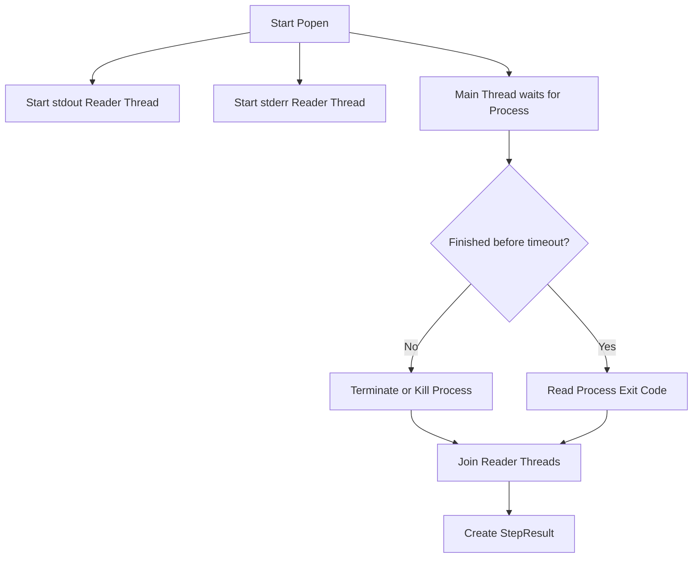

---

# 5. v1.3.5 系統架構

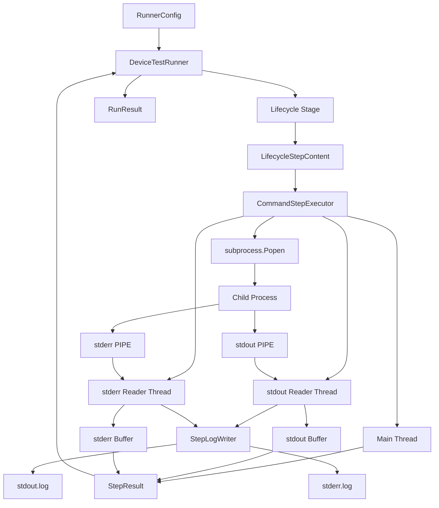

---

# 6. Process、Thread 與 Runner 的角色

v1.3.5 中，需要區分三種概念：

```text
Device Test Runner Process
Child Process
Threads
```

---

## Device Test Runner Process

Device Test Runner 本身是一個 Python Process。

它負責：

* 載入 YAML
* 建立 `RunnerConfig`
* 管理 Lifecycle
* 呼叫 Executor
* 建立 Artifact
* 建立 `RunResult`
* 輸出 report

概念上：

```text
Parent Process
=
Device Test Runner
```

---

## Child Process

每次執行：

```bash
bash scripts/run_scenario.sh
```

Executor 會透過 `Popen` 建立新的 Child Process。

```text
Parent Process
└── Child Process
    └── bash scripts/run_scenario.sh
```

如果 shell script 又啟動其他程式，可能形成：

```text
Device Test Runner
└── bash
    └── Python / adb / recorder / application
```

---

## Threads

v1.3.5 的 Parent Process 中，主要有三條執行線：

```text
Thread 1：Main Thread
Thread 2：stdout Reader Thread
Thread 3：stderr Reader Thread
```

它們仍然屬於同一個 Device Test Runner Process。

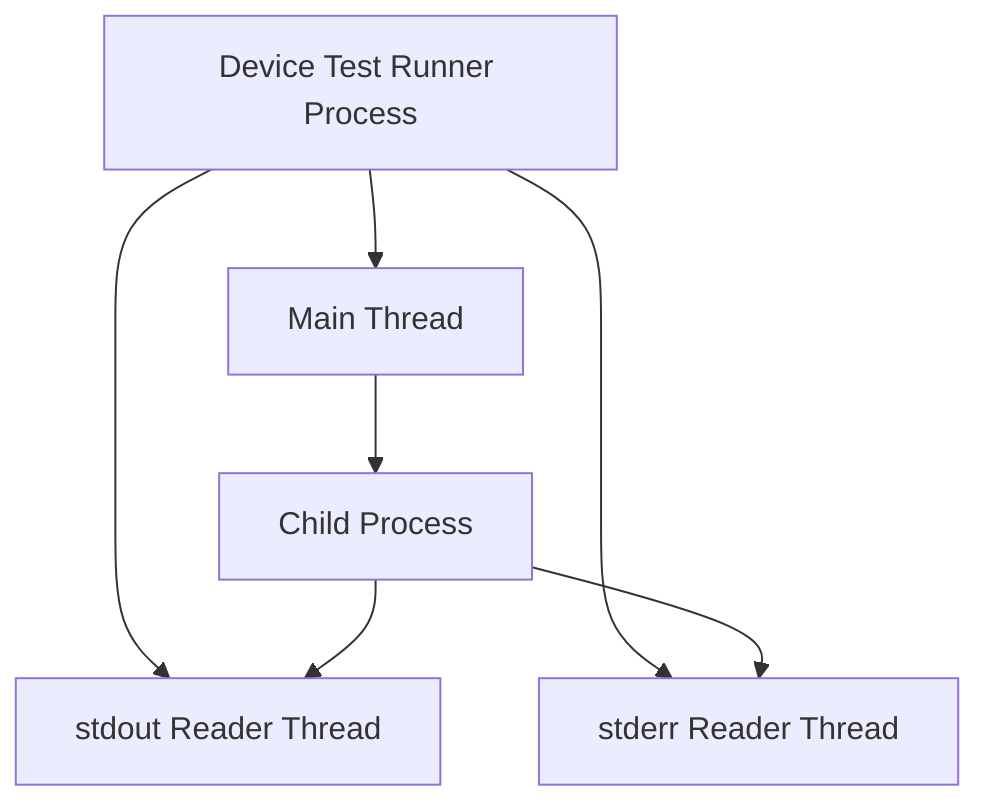

---

# 7. 三條 Thread 的責任

## Main Thread

主執行緒負責 Process lifecycle：

* 呼叫 `subprocess.Popen`
* 建立 stdout Reader Thread
* 建立 stderr Reader Thread
* 啟動兩個 Reader Thread
* 等待 Child Process
* 管理 timeout
* timeout 時 terminate / kill
* 取得 exit code
* 等待 Reader Thread 結束
* 計算 duration
* 建立 `StepResult`

主執行緒不應逐行讀取 stdout 或 stderr。

否則可能阻塞另一條 stream。

---

## stdout Reader Thread

stdout Thread 負責：

* 從 `process.stdout` 逐行讀取
* 將內容顯示到目前 Terminal
* 將內容寫入 stdout Artifact
* 將內容加入 stdout Buffer
* 直到 stdout EOF

資料流：

```text
Child Process stdout
        ↓
subprocess.PIPE
        ↓
stdout Reader Thread
        ├── Terminal
        ├── stdout.log
        └── stdout Buffer
```

---

## stderr Reader Thread

stderr Thread 負責：

* 從 `process.stderr` 逐行讀取
* 將內容顯示到目前 Terminal
* 將內容寫入 stderr Artifact
* 將內容加入 stderr Buffer
* 直到 stderr EOF

資料流：

```text
Child Process stderr
        ↓
subprocess.PIPE
        ↓
stderr Reader Thread
        ├── Terminal
        ├── stderr.log
        └── stderr Buffer
```

---

# 8. 為什麼 stdout 與 stderr 需要兩條 Thread

stdout 與 stderr 是兩條獨立的資料流。

如果使用單一 Thread 先完整讀 stdout：

```python
stdout = process.stdout.read()
stderr = process.stderr.read()
```

可能發生：

1. Child Process 持續輸出 stderr
2. stderr Pipe Buffer 被填滿
3. Child Process 等待 stderr 被讀取
4. Parent Process 還在等待 stdout 結束
5. 雙方互相等待

這可能形成 deadlock。

概念如下：

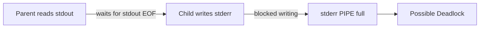

將 stdout 與 stderr 分別交給不同 Reader Thread，可以讓兩條 Pipe 同時被消耗。

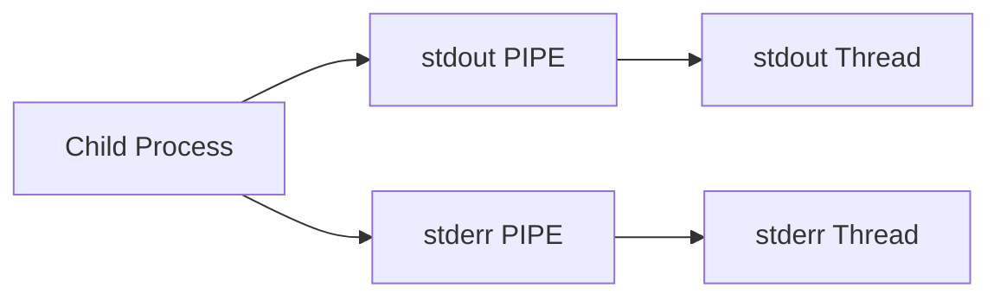

---

# 9. subprocess.PIPE 的角色

設定：

```python
stdout=subprocess.PIPE
stderr=subprocess.PIPE
```

代表 Child Process 的 stdout 與 stderr，不再直接輸出到原本 Terminal，而是被連接到 Parent Process 可以讀取的 Pipe。

概念上：

```text
Child Process stdout
    ↓
PIPE
    ↓
Parent Process
```

以及：

```text
Child Process stderr
    ↓
PIPE
    ↓
Parent Process
```

---

## 與 Linux `|` 的關係

Linux command：

```bash
command_a | command_b
```

表示：

```text
command_a stdout
        ↓
pipe
        ↓
command_b stdin
```

Python：

```python
stdout=subprocess.PIPE
```

則表示：

```text
Child Process stdout
        ↓
pipe
        ↓
Python Parent Process
```

概念相同，都是使用 OS Pipe 傳遞資料。

差別是接收端不同：

```text
Linux |
接收端通常是另一個 Command

subprocess.PIPE
接收端通常是 Python 程式
```

---

# 10. Pipe Buffer 的角色

Pipe 不只是抽象連接，它通常還有由作業系統管理的有限 Buffer。

概念：

```text
Child Process writes
        ↓
OS Pipe Buffer
        ↓
Parent Process reads
```

Buffer 的作用是讓寫入端與讀取端不需要在每一個 byte 上完全同步。

例如：

```text
Child Process 寫入一批資料
Parent Process 稍後再讀取
```

但是 Buffer 有容量限制。

如果：

```text
Child Process 寫入速度
>
Parent Process 讀取速度
```

Buffer 最終可能被填滿。

Buffer 滿後，Child Process 的寫入操作可能被阻塞，直到 Parent Process 讀走部分資料。

這就是為什麼 v1.3.5 必須持續消耗 stdout 與 stderr。

---

# 11. Pipe Buffer 與 Python List Buffer 不同

v1.3.5 可能同時存在兩種 Buffer。

## OS Pipe Buffer

由作業系統管理：

```text
Child Process
→ PIPE
→ Parent Process
```

它負責跨 Process 傳遞資料。

---

## Python Output Buffer

由 Executor 自己管理，例如：

```python
stdout_lines: list[str] = []
stderr_lines: list[str] = []
```

它負責保留完整文字，最後組成：

```python
stdout = "".join(stdout_lines)
stderr = "".join(stderr_lines)
```

資料流：


這兩個 Buffer 不應混為一談。

---

# 12. StepLogWriter

v1.3.5 建議由 `StepLogWriter` 封裝單一步驟的 log 寫入。

概念介面：

```python
class StepLogWriter:
    def write_stdout(self, content: str) -> None:
        ...

    def write_stderr(self, content: str) -> None:
        ...
```

Executor 不需要知道：

* Artifact root directory
* Stage directory
* stdout 檔名
* stderr 檔名
* encoding
* file open mode

Executor 只需要表達：

```python
log_writer.write_stdout(line)
log_writer.write_stderr(line)
```

---

# 13. ArtifactManager 與 StepLogWriter 的關係

`ArtifactManager` 負責整個 Run 的 Artifact 結構。

`StepLogWriter` 負責單一 Step 的 log。

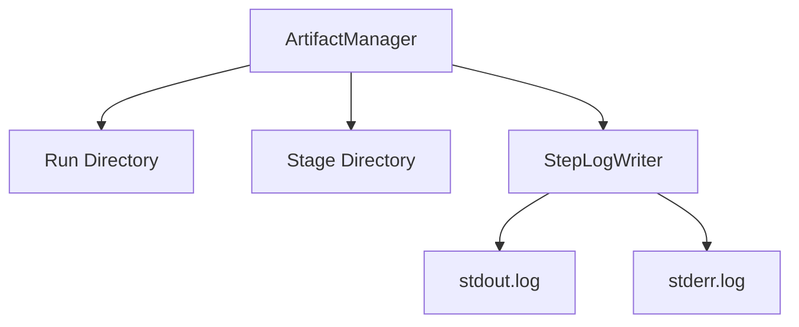

概念介面：

```python
class ArtifactManager:
    def create_step_log_writer(
        self,
        stage: str,
        step_name: str,
    ) -> StepLogWriter:
        ...
```

Runner 可以在執行 Step 前建立：

```python
log_writer = artifact_manager.create_step_log_writer(
    stage=stage,
    step_name=step.name,
)
```

再交給 Executor：

```python
result = executor.execute(
    step=step,
    stage=stage,
    log_writer=log_writer,
)
```

---

# 14. Executor 介面

v1.3.5 的 Executor 介面可以是：

```python
class CommandStepExecutor:
    def execute(
        self,
        step: LifecycleStepContent,
        stage: str,
        log_writer: StepLogWriter,
    ) -> StepResult:
        ...
```

輸入：

```text
LifecycleStepContent
stage
StepLogWriter
```

輸出：

```text
StepResult
```

完整資料流：

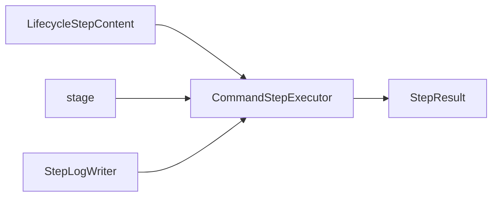

---

# 15. Executor 結構

概念程式碼：

```python
import subprocess
import threading
import time


class CommandStepExecutor:
    def execute(
        self,
        step: LifecycleStepContent,
        stage: str,
        log_writer: StepLogWriter,
    ) -> StepResult:
        started_at = time.monotonic()

        stdout_lines: list[str] = []
        stderr_lines: list[str] = []

        process = subprocess.Popen(
            step.command,
            shell=True,
            stdout=subprocess.PIPE,
            stderr=subprocess.PIPE,
            text=True,
            bufsize=1,
        )

        stdout_thread = threading.Thread(
            target=self._read_stream,
            args=(
                process.stdout,
                stdout_lines,
                log_writer.write_stdout,
            ),
        )

        stderr_thread = threading.Thread(
            target=self._read_stream,
            args=(
                process.stderr,
                stderr_lines,
                log_writer.write_stderr,
            ),
        )

        stdout_thread.start()
        stderr_thread.start()

        error = None

        try:
            exit_code = process.wait(
                timeout=step.timeout_second
            )
        except subprocess.TimeoutExpired:
            process.terminate()

            try:
                exit_code = process.wait(timeout=5)
            except subprocess.TimeoutExpired:
                process.kill()
                exit_code = process.wait()

            error = (
                f"Command timed out after "
                f"{step.timeout_second} seconds"
            )

        stdout_thread.join()
        stderr_thread.join()

        duration_seconds = (
            time.monotonic() - started_at
        )

        success = (
            exit_code == 0
            and error is None
        )

        return StepResult(
            stage=stage,
            name=step.name,
            command=step.command,
            success=success,
            exit_code=exit_code,
            duration_seconds=duration_seconds,
            stdout="".join(stdout_lines),
            stderr="".join(stderr_lines),
            error=error,
        )
```

這是概念架構，實際程式可以再依既有 Repo 調整。

---

# 16. Stream Reader

兩個 Reader Thread 可以共用同一個 Reader 方法：

```python
def _read_stream(
    self,
    stream,
    buffer: list[str],
    write_log,
) -> None:
    if stream is None:
        return

    try:
        for line in iter(stream.readline, ""):
            buffer.append(line)
            write_log(line)
            print(line, end="")
    finally:
        stream.close()
```

這個方法負責三件事：

```text
讀取
保存
輸出
```

資料流：

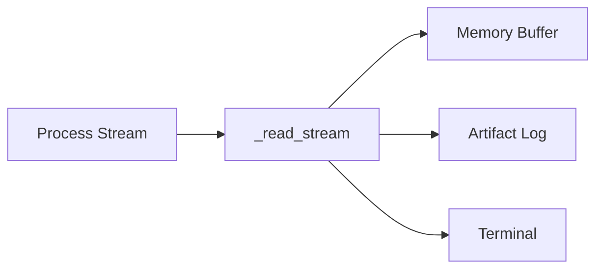

---

# 17. Terminal Streaming

v1.3.5 不只將 log 寫入檔案，也需要保留原本 Script 在 Terminal 顯示的能力。

例如原本 Google Script Repo 執行時會持續輸出：

```text
Connecting device...
Launching recorder...
Starting scenario...
Elapsed time: 10 seconds
Elapsed time: 20 seconds
Scenario completed
```

如果 Runner 將 stdout 攔截後卻不重新輸出，使用者會失去原本的執行體驗。

因此 stdout Thread 應同時：

```python
print(line, end="")
```

stderr Thread 可以：

```python
print(line, end="", file=sys.stderr)
```

形成 Tee 行為：

```text
一份輸出
├── Terminal
├── Artifact File
└── StepResult Buffer
```

---

# 18. Tee Pipeline

`tee` 在 Linux 中代表將同一份資料同時送往多個目的地。

v1.3.5 的 log pipeline 類似：

```bash
command | tee output.log
```

但 Python 版本需要分別處理 stdout 與 stderr。

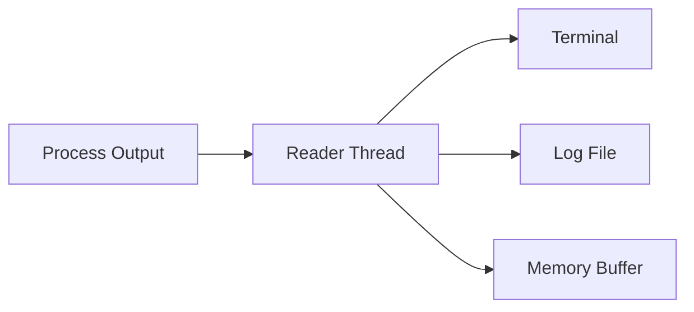

這讓 Device Test Runner 可以同時滿足：

* 即時可觀察性
* 執行歷史保存
* 結果物件建立

---

# 19. `text=True`

Popen 設定：

```python
text=True
```

表示 Python 將 stdout 與 stderr 解碼為字串。

沒有 `text=True` 時，Reader 取得的通常是：

```python
bytes
```

例如：

```python
b"scenario started\n"
```

有 `text=True` 後：

```python
"scenario started\n"
```

這樣可以直接：

* `print()`
* 寫入文字檔
* append 到 `list[str]`
* 組裝進 `StepResult`

---

# 20. `bufsize=1`

設定：

```python
bufsize=1
```

在文字模式中，通常用來請求 line buffering。

也就是希望資料以行為單位被處理：

```text
一行產生
→ 一行讀取
→ 一行顯示
→ 一行寫入 log
```

但需要注意：

> `bufsize=1` 不能保證 Child Process 自己會立即 flush。

如果 Child Process 自己對 stdout 進行 Buffering，Parent Process 仍可能晚一段時間才收到資料。

---

# 21. Child Process 的 Output Buffering

即使 Parent Process 使用 Popen streaming，Child Process 也可能不立即輸出。

例如 Python Script：

```python
print("starting")
time.sleep(30)
```

當 stdout 不是直接連接 Terminal，而是連接 Pipe 時，Python Child Process 可能採用較大的 Buffer。

解決方式之一：

```bash
python -u script.py
```

或設定：

```bash
PYTHONUNBUFFERED=1
```

也可以在 Child Script 中：

```python
print("starting", flush=True)
```

因此即時串流受到兩端影響：

```text
Child Process 是否 flush
+
Parent Process 是否持續 read
```

---

# 22. Main Thread 的 Timeout 管理

主執行緒使用：

```python
process.wait(timeout=step.timeout_second)
```

等待 Child Process 結束。

如果超過 timeout，Python 會拋出：

```python
subprocess.TimeoutExpired
```

此時主執行緒需要：

1. 通知 Process 結束
2. 等待 Process 結束
3. 必要時強制 kill
4. 等待 stdout/stderr Reader Thread 結束
5. 建立失敗的 StepResult

流程：

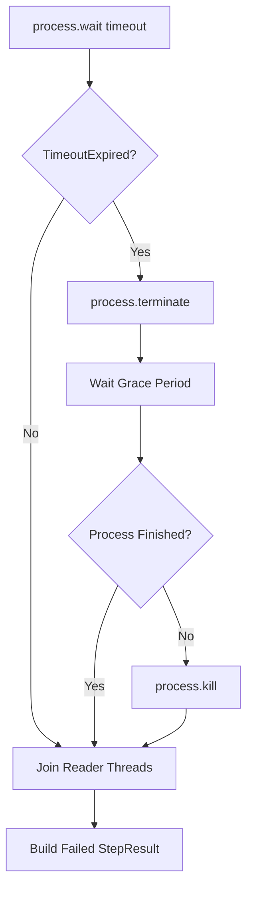

---

# 23. terminate 與 kill

## `process.terminate()`

要求 Process 結束。

在 Unix-like 系統通常對應：

```text
SIGTERM
```

這讓 Process 有機會：

* 執行 signal handler
* 關閉檔案
* 停止 recorder
* 清理部分資源

---

## `process.kill()`

強制終止 Process。

在 Unix-like 系統通常對應：

```text
SIGKILL
```

Process 無法攔截或自行清理。

因此正常策略應是：

```text
terminate
    ↓
等待短暫 grace period
    ↓
仍未結束才 kill
```

---

# 24. Timeout 後仍要讀完 Pipe

當 Process 被 terminate 或 kill 後，stdout / stderr Pipe 中可能仍然有尚未被 Reader Thread 消耗的資料。

因此不能在 timeout 後立即建立 StepResult。

應該先：

```python
stdout_thread.join()
stderr_thread.join()
```

確保：

* Pipe 已到 EOF
* Reader Thread 已結束
* 最後幾行輸出已保存
* stdout / stderr Buffer 已完整

正確順序：

```text
Process 結束
    ↓
Reader Thread 讀到 EOF
    ↓
join Reader Thread
    ↓
組裝 stdout / stderr
    ↓
建立 StepResult
```

---

# 25. 為什麼要呼叫 `join()`

`thread.start()` 會讓 Thread 開始執行，但 Main Thread 不會自動等待它完成。

如果不 `join()`：

```text
Main Thread 建立 StepResult
Reader Thread 還在讀 log
```

可能導致：

* StepResult.stdout 不完整
* StepResult.stderr 不完整
* log file 最後幾行遺失
* Process 已結束但 Reader Thread 尚未完成
* 下一個 Step 已開始，前一個 Step 還在寫檔

因此：

```python
stdout_thread.join()
stderr_thread.join()
```

是 Executor 完成條件的一部分。

---

# 26. Thread Synchronization

v1.3.5 的同步關係：

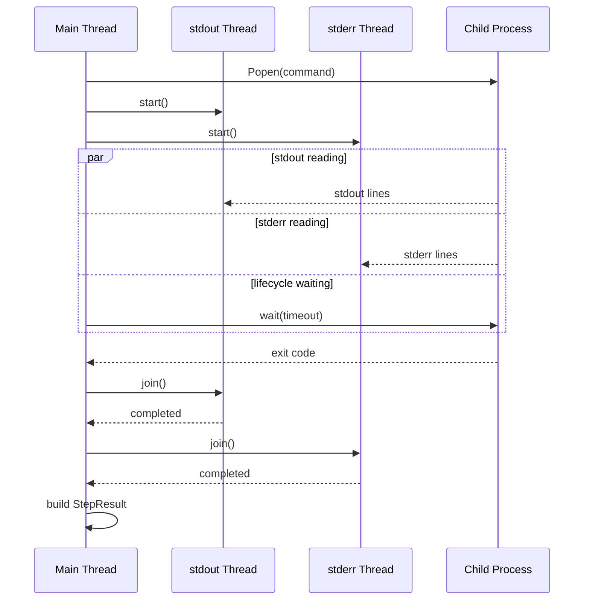

---

# 27. Thread Safety

stdout Thread 只修改：

```python
stdout_lines
```

stderr Thread 只修改：

```python
stderr_lines
```

因此兩條 Thread 不會同時修改同一個 List。

```text
stdout Thread → stdout_lines
stderr Thread → stderr_lines
```

這降低了資料競爭。

如果兩條 Thread 共用同一個 Collection，就需要考慮：

* Lock
* Queue
* ordering
* thread-safe writes

目前分離兩個 Buffer，是 v1.3.5 較簡單且安全的設計。

---

# 28. stdout 與 stderr 的時間順序

stdout 與 stderr 是兩條獨立 Stream。

即使各自內部順序可以保持，也無法保證合併後的絕對時間順序。

例如 Child Process 實際輸出：

```text
stdout: A
stderr: B
stdout: C
```

兩條 Thread 的排程可能讓 Terminal 顯示為：

```text
A
C
B
```

或：

```text
B
A
C
```

因此 v1.3.5 應優先保證：

* stdout 自身順序
* stderr 自身順序
* 各自完整保存

如果未來需要精確重建跨 Stream 時序，需要加入：

```text
timestamp
sequence number
unified event queue
```

這不屬於 v1.3.5 的範圍。

---

# 29. Executor Failure Types

v1.3.5 需要處理幾種不同失敗。

## Process Exit Failure

```text
exit_code != 0
```

例如：

```python
StepResult(
    success=False,
    exit_code=1,
    error=None,
)
```

---

## Timeout Failure

```text
process.wait() raises TimeoutExpired
```

例如：

```python
StepResult(
    success=False,
    exit_code=-15,
    error="Command timed out after 30 seconds",
)
```

實際 exit code 可能依終止方式與作業系統而不同。

---

## Process Start Failure

例如：

* command executable 不存在
* permission denied
* invalid working directory
* `Popen` 建立失敗

此時 Child Process 根本沒有成功建立。

可以建立：

```python
StepResult(
    success=False,
    exit_code=None,
    stdout="",
    stderr="",
    error=str(exception),
)
```

---

## Stream Reader Failure

例如：

* encoding error
* log file write failure
* stream 被意外關閉

這類錯誤需要被記錄，不能讓 Thread 靜默死亡。

較簡單的 v1.3.5 可以在 Reader Thread 捕捉例外，將錯誤保存到共享的 error collection。

---

# 30. Thread Exception 的注意事項

Reader Thread 中拋出的 Exception，不會自動傳回 Main Thread。

例如：

```python
def read_stdout():
    raise RuntimeError("log write failed")
```

Main Thread 不會因為這個 Exception 自動失敗。

因此如果需要嚴格處理，可以使用：

```python
thread_errors: list[Exception] = []
```

Reader Thread：

```python
try:
    ...
except Exception as exc:
    thread_errors.append(exc)
```

Main Thread 在 join 後檢查：

```python
if thread_errors:
    error = str(thread_errors[0])
```

未來也可以使用：

```text
queue.Queue
concurrent.futures
custom thread wrapper
```

v1.3.5 先採用簡單 error collection 即可。

---

# 31. Executor Architecture Diagram

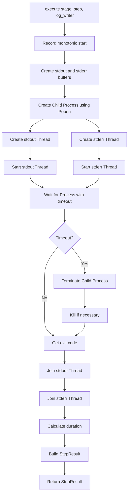

---

# 32. Runner 與 Executor 的責任邊界

## DeviceTestRunner

負責：

* Lifecycle stage 順序
* Stage failure policy
* 哪些 Stage 要 skip
* teardown 與 global_teardown
* 建立 StepLogWriter
* 收集 StepResult
* ExecutionSummary
* RunMetadata
* RunResult
* Reporter

---

## CommandStepExecutor

負責：

* 啟動單一 Child Process
* stdout/stderr Pipe
* Reader Thread
* timeout
* terminate / kill
* exit code
* duration
* 建立 StepResult

---

## StepLogWriter

負責：

* stdout artifact file
* stderr artifact file
* 寫入與 flush
* file encoding
* 關閉 file handle

---

## Responsibility Diagram

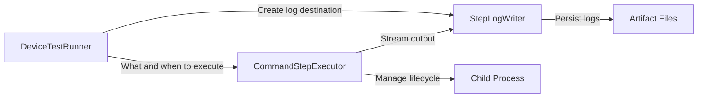

---

# 33. Lifecycle 與 Streaming 的整合

v1.3 的 Lifecycle Runner 依序執行：

```text
global_setup
setup
scenario
teardown
global_teardown
```

v1.3.5 每個 Step 內部再包含一個 Streaming Execution Lifecycle：

```text
Popen
    ↓
start Reader Threads
    ↓
wait Process
    ↓
terminate if timeout
    ↓
join Threads
    ↓
StepResult
```

形成兩層 Lifecycle。

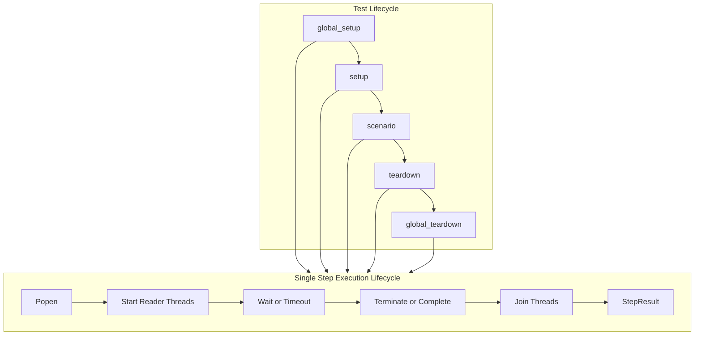

---

# 34. Step Execution State Machine

單一 Step 可以視為一個狀態機：

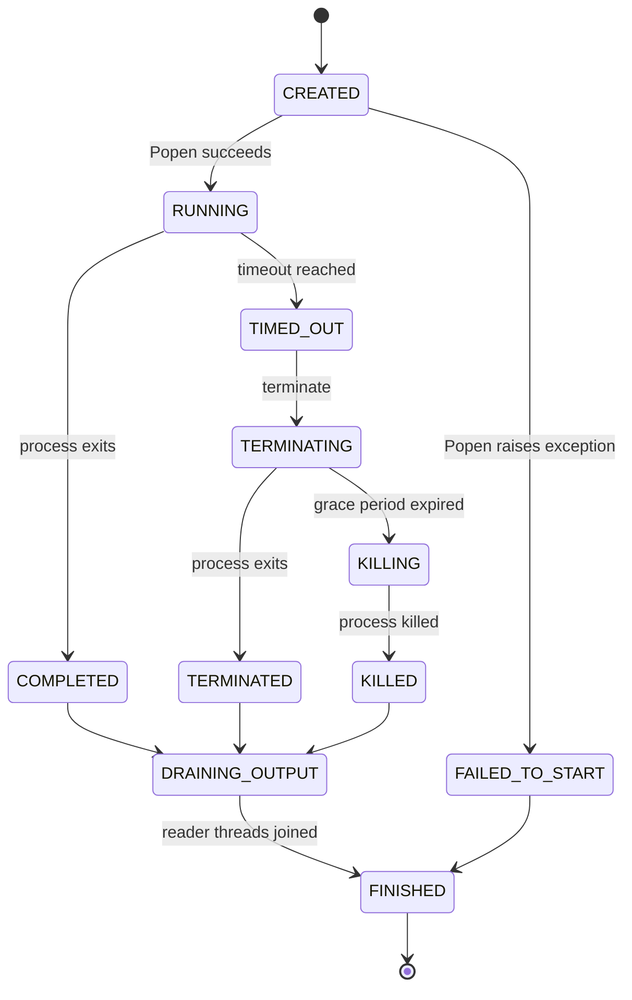

v1.3.5 雖然不一定要正式建立 Enum，但理解這個狀態機有助於正確處理 Process lifecycle。

---

# 35. Artifact Directory

v1.3.5 可以沿用 v1.3 的 Stage-aware 目錄：

```text
artifact/
└── sample_device_config/
    └── power_001_20260730_220600/
        ├── report.json
        ├── global_setup/
        │   ├── verify_device_stdout.log
        │   └── verify_device_stderr.log
        ├── setup/
        │   ├── prepare_device_stdout.log
        │   └── prepare_device_stderr.log
        ├── scenario/
        │   ├── run_youtube_stdout.log
        │   └── run_youtube_stderr.log
        ├── teardown/
        │   ├── stop_youtube_stdout.log
        │   └── stop_youtube_stderr.log
        └── global_teardown/
            ├── release_device_stdout.log
            └── release_device_stderr.log
```

主要差異是：

> v1.3.5 的 log 不再於 Step 結束後一次寫入，而是在 Step 執行期間持續寫入。

---

# 36. Log File Flush

為了讓執行期間可以直接查看 log file，`StepLogWriter` 寫入後可以進行 flush：

```python
def write_stdout(self, content: str) -> None:
    self.stdout_file.write(content)
    self.stdout_file.flush()
```

沒有 flush 時，Python 可能先將內容保留在自己的 File Buffer 中。

因此即使 Reader Thread 已取得資料，檔案內容也可能沒有立刻出現在 Disk View。

流程：

```text
Reader Thread
    ↓
Python File Buffer
    ↓ flush
Operating System
    ↓
Log File
```

即時 log 通常需要：

```python
write()
flush()
```

---

# 37. Log Streaming 的記憶體成本

v1.3.5 同時：

* 將 log 寫入檔案
* 將 log 保存在 `stdout_lines` / `stderr_lines`
* 最後放入 `StepResult`

如果 Script 產生非常大量輸出，仍可能消耗大量記憶體。

例如：

```text
stdout.log = 2 GB
StepResult.stdout = 2 GB
```

這代表同一份資料可能同時存在：

```text
Artifact File
Memory Buffer
Serialized report or later object
```

v1.3.5 可以先接受這個限制。

未來版本可以考慮：

* StepResult 只保存 log path
* 只保留最後 N 行
* 使用 ring buffer
* stdout preview
* 最大 log size
* log rotation
* streaming parser

但這些不屬於 v1.3.5 的範圍。

---

# 38. StepResult 與 Log File 的關係

目前 `StepResult` 仍保存：

```python
stdout: str
stderr: str
```

因此 v1.3.5 同時保留：

```text
Runtime Result
+
Persistent Log
```

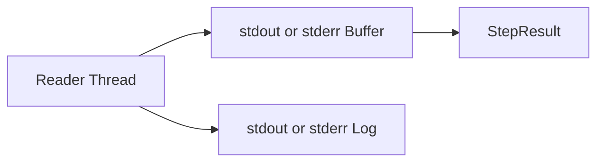

未來可以再重構為：

```python
stdout_file: str
stderr_file: str
```

但 v1.3.5 不必立即修改既有 Model。

---

# 39. Timeout 與 Process Tree

使用：

```python
process.terminate()
```

通常只會終止 `Popen` 直接建立的 Child Process。

如果 Shell Script 又啟動背景程式：

```text
Runner
└── bash script
    └── recorder process
```

終止 bash 不一定會自動終止 recorder。

這可能留下 orphan process。

v1.3.5 的基本 timeout 可以先管理直接 Child Process。

但必須認知到：

```text
Single Process Lifecycle
≠
Entire Process Tree Lifecycle
```

完整 Process Group、Session 或 Recorder Lifecycle 可以放到：

* v1.6 Timeout / Cancellation
* v1.7 Recorder Lifecycle

這樣較符合版本邊界。

---

# 40. Shell 使用注意事項

如果使用：

```python
subprocess.Popen(
    step.command,
    shell=True,
    ...
)
```

Process 結構通常是：

```text
Device Test Runner
└── Shell
    └── Actual Command
```

這會讓：

* exit code 由 Shell 回傳
* signal 可能先送到 Shell
* Process Tree 管理變複雜
* command string 使用方便
* 可直接支援 pipe、redirect、`&&`

如果改用：

```python
subprocess.Popen(
    ["bash", "scripts/run_scenario.sh"],
    shell=False,
)
```

Process 關係比較直接。

v1.3.5 可以維持目前 command string 設計，但未來 Process lifecycle 強化時，需要重新評估 `shell=True`。

---

# 41. StepResult 建立時機

StepResult 只能在以下條件都完成後建立：

```text
Child Process 已結束
stdout Thread 已結束
stderr Thread 已結束
duration 已計算
完整 stdout 已組裝
完整 stderr 已組裝
error 已確認
```

正確順序：


---

# 42. Sequence Diagram

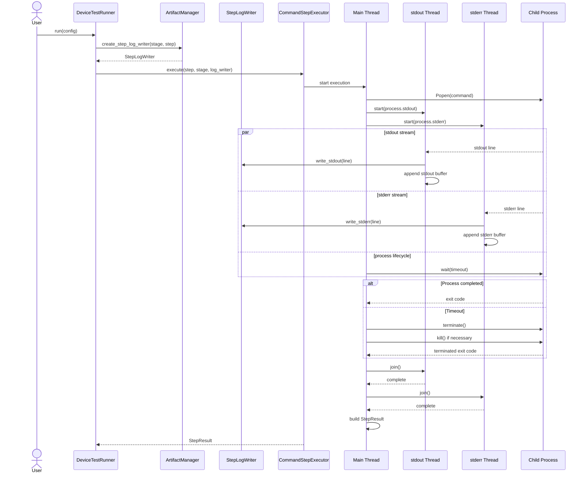

---

# 43. Failure Sequence

```mermaid
sequenceDiagram
    participant Main as Main Thread
    participant Out as stdout Thread
    participant Err as stderr Thread
    participant Process as Child Process
    participant Writer as StepLogWriter

    Main->>Process: Popen(command)
    Main->>Out: start()
    Main->>Err: start()

    Process-->>Out: partial stdout
    Out->>Writer: write stdout

    Process-->>Err: partial stderr
    Err->>Writer: write stderr

    Main->>Process: wait(timeout)
    Process--xMain: TimeoutExpired

    Main->>Process: terminate()

    alt Process still alive
        Main->>Process: kill()
    end

    Process-->>Out: EOF
    Process-->>Err: EOF

    Main->>Out: join()
    Main->>Err: join()

    Main->>Main: build failed StepResult
```

即使 timeout，前面已經產生的 log 仍然應保留。

---

# 44. Runner Lifecycle 不因 Streaming 改變

v1.3.5 雖然 Executor 內部變複雜，但 Runner 的高階 Lifecycle 仍然相同。

```mermaid
flowchart TD
    GS[global_setup]
    Setup[setup]
    Scenario[scenario]
    Teardown[teardown]
    GT[global_teardown]

    GS --> Setup
    Setup --> Scenario
    Scenario --> Teardown
    Teardown --> GT
```

Runner 仍然只看到：

```python
StepResult
```

Runner 不需要知道 Executor 內部用了：

* 幾條 Thread
* Popen
* PIPE
* join
* terminate
* kill

這是封裝的重要價值。

```text
Runner knows WHAT happened.
Executor knows HOW the command was executed.
```

---

# 45. Dependency Structure

```mermaid
flowchart TD
    Runner[runner.py]
    Executor[executor.py]
    Artifact[artifact.py]
    Models[models.py]
    Reporter[reporter.py]
    Subprocess[subprocess]
    Threading[threading]

    Runner --> Models
    Runner --> Executor
    Runner --> Artifact
    Runner --> Reporter

    Executor --> Models
    Executor --> Artifact
    Executor --> Subprocess
    Executor --> Threading

    Artifact --> Models
    Reporter --> Models
```

較理想的依賴方向：

```text
Models
↑
Executor / Artifact / Reporter
↑
Runner
```

Domain Model 不應依賴 subprocess、threading 或檔案系統。

---

# 46. 建議目錄結構

```text
device-test-runner/
├── runner/
│   ├── __init__.py
│   ├── artifact.py
│   ├── config_loader.py
│   ├── executor.py
│   ├── models.py
│   ├── reporter.py
│   └── runner.py
│
├── configs/
│   └── sample_device_config.yaml
│
├── scripts/
│   ├── setup_device.sh
│   ├── run_scenario.sh
│   └── teardown_scenario.sh
│
├── artifact/
│   └── sample_device_config/
│       └── power_001_20260730_220600/
│           ├── report.json
│           ├── global_setup/
│           ├── setup/
│           ├── scenario/
│           ├── teardown/
│           └── global_teardown/
│
├── tests/
│   ├── test_artifact.py
│   ├── test_config_loader.py
│   ├── test_executor.py
│   ├── test_models.py
│   ├── test_reporter.py
│   ├── test_runner.py
│   └── test_integration.py
│
└── docs/
    ├── architecture_v1.0.md
    ├── architecture_v1.1.md
    ├── architecture_v1.2.md
    ├── architecture_v1.3.md
    └── architecture_v1.3.5.md
```

---

# 47. 測試架構

v1.3.5 的測試重點集中在 Executor 與 Streaming Log。

```mermaid
flowchart TD
    ModelTests[Model Tests]
    ArtifactTests[StepLogWriter Tests]
    ReaderTests[Stream Reader Tests]
    ExecutorTests[Popen Executor Tests]
    TimeoutTests[Timeout Tests]
    RunnerTests[Lifecycle Runner Tests]
    IntegrationTests[Streaming Integration Tests]

    ModelTests --> IntegrationTests
    ArtifactTests --> IntegrationTests
    ReaderTests --> IntegrationTests
    ExecutorTests --> IntegrationTests
    TimeoutTests --> IntegrationTests
    RunnerTests --> IntegrationTests
```

---

# 48. StepLogWriter Tests

應測試：

* stdout 寫入正確檔案
* stderr 寫入正確檔案
* 多次寫入會 append
* Unicode 可以寫入
* 空字串不會發生錯誤
* flush 後可立即讀取
* Stage 與 Step name 形成正確路徑
* 關閉後不再寫入

例如：

```python
def test_write_stdout(tmp_path):
    writer = StepLogWriter(
        stdout_path=tmp_path / "stdout.log",
        stderr_path=tmp_path / "stderr.log",
    )

    writer.write_stdout("line 1\n")
    writer.write_stdout("line 2\n")

    assert (
        (tmp_path / "stdout.log").read_text(
            encoding="utf-8"
        )
        == "line 1\nline 2\n"
    )
```

---

# 49. Stream Reader Tests

Stream Reader 可以使用：

```python
io.StringIO
```

測試：

```python
stream = io.StringIO(
    "line 1\nline 2\n"
)
```

應驗證：

* 每行加入 Buffer
* 每行交給 Log Writer
* 完整順序保持
* EOF 後正常結束
* 空 Stream 正常結束

---

# 50. Mock Popen Tests

Executor Unit Test 不應每次真的建立 Child Process。

可以 Mock：

```python
subprocess.Popen
```

Fake Process 需要模擬：

* `stdout`
* `stderr`
* `wait()`
* `terminate()`
* `kill()`
* `returncode`

成功情境：

```text
stdout = "hello\n"
stderr = ""
wait() returns 0
```

失敗情境：

```text
stdout = ""
stderr = "failed\n"
wait() returns 1
```

---

# 51. Timeout Tests

Timeout Test 應模擬：

```python
process.wait(
    timeout=...
)
```

第一次拋出：

```python
subprocess.TimeoutExpired
```

然後驗證：

* `terminate()` 被呼叫
* 必要時 `kill()` 被呼叫
* stdout Thread 被 join
* stderr Thread 被 join
* `StepResult.success == False`
* `StepResult.error` 有 timeout 訊息
* 已產生的 stdout/stderr 被保留

---

# 52. Reader Thread Tests

需要驗證兩條 Reader Thread 可以同時處理：

```text
大量 stdout
大量 stderr
```

避免只測試其中一條 Stream。

可以建立實際的臨時 Python Script：

```python
import sys
import time

for index in range(5):
    print(f"stdout {index}", flush=True)
    print(
        f"stderr {index}",
        file=sys.stderr,
        flush=True,
    )
    time.sleep(0.1)
```

最後驗證：

```text
stdout log 有五行
stderr log 有五行
StepResult.stdout 有五行
StepResult.stderr 有五行
```

---

# 53. Integration Test

v1.3.5 Integration Test 應驗證完整流程：

```mermaid
flowchart TD
    YAML[Lifecycle YAML]
    Loader[ConfigLoader]
    Runner[DeviceTestRunner]
    Executor[Popen Executor]
    Script[Streaming Test Script]
    Threads[stdout and stderr Threads]
    Logs[Artifact Logs]
    StepResult[StepResult]
    Report[report.json]

    YAML --> Loader
    Loader --> Runner
    Runner --> Executor
    Executor --> Script
    Script --> Threads
    Threads --> Logs
    Threads --> StepResult
    StepResult --> Runner
    Runner --> Report
```

應驗證：

* Script 執行期間 stdout 持續產生
* stderr 持續產生
* stdout log 正確
* stderr log 正確
* StepResult 保留完整輸出
* Lifecycle stage 正確
* report.json 正確
* Process 可以正常結束
* Thread 全部結束

---

# 54. Thread Leak 檢查

測試完成後，不應留下 Reader Thread。

可以在測試前後檢查：

```python
threading.enumerate()
```

或將 Thread 明確命名：

```python
threading.Thread(
    name=f"{stage}-{step.name}-stdout",
    ...
)
```

方便除錯：

```text
scenario-run_youtube-stdout
scenario-run_youtube-stderr
```

Thread 命名不是必要功能，但對測試與 log 追蹤很有幫助。

---

# 55. Popen Mock 的難點

Mock `subprocess.run()` 通常只需要回傳一個完成結果。

Mock `Popen()` 比較複雜，因為它代表一個有生命週期的物件：

```text
created
running
producing output
waiting
completed or timed out
```

Mock 需要模擬行為，而不只是資料。

因此 v1.3.5 的 Executor Test 本質上開始接近：

```text
Process lifecycle simulation
```

這也是 v1.3.5 比 v1.3 更重要的學習價值。

---

# 56. v1.3 與 v1.3.5 比較

| 架構項目               | v1.3                  | v1.3.5                         |
| ------------------ | --------------------- | ------------------------------ |
| LifecycleConfig    | 有                     | 沿用                             |
| 五個 Lifecycle Stage | 有                     | 沿用                             |
| StepResult.stage   | 有                     | 沿用                             |
| RunMetadata        | 有                     | 沿用                             |
| ExecutionSummary   | 有                     | 沿用                             |
| Executor API       | 執行單一 Step             | 執行單一 Step並串流                   |
| subprocess API     | `run` 或一次性收集          | `Popen`                        |
| stdout             | Step 結束後取得            | 執行期間即時取得                       |
| stderr             | Step 結束後取得            | 執行期間即時取得                       |
| Reader Thread      | 無                     | stdout、stderr 各一條              |
| Main Thread        | 等待 command            | 管理 Process lifecycle 與 timeout |
| StepLogWriter      | 非必要                   | 正式參與執行                         |
| Artifact Log       | 執行後寫入                 | 執行中持續寫入                        |
| Terminal Output    | 可能等結束                 | 即時顯示                           |
| Timeout Cleanup    | 基本                    | terminate / kill / join        |
| Deadlock 風險處理      | 不明顯                   | 同時消耗兩條 PIPE                    |
| 測試難度               | CompletedProcess Mock | Popen lifecycle Mock           |

---

# 57. v1.3.5 的架構價值

v1.3.5 的價值不是單純把：

```python
subprocess.run()
```

換成：

```python
subprocess.Popen()
```

真正的架構變化是 Runner 開始處理一個外部 Process 的完整執行生命週期：

```text
建立 Process
監控 Process
同時讀取兩條輸出流
即時保存執行紀錄
處理 timeout
終止 Process
等待 Reader 完成
建立執行結果
```

這使 Device Test Runner 從：

```text
Command Wrapper
```

進一步成為：

```text
Process-aware Execution Engine
```

---

# 58. v1.3.5 架構摘要

```mermaid
flowchart TD
    Config[RunnerConfig]
    Runner[DeviceTestRunner]
    Lifecycle[Lifecycle Stage]
    Step[LifecycleStepContent]

    Writer[StepLogWriter]
    Executor[CommandStepExecutor]

    Popen[subprocess.Popen]
    Process[Child Process]

    Main[Main Thread]
    OutThread[stdout Reader Thread]
    ErrThread[stderr Reader Thread]

    OutPipe[stdout PIPE]
    ErrPipe[stderr PIPE]

    Terminal[Terminal]
    Logs[Artifact Logs]
    Buffers[Output Buffers]

    Result[StepResult]
    Summary[ExecutionSummary]
    RunResult[RunResult]

    Config --> Runner
    Runner --> Lifecycle
    Lifecycle --> Step

    Runner --> Writer
    Runner --> Executor

    Step --> Executor
    Writer --> Executor

    Executor --> Popen
    Popen --> Process

    Executor --> Main
    Executor --> OutThread
    Executor --> ErrThread

    Process --> OutPipe
    Process --> ErrPipe

    OutPipe --> OutThread
    ErrPipe --> ErrThread

    OutThread --> Terminal
    OutThread --> Logs
    OutThread --> Buffers

    ErrThread --> Terminal
    ErrThread --> Logs
    ErrThread --> Buffers

    Main --> Result
    Buffers --> Result

    Result --> Runner
    Runner --> Summary
    Runner --> RunResult
```

Device Test Runner v1.3.5 的核心架構可以濃縮為：

> `DeviceTestRunner` 仍然負責五個 Test Lifecycle Stage；每個 `LifecycleStepContent` 交由 `CommandStepExecutor` 使用 `subprocess.Popen` 啟動 Child Process。主執行緒管理 timeout 與 Process lifecycle，stdout 與 stderr Reader Thread 分別持續消耗兩條 Pipe，將輸出同步顯示至 Terminal、寫入 `StepLogWriter` 並保存到記憶體 Buffer。Process 結束後，Executor 等待兩條 Reader Thread 完成，再建立完整的 `StepResult` 交回 Lifecycle Runner。

v1.3.5 是 Device Test Runner 從「Lifecycle-aware Test Runner」進一步成為「具有即時 Log 與 Process Lifecycle 管理能力的 Execution Engine」的版本。
