# Device Test Runner Architecture v1.4.0

## 1. 版本定位

Device Test Runner v1.4.0 延續 v1.3.5 已完成的：

```text
Test Lifecycle
+
Process Lifecycle
+
Streaming stdout / stderr
+
Artifact Collection
```

v1.4.0 開始加入：

```text
Artifact Validation
```

v1.3.5 關心的是：

> Command 有沒有正確執行？Process 有沒有正常結束？stdout / stderr 有沒有完整保存？

v1.4.0 開始進一步回答：

> 測試執行後，應該產生的 Artifact 是否真的存在，而且內容是否符合最基本的有效條件？

例如 Power Test 執行成功：

```text
run_scenario.sh
exit_code = 0
```

但實際上：

```text
power.csv 不存在
```

或者：

```text
power.csv size = 0 bytes
```

此時不能只因為：

```text
exit_code == 0
```

就把整個 Test Run 判定為：

```text
PASSED
```

v1.4.0 因此正式將：

```text
Execution Result
```

與：

```text
Artifact Validation Result
```

分離。

---

# 2. v1.4.0 的核心問題

在 v1.3.5 中，成功通常來自：

```python
exit_code == 0
```

例如：

```python
StepResult(
    stage="scenario",
    name="run_power_test",
    success=True,
    exit_code=0,
)
```

但 Command 成功不一定代表 Test Output 正確。

例如：

```text
Scenario command
    ↓
exit_code = 0
    ↓
Runner 判定成功
```

但是：

```text
power_result.csv
不存在
```

這代表：

```text
Process Success != Test Success
```

v1.4.0 開始正式處理這個差異。

---

# 3. v1.4.0 的核心概念

完整 Test Run 可以拆成兩條判定線：

```text
Execution Validation
+
Artifact Validation
```

也就是：

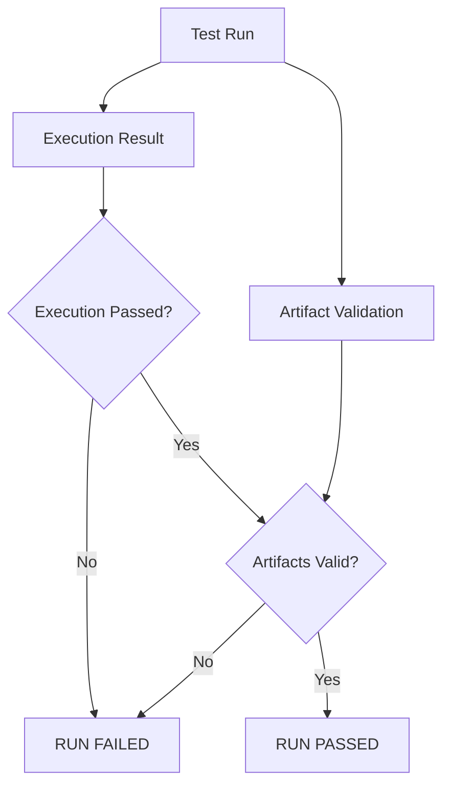

基本規則：

```text
Execution Passed
AND
Artifact Validation Passed
=
Run Passed
```

---

# 4. v1.3.5 → v1.4.0 架構演進

## v1.3

```text
Lifecycle-aware Test Runner
```

解決：

```text
global_setup
setup
scenario
teardown
global_teardown
```

---

## v1.3.5

```text
Process-aware Execution Engine
```

解決：

```text
Popen
stdout streaming
stderr streaming
Reader Threads
Timeout
Process lifecycle
```

---

## v1.4.0

```text
Artifact-aware Test Runner
```

解決：

```text
Test 跑完了
↓
應該產生什麼？
↓
真的有產生嗎？
↓
大小合理嗎？
↓
格式正確嗎？
↓
Artifact 是否有效？
```

因此演進可以表示為：

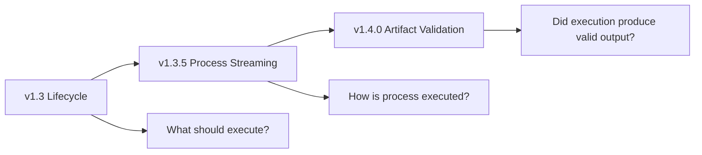

---

# 5. 為什麼 Artifact Validation 應該在 Runner

Artifact Validation 不應全部塞進原本的 Google Scripts Repo。

例如 shell script：

```bash
run_power_test.sh
```

主要責任應該是：

```text
執行 Power Test
產生 Power Artifact
```

而 Runner 可以統一負責：

```text
執行前準備
執行 Test Scenario
收集 Artifact
驗證 Artifact
產生 Report
```

形成：

```text
Google Scripts Repo
        ↓
Domain-specific execution

Device Test Runner
        ↓
Execution orchestration
Artifact management
Artifact validation
Reporting
```

因此可以保留原本 Script Repo 的功能邊界。

---

# 6. Artifact Validation 的第一版範圍

v1.4.0 建議先做最基本且通用的 validation：

* File exists
* File is regular file
* Minimum file size
* Maximum file size（可選）
* Directory exists
* Artifact count
* Required / optional artifact
* Extension / simple type validation

先不要在 v1.4.0 放入：

* CSV Domain Parser
* Power value correctness
* Statistical validation
* Image recognition
* Log semantic analysis
* Golden file comparison
* ML validation

這些屬於更高階的 Domain Validation。

v1.4.0 的定位應該是：

> Artifact infrastructure validation，而不是完整 Domain correctness validation。

---

# 7. Execution Validation 與 Artifact Validation

這兩層非常重要。

## Execution Validation

檢查：

```text
Command 是否正常執行
```

來源：

```python
StepResult
```

例如：

```python
success=True
exit_code=0
```

---

## Artifact Validation

檢查：

```text
執行後產生的 Output 是否符合要求
```

例如：

```text
power.csv exists
power.csv size > 1 KB
```

因此：

```text
StepResult
```

和：

```text
ArtifactValidationResult
```

不應混在同一個概念裡。

---

# 8. v1.4.0 高階架構

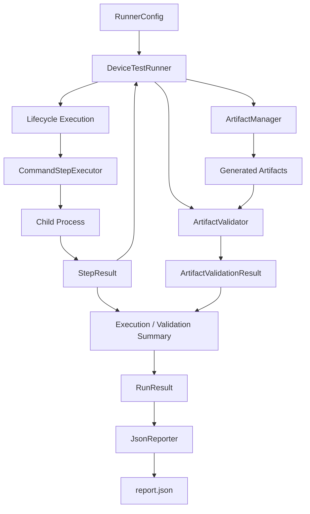

---

# 9. 建議新增的 Artifact Validation Model

v1.3 的 Model 已經穩定，因此 v1.4.0 可以在旁邊新增 Validation Domain Model。

建議：

```python
@dataclass(frozen=True)
class ArtifactValidationRule:
    path: str
    required: bool = True
    min_size_bytes: int | None = None
    max_size_bytes: int | None = None
```

它描述：

> 某個 Artifact 預期應符合什麼條件。

例如：

```python
ArtifactValidationRule(
    path="power.csv",
    required=True,
    min_size_bytes=1024,
)
```

意思：

```text
power.csv 必須存在
而且至少 1024 bytes
```

---

# 10. Validation Config

可以讓 `ArtifactConfig` 開始包含 Validation Rules。

概念上：

```python
@dataclass(frozen=True)
class ArtifactConfig:
    output_dir: str
    validations: List[ArtifactValidationRule] = field(
        default_factory=list
    )
```

因此：

```text
ArtifactConfig
├── output_dir
└── validation rules
```

這是 v1.4.0 第一個真正擴充 `ArtifactConfig` 語意的版本。

---

# 11. YAML 設計

可以從簡單版本開始：

```yaml
artifact:
  output_dir: artifact/sample_device_config

  validations:
    - path: power.csv
      required: true
      min_size_bytes: 1024

    - path: device.log
      required: true
      min_size_bytes: 1
```

對應：

```python
ArtifactConfig(
    output_dir="artifact/sample_device_config",
    validations=[
        ArtifactValidationRule(
            path="power.csv",
            required=True,
            min_size_bytes=1024,
        ),
        ArtifactValidationRule(
            path="device.log",
            required=True,
            min_size_bytes=1,
        ),
    ],
)
```

---

# 12. 為什麼 Rule 應該是資料

不建議寫成：

```python
if test_case.id == "power_001":
    assert power_csv.exists()
```

因為這會把 Test Case-specific knowledge 塞進 Runner。

比較好的方式：

```text
YAML
↓
Validation Rule
↓
Generic ArtifactValidator
```

例如：

```yaml
validations:
  - path: power.csv
    required: true
    min_size_bytes: 1024
```

Runner 不需要知道：

```text
什麼叫 Power Test
```

Runner 只需要知道：

```text
這份設定要求 power.csv
至少 1024 bytes
```

這維持了 Device Test Runner 的 generic runner 定位。

---

# 13. ArtifactValidationResult

每條 Rule 應產生自己的 Result。

建議 Model：

```python
@dataclass(frozen=True)
class ArtifactValidationResult:
    path: str
    success: bool
    exists: bool
    size_bytes: int | None
    error: str | None = None
```

例如成功：

```python
ArtifactValidationResult(
    path="power.csv",
    success=True,
    exists=True,
    size_bytes=24580,
    error=None,
)
```

失敗：

```python
ArtifactValidationResult(
    path="power.csv",
    success=False,
    exists=False,
    size_bytes=None,
    error="Required artifact does not exist",
)
```

---

# 14. Validation Rule 與 Validation Result

這是一組很重要的 Input / Output 關係：

```text
ArtifactValidationRule
        ↓
ArtifactValidator
        ↓
ArtifactValidationResult
```

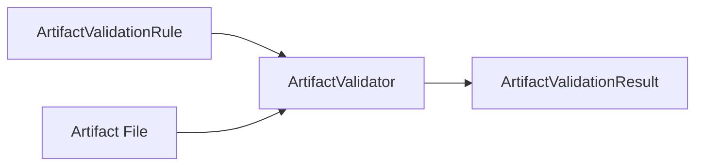

這跟 Executor 架構很像：

```text
LifecycleStepContent
        ↓
Executor
        ↓
StepResult
```

所以 v1.4.0 開始產生一個很漂亮的對稱：

```text
Execution Domain

LifecycleStepContent
        ↓
Executor
        ↓
StepResult
```

以及：

```text
Validation Domain

ArtifactValidationRule
        ↓
Validator
        ↓
ArtifactValidationResult
```

---

# 15. ArtifactValidator

`ArtifactValidator` 應是一個獨立 Component。

概念：

```python
class ArtifactValidator:

    def validate(
        self,
        artifact_dir: Path,
        rule: ArtifactValidationRule,
    ) -> ArtifactValidationResult:
        ...
```

它不需要知道：

* Lifecycle
* subprocess
* Popen
* Thread
* Device
* YAML
* Reporter

只需要知道：

```text
Artifact Directory
Validation Rule
```

然後回傳：

```text
Validation Result
```

---

# 16. ArtifactValidator Responsibility

ArtifactValidator 負責：

```text
Resolve artifact path
↓
Check existence
↓
Check file type
↓
Read file metadata
↓
Apply validation rules
↓
Build ArtifactValidationResult
```

流程：

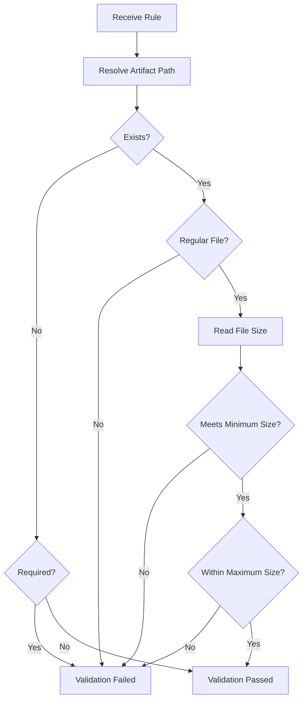

---

# 17. Existence Validation

最基本規則：

```python
path.exists()
```

例如：

```yaml
- path: power.csv
  required: true
```

如果不存在：

```text
validation FAILED
```

如果：

```yaml
required: false
```

Artifact 不存在可以視為：

```text
validation PASSED
```

或者未來引入：

```text
SKIPPED
```

v1.4.0 可以先維持 bool：

```text
success=True
```

---

# 18. File Size Validation

檔案存在不代表有效。

例如：

```text
power.csv
0 bytes
```

很可能代表：

* recorder 沒有成功寫資料
* script 建立了檔案但測試沒有真的執行
* process 中途失敗
* upstream tool 出錯

因此：

```yaml
min_size_bytes: 1024
```

可以避免：

```text
空 Artifact
```

被判定成功。

---

# 19. Minimum Size Validation

概念：

```python
if (
    rule.min_size_bytes is not None
    and size_bytes < rule.min_size_bytes
):
    return failed(...)
```

例如：

```text
Expected:
>= 1024 bytes

Actual:
128 bytes

Result:
FAILED
```

---

# 20. Maximum Size Validation

有些 Artifact 過大也可能表示異常。

例如：

```text
Expected:
log < 500 MB

Actual:
8 GB
```

可能代表：

* infinite loop
* recorder 沒有停止
* log spam
* runaway process

因此可以選擇支援：

```yaml
max_size_bytes: 524288000
```

但這是 optional rule。

---

# 21. Validation Pipeline

執行順序建議：

```text
Lifecycle Execution
        ↓
Cleanup
        ↓
Artifact Finalized
        ↓
Artifact Validation
        ↓
Build Final Summary
        ↓
RunResult
        ↓
Report
```

重要的是：

> 不應該在 Artifact 還正在產生時就驗證。

例如 Recorder 在 `teardown` 才停止並 flush：

```text
scenario
↓
teardown stops recorder
↓
recorder flushes power.csv
↓
validate power.csv
```

所以 Artifact Validation 應該通常放在：

```text
Lifecycle execution 完成後
```

而不是 Scenario 剛結束時。

---

# 22. Validation 應該是 Lifecycle Stage 嗎？

不建議在 v1.4.0 直接新增：

```text
validation
```

成為第六個 Lifecycle Stage。

目前 Lifecycle 的語意是：

```text
執行 Test Environment / Scenario 的 Command Lifecycle
```

而 Artifact Validation 是：

```text
Runner 內部對執行結果的檢查
```

它比較像：

```text
Post-execution Result Processing
```

因此較好的分層是：

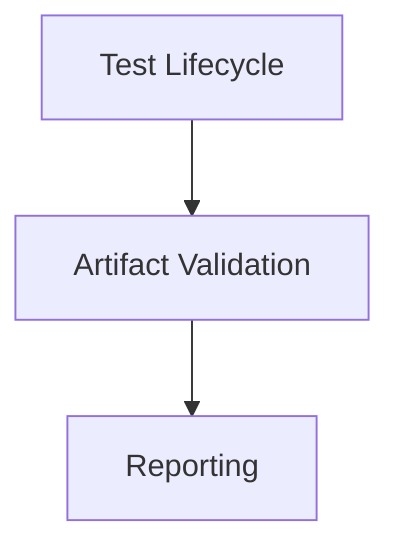

而不是：

```text
global_setup
setup
scenario
teardown
global_teardown
validation
```

這樣可以保持 Lifecycle Domain 的純度。

---

# 23. Runner 高階流程

v1.4.0 的 `DeviceTestRunner.run()` 可以開始變成：

```python
def run(self, config: RunnerConfig) -> RunResult:

    started_at = self.clock.now()

    artifact_dir = self.artifact_manager.create_run(...)

    step_results = self._execute_lifecycle(
        config=config,
        artifact_dir=artifact_dir,
    )

    validation_results = self._validate_artifacts(
        config=config,
        artifact_dir=artifact_dir,
    )

    finished_at = self.clock.now()

    summary = self._build_summary(
        config=config,
        step_results=step_results,
        validation_results=validation_results,
        started_at=started_at,
        finished_at=finished_at,
    )

    metadata = self._build_metadata(...)

    result = RunResult(...)

    self.reporter.write(result)

    return result
```

高階流程變得非常清楚：

```text
Prepare
Execute
Validate
Aggregate
Report
```

---

# 24. v1.4.0 Runner Activity Diagram

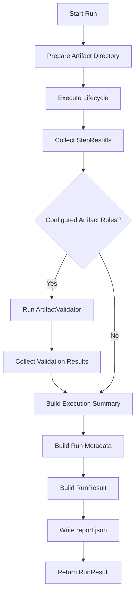

---

# 25. Execution 失敗後還要不要做 Artifact Validation？

建議：

```text
要。
```

因為即使 Scenario Failed，也可能產生有用的 Debug Artifact。

例如：

```text
scenario FAILED
↓
device.log exists
crash_dump exists
power.csv partial exists
```

Artifact Validation 仍可以告訴你：

```text
device.log       VALID
crash_dump       VALID
power.csv        TOO SMALL
```

所以：

```text
Execution failure
```

不應直接跳過所有 Validation。

這對 Debug 非常重要。

---

# 26. Teardown 後再 Validate

v1.4.0 的推薦順序：


因為 Cleanup Stage 很可能本身就是 Artifact Finalization 的一部分。

---

# 27. Execution Result 與 Validation Result 的四種組合

這是 v1.4.0 很重要的概念。

| Execution | Artifact Validation | Final |
| --------- | ------------------- | ----- |
| PASS      | PASS                | PASS  |
| PASS      | FAIL                | FAIL  |
| FAIL      | PASS                | FAIL  |
| FAIL      | FAIL                | FAIL  |

換句話說：

```text
Final PASS
=
Execution PASS
AND
Artifact Validation PASS
```

---

# 28. 為什麼 Execution PASS + Artifact FAIL 必須算 FAIL

例如：

```text
run_power_test.sh
exit_code = 0
```

但是：

```text
power.csv missing
```

如果仍判定：

```text
PASSED
```

Test Runner 的結果就沒有意義。

因為真正測試的目的不是：

```text
bash 有沒有正常離開
```

而是：

```text
這次測試有沒有產生可用的測試結果
```

---

# 29. ValidationSummary

如果 v1.4.0 開始有多個 Artifact Rule，建議不要把全部統計塞進原本 `ExecutionSummary`。

可以新增：

```python
@dataclass(frozen=True)
class ValidationSummary:
    configured_validations: int
    passed_validations: int
    failed_validations: int
```

例如：

```text
configured = 3
passed = 2
failed = 1
```

這樣：

```text
ExecutionSummary
```

專門描述：

```text
Process / Step execution
```

而：

```text
ValidationSummary
```

專門描述：

```text
Artifact validation
```

責任比較清楚。

---

# 30. 建議的 Result 結構

v1.4.0 可以開始演進成：

```text
RunResult
├── RunMetadata
├── ExecutionSummary
├── ValidationSummary
├── List[StepResult]
├── List[ArtifactValidationResult]
└── artifact_dir
```

概念 Model：

```python
@dataclass(frozen=True)
class RunResult:
    metadata: RunMetadata
    summary: ExecutionSummary
    validation_summary: ValidationSummary
    step_results: List[StepResult]
    validation_results: List[ArtifactValidationResult]
    artifact_dir: str | None = None
```

如果你希望 v1.4.0 先保持最小變更，也可以暫時不新增 `ValidationSummary`，只放：

```python
validation_results
```

但從 architecture cleanliness 來看，獨立 Summary 會比較漂亮。

---

# 31. 建議不要把 Artifact Validation 塞進 StepResult

不建議：

```python
StepResult(
    ...
    artifact_valid=True,
)
```

因為：

```text
一個 Step
```

可能：

* 不產生 Artifact
* 產生多個 Artifact
* Artifact 在 teardown 才完成
* 多個 Step 共同產生一個 Artifact

因此：

```text
StepResult
```

和：

```text
ArtifactValidationResult
```

應該是平行關係。

不是：

```text
StepResult contains validation
```

而是：

```text
RunResult
├── StepResult[]
└── ArtifactValidationResult[]
```

---

# 32. Result Domain Diagram

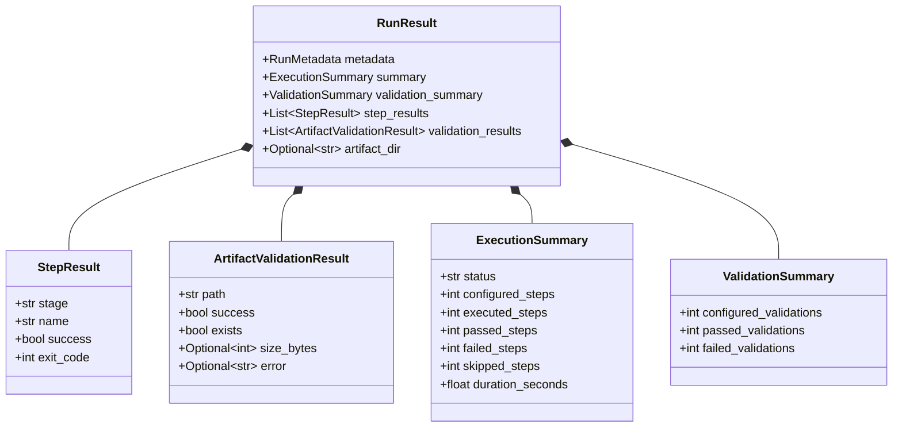

---

# 33. Final Run Status

v1.3 的：

```python
summary.status
```

主要來自 StepResult。

到了 v1.4.0，最終 status 必須同時考慮：

```text
Execution
+
Validation
```

因此建議建立一個統一的 aggregation：

```python
execution_passed = (
    execution_summary.failed_steps == 0
)

validation_passed = (
    validation_summary.failed_validations == 0
)

status = (
    "PASSED"
    if execution_passed and validation_passed
    else "FAILED"
)
```

---

# 34. ExecutionSummary.status 的語意問題

這裡會出現一個架構問題。

原本：

```python
ExecutionSummary.status
```

其實被當成：

```text
整體 Run Status
```

但到了 v1.4：

```text
Execution Summary
```

只應該代表 Execution。

所以可以選擇：

### 方案 A：維持現況

```text
ExecutionSummary.status
=
Final Run Status
```

簡單，但語意開始變得不純。

### 方案 B：RunResult 新增 status

更乾淨：

```python
@dataclass(frozen=True)
class RunResult:
    status: str
    metadata: RunMetadata
    execution_summary: ExecutionSummary
    validation_summary: ValidationSummary
    ...
```

形成：

```text
RunResult.status
    = Final Status

ExecutionSummary
    = Process statistics

ValidationSummary
    = Artifact statistics
```

從長期架構來看，方案 B 更適合。

---

# 35. 建議 v1.4.0 RunResult

如果願意在 v1.4 做一次 Result Model cleanup，可以是：

```python
@dataclass(frozen=True)
class RunResult:
    status: str
    metadata: RunMetadata
    execution_summary: ExecutionSummary
    validation_summary: ValidationSummary
    step_results: List[StepResult]
    validation_results: List[ArtifactValidationResult]
    artifact_dir: str | None = None

    @property
    def passed(self) -> bool:
        return self.status == "PASSED"
```

這樣建立：

```text
Single Source of Truth
```

最終狀態只有：

```python
RunResult.status
```

---

# 36. Status Aggregator

可以建立 private builder：

```python
def _determine_run_status(
    execution_summary: ExecutionSummary,
    validation_summary: ValidationSummary,
) -> str:

    execution_passed = (
        execution_summary.failed_steps == 0
    )

    validation_passed = (
        validation_summary.failed_validations == 0
    )

    if execution_passed and validation_passed:
        return "PASSED"

    return "FAILED"
```

未來增加：

```text
INFRA_ERROR
CANCELLED
TIMEOUT
```

時，這個 Aggregator 就會成為統一決策點。

---

# 37. Validation Summary Invariants

ValidationSummary 應符合：

```text
configured_validations
=
passed_validations
+
failed_validations
```

Unit Test：

```python
assert (
    summary.configured_validations
    == summary.passed_validations
    + summary.failed_validations
)
```

這與 ExecutionSummary 的：

```text
configured_steps
=
passed_steps
+
failed_steps
+
skipped_steps
```

形成對稱。

---

# 38. Execution 與 Validation 的對稱性

v1.4.0 會出現非常漂亮的架構：

```text
CONFIG
├── LifecycleStepContent[]
└── ArtifactValidationRule[]

EXECUTION
├── StepResult[]
└── ArtifactValidationResult[]

SUMMARY
├── ExecutionSummary
└── ValidationSummary
```

用圖表示：

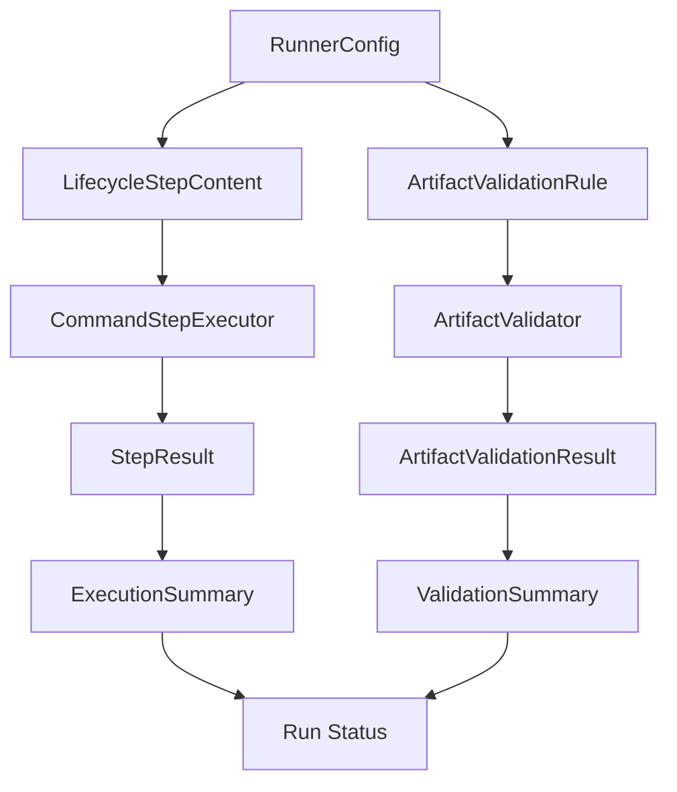

---

# 39. Validator 與 Parser 不一樣

這個邊界非常重要。

## Validator

回答：

```text
Artifact 是否存在？
檔案是否非空？
大小是否合理？
格式是否基本符合要求？
```

---

## Parser

回答：

```text
Artifact 裡面的資料代表什麼？
```

例如：

```text
power.csv
```

Validator：

```text
exists
size > 1 KB
```

Parser：

```text
average_power = 2.3 W
peak_power = 4.8 W
```

再進一步的 Domain Validator：

```text
average_power < expected threshold
```

因此未來可以演進：

```text
Artifact
↓
Infrastructure Validator
↓
Parser
↓
Domain Validator
```

v1.4.0 先做第一層即可。

---

# 40. Artifact Validation Pipeline 的長期演進

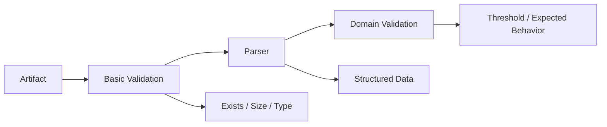

v1.4.0：

```text
Basic Validation
```

後續版本才考慮：

```text
Parser / Domain Validation
```

---

# 41. Artifact Validator 與 Google Script Repo 的界線

假設 Google Script 產生：

```text
power_data.csv
```

Google Script Repo：

```text
負責如何產生 power_data.csv
```

Device Test Runner：

```text
負責要求 power_data.csv 必須存在
負責確認其大小是否合理
負責保存與報告 validation result
```

Power Domain Parser：

```text
負責解析 power_data.csv 裡面的數值
```

因此三層可以清楚分離：

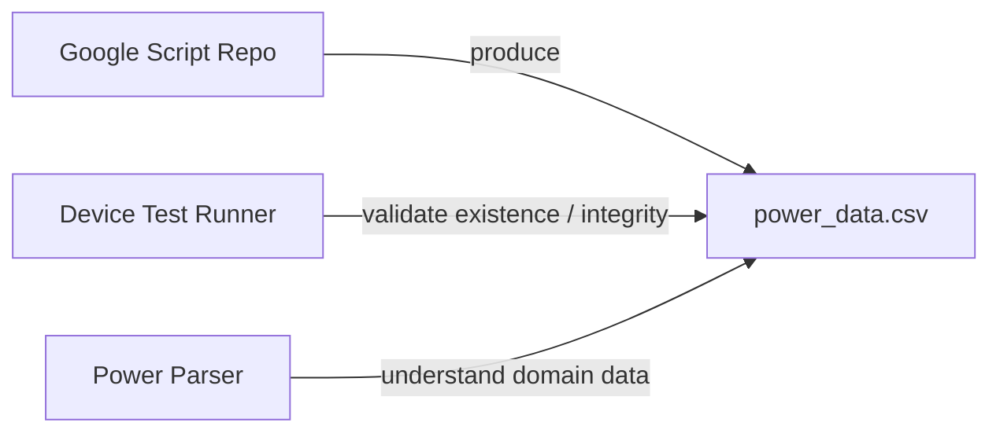

---

# 42. Optional Artifact

不是每個 Artifact 都一定要存在。

例如 Debug Log：

```yaml
- path: crash_dump.txt
  required: false
```

沒有 Crash 時：

```text
crash_dump.txt
不存在
```

這不應讓 Test Failure。

因此：

```text
required = false
```

是很重要的 Validation Rule。

---

# 43. Required / Optional Decision

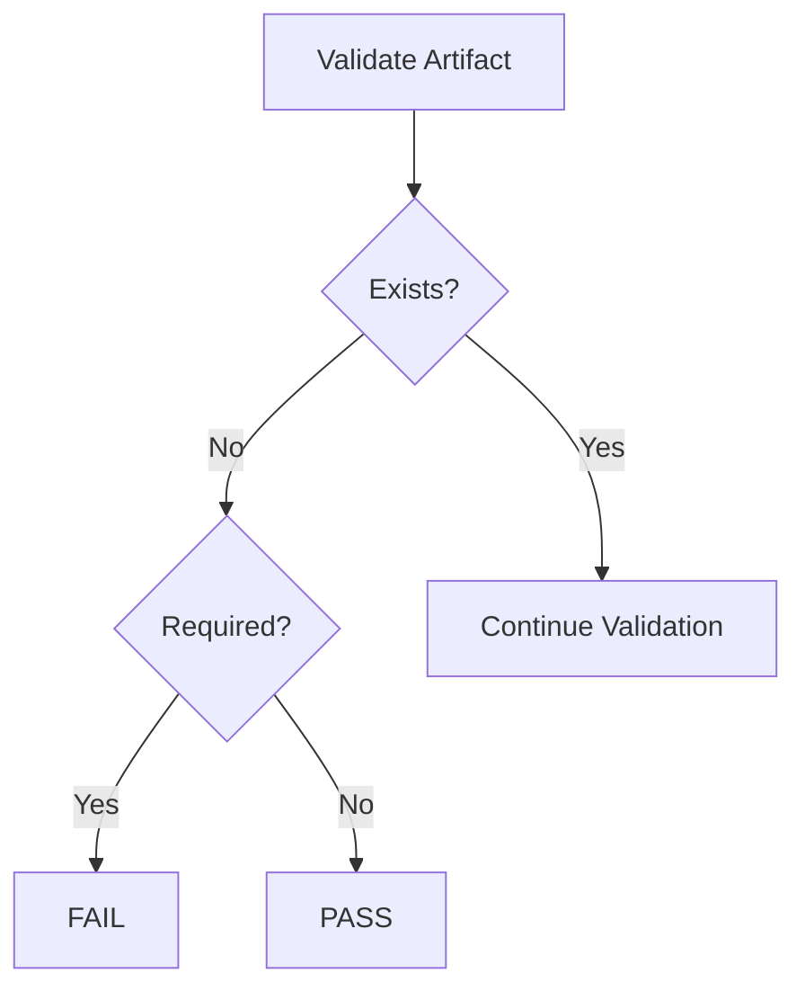

---

# 44. Validation Error Message

Validation Result 應該提供清楚的 error。

不建議：

```text
error="failed"
```

建議：

```text
Required artifact does not exist: power.csv
```

或者：

```text
Artifact size below minimum: expected >= 1024 bytes, actual=128 bytes
```

這會讓 `report.json` 本身具備 Debug 價值。

---

# 45. Artifact Path Resolution

Validation Rule 的：

```yaml
path: power.csv
```

建議是相對於：

```text
artifact_dir
```

而不是 Repository Working Directory。

例如：

```text
artifact_dir
=
artifact/sample/power_001_20260807_150000
```

Rule：

```text
power.csv
```

最終：

```text
artifact/sample/power_001_20260807_150000/power.csv
```

概念：

```python
artifact_path = (
    Path(artifact_dir)
    / rule.path
)
```

這能避免工作目錄不同造成 Validation 找錯位置。

---

# 46. Path Traversal 注意事項

如果 Rule 來自 YAML：

```yaml
path: ../../some_file
```

理論上可能跑出 artifact directory。

Side Project v1.4.0 不一定要做完整 Security Hardening，但可以建立一個基本 invariant：

> Artifact Validation path 應該位於 artifact_dir 下。

未來 Platform 化時再完整處理：

* path normalization
* path traversal
* symlink
* sandbox

---

# 47. Validator 不應修改 Artifact

ArtifactValidator 應該是 read-only。

它只應：

```text
讀取檔案 metadata
檢查條件
產生結果
```

不應：

```text
修改檔案
刪除檔案
修正檔案
重新產生 Artifact
```

這符合：

```text
Validation should observe, not mutate.
```

---

# 48. v1.4.0 Sequence Diagram

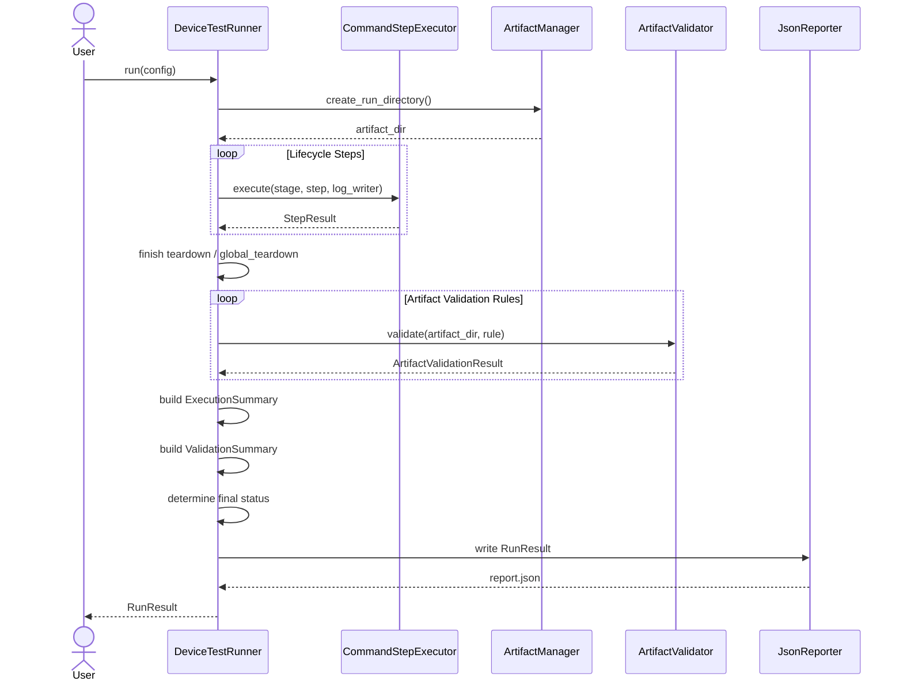

---

# 49. Component Architecture

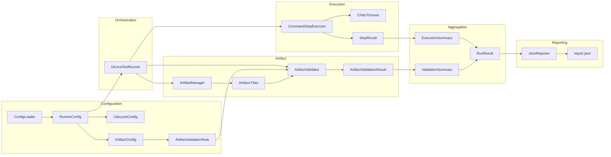

---

# 50. report.json 的變化

v1.3.5：

```json
{
  "metadata": {},
  "summary": {},
  "step_results": []
}
```

v1.4.0：

```json
{
  "status": "FAILED",

  "metadata": {},

  "execution_summary": {},

  "validation_summary": {},

  "step_results": [],

  "validation_results": [],

  "artifact_dir": "..."
}
```

---

# 51. report.json 範例

```json
{
  "status": "FAILED",

  "metadata": {
    "test_case_id": "power_001",
    "test_case_name": "Youtube Playback Power Test",
    "device_serial": "emulator-5566",
    "device_product": "pixel",
    "device_build": "test_build",
    "runner_version": "1.4.0",
    "started_at": "2026-08-07T15:30:00+08:00",
    "finished_at": "2026-08-07T15:35:00+08:00"
  },

  "execution_summary": {
    "configured_steps": 5,
    "executed_steps": 5,
    "passed_steps": 5,
    "failed_steps": 0,
    "skipped_steps": 0,
    "duration_seconds": 300.0
  },

  "validation_summary": {
    "configured_validations": 2,
    "passed_validations": 1,
    "failed_validations": 1
  },

  "step_results": [
    {
      "stage": "scenario",
      "name": "run_youtube",
      "success": true,
      "exit_code": 0
    }
  ],

  "validation_results": [
    {
      "path": "device.log",
      "success": true,
      "exists": true,
      "size_bytes": 20520,
      "error": null
    },
    {
      "path": "power.csv",
      "success": false,
      "exists": true,
      "size_bytes": 128,
      "error": "Artifact size below minimum: expected >= 1024 bytes, actual=128 bytes"
    }
  ],

  "artifact_dir": "artifact/sample_device_config/power_001_20260807_153000"
}
```

最值得注意：

```text
execution failed_steps = 0
```

但是：

```text
validation failed_validations = 1
```

所以：

```text
status = FAILED
```

這就是 v1.4.0 的核心價值。

---

# 52. Unit Test 架構

v1.4.0 新增的測試主要集中在：

```text
ArtifactValidationRule
ArtifactValidator
ArtifactValidationResult
ValidationSummary
Status Aggregation
```

整體：

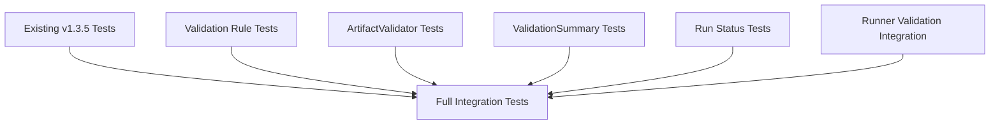

---

# 53. ArtifactValidator Tests

應至少涵蓋：

### Required file exists

```text
expected: PASS
```

### Required file missing

```text
expected: FAIL
```

### Optional file missing

```text
expected: PASS
```

### File size equals minimum

```text
expected: PASS
```

### File below minimum

```text
expected: FAIL
```

### File above maximum

```text
expected: FAIL
```

### Empty file with min_size=1

```text
expected: FAIL
```

### Unicode filename

```text
expected: supported
```

---

# 54. 使用 tmp_path 測 Artifact Validation

這一版非常適合 pytest 的：

```python
tmp_path
```

例如：

```python
def test_required_artifact_exists(tmp_path):
    artifact = tmp_path / "power.csv"
    artifact.write_text(
        "timestamp,power\n1,2.3\n",
        encoding="utf-8",
    )

    rule = ArtifactValidationRule(
        path="power.csv",
        required=True,
        min_size_bytes=1,
    )

    result = validator.validate(
        artifact_dir=tmp_path,
        rule=rule,
    )

    assert result.success is True
    assert result.exists is True
    assert result.size_bytes > 0
```

---

# 55. Missing Artifact Test

```python
def test_required_artifact_missing(tmp_path):
    rule = ArtifactValidationRule(
        path="power.csv",
        required=True,
    )

    result = validator.validate(
        artifact_dir=tmp_path,
        rule=rule,
    )

    assert result.success is False
    assert result.exists is False
    assert result.size_bytes is None
```

這種測試不需要 Mock File System。

直接用：

```text
tmp_path
```

通常會比 Mock `Path.exists()` 更直觀。

---

# 56. Size Validation Test

```python
def test_artifact_below_minimum_size(tmp_path):
    artifact = tmp_path / "power.csv"
    artifact.write_bytes(b"123")

    rule = ArtifactValidationRule(
        path="power.csv",
        min_size_bytes=10,
    )

    result = validator.validate(
        artifact_dir=tmp_path,
        rule=rule,
    )

    assert result.success is False
    assert result.size_bytes == 3
```

這類測試可以讓你練到：

```text
filesystem state
domain rule
result object
```

---

# 57. Status Aggregation Tests

應該特別測四種狀況。

## Execution PASS + Validation PASS

```text
RUN PASSED
```

## Execution PASS + Validation FAIL

```text
RUN FAILED
```

## Execution FAIL + Validation PASS

```text
RUN FAILED
```

## Execution FAIL + Validation FAIL

```text
RUN FAILED
```

這可以 parameterize：

```python
@pytest.mark.parametrize(
    (
        "execution_passed",
        "validation_passed",
        "expected_status",
    ),
    [
        (True, True, "PASSED"),
        (True, False, "FAILED"),
        (False, True, "FAILED"),
        (False, False, "FAILED"),
    ],
)
def test_run_status(
    execution_passed,
    validation_passed,
    expected_status,
):
    ...
```

---

# 58. Runner Tests

Runner Test 應使用：

```text
Fake Executor
Fake Validator
Fake Reporter
tmp_path Artifact
```

驗證：

* Lifecycle 先執行
* Validation 在 Lifecycle 後執行
* 每個 Rule 都交給 Validator
* Validation Results 被收集
* Validation Failure 不會消失
* Final Run Status 正確
* Reporter 收到完整結果

---

# 59. Integration Test

完整 E2E-like Integration Test：

```text
Temporary YAML
↓
ConfigLoader
↓
RunnerConfig
↓
DeviceTestRunner
↓
Lifecycle
↓
Temporary Script
↓
Generate Artifact
↓
ArtifactValidator
↓
RunResult
↓
report.json
```

圖：

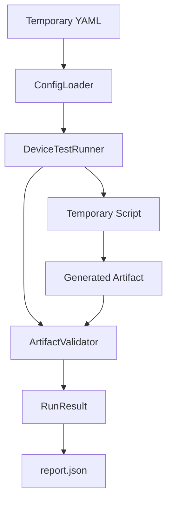

---

# 60. 一個很好的 Integration Test

可以建立：

```bash
#!/bin/bash

echo "timestamp,power" > "$ARTIFACT_DIR/power.csv"
echo "1,2.3" >> "$ARTIFACT_DIR/power.csv"

exit 0
```

YAML：

```yaml
artifact:
  validations:
    - path: power.csv
      required: true
      min_size_bytes: 10
```

Expected：

```text
Execution: PASS
Artifact Validation: PASS
Final: PASS
```

然後另一個 script：

```bash
#!/bin/bash

touch "$ARTIFACT_DIR/power.csv"

exit 0
```

Expected：

```text
Execution: PASS
Artifact exists: YES
Artifact size: 0
Validation: FAIL
Final: FAIL
```

這個案例可以非常清楚地證明：

> exit code 0 並不足以代表 Test Run Passed。

---

# 61. v1.4.0 的 Dependency Structure

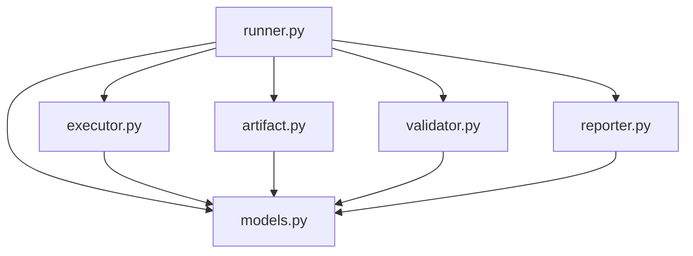

建議新增：

```text
runner/validator.py
```

不要將 Validation 塞進：

```text
artifact.py
```

因為：

```text
ArtifactManager
=
管理 Artifact

ArtifactValidator
=
判斷 Artifact
```

兩個責任不同。

---

# 62. 建議目錄

```text
device-test-runner/
├── runner/
│   ├── __init__.py
│   ├── artifact.py
│   ├── config_loader.py
│   ├── executor.py
│   ├── models.py
│   ├── reporter.py
│   ├── runner.py
│   └── validator.py
│
├── configs/
│   └── sample_device_config.yaml
│
├── scripts/
│   ├── setup_device.sh
│   ├── run_scenario.sh
│   └── teardown_scenario.sh
│
├── artifact/
│   └── sample_device_config/
│
├── tests/
│   ├── test_artifact.py
│   ├── test_config_loader.py
│   ├── test_executor.py
│   ├── test_models.py
│   ├── test_reporter.py
│   ├── test_runner.py
│   ├── test_validator.py
│   └── test_integration.py
│
└── docs/
    ├── architecture_v1.0.md
    ├── architecture_v1.1.md
    ├── architecture_v1.2.md
    ├── architecture_v1.3.md
    ├── architecture_v1.3.5.md
    └── architecture_v1.4.0.md
```

---

# 63. ArtifactManager 與 ArtifactValidator

兩個類別的責任可以直接用一句話區分：

```text
ArtifactManager：
Where and how artifacts are stored.

ArtifactValidator：
Whether artifacts are valid.
```

圖：

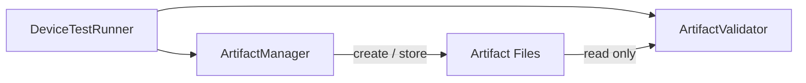

Validator 不應透過 Manager 去修改 Artifact。

---

# 64. v1.4.0 的架構邊界

現在 DTR 已經出現幾個相當清楚的 Boundary。

```text
Configuration Boundary
    ↓
RunnerConfig

Execution Boundary
    ↓
CommandStepExecutor

Process Boundary
    ↓
Popen / Child Process

Artifact Boundary
    ↓
ArtifactManager

Validation Boundary
    ↓
ArtifactValidator

Reporting Boundary
    ↓
JsonReporter
```

Runner 是中間的 Orchestrator：

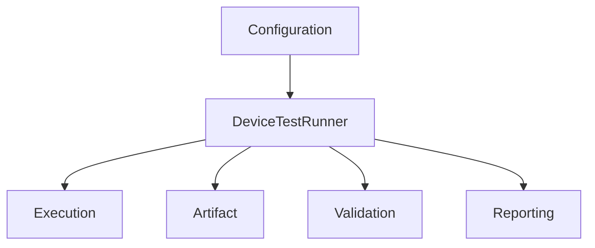

---

# 65. v1.4.0 不應做的事

為了控制版本範圍，v1.4.0 不建議加入：

* Retry
* Step retry
* Artifact retry
* Timeout policy 重構
* Background recorder lifecycle
* Full process group kill
* Hook system
* Controller / Worker
* Remote validation
* SQLite
* Dashboard
* Artifact upload
* Domain parser framework
* Keyword Registry

這些可以在後續版本逐步加入。

v1.4.0 應保持聚焦：

```text
Artifact exists?
Artifact usable?
Run status reflects artifact validity?
```

---

# 66. v1.4.0 的設計價值

v1.3.5 之前，Runner 大部分依賴：

```text
Process-level truth
```

也就是：

```text
exit code
stdout
stderr
timeout
```

v1.4.0 開始引入：

```text
Test-output-level truth
```

也就是：

```text
expected artifact
actual artifact
validation rule
validation result
```

這表示 Test Runner 開始不再完全相信：

```text
Process 說自己成功
```

而是會確認：

```text
成功的證據到底有沒有產生
```

這非常接近真正 Testing Infrastructure 的思維。

---

# 67. v1.3.5 與 v1.4.0 比較

| 架構項目                          | v1.3.5               | v1.4.0                 |
| ----------------------------- | -------------------- | ---------------------- |
| Lifecycle                     | 有                    | 沿用                     |
| Popen                         | 有                    | 沿用                     |
| stdout streaming              | 有                    | 沿用                     |
| stderr streaming              | 有                    | 沿用                     |
| Process timeout               | 有                    | 沿用                     |
| ArtifactManager               | 有                    | 沿用                     |
| StepLogWriter                 | 有                    | 沿用                     |
| StepResult                    | 有                    | 沿用                     |
| Artifact existence validation | 無                    | 有                      |
| Artifact size validation      | 無                    | 有                      |
| Required / optional           | 無                    | 有                      |
| ArtifactValidationRule        | 無                    | 有                      |
| ArtifactValidator             | 無                    | 有                      |
| ArtifactValidationResult      | 無                    | 有                      |
| ValidationSummary             | 無                    | 建議加入                   |
| Final status                  | 主要由 Step 判定          | Execution + Validation |
| Runner 定位                     | Process-aware Runner | Artifact-aware Runner  |

---

# 68. Version Evolution

```mermaid
flowchart LR
    V10[v1.0 Basic Runner]
    V11[v1.1 Multi-step Workflow]
    V12[v1.2 Artifact and Report]
    V13[v1.3 Lifecycle]
    V135[v1.3.5 Streaming Process]
    V14[v1.4.0 Artifact Validation]

    V10 --> V11
    V11 --> V12
    V12 --> V13
    V13 --> V135
    V135 --> V14

    V10 --> A[Execute]
    V11 --> B[Orchestrate Steps]
    V12 --> C[Persist Results]
    V13 --> D[Manage Test Lifecycle]
    V135 --> E[Manage Process Lifecycle]
    V14 --> F[Validate Test Outputs]
```

---

# 69. v1.4.0 架構摘要

```mermaid
flowchart TD
    YAML[YAML Configuration]
    Loader[ConfigLoader]
    Config[RunnerConfig]

    Runner[DeviceTestRunner]

    Lifecycle[Lifecycle]
    Executor[CommandStepExecutor]
    Process[Child Process]
    StepResult[StepResult]

    ArtifactManager[ArtifactManager]
    Artifact[Artifact Files]

    Rule[ArtifactValidationRule]
    Validator[ArtifactValidator]
    ValidationResult[ArtifactValidationResult]

    ExecutionSummary[ExecutionSummary]
    ValidationSummary[ValidationSummary]

    Status[Final Run Status]
    Result[RunResult]

    Reporter[JsonReporter]
    JSON[report.json]

    YAML --> Loader
    Loader --> Config
    Config --> Runner

    Runner --> Lifecycle
    Lifecycle --> Executor
    Executor --> Process
    Process --> StepResult
    StepResult --> Runner

    Runner --> ArtifactManager
    ArtifactManager --> Artifact

    Config --> Rule
    Rule --> Validator
    Artifact --> Validator

    Validator --> ValidationResult
    ValidationResult --> Runner

    StepResult --> ExecutionSummary
    ValidationResult --> ValidationSummary

    ExecutionSummary --> Status
    ValidationSummary --> Status

    Status --> Result
    ExecutionSummary --> Result
    ValidationSummary --> Result
    StepResult --> Result
    ValidationResult --> Result

    Result --> Reporter
    Reporter --> JSON
```

Device Test Runner v1.4.0 的核心架構可以濃縮為：

> `DeviceTestRunner` 仍使用 v1.3.5 的 Lifecycle 與 Popen Execution Engine 執行測試；Lifecycle 完成並讓 Artifact finalized 後，再由 `ArtifactValidator` 根據 `ArtifactValidationRule` 對 Artifact 進行存在性、required/optional 與檔案大小等基礎驗證，產生獨立的 `ArtifactValidationResult`。最後 Runner 分別聚合 `ExecutionSummary` 與 `ValidationSummary`，只有 Execution 與 Artifact Validation 同時通過時，整次 `RunResult` 才能被判定為 `PASSED`。

v1.4.0 因此標誌著 Device Test Runner 從：

```text
「Script 有沒有成功跑完？」
```

開始進入：

```text
「Script 跑完後，有沒有真的產生有效的測試成果？」
```

這也是從單純 Execution Engine 走向真正 Test Infrastructure 很關鍵的一步。
