# Device Test Runner Architecture v1.4.1

## 1. 版本定位

Device Test Runner v1.4.1 延續 v1.4.0 的 Artifact Validation。

v1.4.0 解決的核心問題是：

```text
Command Exit Code == 0
```

不代表：

```text
Test Result 一定有效
```

因此加入：

```text
ArtifactValidationRule
        ↓
ArtifactValidator
        ↓
ArtifactValidationResult
```

v1.4.1 的目標不是再加入新的大型功能，而是將這條 Validation Pipeline 收斂成更明確的架構：

```text
Configuration
      ↓
Validation Rules
      ↓
Artifact Validator
      ↓
Validation Results
      ↓
Validation Summary
      ↓
Run Status Aggregation
      ↓
RunResult
```

核心原則：

> Execution 與 Validation 是兩條獨立 Pipeline，最後才在 Run-level 聚合。

---

# 2. v1.4.0 → v1.4.1

v1.4.0：

```text
Lifecycle
    ↓
StepResult[]

Artifact
    ↓
ArtifactValidationResult[]

兩者共同影響最後結果
```

v1.4.1 將這個概念正式整理為：

```text
Execution Pipeline
+
Validation Pipeline
+
Run Aggregation
```

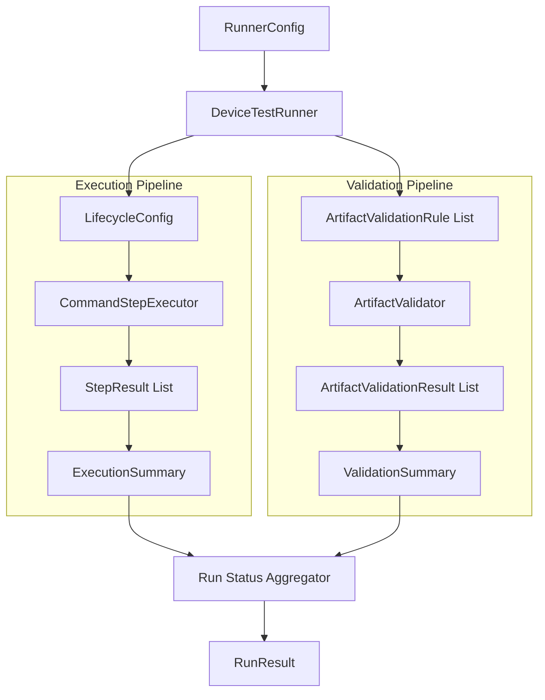

---

# 3. v1.4.1 的核心架構原則

v1.4.1 建議固定四個重要 Boundary：

```text
Execution
Validation
Aggregation
Reporting
```

也就是：

```text
Command 有沒有正確執行？
        ↓
Execution

Artifact 有沒有符合要求？
        ↓
Validation

整次 Test Run 是否成功？
        ↓
Aggregation

結果如何保存？
        ↓
Reporting
```

不要讓其中任何兩層混在一起。

---

# 4. Configuration Model

v1.4.1 延續原本的 Test Lifecycle Model：

```python
@dataclass(frozen=True)
class DeviceTestCase:
    id: str
    name: str
    description: str


@dataclass(frozen=True)
class DeviceInfo:
    serial: str
    product: str
    build: str


@dataclass(frozen=True)
class LifecycleStepContent:
    name: str
    type: str
    command: str
    timeout_second: int


@dataclass(frozen=True)
class LifecycleSteps:
    steps: List[LifecycleStepContent] = field(
        default_factory=list
    )


@dataclass(frozen=True)
class LifecycleConfig:
    global_setup: LifecycleSteps = field(
        default_factory=LifecycleSteps
    )
    setup: LifecycleSteps = field(
        default_factory=LifecycleSteps
    )
    scenario: LifecycleSteps = field(
        default_factory=LifecycleSteps
    )
    teardown: LifecycleSteps = field(
        default_factory=LifecycleSteps
    )
    global_teardown: LifecycleSteps = field(
        default_factory=LifecycleSteps
    )
```

Lifecycle 本身不需要因為 Artifact Validation 而改變。

---

# 5. Artifact Validation Config

v1.4.1 的 ArtifactConfig 開始正式承擔：

```text
Artifact Storage Configuration
+
Artifact Validation Configuration
```

概念：

```python
@dataclass(frozen=True)
class ArtifactValidationRule:
    path: str
    required: bool = True
    min_size_bytes: int | None = None
    max_size_bytes: int | None = None


@dataclass(frozen=True)
class ArtifactConfig:
    output_dir: str
    validations: List[ArtifactValidationRule] = field(
        default_factory=list
    )
```

結構：

```text
ArtifactConfig
├── output_dir
└── validations
    ├── ArtifactValidationRule
    ├── ArtifactValidationRule
    └── ArtifactValidationRule
```

---

# 6. RunnerConfig

RunnerConfig 因此可以保持：

```python
@dataclass(frozen=True)
class RunnerConfig:
    test_case: DeviceTestCase
    device: DeviceInfo
    lifecycle: LifecycleConfig
    artifact: ArtifactConfig
```

形成：

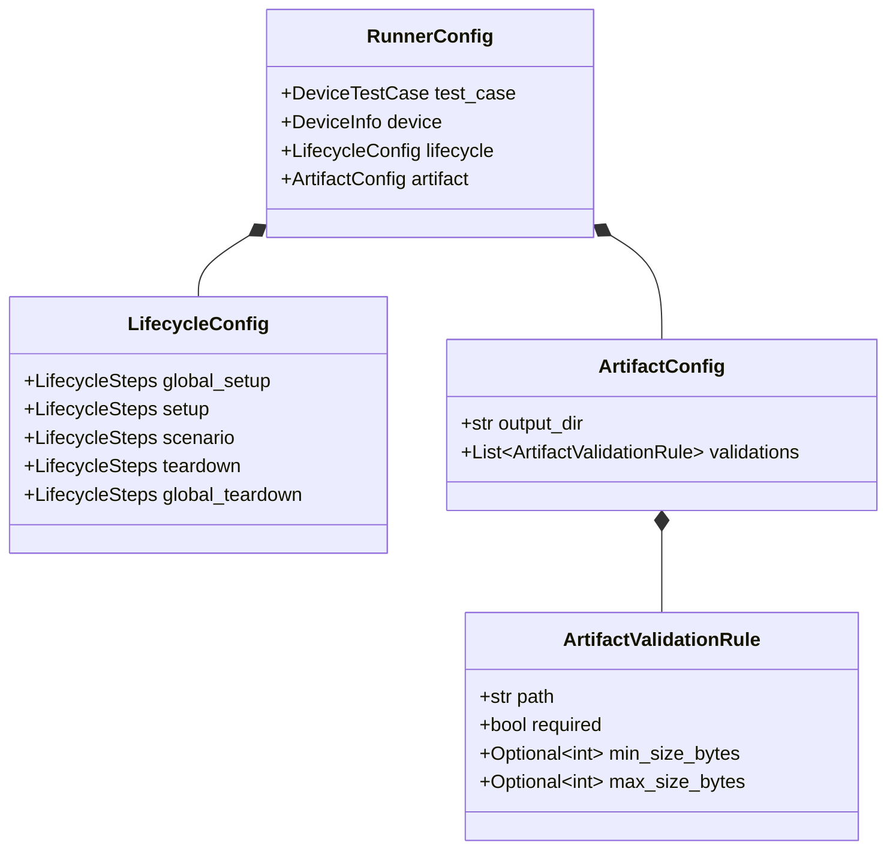

---

# 7. YAML

例如：

```yaml
test_case:
  id: power_001
  name: Youtube Playback Power Test
  description: Measure power behavior during Youtube playback

device:
  serial: emulator-5566
  product: pixel
  build: test_build

lifecycle:
  global_setup:
    steps:
      - name: check_device
        type: command
        command: "adb devices"
        timeout_second: 10

  setup:
    steps:
      - name: setup_device
        type: command
        command: "bash scripts/setup_device.sh"
        timeout_second: 30

  scenario:
    steps:
      - name: run_scenario
        type: command
        command: "bash scripts/run_scenario.sh"
        timeout_second: 300

  teardown:
    steps:
      - name: stop_scenario
        type: command
        command: "bash scripts/stop_scenario.sh"
        timeout_second: 30

  global_teardown:
    steps:
      - name: collect_logs
        type: command
        command: "bash scripts/collect_logs.sh"
        timeout_second: 30

artifact:
  output_dir: artifact/sample_device_config

  validations:
    - path: power.csv
      required: true
      min_size_bytes: 1024

    - path: device.log
      required: true
      min_size_bytes: 1

    - path: crash_dump.txt
      required: false
```

---

# 8. Rule 是 Configuration，不是 Validation Code

Artifact Rule 應該只是資料：

```python
ArtifactValidationRule(
    path="power.csv",
    required=True,
    min_size_bytes=1024,
)
```

不要把 rule 寫成：

```python
if test_case.id == "power_001":
    check_power_csv()
```

因為這會讓 Runner 開始知道 Power Domain。

正確架構：

```text
Power Test YAML

     ↓

path = power.csv
min_size = 1024

     ↓

Generic ArtifactValidator
```

也就是：

> Domain-specific requirement 放在 Configuration，Generic mechanism 留在 Runner。

---

# 9. Validation Result Model

每個 Rule 對應一個 Validation Result。

```python
@dataclass(frozen=True)
class ArtifactValidationResult:
    path: str
    success: bool
    exists: bool
    size_bytes: int | None
    error: str | None = None
```

因此：

```text
Rule #1 → Result #1
Rule #2 → Result #2
Rule #3 → Result #3
```

形成非常清楚的 mapping：

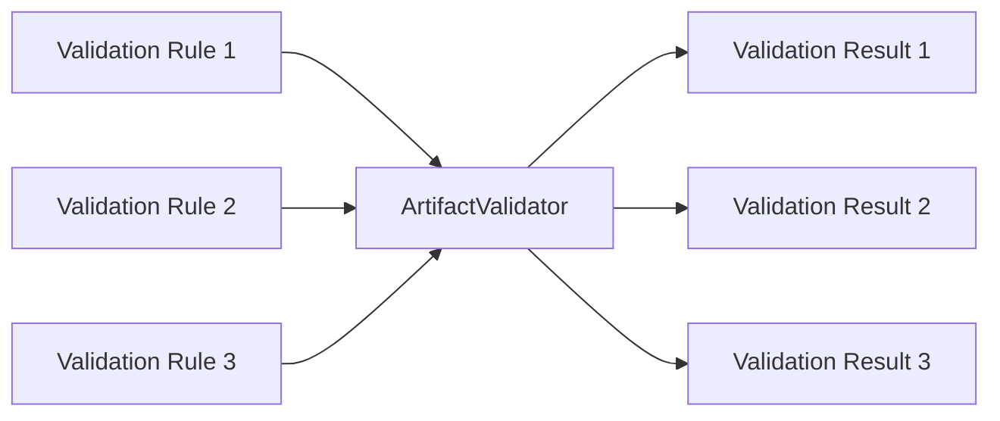

---

# 10. ArtifactValidator

v1.4.1 將 Validator 固定成一個非常單純的 component：

```python
class ArtifactValidator:

    def validate(
        self,
        artifact_dir: Path,
        rule: ArtifactValidationRule,
    ) -> ArtifactValidationResult:
        ...
```

輸入：

```text
artifact_dir
+
ArtifactValidationRule
```

輸出：

```text
ArtifactValidationResult
```

Validator 不應接收：

```text
RunnerConfig
DeviceTestCase
LifecycleConfig
StepResult
ExecutionSummary
```

原因是這些資料與 Artifact Validation 本身沒有直接關係。

---

# 11. Validator 的 Pure-ish Design

ArtifactValidator 雖然必須讀 File System，因此不是完全 Pure Function。

但它應盡量接近：

```text
Rule + File State
        ↓
Validation Result
```

而不要：

```text
修改 Runner
修改 Artifact
更新 Summary
寫 report
執行 command
```

也就是：

```text
Observe
Evaluate
Return
```

而不是：

```text
Observe
Mutate
Control
```

---

# 12. Validation Pipeline

單一 Rule 的完整流程：

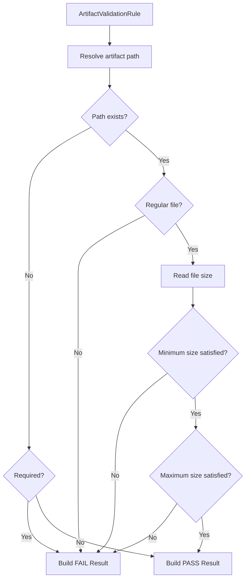

---

# 13. Validation Ordering

Rule 的判定順序建議固定：

```text
1. Resolve Path
2. Exists
3. Required / Optional
4. Is File
5. Size
6. Other Simple Validation
7. Result
```

原因是後面的 Validation 依賴前面的條件。

例如：

```text
檔案不存在
```

就不需要繼續：

```text
get size
```

---

# 14. Required Artifact

例如：

```yaml
- path: power.csv
  required: true
```

不存在：

```text
FAIL
```

結果：

```python
ArtifactValidationResult(
    path="power.csv",
    success=False,
    exists=False,
    size_bytes=None,
    error="Required artifact does not exist: power.csv",
)
```

---

# 15. Optional Artifact

例如：

```yaml
- path: crash_dump.txt
  required: false
```

如果：

```text
crash_dump.txt
不存在
```

這不是 Test Failure。

v1.4.1 可以視為：

```python
ArtifactValidationResult(
    path="crash_dump.txt",
    success=True,
    exists=False,
    size_bytes=None,
    error=None,
)
```

目前仍然維持：

```text
PASS / FAIL
```

兩態模型即可。

如果未來真的需要：

```text
SKIPPED
OPTIONAL_MISSING
```

再擴充 status Enum。

---

# 16. Minimum Size

例如：

```yaml
min_size_bytes: 1024
```

代表：

```text
size >= 1024
```

才算有效。

```text
power.csv
size = 2048
→ PASS
```

```text
power.csv
size = 128
→ FAIL
```

---

# 17. Maximum Size

例如：

```yaml
max_size_bytes: 524288000
```

即：

```text
500 MB
```

過大的 Artifact 可能代表：

* recorder 沒停止
* infinite logging
* process runaway
* wrong file
* debug logging accidentally enabled

因此：

```text
min size
```

檢測 Artifact 太小，

```text
max size
```

則可以檢測 Artifact 異常膨脹。

---

# 18. Rule Validation

v1.4.1 也應該驗證 Rule 本身是否合法。

例如：

```yaml
min_size_bytes: -1
```

應視為 Configuration Error。

或者：

```yaml
min_size_bytes: 5000
max_size_bytes: 1000
```

也是無效設定。

因此 ConfigLoader 或 Rule Validator 可以保證：

```text
min_size >= 0
max_size >= 0
min_size <= max_size
```

這是：

```text
Validate the validator configuration.
```

不要等到 Test Run 結束後才發現 Rule 本身不合理。

---

# 19. Configuration Validation vs Artifact Validation

這是兩件不同的事情。

## Configuration Validation

```text
Rule 本身是否合法？
```

例如：

```text
min_size = -1
```

---

## Artifact Validation

```text
實際 Artifact 是否符合 Rule？
```

例如：

```text
min_size = 1024
actual = 128
```

因此：

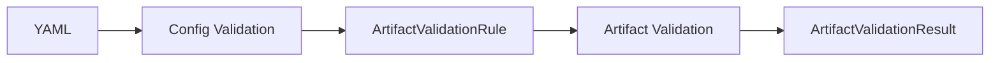

---

# 20. ValidationSummary

v1.4.1 建議正式引入：

```python
@dataclass(frozen=True)
class ValidationSummary:
    configured_validations: int
    passed_validations: int
    failed_validations: int
```

例如：

```text
Configured Validations: 3
Passed Validations:     2
Failed Validations:     1
```

---

# 21. ValidationSummary Invariant

應永遠成立：

```text
configured_validations
=
passed_validations
+
failed_validations
```

例如：

```python
assert (
    summary.configured_validations
    == summary.passed_validations
    + summary.failed_validations
)
```

這與 ExecutionSummary：

```text
configured_steps
=
passed_steps
+
failed_steps
+
skipped_steps
```

形成對稱。

---

# 22. ExecutionSummary 不應再承擔 Final Status

v1.3：

```python
ExecutionSummary.status
```

還可以近似代表：

```text
Run Status
```

因為只有 Execution Result。

到了 v1.4：

```text
Execution PASS
Validation FAIL
```

也是：

```text
Run FAILED
```

因此：

```text
ExecutionSummary.status
```

已經不適合作為最終 Run Status。

---

# 23. Run-level Status

v1.4.1 建議將最終 status 上移到：

```python
RunResult
```

例如：

```python
@dataclass(frozen=True)
class RunResult:
    status: str
    metadata: RunMetadata
    execution_summary: ExecutionSummary
    validation_summary: ValidationSummary
    step_results: List[StepResult]
    validation_results: List[ArtifactValidationResult]
    artifact_dir: str | None = None

    @property
    def passed(self) -> bool:
        return self.status == "PASSED"
```

這形成：

```text
StepResult.success
        ↓
Step-level status

ExecutionSummary
        ↓
Execution-level status / statistics

ArtifactValidationResult.success
        ↓
Artifact-level status

ValidationSummary
        ↓
Validation-level statistics

RunResult.status
        ↓
Run-level status
```

---

# 24. Single Source of Truth

v1.4.1 很重要的一個 cleanup 是：

> 每一層都只保留一個主要狀態來源。

推薦：

```text
Step:
StepResult.success

Artifact:
ArtifactValidationResult.success

Run:
RunResult.status
```

避免：

```text
success
passed
status
exit_code
```

全部分別計算同一件事。

---

# 25. StepResult.passed

目前：

```python
@property
def passed(self) -> bool:
    return self.exit_code == 0
```

v1.4.1 可以逐步調整成：

```python
@property
def passed(self) -> bool:
    return self.success
```

原因是：

```text
exit_code == 0
```

只是成功的其中一種判斷來源。

Timeout：

```python
exit_code = None
success = False
```

Executor Error：

```python
exit_code = None
success = False
```

未來 Retry exhausted：

```text
也可能需要 success=False
```

因此 `success` 比 exit_code 更適合當 Step-level truth。

---

# 26. Run Status Aggregator

v1.4.1 可以把 final status aggregation 抽成單一方法：

```python
def determine_run_status(
    execution_summary: ExecutionSummary,
    validation_summary: ValidationSummary,
) -> str:

    execution_passed = (
        execution_summary.failed_steps == 0
        and execution_summary.executed_steps > 0
    )

    validation_passed = (
        validation_summary.failed_validations == 0
    )

    if execution_passed and validation_passed:
        return "PASSED"

    return "FAILED"
```

或一個 Component：

```text
RunStatusAggregator
```

v1.4.1 不一定需要正式建立 class。

private function 已經足夠。

---

# 27. Final Status Truth Table

| Execution | Validation | RunResult.status |
| --------- | ---------- | ---------------- |
| PASS      | PASS       | PASSED           |
| PASS      | FAIL       | FAILED           |
| FAIL      | PASS       | FAILED           |
| FAIL      | FAIL       | FAILED           |

也就是：

```text
PASS
=
Execution PASS
AND
Validation PASS
```

這是 v1.4.x 最重要的 Run invariant。

---

# 28. Empty Validation Rules

如果：

```yaml
artifact:
  output_dir: artifact/output
```

沒有：

```yaml
validations:
```

則：

```text
configured_validations = 0
passed_validations = 0
failed_validations = 0
```

Validation 應視為：

```text
沒有 Validation Failure
```

因此：

```text
validation_passed = True
```

不要因為：

```text
configured_validations == 0
```

就讓 Run Failure。

這與 Execution 不同。

Execution：

```text
0 executed steps
```

通常是異常。

Validation：

```text
0 configured rules
```

可以是合法設定。

---

# 29. Execution 與 Validation 的 Empty Semantics

這是值得明確定義的差異：

```text
Execution
0 Steps Executed
→ 通常 FAILED / invalid run
```

但：

```text
Validation
0 Rules Configured
→ VALID / nothing to validate
```

因此兩個 Summary 不應共用完全相同的 aggregation function。

---

# 30. Runner 高階流程

v1.4.1 的 Runner 可以非常清楚：

```python
def run(self, config: RunnerConfig) -> RunResult:

    started_at = self.clock.now()

    artifact_dir = self._prepare_artifacts(config)

    step_results = self._execute_lifecycle(
        config=config,
        artifact_dir=artifact_dir,
    )

    validation_results = self._validate_artifacts(
        config=config,
        artifact_dir=artifact_dir,
    )

    finished_at = self.clock.now()

    execution_summary = self._build_execution_summary(
        config=config,
        step_results=step_results,
        started_at=started_at,
        finished_at=finished_at,
    )

    validation_summary = self._build_validation_summary(
        rules=config.artifact.validations,
        results=validation_results,
    )

    status = self._determine_run_status(
        execution_summary,
        validation_summary,
    )

    metadata = self._build_metadata(
        config,
        started_at,
        finished_at,
    )

    result = RunResult(
        status=status,
        metadata=metadata,
        execution_summary=execution_summary,
        validation_summary=validation_summary,
        step_results=step_results,
        validation_results=validation_results,
        artifact_dir=str(artifact_dir),
    )

    self.reporter.write(result)

    return result
```

這個 `run()` 已經可以當成整個 DTR Architecture 的高階文件。

---

# 31. Runner Pipeline

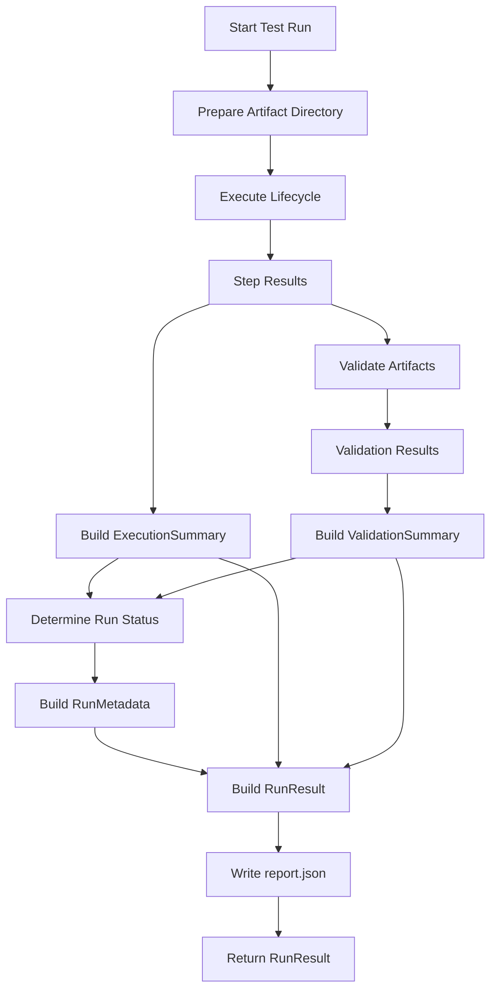

---

# 32. Validation 執行時機

v1.4.1 仍保持：

```text
global_setup
↓
setup
↓
scenario
↓
teardown
↓
global_teardown
↓
Artifact Validation
↓
Aggregation
↓
Report
```

原因是 Artifact 可能在：

```text
teardown
```

或：

```text
global_teardown
```

才真正完成。

例如：

```text
Recorder stop
→ flush file
→ close file
```

如果在 scenario 後立即 Validate：

```text
file size = 0
```

可能只是 Artifact 還沒有 flush。

---

# 33. Execution Failure 仍然 Validate

即使：

```text
scenario FAILED
```

仍建議跑：

```text
Artifact Validation
```

例如：

```text
scenario FAILED

device.log       exists
power.csv        partial
crash_dump       exists
```

Validation 可以提供更多 Debug context。

所以流程不是：

```text
Execution Failed
→ Skip Validation
```

而是：

```text
Execution Failed
→ Cleanup
→ Validate whatever artifacts exist
→ Build final result
```

---

# 34. ArtifactManager 與 ArtifactValidator

這兩個 Component 必須保持分離。

## ArtifactManager

回答：

```text
Artifact 放在哪裡？
怎麼建立目錄？
怎麼寫 log？
```

---

## ArtifactValidator

回答：

```text
Artifact 是否符合要求？
```

圖：

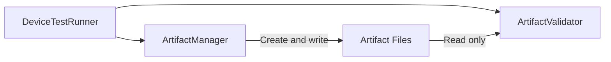

---

# 35. Validator 應該 Read-only

Validator 不應：

```text
修補 Artifact
建立缺少的檔案
刪掉無效 Artifact
重新執行 Script
修改 File Content
```

Validator 只做：

```text
Read
Check
Return Result
```

這讓 Validation 保持 deterministic。

---

# 36. Artifact Path Resolution

ValidationRule：

```yaml
path: power.csv
```

應該相對於：

```text
artifact_dir
```

解析。

例如：

```text
artifact_dir
=
artifact/sample/power_001_20260811_210000
```

則：

```text
power.csv
```

代表：

```text
artifact/sample/power_001_20260811_210000/power.csv
```

而不是：

```text
Repo Root/power.csv
```

這可以避免 Working Directory 問題。

---

# 37. Path Resolution Function

可以集中：

```python
def resolve_artifact_path(
    artifact_dir: Path,
    relative_path: str,
) -> Path:
    return artifact_dir / relative_path
```

不要讓：

```text
Runner
Validator
Reporter
Tests
```

各自重新組 path。

Path Rule 應該只有一份。

---

# 38. report.json

v1.4.1 建議正式改成：

```json
{
  "status": "PASSED",

  "metadata": {},

  "execution_summary": {},

  "validation_summary": {},

  "step_results": [],

  "validation_results": [],

  "artifact_dir": "..."
}
```

---

# 39. report.json 範例

```json
{
  "status": "FAILED",

  "metadata": {
    "test_case_id": "power_001",
    "test_case_name": "Youtube Playback Power Test",
    "test_case_description": "Measure power behavior during Youtube playback",
    "device_serial": "emulator-5566",
    "device_product": "pixel",
    "device_build": "test_build",
    "runner_version": "1.4.1",
    "started_at": "2026-08-11T21:00:00+08:00",
    "finished_at": "2026-08-11T21:05:30+08:00"
  },

  "execution_summary": {
    "configured_steps": 5,
    "executed_steps": 5,
    "passed_steps": 5,
    "failed_steps": 0,
    "skipped_steps": 0,
    "duration_seconds": 330.0
  },

  "validation_summary": {
    "configured_validations": 3,
    "passed_validations": 2,
    "failed_validations": 1
  },

  "step_results": [
    {
      "stage": "scenario",
      "name": "run_scenario",
      "success": true,
      "exit_code": 0,
      "duration_seconds": 300.0
    }
  ],

  "validation_results": [
    {
      "path": "power.csv",
      "success": false,
      "exists": true,
      "size_bytes": 128,
      "error": "Artifact size below minimum: expected >= 1024 bytes, actual=128 bytes"
    },
    {
      "path": "device.log",
      "success": true,
      "exists": true,
      "size_bytes": 12580,
      "error": null
    },
    {
      "path": "crash_dump.txt",
      "success": true,
      "exists": false,
      "size_bytes": null,
      "error": null
    }
  ],

  "artifact_dir": "artifact/sample_device_config/power_001_20260811_210000"
}
```

這個例子特別重要：

```text
Execution:
5 / 5 PASSED

Validation:
2 PASSED
1 FAILED

Final:
FAILED
```

---

# 40. 為什麼 Run Status 要放最上層

如果使用者打開 report.json，最想先知道的是：

```text
這次 Run 成功還是失敗？
```

所以：

```json
"status": "FAILED"
```

應該在 top-level。

接下來再追：

```text
Execution Failed?
Artifact Failed?
```

這比從 Summary 自己推理最後狀態容易很多。

---

# 41. Result Domain

v1.4.1 的 Result Domain 可以整理成：

```text
RunResult
├── status
├── RunMetadata
│
├── ExecutionSummary
├── ValidationSummary
│
├── StepResult[]
├── ArtifactValidationResult[]
│
└── artifact_dir
```

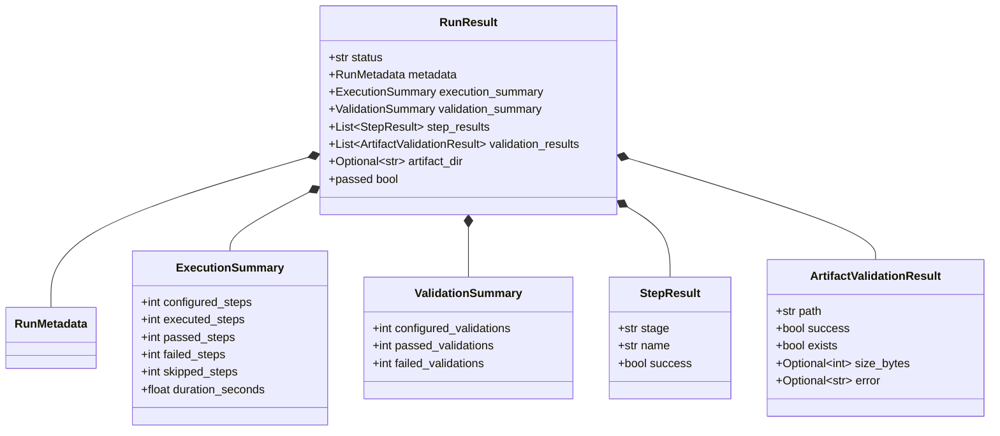

---

# 42. Execution / Validation 對稱架構

到了 v1.4.1，兩條 Pipeline 已經很對稱。

```text
Execution Configuration
LifecycleStepContent
        ↓
CommandStepExecutor
        ↓
StepResult
        ↓
ExecutionSummary
```

以及：

```text
Validation Configuration
ArtifactValidationRule
        ↓
ArtifactValidator
        ↓
ArtifactValidationResult
        ↓
ValidationSummary
```

最後：

```text
ExecutionSummary
+
ValidationSummary
        ↓
RunResult.status
```

---

# 43. 對稱架構圖

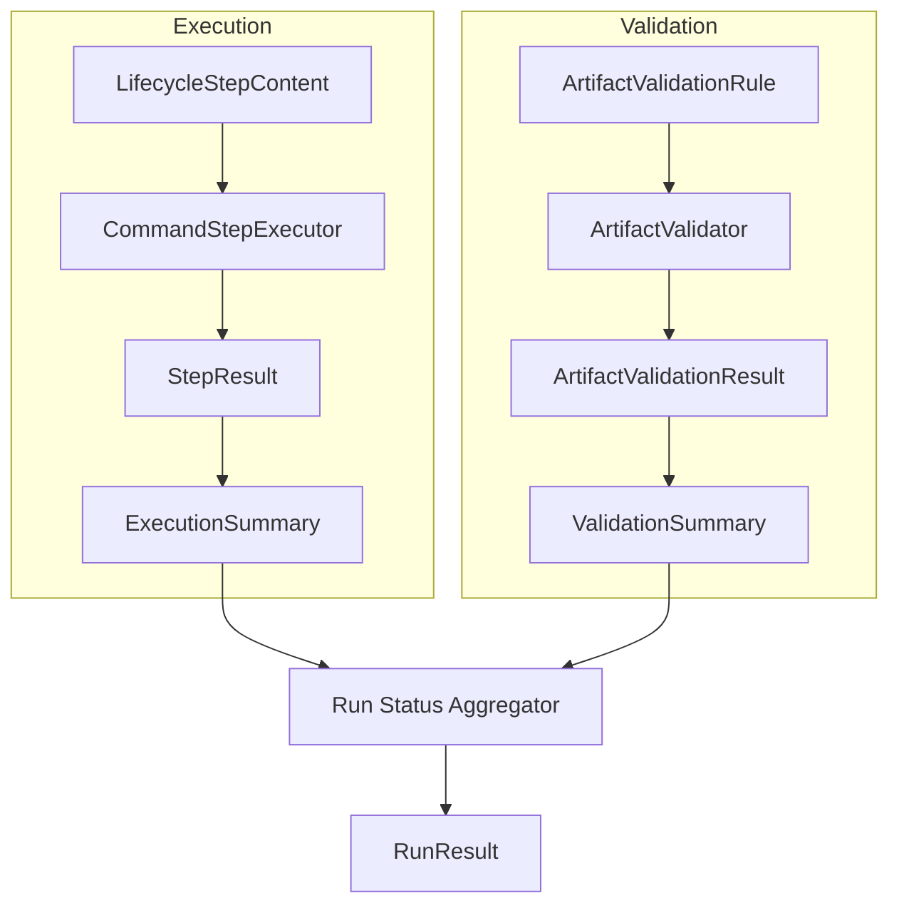

這是 v1.4.1 最值得保留的架構。

---

# 44. Parser 仍然不屬於 ArtifactValidator

ArtifactValidator 檢查：

```text
power.csv exists
size > 1 KB
```

Parser 才處理：

```text
average_power = 2.1 W
peak_power = 4.3 W
```

Domain Validation 再處理：

```text
average_power < threshold
```

所以長期應保持：

```text
Artifact
    ↓
Infrastructure Validation
    ↓
Parser
    ↓
Domain Validation
```

v1.4.1 仍只做到：

```text
Infrastructure Validation
```

---

# 45. Validation Rule 不應知道 Parser

同樣不要寫：

```yaml
validation:
  python_function: parse_power_result
```

在 v1.4.1 先保持：

```text
exists
required
min_size
max_size
```

這些是 generic filesystem-level rule。

如此 `ArtifactValidator` 才能保持：

```text
Domain Agnostic
```

---

# 46. Unit Test Strategy

v1.4.1 的測試可以分成：

```text
Rule Configuration
Validator
Validation Summary
Status Aggregator
Runner Integration
Full Integration
```

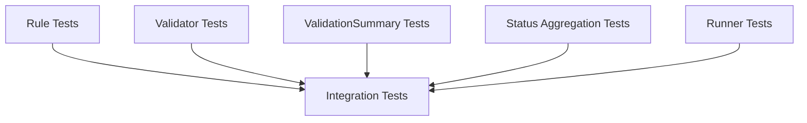

---

# 47. Rule Tests

至少應測：

```text
required default = True
min_size default = None
max_size default = None
```

以及 invalid configuration：

```text
min_size < 0
max_size < 0
min_size > max_size
```

如果 ConfigLoader 負責 Validation，就測 ConfigLoader。

如果 Rule 有：

```python
__post_init__()
```

就測 Model。

---

# 48. Validator Tests

使用：

```python
tmp_path
```

比 Mock File System 更適合。

必測：

```text
required + exists
required + missing
optional + exists
optional + missing

empty file

size == min
size < min
size > min

size == max
size > max

min + max together
```

---

# 49. Optional Missing Test

例如：

```python
def test_optional_missing_artifact_passes(tmp_path):
    rule = ArtifactValidationRule(
        path="crash_dump.txt",
        required=False,
    )

    result = validator.validate(
        artifact_dir=tmp_path,
        rule=rule,
    )

    assert result.success is True
    assert result.exists is False
    assert result.size_bytes is None
```

這個測試很重要，因為 optional semantics 很容易被寫錯。

---

# 50. Boundary Size Tests

例如：

```text
min_size = 10
actual = 10

PASS
```

以及：

```text
max_size = 100
actual = 100

PASS
```

通常 minimum / maximum 應理解為 inclusive：

```text
size >= min
size <= max
```

要透過 Test 固定語意。

---

# 51. Validation Summary Tests

例如：

```python
results = [
    ArtifactValidationResult(success=True, ...),
    ArtifactValidationResult(success=True, ...),
    ArtifactValidationResult(success=False, ...),
]
```

Expected：

```text
configured = 3
passed = 2
failed = 1
```

並驗證：

```python
assert (
    configured
    == passed + failed
)
```

---

# 52. Run Status Tests

最重要的四個 case：

```python
@pytest.mark.parametrize(
    (
        "execution_passed",
        "validation_passed",
        "expected",
    ),
    [
        (True, True, "PASSED"),
        (True, False, "FAILED"),
        (False, True, "FAILED"),
        (False, False, "FAILED"),
    ],
)
```

這個 truth table 應成為 DTR 的核心 invariant。

---

# 53. No Validation Rules Test

也要特別測：

```text
Execution PASS
0 Validation Rules
```

Expected：

```text
PASSED
```

不能因為：

```text
configured_validations == 0
```

而誤判 Failure。

---

# 54. Runner Tests

Runner Test 不需要真的碰所有檔案。

可以使用：

```text
FakeExecutor
FakeArtifactValidator
FakeReporter
```

驗證流程：

```text
Lifecycle 執行
↓
Validator 執行
↓
Summary 建立
↓
Status Aggregation
↓
Reporter
```

特別驗證：

```text
Validation 一定發生在 Lifecycle cleanup 完成之後
```

---

# 55. Integration Test：Execution PASS / Validation FAIL

這是 v1.4.1 最有代表性的測試。

Script：

```bash
#!/bin/bash

touch "$ARTIFACT_DIR/power.csv"

exit 0
```

Rule：

```yaml
- path: power.csv
  required: true
  min_size_bytes: 1024
```

Expected：

```text
Process Exit Code = 0
Execution = PASS

power.csv exists
size = 0
Validation = FAIL

RunResult.status = FAILED
```

這直接證明：

```text
Process Success != Run Success
```

---

# 56. Integration Test：Execution FAIL / Artifact Exists

另一個很有價值的案例：

```bash
#!/bin/bash

echo "partial data" > "$ARTIFACT_DIR/debug.log"

exit 1
```

Expected：

```text
Execution FAIL
Artifact Validation PASS
Final FAILED
```

但 report 中仍然可以知道：

```text
debug.log 是有效的 Debug Artifact
```

這對失敗分析非常實用。

---

# 57. Reporter Tests

JsonReporter 應驗證：

```text
status
metadata
execution_summary
validation_summary
step_results
validation_results
artifact_dir
```

特別確認：

```json
"status": "FAILED"
```

與：

```json
"execution_summary": {
    "failed_steps": 0
}
```

可以同時存在。

因為 Failure 可能來自 Artifact Validation。

---

# 58. Component Diagram

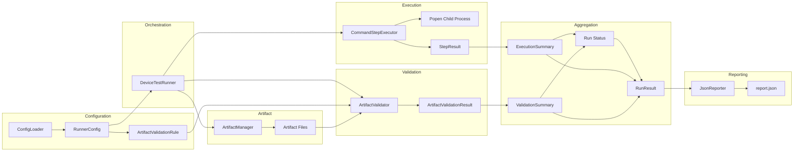

---

# 59. Dependency Direction

推薦：

```text
models.py
↑
executor.py
artifact.py
validator.py
reporter.py
↑
runner.py
```

也就是：

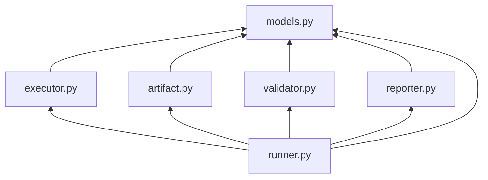

Runner 可以依賴這些 Component。

但：

```text
Validator
```

不應反過來依賴：

```text
DeviceTestRunner
```

---

# 60. 建議目錄結構

```text
device-test-runner/
├── runner/
│   ├── __init__.py
│   ├── artifact.py
│   ├── config_loader.py
│   ├── executor.py
│   ├── models.py
│   ├── reporter.py
│   ├── runner.py
│   └── validator.py
│
├── configs/
│   └── sample_device_config.yaml
│
├── scripts/
│   ├── setup_device.sh
│   ├── run_scenario.sh
│   └── teardown_scenario.sh
│
├── artifact/
│   └── sample_device_config/
│
├── tests/
│   ├── test_artifact.py
│   ├── test_config_loader.py
│   ├── test_executor.py
│   ├── test_models.py
│   ├── test_reporter.py
│   ├── test_runner.py
│   ├── test_validator.py
│   └── test_integration.py
│
└── docs/
    ├── architecture_v1.0.md
    ├── architecture_v1.1.md
    ├── architecture_v1.2.md
    ├── architecture_v1.3.md
    ├── architecture_v1.3.5.md
    ├── architecture_v1.4.0.md
    └── architecture_v1.4.1.md
```

---

# 61. v1.4.0 與 v1.4.1 比較

| 架構項目                | v1.4.0                | v1.4.1                         |
| ------------------- | --------------------- | ------------------------------ |
| Artifact Validation | 引入                    | 收斂                             |
| ValidationRule      | 有                     | 固定責任                           |
| ArtifactValidator   | 有                     | 明確 read-only boundary          |
| ValidationResult    | 有                     | 正式成為 Result Domain             |
| ValidationSummary   | 建議                    | 正式化                            |
| ExecutionSummary    | 可能同時代表 Run            | 限制為 Execution                  |
| Final Status        | Aggregation 概念        | 上移到 `RunResult.status`         |
| `passed`            | 可能重複計算                | 從 Run status 派生                |
| Empty validation    | 未明確                   | 明確視為合法                         |
| Rule validation     | 基本                    | 加入 configuration invariant     |
| Path resolution     | 基本                    | 集中定義                           |
| Validator mutation  | 未特別限定                 | read-only                      |
| Testing             | Validator 為主          | 加入 boundary / status invariant |
| 架構定位                | Artifact-aware Runner | Stable Validation Pipeline     |

---

# 62. Version Evolution

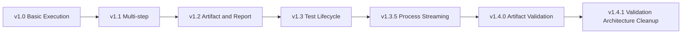

對應的核心問題：

```text
v1.0
How do I execute a test?

v1.1
How do I execute multiple steps?

v1.2
How do I persist the result?

v1.3
How do I manage test lifecycle?

v1.3.5
How do I manage a running process?

v1.4.0
How do I know the produced artifacts are valid?

v1.4.1
How do I make execution and validation results consistent?
```

---

# 63. v1.4.1 的架構價值

v1.4.0 最大的功能突破是：

```text
Runner 不再只相信 exit code。
```

v1.4.1 的最大架構突破則是：

```text
Runner 開始有清楚的 Result Model hierarchy。
```

也就是：

```text
StepResult
        ↓
ExecutionSummary

ArtifactValidationResult
        ↓
ValidationSummary

ExecutionSummary
+
ValidationSummary
        ↓
RunResult.status
```

每一層負責自己的 truth。

---

# 64. Result Hierarchy

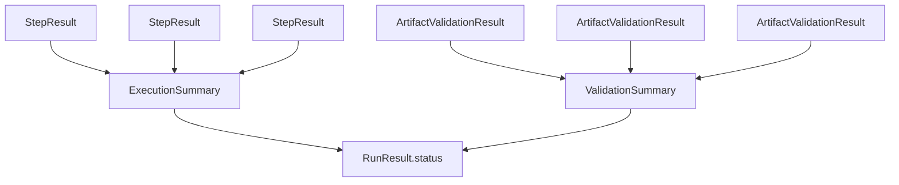

這個結構之後非常容易再加入：

```text
RetrySummary
TimeoutSummary
RecorderSummary
```

而不用把所有狀態塞進 `StepResult`。

---

# 65. 為 v1.5 Retry 預留的邊界

v1.4.1 不需要實作 Retry。

但是現在的架構已經開始適合接：

```text
LifecycleStepContent
        ↓
Retry Policy
        ↓
Attempt 1
Attempt 2
Attempt 3
        ↓
StepResult
```

重要的是：

```text
ArtifactValidator
```

不需要因此改變。

也就是：

```text
Retry
```

屬於 Execution Pipeline；

```text
Artifact Validation
```

仍然是 Post-execution Pipeline。

這表示 v1.4.1 的 Boundary 是穩定的。

---

# 66. Architecture Summary

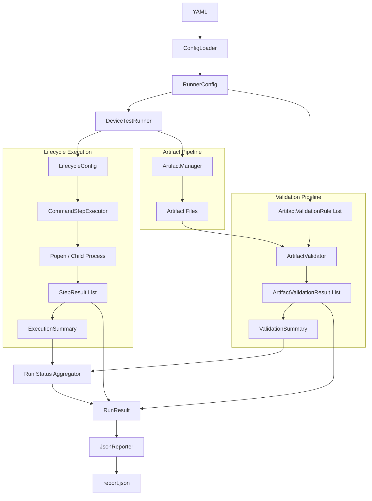

---

# 67. v1.4.1 核心摘要

Device Test Runner v1.4.1 可以濃縮成：

> v1.4.1 將 v1.4.0 引入的 Artifact Validation 正式整理成獨立的 Validation Pipeline。`ArtifactValidationRule` 描述 Artifact 預期條件，`ArtifactValidator` 以 read-only 方式檢查實際 Artifact，產生 `ArtifactValidationResult`，再由 `ValidationSummary` 聚合 Validation 狀態。Execution 與 Validation 不互相污染，而是分別產生 `ExecutionSummary` 與 `ValidationSummary`，最後統一由 Run-level Aggregation 決定 `RunResult.status`。

最重要的架構關係是：

```text
LifecycleStepContent
        ↓
CommandStepExecutor
        ↓
StepResult
        ↓
ExecutionSummary
              \
               \
                → RunResult.status
               /
              /
ArtifactValidationRule
        ↓
ArtifactValidator
        ↓
ArtifactValidationResult
        ↓
ValidationSummary
```

v1.4.0 是：

```text
「加入 Artifact Validation」
```

v1.4.1 則是：

```text
「讓 Artifact Validation 真正成為穩定的架構層」
```

這也讓 Device Test Runner 為下一階段的 Retry Policy、Timeout/Cancellation、Recorder Lifecycle 等 execution policy 功能留下乾淨的擴充位置。
