# Device Test Runner Architecture v1.5.0

## 1. 版本定位

Device Test Runner v1.5.0 延續目前已建立的架構：

```text
v1.3
Test Lifecycle

v1.3.5
Process Lifecycle + Streaming Log

v1.4.x
Artifact Validation + Run Status Aggregation

v1.5.0
Retry Policy
```

v1.4.1 已經可以回答：

```text
Step 有沒有成功？
Artifact 有沒有成功？
整個 Run 有沒有成功？
```

v1.5.0 開始回答另一個問題：

> Step 執行失敗時，是不是應該立刻判定失敗，還是可以重新嘗試？

過去：

```text
Execute Step
    ↓
FAILED
    ↓
Stop / Cleanup
```

v1.5.0：

```text
Execute Step
    ↓
FAILED
    ↓
RetryPolicy
    ↓
Retry?
 ┌──┴──┐
YES    NO
 ↓      ↓
再次執行 Final Failure
```

因此 v1.5.0 可以定位為：

> **Policy-aware Execution Engine**

---

# 2. v1.5.0 的核心問題

Device Test / Hardware Validation 很容易遇到 transient failure。

例如：

```text
adb temporarily unavailable
device reconnecting
network timeout
temporary service unavailable
recorder startup race condition
shell command temporary failure
```

如果一遇到：

```text
exit_code != 0
```

就立刻：

```text
FAILED
```

會造成：

```text
Transient Failure
        ↓
False Test Failure
        ↓
人工重新執行
        ↓
浪費 Lab / Engineer 時間
```

Retry 的目的不是：

> 讓失敗的測試硬變成成功。

而是：

> 對具有暫時性的失敗，允許有限且受控制的重新執行。

---

# 3. Retry 不是 while True

最危險的實作是：

```python
while not success:
    execute()
```

這會產生：

```text
無限執行
資源無法釋放
Lab machine 被佔住
Artifact 不斷產生
錯誤被掩蓋
```

v1.5.0 的 Retry 必須是：

```text
Policy Controlled
Bounded
Observable
Reportable
```

因此需要：

```text
RetryPolicy
Attempt
Retry Decision
Final StepResult
```

---

# 4. v1.5.0 高階架構

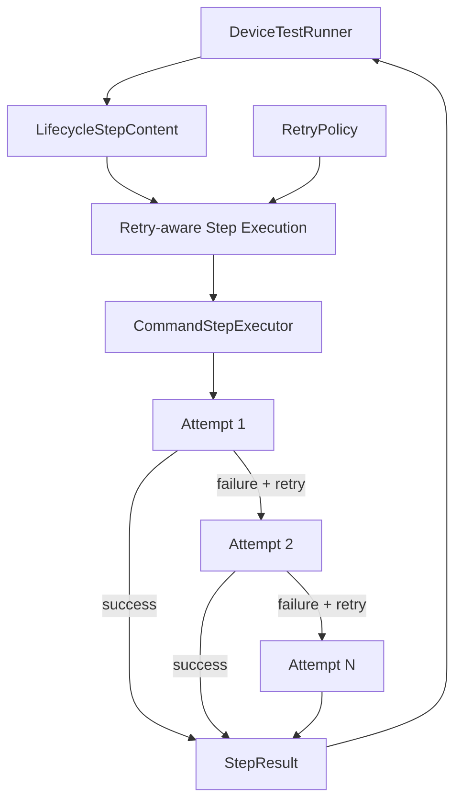

這裡最重要的是：

```text
CommandStepExecutor
```

仍然只負責：

> 執行一次 Command。

而：

```text
Retry Policy
```

負責：

> 要不要再執行一次。

不要把 Retry loop 塞進最底層 subprocess code。

---

# 5. Execution Layer 的兩個層次

v1.5.0 之後，Execution Layer 可以拆成：

```text
Retry Execution
       ↓
Single Attempt Execution
```

也就是：

```text
Retry-aware Executor / Runner
        ↓
CommandStepExecutor
        ↓
subprocess.Popen
```

概念：

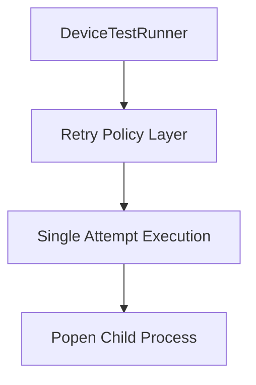

這樣可以保持 v1.3.5 已經建立好的 Popen Executor 不被破壞。

---

# 6. Single Responsibility

## DeviceTestRunner

負責：

```text
Lifecycle orchestration
Stage policy
Execution summary
Artifact validation
Final aggregation
```

## Retry Policy

負責：

```text
最多可以執行幾次？
哪些錯誤可以 retry？
Retry 間隔多久？
目前是否還可以 retry？
```

## CommandStepExecutor

負責：

```text
執行一次 command
Popen
stdout / stderr
timeout
process cleanup
```

也就是：

```text
Runner
=
When to execute

RetryPolicy
=
Whether to execute again

CommandStepExecutor
=
How to execute once
```

---

# 7. 建議新增 RetryPolicy Model

v1.5.0 可以先使用簡單 Policy：

```python
@dataclass(frozen=True)
class RetryPolicy:
    max_attempts: int = 1
    delay_seconds: float = 0
```

例如：

```python
RetryPolicy(
    max_attempts=3,
    delay_seconds=5,
)
```

意思是：

```text
最多執行 3 次

Attempt 1
↓ failure

wait 5 sec

Attempt 2
↓ failure

wait 5 sec

Attempt 3
↓ failure

Final FAILED
```

---

# 8. `max_attempts` 而不是 `retry_count`

這個命名值得統一。

例如：

```text
retry_count = 3
```

容易產生歧義：

```text
總共執行 3 次？
還是
初始一次 + retry 3 次 = 4 次？
```

如果使用：

```python
max_attempts = 3
```

語意明確：

```text
最多執行三次
```

也就是：

```text
Attempt #1
Attempt #2
Attempt #3
```

因此建議：

```python
max_attempts
```

而不是：

```python
retry_count
```

---

# 9. RetryPolicy 的基本 Invariant

至少應成立：

```text
max_attempts >= 1
delay_seconds >= 0
```

例如：

```python
RetryPolicy(
    max_attempts=0
)
```

應該在 Configuration Loading 時就拒絕。

因為：

```text
0 attempts
```

對 Step execution 沒有合理語意。

---

# 10. Retry 放在哪裡設定？

v1.5.0 有兩種設計。

## Global Retry

例如：

```yaml
execution:
  retry:
    max_attempts: 3
    delay_seconds: 5
```

代表所有 Step 都使用相同 Retry Policy。

---

## Step-level Retry

例如：

```yaml
scenario:
  steps:
    - name: run_youtube
      type: command
      command: ...
      timeout_second: 300

      retry:
        max_attempts: 3
        delay_seconds: 5
```

每個 Step 可以有不同 Policy。

---

# 11. v1.5.0 建議先從 Global Retry 開始

因為不同 Step 的 Retry semantic 差很多。

例如：

```text
adb get-state
```

Retry 很合理。

但：

```text
flash device
```

Retry 可能需要非常謹慎。

又例如：

```text
start recorder
```

可以 retry。

但是：

```text
payment / destructive command
```

理論上可能不具 idempotency。

因此 Retry Policy 最自然的歸屬是：

```text
LifecycleStepContent
```

---

# 12. LifecycleStepContent 的演進

v1.4：

```python
@dataclass(frozen=True)
class LifecycleStepContent:
    name: str
    type: str
    command: str
    timeout_second: int
```

v1.5：

```python
@dataclass(frozen=True)
class LifecycleStepContent:
    name: str
    type: str
    command: str
    timeout_second: int
    retry: RetryPolicy = field(
        default_factory=RetryPolicy
    )
```

其中 default：

```python
RetryPolicy(
    max_attempts=1,
    delay_seconds=0,
)
```

等同於：

```text
Retry Disabled
```

因此舊 YAML 不需要全部修改。

---

# 13. Backward Compatibility

假設舊 YAML：

```yaml
- name: setup_device
  type: command
  command: "bash setup.sh"
  timeout_second: 30
```

載入後：

```python
LifecycleStepContent(
    ...,
    retry=RetryPolicy(
        max_attempts=1,
        delay_seconds=0,
    ),
)
```

也就是：

```text
沒有 retry config
=
只執行一次
```

這是一個非常乾淨的 backward-compatible 設計。

---

# 14. YAML Example

```yaml
lifecycle:

  global_setup:
    steps:

      - name: check_device
        type: command
        command: "adb get-state"
        timeout_second: 10

        retry:
          max_attempts: 3
          delay_seconds: 2

  setup:
    steps:

      - name: setup_device
        type: command
        command: "bash scripts/setup_device.sh"
        timeout_second: 30

        retry:
          max_attempts: 2
          delay_seconds: 5

  scenario:
    steps:

      - name: run_scenario
        type: command
        command: "bash scripts/run_scenario.sh"
        timeout_second: 300

        retry:
          max_attempts: 1
          delay_seconds: 0
```

可以看到：

```text
check_device
→ retry 3 attempts

setup_device
→ retry 2 attempts

run_scenario
→ no retry
```

---

# 15. Attempt 是 v1.5.0 的新概念

以前：

```text
Step
↓
StepResult
```

現在：

```text
Step
↓
Attempt #1
↓
Attempt #2
↓
...
↓
Final StepResult
```

所以要開始區分：

```text
Attempt Result
```

和：

```text
Step Result
```

---

# 16. 建議新增 AttemptResult

概念 Model：

```python
@dataclass(frozen=True)
class AttemptResult:
    attempt: int
    success: bool
    exit_code: int | None
    duration_seconds: float
    stdout: str
    stderr: str
    error: str | None = None
```

這代表：

> 某一次真正的 process execution。

例如：

```python
AttemptResult(
    attempt=1,
    success=False,
    exit_code=1,
    duration_seconds=2.3,
    stdout="",
    stderr="device offline",
    error=None,
)
```

第二次：

```python
AttemptResult(
    attempt=2,
    success=True,
    exit_code=0,
    duration_seconds=1.2,
    stdout="device",
    stderr="",
)
```

---

# 17. StepResult 的角色變化

v1.3.x：

```text
StepResult
=
一次 Process Result
```

v1.5.0 之後：

```text
StepResult
=
一個 Step 完整執行結果
```

其中可能包含：

```text
1..N Attempts
```

這是很重要的 Domain Model 演進。

---

# 18. 建議 StepResult

概念上可以演進為：

```python
@dataclass(frozen=True)
class StepResult:
    stage: str
    name: str
    command: str

    success: bool

    attempts: List[AttemptResult]

    duration_seconds: float

    error: str | None = None

    @property
    def attempt_count(self) -> int:
        return len(self.attempts)

    @property
    def passed(self) -> bool:
        return self.success
```

但如果 v1.5.0 不想一次大改 Model，也可以保留現有欄位，再增加：

```python
attempt_count: int
```

---

# 19. Full Model vs Minimal Model

## Minimal v1.5

```python
StepResult(
    ...
    attempt_count=2
)
```

優點：

```text
改動小
```

缺點：

```text
不知道第一輪為什麼失敗
```

---

## Complete v1.5

```python
StepResult(
    attempts=[
        AttemptResult(...),
        AttemptResult(...),
    ]
)
```

優點：

```text
完整 Observability
Retry history 可追蹤
report.json 可分析 flaky failure
```

對 Device Test Runner 這種 Infra-learning side project，我會比較推薦完整版本：

```text
AttemptResult[]
```

因為 Retry 最大的學習價值之一就是：

> 不要把第一次失敗吃掉。

---

# 20. Retry 不能掩蓋失敗歷史

例如：

```text
Attempt 1
FAILED
device offline

Attempt 2
FAILED
device offline

Attempt 3
PASSED
```

最終：

```text
StepResult.success = True
```

但 Report 不應只寫：

```text
PASSED
```

應該保留：

```text
Attempts = 3

1 FAILED
2 FAILED
3 PASSED
```

因為這本身就是重要的 Reliability Signal。

---

# 21. Retry 與 Flakiness

假設一個 Step：

```text
100 Runs
```

其中：

```text
90 次 Attempt 1 成功

8 次 Attempt 2 才成功

2 次全部失敗
```

如果只看 Final Result：

```text
98% PASS
```

但實際上：

```text
First-attempt pass rate
=
90%
```

這代表系統存在：

```text
Transient Failure
Flakiness
```

因此 Attempt history 未來可以支援：

```text
Flaky Step Detection
```

這是 Retry 與 Observability 很重要的連結。

---

# 22. Retry-aware Execution Architecture

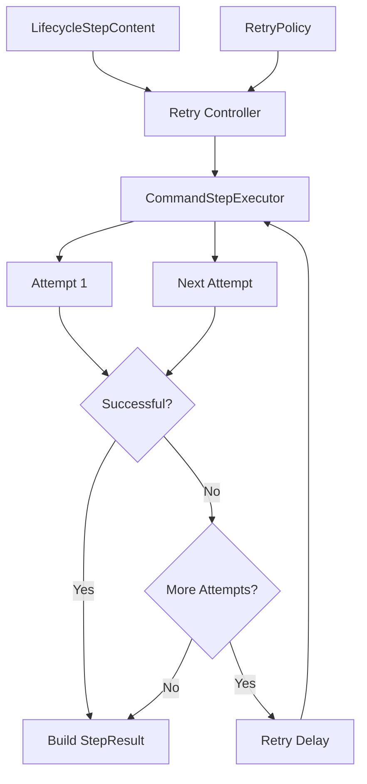

---

# 23. Retry Controller

這個 component 不一定要真的叫：

```text
RetryController
```

可以先實作成 Runner private method：

```python
_execute_step_with_retry()
```

例如：

```python
def _execute_step_with_retry(
    self,
    stage: str,
    step: LifecycleStepContent,
) -> StepResult:
    ...
```

v1.5.0 不需要為每個概念都建立 class。

只有：

```text
RetryPolicy
```

值得成為正式 Domain Model。

---

# 24. Retry Algorithm

概念：

```python
def _execute_step_with_retry(
    self,
    stage: str,
    step: LifecycleStepContent,
) -> StepResult:

    attempt_results = []

    for attempt in range(
        1,
        step.retry.max_attempts + 1,
    ):
        result = self.executor.execute(
            stage=stage,
            step=step,
            attempt=attempt,
        )

        attempt_results.append(result)

        if result.success:
            break

        if attempt < step.retry.max_attempts:
            time.sleep(
                step.retry.delay_seconds
            )

    return self._build_step_result(
        stage=stage,
        step=step,
        attempts=attempt_results,
    )
```

---

# 25. Retry Decision

最基本的 v1.5.0 判斷：

```text
Attempt Failed
AND
Attempt Number < max_attempts
=
Retry
```

也就是：

```python
should_retry = (
    not result.success
    and attempt < policy.max_attempts
)
```

這是最簡單的 RetryPolicy。

---

# 26. 所有 Failure 都 Retry 嗎？

這是 v1.5.0 很重要的設計問題。

最初可以：

```text
任何 Attempt Failure
→ retry
```

但長期不夠好。

例如：

```text
device offline
```

可能值得 retry。

但：

```text
invalid command
syntax error
configuration error
permission denied
```

通常 retry 沒有意義。

所以 Retry 最後會需要：

```text
Error Classification
```

---

# 27. Error Classification

可以將 Failure 分成：

```text
Transient Error

Permanent Error

Unknown Error
```

例如：

| Failure                         | Category     |
| ------------------------------- | ------------ |
| Device temporarily offline      | Transient    |
| Network timeout                 | Transient    |
| Service temporarily unavailable | Transient    |
| Syntax error                    | Permanent    |
| Invalid config                  | Permanent    |
| File not found                  | 通常 Permanent |
| Unknown exit code               | Unknown      |

然後：

```text
Transient
→ Retry

Permanent
→ Don't Retry

Unknown
→ Policy Decision
```

---

# 28. v1.5.0 是否需要完整 Error Classification？

不一定。

為了避免一次把版本做太大，可以分階段：

```text
v1.5.0
max_attempts + delay

v1.5.x
retryable exit codes / error categories
```

也就是 v1.5.0 先建立：

```text
Retry Framework
```

之後再豐富：

```text
Retry Decision Rules
```

這樣比較符合版本演進。

---

# 29. Retryable Exit Codes

如果要在 v1.5.0 稍微加入條件，可以：

```python
@dataclass(frozen=True)
class RetryPolicy:
    max_attempts: int = 1
    delay_seconds: float = 0
    retryable_exit_codes: tuple[int, ...] = ()
```

例如：

```yaml
retry:
  max_attempts: 3
  delay_seconds: 2
  retryable_exit_codes:
    - 1
    - 124
```

但需要定義：

```text
empty retryable_exit_codes
```

到底代表：

```text
all failures retryable
```

還是：

```text
no failures retryable
```

因此第一版其實可以先不加入，避免語意變複雜。

---

# 30. Retry Delay

最基本：

```text
Fixed Delay
```

例如：

```yaml
delay_seconds: 5
```

流程：

```text
Attempt 1 FAILED
↓
5 sec
↓
Attempt 2 FAILED
↓
5 sec
↓
Attempt 3
```

v1.5.0 不需要立即支援：

```text
Exponential Backoff
Jitter
Adaptive Retry
```

---

# 31. 未來 Backoff

長期可能：

```text
Attempt 1
↓ failure
1 sec

Attempt 2
↓ failure
2 sec

Attempt 3
↓ failure
4 sec
```

也就是：

```text
Exponential Backoff
```

在 Distributed System / API Client 中很常見。

但 Device Test Runner v1.5.0 使用：

```text
Fixed Delay
```

已經足夠。

---

# 32. Retry 與 Timeout 的關係

這兩個概念不能混在一起。

```text
Timeout
=
單一次 Attempt 最多跑多久
```

而：

```text
Retry
=
最多可以執行幾個 Attempt
```

例如：

```yaml
timeout_second: 30

retry:
  max_attempts: 3
  delay_seconds: 5
```

最差情況大約：

```text
Attempt 1: 30 sec
Delay:      5 sec

Attempt 2: 30 sec
Delay:      5 sec

Attempt 3: 30 sec
```

總計：

```text
100 sec
```

所以：

> Step Timeout 和 Total Retry Duration 是不同層次的 Timeout。

這也正好為 v1.6 Timeout / Cancellation 留下議題。

---

# 33. Timeout Failure 是否應 Retry？

從架構上：

```text
Timeout
```

只是其中一種：

```text
Attempt Failure
```

所以完全可以交給 RetryPolicy 決定。

例如：

```text
Attempt #1 TIMEOUT
↓
Retry allowed
↓
Attempt #2
```

但要注意：

> 第一次 Attempt 的 Process 必須真正清理乾淨，才能開始下一次。

否則可能出現：

```text
Old Recorder Process
+
New Recorder Process
```

這會導致污染。

這也是 v1.5 與 v1.6/v1.7 之間的重要連結。

---

# 34. Retry 必須在 Process Cleanup 後

正確：

```text
Attempt Failed
↓
Process terminated
↓
stdout/stderr threads joined
↓
Artifact finalized
↓
AttemptResult created
↓
Retry delay
↓
Next Attempt
```

錯誤：

```text
Timeout
↓
立即再 Popen
↓
前一個 Process 還活著
```

因此：

> `CommandStepExecutor.execute()` 必須保證單次 Attempt 已完全結束，才把 Result 回傳給 Retry Layer。

---

# 35. Retry 與 Lifecycle 的關係

Retry 發生在：

```text
單一 Lifecycle Step 內部
```

不是：

```text
整個 Lifecycle 重新開始
```

例如：

```text
setup
  ├── Step A
  └── Step B
          ├── Attempt 1 FAILED
          └── Attempt 2 PASSED

scenario
...
```

也就是：

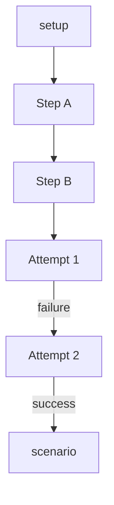

Step B 最終成功後：

```text
setup stage 可以繼續。
```

---

# 36. Retry Exhausted

如果：

```text
Attempt 1 FAILED
Attempt 2 FAILED
Attempt 3 FAILED
```

則：

```text
Retry Exhausted
```

最終：

```python
StepResult.success = False
```

然後交還 Lifecycle policy。

例如 Scenario Step retry exhausted：

```text
Step FAILED
↓
stop remaining scenario steps
↓
teardown
↓
global_teardown
```

Retry 不改變 Lifecycle failure policy。

它只是延後：

```text
Step 最終成功 / 失敗
```

的判定。

---

# 37. Retry 成功

例如：

```text
Attempt 1 FAILED
Attempt 2 PASSED
```

最終：

```text
StepResult.success = True
```

Lifecycle 可以繼續。

但：

```text
attempt_count = 2
```

應保留下來。

未來可以將這種 Step 標記成：

```text
FLAKY
```

但 v1.5.0 不需要立即增加第三種 Step Status。

---

# 38. Artifact Log 與 Retry

Retry 後會有多份 stdout / stderr。

不能全部寫到：

```text
scenario/run_scenario_stdout.log
```

否則無法區分 Attempt。

建議：

```text
artifact/
└── run_xxx/
    └── scenario/
        └── run_scenario/
            ├── attempt_1/
            │   ├── stdout.log
            │   └── stderr.log
            │
            ├── attempt_2/
            │   ├── stdout.log
            │   └── stderr.log
            │
            └── attempt_3/
                ├── stdout.log
                └── stderr.log
```

這是 v1.5.0 Artifact Structure 很值得做的改進。

---

# 39. Attempt-aware Artifact

以前：

```text
Stage
↓
Step
↓
stdout/stderr
```

現在：

```text
Stage
↓
Step
↓
Attempt
↓
stdout/stderr
```

即：

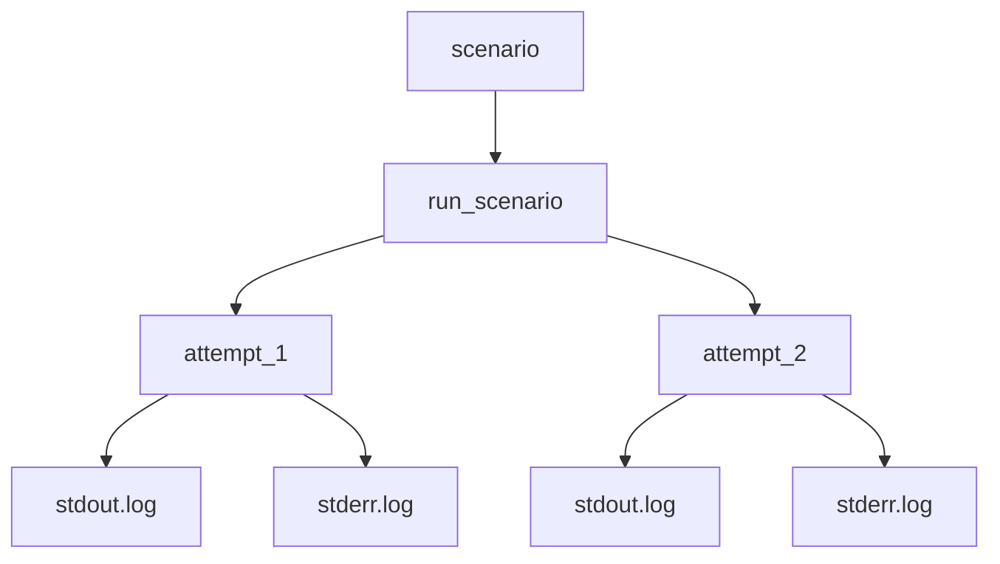

---

# 40. StepLogWriter 的演進

v1.3.5：

```python
create_step_log_writer(
    stage,
    step_name,
)
```

v1.5.0：

```python
create_step_log_writer(
    stage,
    step_name,
    attempt,
)
```

例如：

```python
log_writer = artifact_manager.create_step_log_writer(
    stage="scenario",
    step_name="run_scenario",
    attempt=2,
)
```

這樣 Retry 不會覆寫上一輪 log。

---

# 41. AttemptResult 與 Artifact

AttemptResult 可以進一步保存：

```python
stdout_log: str | None
stderr_log: str | None
```

但若目前 StepResult 已保存完整 stdout / stderr，可以先不增加 path。

report.json 則最好保存：

```text
attempt_1/stdout.log
attempt_1/stderr.log
```

避免將巨大 stdout 全部寫進 JSON。

---

# 42. Retry 與 Artifact Validation

這兩條 pipeline 仍應保持分離。

```text
Retry
=
Execution Policy
```

```text
Artifact Validation
=
Post-execution Validation
```

所以：

```text
Step Attempt
↓
Retry
↓
Final Lifecycle Result
↓
Teardown
↓
Global Teardown
↓
Artifact Validation
```

而不是：

```text
Attempt 1
↓
Artifact Validation
↓
Retry
```

至少 v1.5.0 應保持這麼簡單。

---

# 43. Artifact-based Retry

但是未來可以出現一個有趣的需求：

```text
Command exit_code = 0
BUT
expected artifact missing
```

此時：

```text
要不要 Retry Scenario？
```

這叫做：

```text
Result-based Retry
```

或：

```text
Artifact-aware Retry
```

但這會讓：

```text
Execution Policy
```

與：

```text
Validation Pipeline
```

開始產生依賴。

因此不建議在基礎 v1.5.0 立即做。

先完成：

```text
Execution Failure Retry
```

比較乾淨。

---

# 44. 為 Artifact-aware Retry 預留空間

未來架構可能：

```text
Attempt
↓
Attempt Validation
↓
Retry Decision
```

但目前：

```text
Attempt
↓
Execution Result
↓
Retry Decision
```

v1.5.0 不需要過早耦合：

```text
ArtifactValidator
```

與：

```text
RetryPolicy
```

---

# 45. Retry Policy 與 Idempotency

這是 Retry 最重要的工程風險之一。

假設：

```text
Step:
install application
```

Attempt 1：

```text
其實已安裝成功
但最後 command exit 1
```

Attempt 2：

```text
再次 install
```

是否安全？

取決於 Step 是否：

```text
Idempotent
```

也就是：

> 同一個操作執行多次，是否仍能得到合理且相同的狀態？

例如：

```text
adb get-state
```

通常是 read-only，Retry 安全。

但：

```text
start recorder
```

可能：

```text
Attempt 1 已經成功啟動 recorder
只是後續回報 failure

Attempt 2 又啟動第二個 recorder
```

就不安全。

因此：

> Retry 不是所有 Step 都應該預設開啟。

---

# 46. v1.5.0 建議 Default

最安全：

```python
RetryPolicy(
    max_attempts=1,
    delay_seconds=0,
)
```

也就是：

```text
Retry Opt-in
```

而不是：

```text
所有 Step 預設 retry 3 次
```

需要明確設定：

```yaml
retry:
  max_attempts: 3
```

才開 Retry。

---

# 47. Retry Execution Sequence

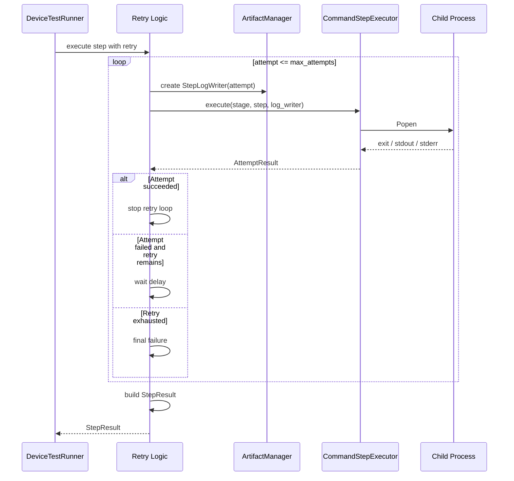

---

# 48. Retry State Machine

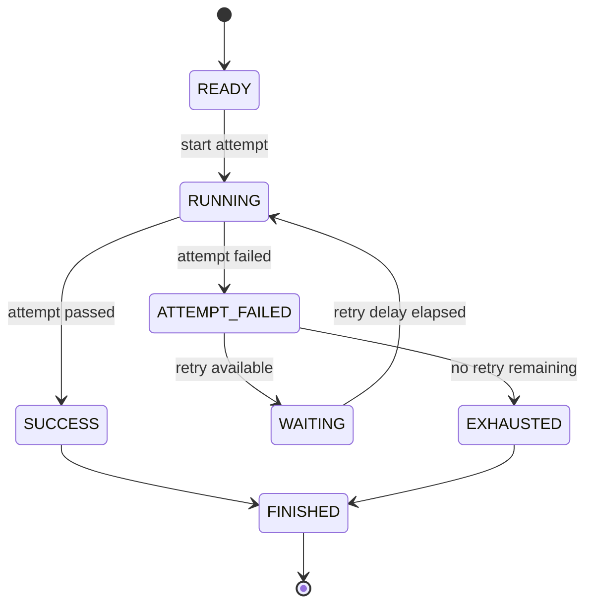

---

# 49. Retry Delay 是否算進 Step Duration？

建議：

```text
要。
```

因為：

```text
Step Duration
```

應表示：

> 從 Step 開始到 Step 最終完成，使用者實際等待多久。

例如：

```text
Attempt 1 = 10 sec
Delay = 5 sec
Attempt 2 = 8 sec
```

Step duration：

```text
23 sec
```

而 AttemptResult 各自仍保留：

```text
10 sec
8 sec
```

這兩個 metric 都有價值。

---

# 50. ExecutionSummary 的 Duration

同樣：

```text
ExecutionSummary.duration_seconds
```

應包含 Retry Delay。

因為這就是整個 Run 真正消耗的時間。

未來做：

```text
Lab Usage Optimization
```

時，Retry overhead 就可以被量化。

---

# 51. Retry Metrics

v1.5.0 可以先不新增正式 Summary，但 report 中至少可推導：

```text
total_attempts

retried_steps

successful_after_retry

retry_exhausted_steps
```

未來可以增加：

```python
RetrySummary
```

例如：

```python
@dataclass(frozen=True)
class RetrySummary:
    total_attempts: int
    retried_steps: int
    recovered_steps: int
    exhausted_steps: int
```

但若要控制 v1.5.0 範圍，可以留到 v1.5.x 或 v1.9 Summary。

---

# 52. 不要立刻建立 RetrySummary 也合理

目前已有：

```text
ExecutionSummary
ValidationSummary
```

如果每新增一個 feature 就加 Summary：

```text
RetrySummary
TimeoutSummary
RecorderSummary
```

RunResult 可能快速膨脹。

所以 v1.5.0 可以先：

```text
AttemptResult[]
```

讓資訊完整存在。

之後 v1.9 Execution Summary 再正式聚合。

這是比較保守的版本策略。

---

# 53. RunResult 在 v1.5.0 的角色

v1.4.1：

```text
RunResult
├── status
├── metadata
├── execution_summary
├── validation_summary
├── StepResult[]
├── ArtifactValidationResult[]
└── artifact_dir
```

v1.5.0 不需要再加新的 Run-level status。

Retry 只影響：

```text
StepResult
```

然後：

```text
StepResult
↓
ExecutionSummary
↓
RunResult.status
```

原本的 aggregation pipeline 可以繼續使用。

---

# 54. Retry Recovery 對 ExecutionSummary 的影響

例如：

```text
Step A
Attempt 1 FAILED
Attempt 2 PASSED
```

最終：

```text
Step A = PASSED
```

因此：

```text
ExecutionSummary.passed_steps += 1
ExecutionSummary.failed_steps += 0
```

Attempt failure 不應直接計入：

```text
failed_steps
```

因為 ExecutionSummary 計算的是：

```text
Final Step Outcome
```

而不是：

```text
Attempt Outcome
```

---

# 55. Attempt Failure 與 Step Failure

非常重要：

```text
Attempt failure
!=
Step failure
```

例如：

```text
Attempt #1 FAILED
Attempt #2 PASSED
```

代表：

```text
Step PASSED
```

只有：

```text
所有 Attempts 都失敗
```

才是：

```text
Step FAILED
```

圖：

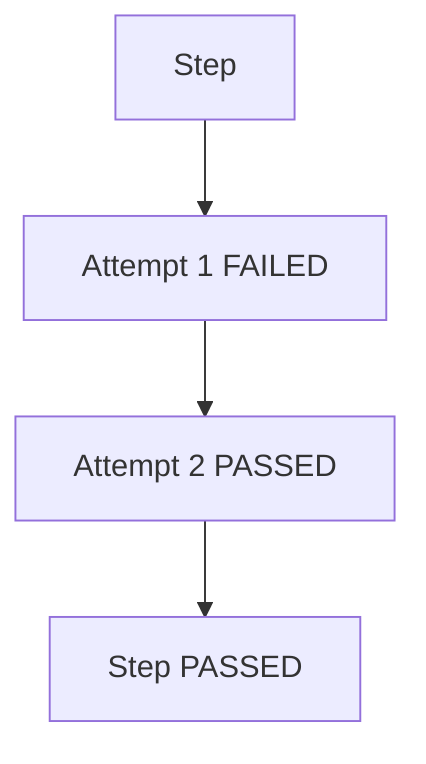

---

# 56. Result Hierarchy

v1.5.0 之後 Result 層次可以理解為：

```text
AttemptResult
        ↓ aggregate
StepResult
        ↓ aggregate
ExecutionSummary

ArtifactValidationResult
        ↓ aggregate
ValidationSummary

ExecutionSummary
+
ValidationSummary
        ↓
RunResult.status
```

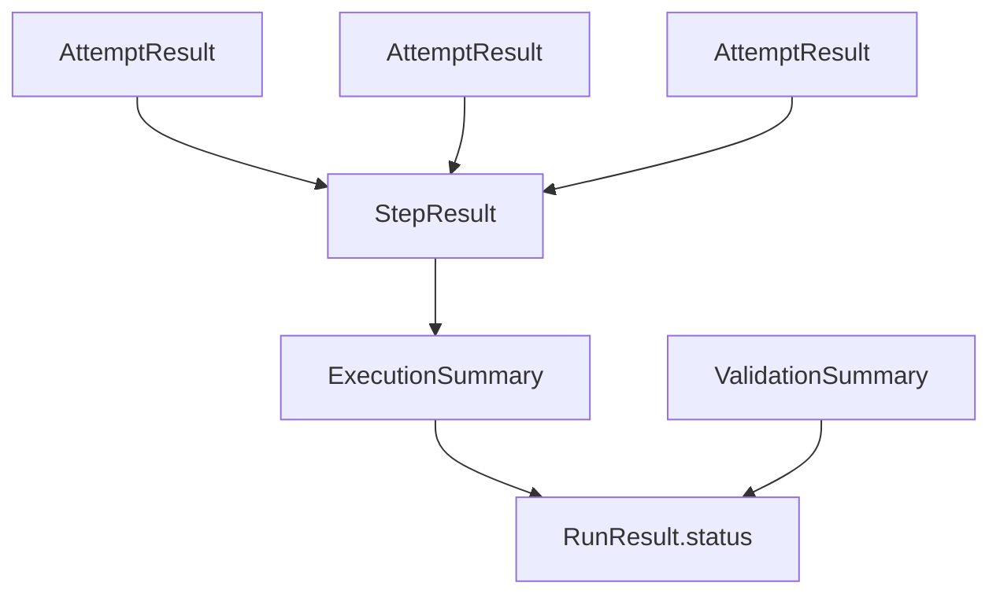

這是 v1.5.0 最大的 Result Domain 演進。

---

# 57. Recommended Model Structure

概念上：

```python
@dataclass(frozen=True)
class RetryPolicy:
    max_attempts: int = 1
    delay_seconds: float = 0


@dataclass(frozen=True)
class LifecycleStepContent:
    name: str
    type: str
    command: str
    timeout_second: int
    retry: RetryPolicy = field(
        default_factory=RetryPolicy
    )


@dataclass(frozen=True)
class AttemptResult:
    attempt: int
    success: bool
    exit_code: Optional[int]
    duration_seconds: float
    stdout: str
    stderr: str
    error: Optional[str] = None


@dataclass(frozen=True)
class StepResult:
    stage: str
    name: str
    command: str
    success: bool
    attempts: List[AttemptResult]
    duration_seconds: float
    error: Optional[str] = None

    @property
    def passed(self) -> bool:
        return self.success

    @property
    def attempt_count(self) -> int:
        return len(self.attempts)
```

這是架構概念，不代表一定要在單一 commit 全部改完。

---

# 58. Class Diagram

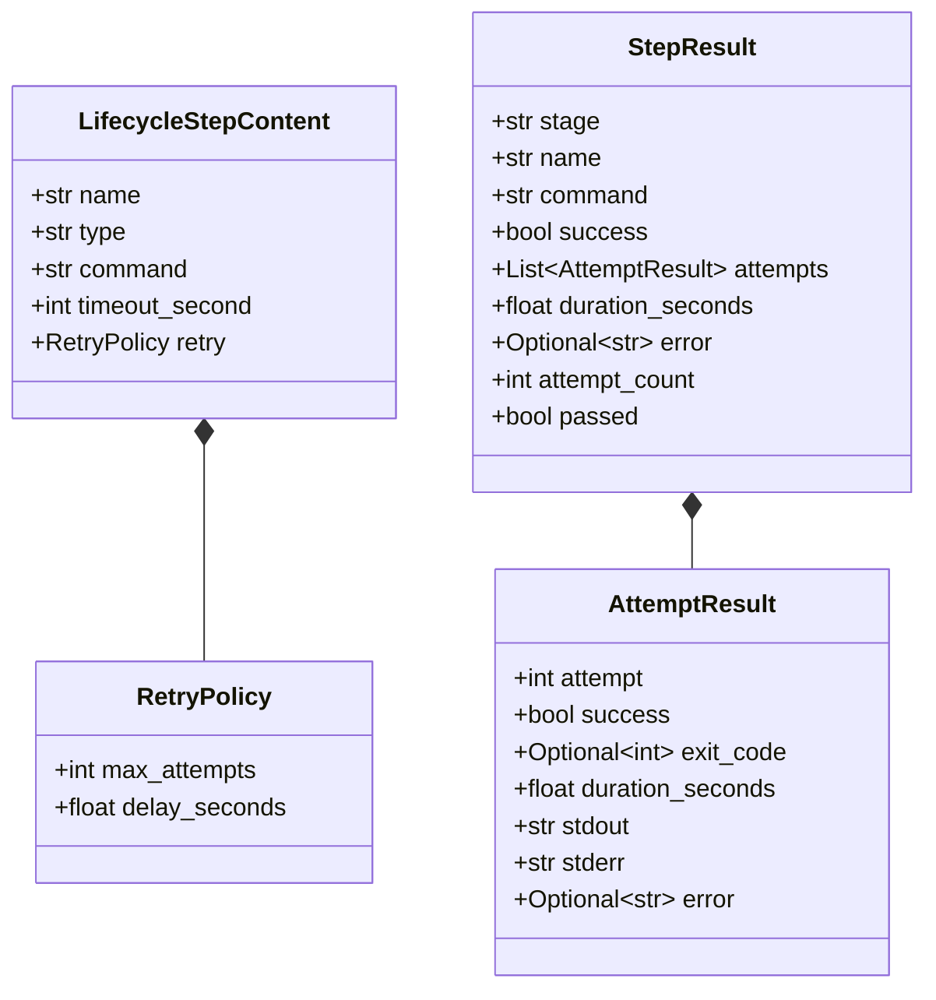

---

# 59. CommandStepExecutor 的介面變化

有兩種選擇。

## 方案 A

Executor 回傳：

```text
AttemptResult
```

```python
def execute(
    ...,
) -> AttemptResult:
```

這在 Domain 上最乾淨。

因為 Executor 每次真的只執行：

```text
one attempt
```

---

## 方案 B

Executor 仍回傳：

```text
StepResult
```

外層再組 Retry。

但這樣：

```text
StepResult
```

同時代表：

```text
Attempt
```

和：

```text
Final Step
```

語意會開始混亂。

因此 v1.5.0 比較推薦：

```text
CommandStepExecutor
→ AttemptResult
```

外層 Retry aggregation：

```text
AttemptResult[]
→ StepResult
```

---

# 60. Execution Pipeline 演進

v1.3.5：

```text
LifecycleStepContent
        ↓
CommandStepExecutor
        ↓
StepResult
```

v1.5.0：

```text
LifecycleStepContent
        ↓
Retry-aware Execution
        ↓
CommandStepExecutor
        ↓
AttemptResult
        ↑
        └──── repeat
        ↓
StepResult
```

這是 v1.5.0 最核心的 Architecture Change。

---

# 61. CommandStepExecutor 仍然保持單純

Executor 不應知道：

```text
max_attempts
delay_seconds
previous attempt result
```

它只需要：

```text
收到 Command
↓
執行一次
↓
回傳 AttemptResult
```

這符合：

```text
Single Responsibility Principle
```

也使得 Executor 的 v1.3.5 streaming logic 幾乎可以原封不動保留。

---

# 62. Retry-aware Execution 可以放在哪裡？

目前有三個可能位置：

```text
DeviceTestRunner private method

RetryExecutor decorator / wrapper

ExecutionPolicy component
```

v1.5.0 建議先用：

```python
DeviceTestRunner._execute_step_with_retry()
```

原因：

```text
需求還小
沒有第二種 Policy Engine
避免過度抽象
```

未來 Retry、Cancellation、Recorder Lifecycle 都加入後，再考慮抽成：

```text
StepExecutionEngine
```

---

# 63. 未來可能出現 StepExecutionEngine

長期：

```text
DeviceTestRunner
        ↓
StepExecutionEngine
        ├── Retry Policy
        ├── Timeout Policy
        ├── Cancellation
        └── Command Executor
```

但 v1.5.0 還不用急著建立。

這也是一個重要的設計原則：

> 先讓抽象從重複需求中長出來，而不是預測所有未來需求。

---

# 64. Retry 與 Teardown

假設：

```text
scenario Step
```

嘗試三次後仍失敗：

```text
Attempt 1 FAIL
Attempt 2 FAIL
Attempt 3 FAIL
```

Lifecycle：

```text
scenario FAILED
↓
teardown
↓
global_teardown
```

Retry 不可以阻止 cleanup。

同樣：

```text
setup retry exhausted
```

仍應進入既定的 cleanup policy。

因此：

```text
Retry Policy
```

是 Step execution policy，

而：

```text
Lifecycle Policy
```

仍然是 Runner-level policy。

兩者不能混為一談。

---

# 65. Retry 與 Teardown 的 Boundary

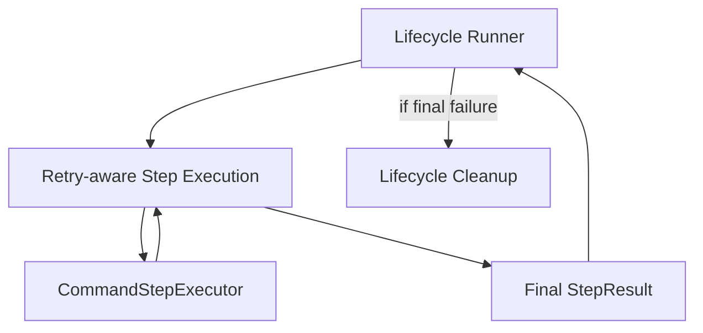

Retry Layer 只交給 Runner：

```text
Final StepResult
```

Runner 不需要知道每一次 Retry 決策細節。

---

# 66. Artifact Validation 仍然在 Lifecycle 後

完整 v1.5 Pipeline：

```text
global_setup
    ↓
setup
    ↓
scenario
    ↓
teardown
    ↓
global_teardown
    ↓
Artifact Validation
    ↓
Execution Summary
    ↓
Validation Summary
    ↓
Run Status
    ↓
Report
```

每個 Lifecycle Step 內部：

```text
Attempt
↓
Retry
↓
Final StepResult
```

---

# 67. Full Architecture

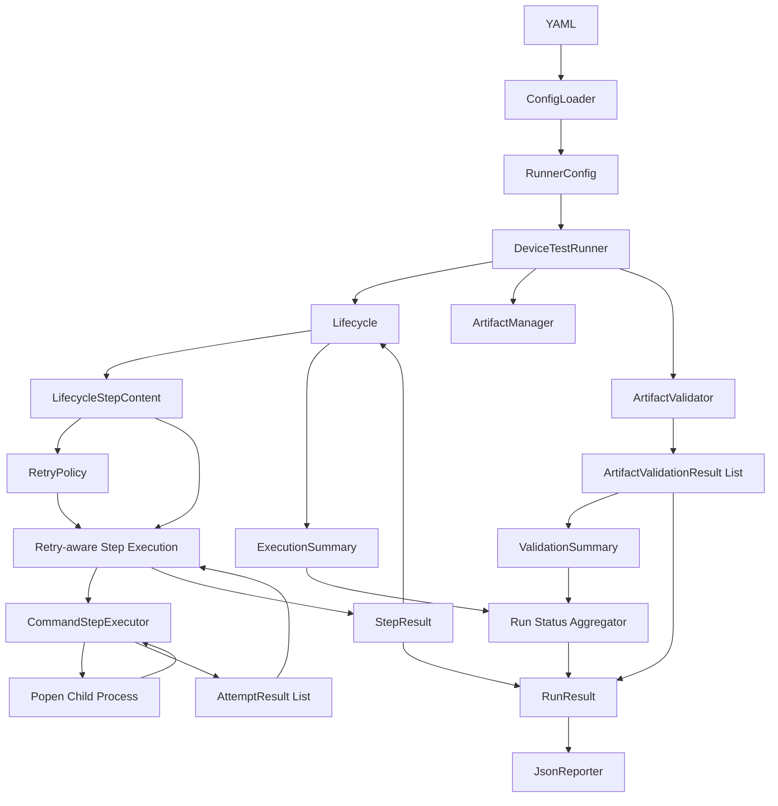

---

# 68. report.json 的演進

v1.5.0 最有價值的新增內容是：

```text
attempt history
```

例如：

```json
{
  "stage": "global_setup",
  "name": "check_device",
  "success": true,
  "attempt_count": 2,
  "duration_seconds": 4.5,

  "attempts": [
    {
      "attempt": 1,
      "success": false,
      "exit_code": 1,
      "duration_seconds": 1.0,
      "error": null
    },
    {
      "attempt": 2,
      "success": true,
      "exit_code": 0,
      "duration_seconds": 1.5,
      "error": null
    }
  ]
}
```

其中剩下：

```text
2 seconds
```

可能就是：

```text
retry delay
```

---

# 69. Reporter 不應隱藏 Retry

例如：

```text
Step PASSED
```

但報表最好呈現：

```text
PASSED after 2 attempts
```

而不是只：

```text
PASSED
```

這讓使用者知道：

```text
這個 Step 是 recovered failure
```

而不是第一次就穩定成功。

---

# 70. Retry Log Example

Console 可以顯示：

```text
[global_setup][check_device][attempt 1/3]
Executing: adb get-state

error: device offline

Attempt 1 failed.
Retrying in 2 seconds...

[global_setup][check_device][attempt 2/3]
Executing: adb get-state

device

Attempt 2 passed.
```

這是 Observability 的一部分。

---

# 71. Retry Error Message

當 Retry exhausted：

```text
Step failed after 3 attempts
```

比：

```text
command failed
```

更有資訊。

例如：

```python
StepResult(
    success=False,
    error="Step failed after 3 attempts",
)
```

實際每次原因仍保存在：

```text
AttemptResult[]
```

---

# 72. Unit Test Strategy

v1.5.0 最重要的測試：

```text
RetryPolicy
Retry Loop
Attempt Aggregation
Retry Delay
Retry Exhausted
Retry Recovery
Artifact Isolation
Lifecycle Interaction
```

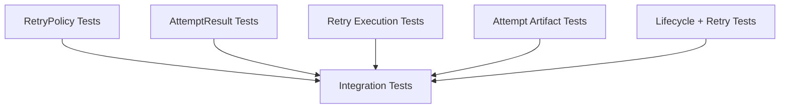

---

# 73. RetryPolicy Tests

應至少測：

```text
default max_attempts = 1
default delay = 0

max_attempts >= 1

delay >= 0
```

以及：

```text
old YAML without retry
→ RetryPolicy(max_attempts=1)
```

---

# 74. Success on First Attempt

FakeExecutor：

```text
Attempt 1
success=True
```

Expected：

```text
executor called once
attempt_count = 1
StepResult.success = True
```

即使：

```text
max_attempts = 3
```

也不能再執行 Attempt 2。

---

# 75. Retry then Success

FakeExecutor：

```text
Attempt 1 = FAIL
Attempt 2 = PASS
```

Expected：

```text
executor called twice
attempt_count = 2
StepResult.success = True
```

這是 v1.5.0 最重要的 Happy Retry Case。

---

# 76. Retry Exhausted

FakeExecutor：

```text
Attempt 1 = FAIL
Attempt 2 = FAIL
Attempt 3 = FAIL
```

Policy：

```text
max_attempts = 3
```

Expected：

```text
executor called exactly 3 times
StepResult.success = False
attempt_count = 3
```

絕對不能執行：

```text
Attempt 4
```

這是 bounded retry 最重要的 invariant。

---

# 77. No Retry Policy

Policy：

```python
RetryPolicy(
    max_attempts=1
)
```

Attempt 1：

```text
FAIL
```

Expected：

```text
executor called once
Step FAILED
```

也就是：

```text
max_attempts=1
```

必須完全等價於 v1.4.1 行為。

---

# 78. Retry Delay Test

不要真的：

```python
time.sleep(5)
```

做 Unit Test。

應該注入：

```text
Sleeper / sleep function
```

或者 Mock：

```python
time.sleep
```

然後 assert：

```python
sleep.assert_called_with(5)
```

這樣 Unit Test 不需要真的等 Retry Delay。

---

# 79. Attempt Artifact Tests

Retry 兩次後應產生：

```text
attempt_1/stdout.log
attempt_1/stderr.log

attempt_2/stdout.log
attempt_2/stderr.log
```

而不是第二次覆蓋第一次。

這是 ArtifactManager v1.5 非常重要的測試。

---

# 80. Lifecycle + Retry Recovery Test

例如 setup Step：

```text
Attempt 1 FAIL
Attempt 2 PASS
```

Expected：

```text
setup final status = PASS

scenario
仍然執行
```

也就是：

```text
Attempt Failure
```

不能直接 trigger Lifecycle Fail-fast。

只有：

```text
Final Step Failure
```

才 trigger。

---

# 81. Lifecycle + Retry Exhausted Test

例如 setup：

```text
Attempt 1 FAIL
Attempt 2 FAIL
```

Policy：

```text
max_attempts=2
```

Expected：

```text
setup Step = FAILED
scenario = SKIPPED
teardown = executed
global_teardown = executed
```

這驗證 Retry 與 Lifecycle policy 的 Boundary。

---

# 82. Integration Test

可以建立一個 temporary script：

```bash
#!/bin/bash

COUNTER_FILE="$ARTIFACT_DIR/counter"

COUNT=0

if [ -f "$COUNTER_FILE" ]; then
    COUNT=$(cat "$COUNTER_FILE")
fi

COUNT=$((COUNT + 1))
echo "$COUNT" > "$COUNTER_FILE"

if [ "$COUNT" -lt 2 ]; then
    echo "temporary failure" >&2
    exit 1
fi

echo "success"
exit 0
```

這個 script：

```text
Attempt 1
→ FAIL

Attempt 2
→ PASS
```

非常適合 Retry Integration Test。

---

# 83. Integration Expected Result

Policy：

```yaml
retry:
  max_attempts: 3
  delay_seconds: 0
```

Expected：

```text
Attempt 1 = FAILED
Attempt 2 = PASSED

Attempt 3 = NOT EXECUTED

StepResult.success = True
attempt_count = 2

Lifecycle continues

Final Run = PASSED
```

如果 Artifact Validation 也通過。

---

# 84. Testing Retry with Timeout

另一個重要案例：

```text
Attempt 1 TIMEOUT
Attempt 2 PASS
```

驗證：

```text
old process cleaned
reader threads joined
Attempt 2 starts successfully
Step final PASS
```

這會開始連結：

```text
v1.5 Retry
+
v1.6 Timeout/Cancellation
```

---

# 85. Retry 不應和 ArtifactValidator 耦合

Unit Test 中可以驗證：

```text
RetryExecutor
```

完全不需要：

```text
ArtifactValidator
```

而：

```text
ArtifactValidator
```

也完全不知道 Retry 發生過。

最後只有：

```text
RunResult
```

同時擁有兩邊資訊。

這表示 v1.4.1 建立的 Boundary 是正確的。

---

# 86. Component Architecture

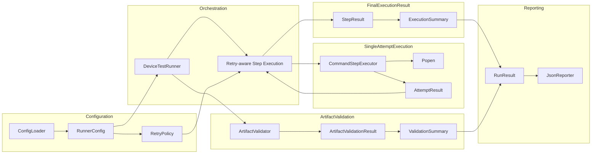

---

# 87. Dependency Direction

建議：

```text
models.py
↑
executor.py
artifact.py
validator.py
reporter.py
↑
runner.py
```

RetryPolicy：

```text
models.py
```

Retry loop：

```text
runner.py
```

單次 process execution：

```text
executor.py
```

不要讓：

```text
executor.py
```

開始 import：

```text
DeviceTestRunner
```

或 Lifecycle policy。

---

# 88. 建議目錄

v1.5.0 不一定需要新增新的 module。

```text
device-test-runner/
├── runner/
│   ├── __init__.py
│   ├── artifact.py
│   ├── config_loader.py
│   ├── executor.py
│   ├── models.py
│   ├── reporter.py
│   ├── runner.py
│   └── validator.py
│
├── configs/
├── scripts/
├── artifact/
├── tests/
│   ├── test_artifact.py
│   ├── test_config_loader.py
│   ├── test_executor.py
│   ├── test_models.py
│   ├── test_reporter.py
│   ├── test_retry.py
│   ├── test_runner.py
│   ├── test_validator.py
│   └── test_integration.py
│
└── docs/
    ├── architecture_v1.0.md
    ├── architecture_v1.1.md
    ├── architecture_v1.2.md
    ├── architecture_v1.3.md
    ├── architecture_v1.3.5.md
    ├── architecture_v1.4.0.md
    ├── architecture_v1.4.1.md
    └── architecture_v1.5.0.md
```

如果 Retry 未來繼續擴大，再考慮：

```text
retry.py
```

目前先不必過度拆 module。

---

# 89. v1.4.1 與 v1.5.0 比較

| 架構項目                       | v1.4.1                  | v1.5.0             |
| -------------------------- | ----------------------- | ------------------ |
| Lifecycle                  | 有                       | 沿用                 |
| Popen Streaming            | 有                       | 沿用                 |
| Artifact Validation        | 有                       | 沿用                 |
| Run Status Aggregation     | 有                       | 沿用                 |
| Step Execution             | 一次                      | 1..N Attempts      |
| RetryPolicy                | 無                       | 有                  |
| max_attempts               | 無                       | 有                  |
| retry delay                | 無                       | 有                  |
| Attempt Concept            | 無                       | 有                  |
| AttemptResult              | 無                       | 建議加入               |
| StepResult                 | 一次 execution result     | final step result  |
| Retry History              | 無                       | 有                  |
| Attempt-specific Artifact  | 無                       | 有                  |
| Transient Failure Recovery | 無                       | 有                  |
| Retry Exhausted            | 無                       | 有                  |
| Lifecycle Failure          | First execution failure | Final step failure |
| Execution Engine           | Process-aware           | Policy-aware       |

---

# 90. Version Evolution

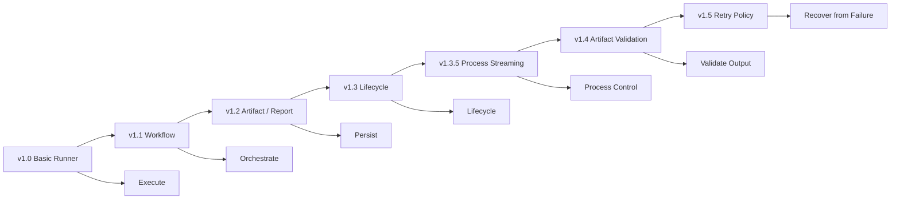

---

# 91. Architecture Evolution 的真正意義

一路從 v1.0 到 v1.5，可以看到 Runner 不斷增加的是：

```text
Decision Making
```

v1.0：

```text
Run this command.
```

v1.1：

```text
Run these commands in order.
```

v1.3：

```text
Run them according to lifecycle.
```

v1.3.5：

```text
Manage the process while it is running.
```

v1.4：

```text
Determine whether the produced result is valid.
```

v1.5：

```text
Determine what to do when execution fails.
```

所以 Runner 的價值越來越不是：

```text
subprocess wrapper
```

而是：

```text
Execution Policy + Orchestration
```

---

# 92. v1.5.0 最重要的 Boundary

這一版最重要的架構分界：

```text
RetryPolicy
!=
CommandStepExecutor
```

也就是：

```text
Policy
!=
Mechanism
```

CommandStepExecutor 是 mechanism：

```text
如何執行一次？
```

RetryPolicy 是 policy：

```text
失敗後要不要再執行？
```

這是 Test Platform / Operating System / Distributed System 中非常重要的設計概念：

> **Separate policy from mechanism.**

---

# 93. Policy vs Mechanism

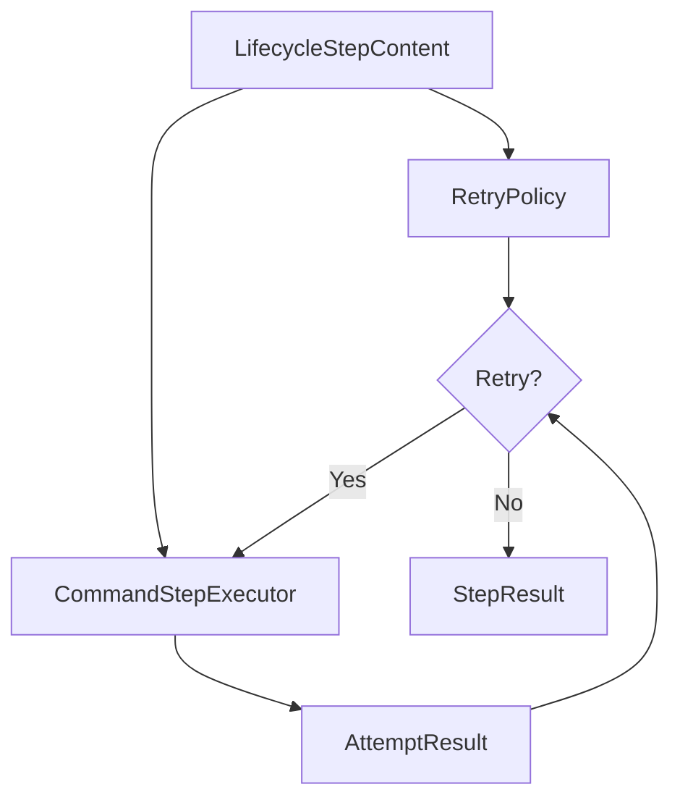

這個設計讓未來可以替換：

```text
Fixed Retry
Exponential Backoff
Error-based Retry
Artifact-aware Retry
```

而不需要修改：

```text
Popen streaming engine
```

---

# 94. v1.5.0 架構摘要

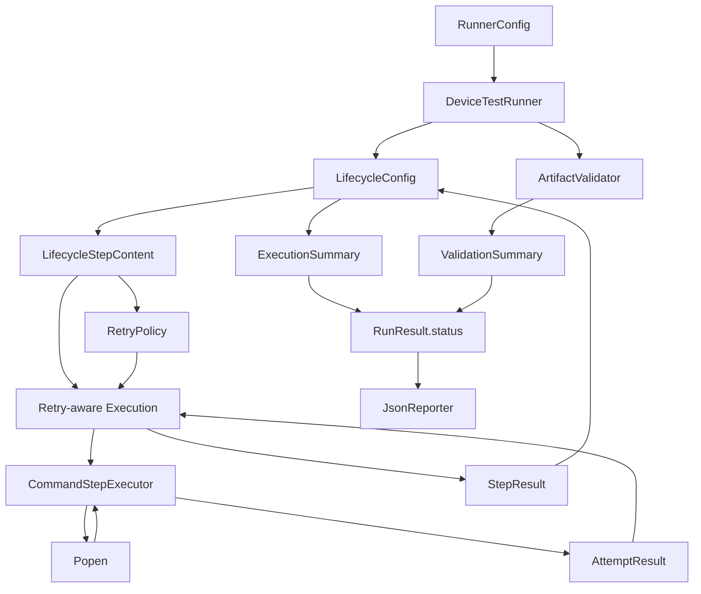

---

# 95. v1.5.0 核心摘要

Device Test Runner v1.5.0 可以濃縮為：

> v1.5.0 在既有 Lifecycle Execution Engine 上引入 `RetryPolicy`，將一次 Step 執行拆成一個或多個 `Attempt`。`CommandStepExecutor` 繼續只負責單一次 Popen execution 並回傳 `AttemptResult`；Retry-aware execution 根據 `RetryPolicy` 決定失敗後是否再次執行，最後將所有 Attempt 聚合成一個 `StepResult`。Lifecycle Runner 只看到最終 Step 結果，因此原有的 setup / scenario / teardown failure policy 不需要被破壞。

最重要的資料流：

```text
LifecycleStepContent
        +
RetryPolicy
        ↓
Retry-aware Execution
        ↓
CommandStepExecutor
        ↓
AttemptResult
        ↓
Retry Decision
        ├── RETRY
        │     ↓
        │  Next Attempt
        │
        └── COMPLETE
              ↓
          StepResult
              ↓
      ExecutionSummary
```

而完整 Runner 仍然維持：

```text
Lifecycle Execution
        ↓
Retry-aware Step Execution
        ↓
Final StepResult
        ↓
Cleanup
        ↓
Artifact Validation
        ↓
ExecutionSummary
+
ValidationSummary
        ↓
RunResult.status
        ↓
report.json
```

v1.5.0 最重要的架構進化不是「多跑幾次 command」，而是正式把：

```text
Mechanism
```

與：

```text
Policy
```

拆開。

也就是：

```text
CommandStepExecutor
=
How do I execute once?

RetryPolicy
=
Should I execute again?

DeviceTestRunner
=
Where does this execution belong in the whole lifecycle?
```

這讓 Device Test Runner 開始真正具有 **Execution Policy Engine** 的味道，也為下一階段的 Timeout / Cancellation、Recorder Lifecycle 與更進階的 Failure Classification 留下乾淨的架構空間。
