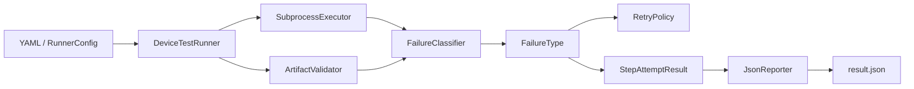
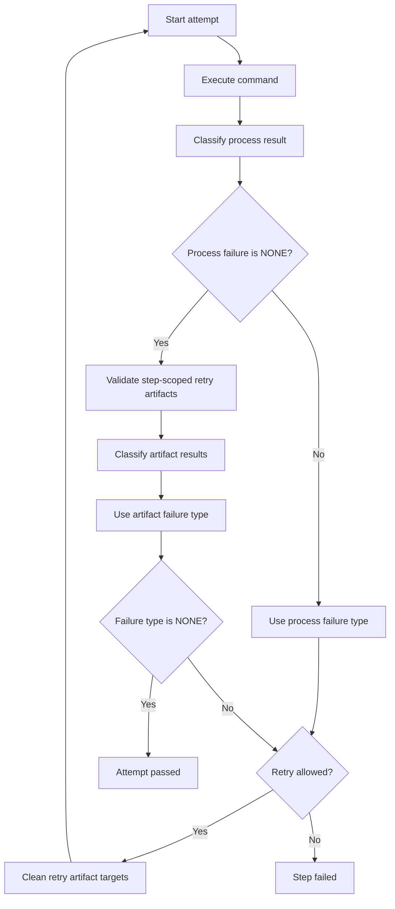
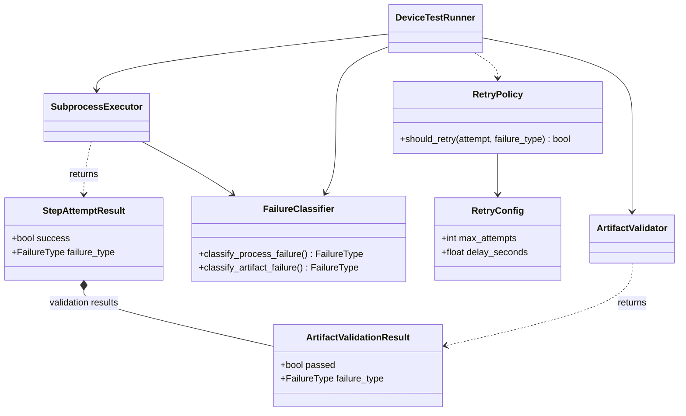
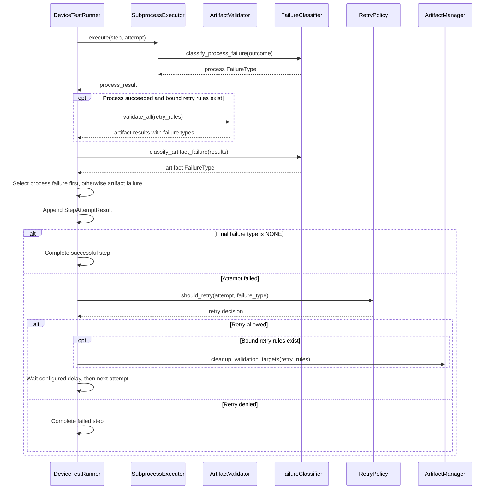

# Device Test Runner Architecture v1.5.2 — Failure Classification

本文件說明 v1.5.2 的架構、資料流與設計限制。範例與介面以該版本為準；目前使用方式請見 [README](../../README.md)。

## 版本範圍

v1.5.2 在 v1.5.1 的 artifact-aware retry 之上，加入統一的 failure classification。Runner 不再只依賴布林值或 exit code 決定 retry，而是先將 process 與 artifact 結果轉換成可追蹤的 failure type。

```text
Execution / Validation Result
            ↓
    FailureClassifier
            ↓
       FailureType
            ↓
 RetryPolicy / StepAttemptResult / result.json
```

目前支援的分類：

| FailureType | 業務意義 | 判定來源 |
| --- | --- | --- |
| `NONE` | attempt 成功 | process 成功且相關 artifact rules 通過 |
| `TIMEOUT` | command 超過 step timeout | executor timeout state |
| `DEVICE_OFFLINE` | 測試裝置無法連線或未授權 | stderr／error pattern |
| `PROCESS_ERROR` | 一般 command 或 subprocess failure | 非零 exit code或執行例外 |
| `ARTIFACT_MISSING` | 必要輸出未產生 | artifact validation result |
| `ARTIFACT_INVALID` | 輸出存在但不符合品質契約 | artifact validation result |

## 元件責任



- `SubprocessExecutor` 保存 stdout、stderr、exit code 與 timeout state，並請 `FailureClassifier` 分類 process failure。
- `ArtifactValidator` 為每個 validation result 標示 `NONE`、`ARTIFACT_MISSING` 或 `ARTIFACT_INVALID`。
- `DeviceTestRunner` 合併 process 與 attempt-level artifact classification。
- `RetryPolicy` 依 failure type 與最大 attempts 判斷是否重試。
- `StepAttemptResult` 保存最終 failure type，供報表與除錯使用。

## Attempt 判定流程



Failure priority：`Process failure > Artifact failure > NONE`

若 command 本身失敗，artifact validation 不會掩蓋 process failure。只有 command 成功後，step-scoped artifact rules 才參與該 attempt 的最終判定。

Artifact failure 內部優先順序：`ARTIFACT_MISSING > ARTIFACT_INVALID > NONE`

缺少必要產物比內容不合法更接近根因，因此同時發生時回報 `ARTIFACT_MISSING`。

## Device Offline Classification

`FailureClassifier` 會對 stderr 與 executor error 做不分大小寫的 pattern matching。目前辨識：

- `device offline`
- `no devices/emulators found`
- `device not found`
- `device unauthorized`

未符合 device-offline pattern 的 process failure 會歸類為 `PROCESS_ERROR`。此分類是 retry policy，不是 domain-specific root-cause analysis；原始 stderr 與 log path 仍保留在 attempt result 中。

## 重試規則

v1.5.2 的 retry input 從 success boolean 改為 failure type：

```python
retry_policy.should_retry(
    attempt=current_attempt,
    failure_type=final_failure_type,
)
```

以下類型在仍有 attempt capacity 時可重試：

- `TIMEOUT`
- `DEVICE_OFFLINE`
- `PROCESS_ERROR`
- `ARTIFACT_MISSING`
- `ARTIFACT_INVALID`

`NONE` 永不重試；到達 `max_attempts` 後，所有 failure type 都停止重試。

## 報告與診斷

每個 `StepAttemptResult` 包含：

- attempt number
- success
- failure type
- exit code
- duration
- stdout／stderr 與 log paths
- executor error
- attempt-level artifact validation results

這讓使用者可從 `result.json` 判斷失敗屬於執行環境、裝置連線、command 邏輯，或 artifact acceptance contract，並保留原始 log 進一步追查。

## 生命週期清理規則

v1.5.2 同時強化 lifecycle 的 cleanup 保證。這是執行邏輯變更，不只是 failure classification 的內部重構：

- `global_setup` 失敗：跳過 `setup`、`scenario` 與 `teardown`，仍執行 `global_teardown`。
- `setup` 失敗：跳過 `scenario`，仍執行 `teardown` 與 `global_teardown`。
- `scenario` 失敗：停止該 stage 的剩餘 steps，仍執行 `teardown` 與 `global_teardown`。
- `teardown` 與 `global_teardown` 中的 step 失敗：記錄失敗，但不中斷同一 cleanup stage 的後續 steps。

因此 `teardown` 以 `global_setup` 成功為前提，而 `global_teardown` 無條件進入執行。被跳過的 configured steps 會計入 `skipped_steps`，並使最終 run status 為 `FAILED`。

## 相容性

- YAML lifecycle 與 artifact rule schema 不因本版本改變。
- 原有 `max_attempts`、`delay_seconds`、`after_step` 與 `retry_on_failure` 行為保留。
- Lifecycle schema 不變，但 cleanup routing 已依上述契約變更；依賴「`global_setup` 失敗時不執行 `global_teardown`」或「`setup` 失敗時不執行 `teardown`」的使用者應調整 cleanup steps。
- `result.json` 的 attempt 與 artifact validation objects 新增 failure classification，consumer 應容許新增欄位。
- Runner metadata version 更新為 `1.5.2`。

## 範圍限制

v1.5.2 不包含：

- 使用者自訂 retryable failure type
- regex／plugin-based failure classifier
- process-group cancellation guarantees
- recorder lifecycle
- distributed controller／worker execution

上述能力保留給後續版本。

## Implementation UML — Git tag v1.5.2

### Classification Relationships

依據 `runner/failure.py`、`runner/retry.py` 與 `runner/models.py`；僅列出和 failure classification 相關的介面。ArtifactValidator 產生每筆 failure type，合併分類由 Runner 呼叫 FailureClassifier。



### Attempt Classification Sequence



此版本尚無 `retry_on` allow-list 與 `CANCELLED`；兩者不可回填為 v1.5.2 的既有能力。
