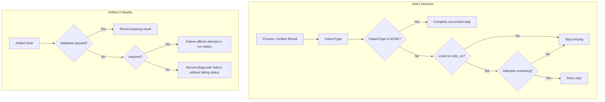
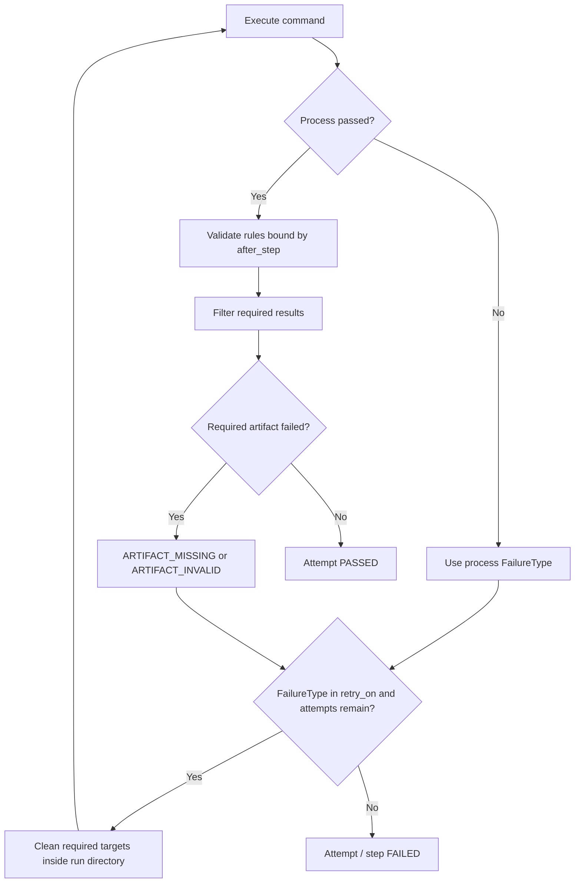
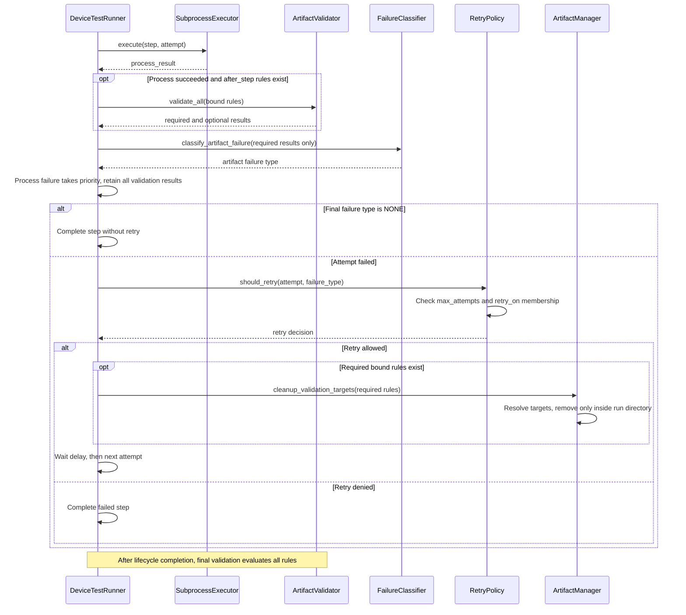

# Device Test Runner Architecture v1.5.3 — Selective Retry and Artifact Criticality

## 1. 版本定位

v1.5.3 在 v1.5.2 的 failure classification 上增加兩個 policy input：`retry.retry_on` 決定哪些 failure type 可重試；artifact rule 的 `required` 決定 validation failure 是否影響 attempt 與 run status。



## 2. Configuration Contract

```yaml
retry:
  max_attempts: 3
  delay_seconds: 1
  retry_on:
    - timeout
    - device_offline
    - artifact_missing

artifact:
  validation:
    rules:
      - name: power_csv
        type: csv_content
        path: results/power.csv
        after_step: run_power_test
        required: true
      - name: debug_log
        type: exists
        path: debug.log
        required: false
```

允許的 `retry_on` 值為 `timeout`、`device_offline`、`process_error`、`artifact_missing`、`artifact_invalid`。Config loader 保留順序並移除重複值；未知值或 `none` 會造成 `ValueError`。從 YAML 載入時，未設定 `retry_on` 會得到空清單，因此不重試。`required` 未設定時預設為 `true`。

## 3. Attempt Decision Flow



Process failure 仍優先於 artifact failure；artifact failure 中 `ARTIFACT_MISSING` 優先於 `ARTIFACT_INVALID`。Optional result 不參與 failure classification，因此即使 validation `passed: false`，attempt 仍可成功。

## 4. Final Status and Reporting

所有 rules 仍會出現在 validation results，且每筆結果包含 `required`。Execution summary 同時保存：

* `failed_artifact_rules`：所有失敗 validation 的數量
* `failed_required_artifact_rules`：其中 required failure 的數量

最終狀態只因 failed step、skipped step 或 failed required artifact 成為 `FAILED`。只有 optional artifact 失敗時，run 可維持 `PASSED`。

## 5. Cleanup Safety

重試前只清除 required validation targets。相對路徑以 run directory 為基準；absolute 或解析後位於 run directory 外的路徑不會刪除，缺少的 target 直接忽略。這可避免 optional diagnostics 消失，也限制 cleanup 的檔案系統邊界。

## 6. Compatibility

* Runner 與 report metadata version 為 `1.5.3`。
* `retry_on_failure` 已由 failure-type policy 與 `required` 取代；舊 YAML 應遷移。
* 未設定 `retry_on` 不再代表所有 failure 都可重試；需明確列出。
* Report consumers 應容許 validation result 的 `required` 與 summary 的 `failed_required_artifact_rules`。

## 7. Out of Scope

本版本不包含 regex／plugin-based classifier、per-step retry policy、process-group cancellation、recorder lifecycle 或 distributed execution。


## 8. Selective Retry Sequence — Git tag v1.5.3

依據 `runner/runner.py` 的 attempt loop、`runner/retry.py` 與 `runner/artifact.py`。Optional results 仍保存在 attempt 中，但只有 required results 參與 artifact failure classification。



只有 optional artifact 失敗且 command 成功時會走成功分支。Cleanup 不等同 process-tree cleanup；此版本尚未提供 cancellation token。
