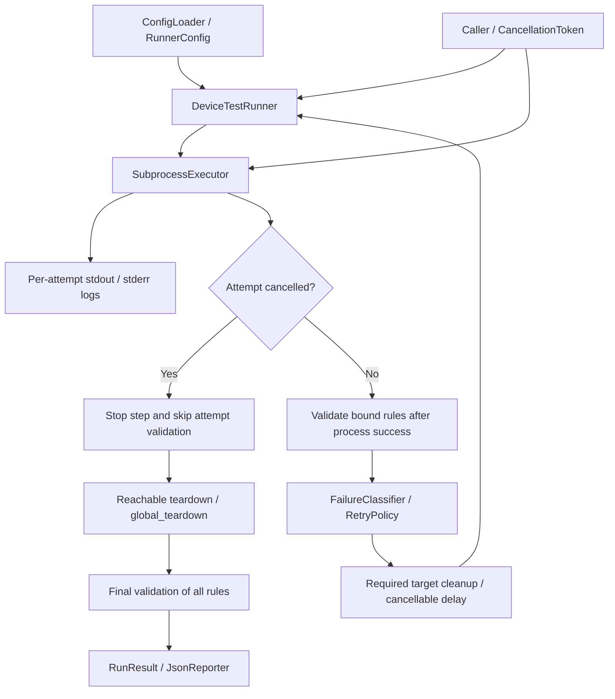
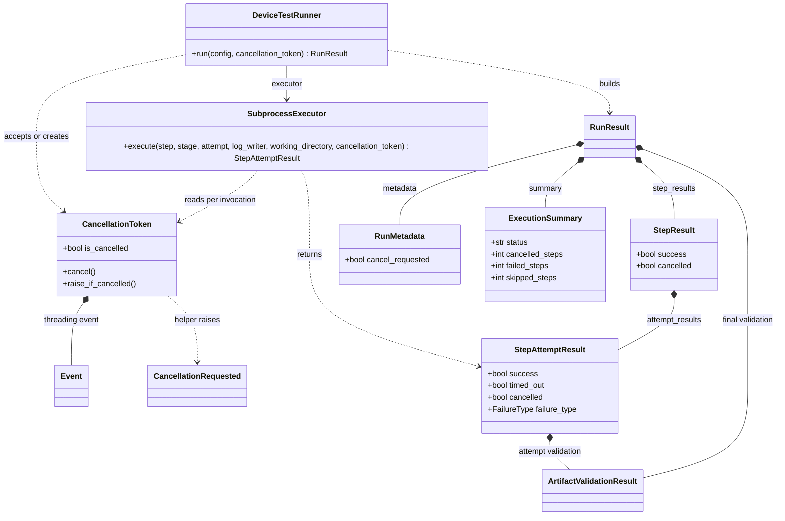
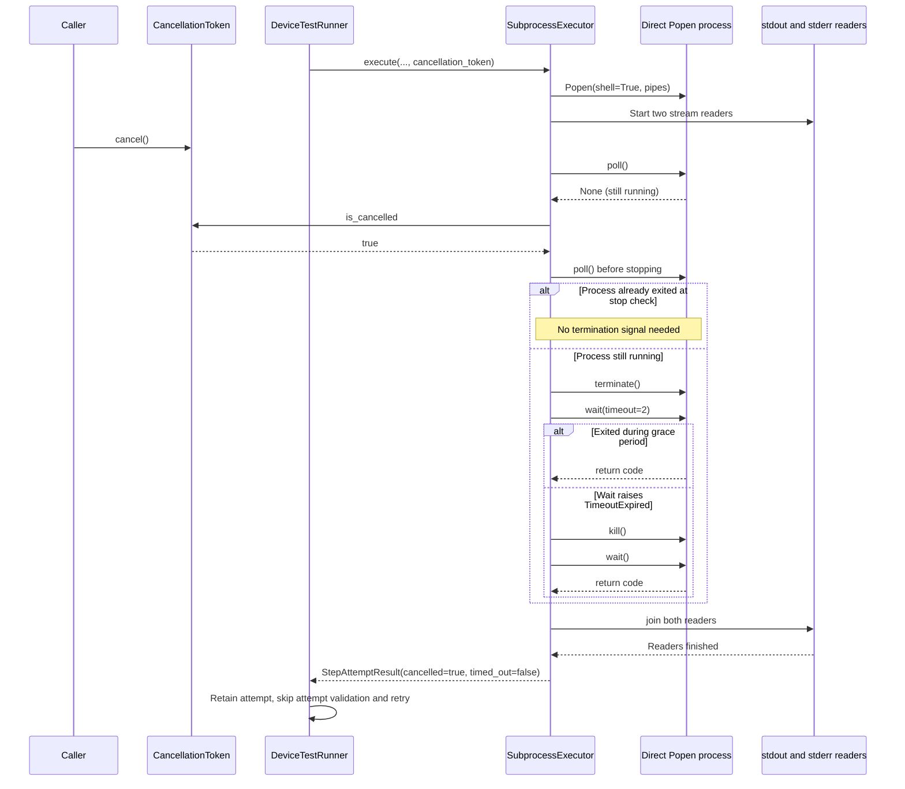
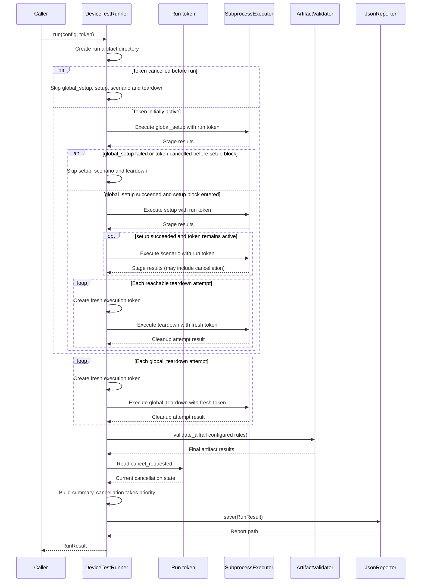

# Device Test Runner Architecture v1.6.0 — Cancellation Foundation

本文件說明 v1.6.0 的架構、資料流與設計限制。範例與介面以該版本為準；目前使用方式請見 [README](../../README.md)。

## 版本範圍與依據

v1.6.0 在 v1.5.3 的 selective retry 與 artifact criticality 上加入 cooperative cancellation。`DeviceTestRunner.VERSION` 為 `1.6.0`；呼叫端可傳入 `CancellationToken`，在一般 lifecycle step 或 retry delay 期間要求取消。

本文件以 Git tag `v1.6.0` 的實作為依據，並以 tag `v1.5.3` 為比較基準。此版本提供基本取消功能；程序樹終止、訊號處理與例外後的清理仍有待完成。

## 元件與資料流

* `CancellationToken` 使用 `threading.Event`；`cancel()` 可重複呼叫，`is_cancelled` 回報狀態，`raise_if_cancelled()` 在取消後拋出 `CancellationRequested`。Runner 本身以狀態檢查實作流程，不使用該例外路徑。
* `run(config, cancellation_token=None)` 未收到 token 時建立新 token。一般 stage 與 attempt 開始前檢查取消，避免繼續啟動工作。
* Cleanup attempt 使用新的未取消 token，避免外部已取消的 token 立刻終止清理程序。

## `subprocess` 定義、差異與應用

Python 的 `subprocess` 模組用來建立並管理外部 OS process，例如 shell command、script 或裝置工具。它把 Python 程式與外部命令的生命週期連接起來，包含啟動 process、傳遞環境變數、讀取 stdout／stderr、取得 exit code，以及等待或停止 process。

| API／物件 | 是否等待 | 回傳／用途 | 適合情境 |
| --- | --- | --- | --- |
| `subprocess.run()` | 是 | `CompletedProcess`；命令完成後取得 exit code、stdout、stderr | 短命令、一次性執行，不需要執行中監控 |
| `subprocess.Popen` | 否；建立後立即回傳 process 控制物件 | 取得可操作的 process，可讀取串流、監控、等待、停止 | 長時間命令、即時 log、timeout 與 cancellation |
| `Popen.wait()` | 是 | 等待指定的 process 結束並回傳 exit code | 已決定只需等待，不需要週期性檢查狀態 |
| `Popen.poll()` | 否；非阻塞 | process 尚未結束時回傳 `None`，結束後回傳 exit code | polling、timeout、cancellation monitoring |

`run()` 是較高階的便利 API，內部仍可建立 `Popen`，但會替呼叫端處理等待與結果收集；`CompletedProcess` 代表命令已經完成的結果，不是執行中的控制物件。相對地，`Popen` 代表仍可被監控與控制的 process。`wait()` 是單純等待，可能阻塞目前 thread；`poll()` 則適合在迴圈中檢查 process 是否已結束，同時處理取消與 timeout。

在本專案中，`SubprocessExecutor` 選擇 `Popen` 而不是 `run()`，原因是 lifecycle step 可能是長時間裝置測試，需要：

* 由 reader thread 即時保存 stdout／stderr，避免等到命令結束才取得 log。
* 使用 `poll()` 每 0.1 秒檢查 process、`CancellationToken` 與 step timeout。
* 取消或 timeout 時呼叫 `terminate()`，必要時再 `kill()`，最後以 `wait()` 確認 process 結束。
* 將 exit code、輸出內容、duration、timeout 與 cancellation 狀態組合成 `StepAttemptResult`。

因此，`Popen` 是本版本 cancellation／monitoring 的基礎；`run()` 適合不需要中途控制的短命令，而 `wait()` 與 `poll()` 是 `Popen` 生命週期控制中的不同等待策略，不是互相替代的執行 API。

## 命令執行與重試

Executor 使用 `shell=True` 在 run directory 執行 command，設定 `DEVICE_TEST_RUNNER_ROOT` 與 `RUN_ARTIFACT_DIR`，由兩個 thread 讀取 stdout／stderr。

每輪最多等待 0.1 秒，依序檢查 process completion、token cancellation、step timeout。已觀察到程序完成時先結束 polling；若仍執行中且取消與 timeout 同時可見，取消優先。取消回傳 `failure_type=cancelled`、`cancelled=true`、`timed_out=false`；timeout 回傳 `failure_type=timeout`、`timed_out=true`、`cancelled=false`。

`_stop_process()` 對直接 `Popen` 程序送出 terminate，等待最多兩秒，仍未退出才 kill 並 wait。接著等待輸出 reader 結束並保存已讀取的 log。這不是總執行時間上限：未被終止的後代程序可能繼續持有 pipe，使 reader join 延遲。

取消 attempt 不執行 attempt-level artifact validation，也不重試。一般成功 command 才驗證 `after_step` 綁定規則；process failure 優先於 required artifact failure，optional artifact 僅供診斷。允許重試時，只清除 run directory 內的 required targets。

Retry delay 使用 monotonic clock，以最多 0.1 秒的 sleep 檢查取消。若等待中取消，step 標記 `cancelled=true`，但已完成 attempt 保留原始 failure type。Cleanup 使用原始 token 等待 retry delay，因此取消後可以略過剩餘 delay 並繼續 cleanup retry；不保證取消後 cleanup 仍等待完整設定時間。

## 生命週期路由

| 取消時機 | 後續行為 |
| --- | --- |
| run 開始前 | 只執行 `global_teardown`，一般 steps 算 skipped，可能沒有 cancelled step |
| `global_setup` 執行中 | 停止該 stage，跳過 `setup`、`scenario`、`teardown`，執行 `global_teardown` |
| 進入 `setup` 區塊後，於 `setup` 或 `scenario` 取消 | 停止一般工作，執行 `teardown` 與 `global_teardown` |
| 一般 step 的 retry delay | 不啟動下一次 attempt，依 stage 路由至 cleanup |
| cleanup 執行期間 | 新的 execution token 不受原始取消狀態影響，仍受各 step timeout 與 retry policy 控制 |

`teardown` 實際位於 `global_setup_success and not cancellation_token.is_cancelled` 區塊內；如果 global_setup 完成後、進入該區塊前就觀察到取消，teardown 會被跳過。`global_teardown` 是受控流程中的 best effort，程式沒有以 `try/finally` 包覆整個 run；未處理的 Python exception 或 KeyboardInterrupt 不在此保證內。

Lifecycle 後仍對 **所有** artifact rules 做 final validation，包括有 `after_step` 的規則與被取消／跳過 step 的規則。因此取消 run 可以同時包含 missing required artifact 診斷。

## 報告欄位與相容性

| 層級 | v1.6.0 欄位／行為 |
| --- | --- |
| `StepAttemptResult` | 新增必要建構參數 `timed_out`、`cancelled`；取消 failure type 為 `cancelled` |
| `StepResult` | 新增必要建構參數 `cancelled`；retry delay 取消也可使此欄位為 true |
| `RunMetadata` | `runner_version=1.6.0`，新增必要參數 `cancel_requested` |
| `ExecutionSummary` | 新增必要參數 `cancelled_steps`；`failed_steps` 排除 cancelled steps |
| `SubprocessExecutor.execute` | 呼叫端與 mock executor 必須提供 `cancellation_token` |
| `DeviceTestRunner.run` | token 為 optional，既有 `run(config)` 呼叫形式仍可使用 |

`executed_steps = len(step_results)`，`skipped_steps = configured_steps - executed_steps`。Summary status 優先序：取消請求或 cancelled step → `CANCELLED`；否則 failed step、skipped step、required artifact failure 任一存在 → `FAILED`；其餘 → `PASSED`。`cancel_requested` 與 `cancelled_steps` 不等價，例如執行前取消的 run 可為 `true`／`0`。

結果消費端應讀取 `summary.status` 與 attempt `success`。目前 `RunResult.passed` 只檢查 step success，`StepAttemptResult.passed` 只檢查 exit code；兩者不等同包含取消與 artifact 判定的完整結果。

YAML 禁止 `retry_on: [cancelled]`，policy 即使收到直接 Python 建構且包含 `CANCELLED` 的清單也不重試。YAML 未指定 `retry_on` 時為空清單；直接 `RetryConfig()` 的預設包含五種一般 failure types，預設 `max_attempts=1`。呼叫端宜明確指定 retry policy。

## 待完成項目

* Process-group／descendant termination 與可量測的 shutdown 上限。
* CLI SIGINT／SIGTERM 接線與明確 exit code 策略。
* 未處理例外時的 teardown／report finalization。
* Cancellation boundary race 與 cleanup retry-delay semantics 的更完整測試。
* Sample happy path 修正與 GitHub Release 驗證；Git tag `v1.6.0` 已存在。

## Implementation UML — Git tag v1.6.0

### Cancellation and Result Relationships

依據 `runner/cancellation.py`、`runner/runner.py`、`runner/executor.py` 與 `runner/models.py`，省略未改變的設定欄位。Token 由呼叫端傳入，或由 Runner 在未傳入時建立；Executor 不持有永久的 token 欄位，而是每次 execute 接收它。

`raise_if_cancelled()` 是輔助 API；Runner／Executor 的正常取消流程讀取 `is_cancelled`，不依靠拋出 `CancellationRequested`。

### Running Process Cancellation Sequence

此圖描述程序仍在執行時，呼叫端從另一個 thread 提出取消的路徑。stdout 與 stderr reader 是兩個 thread，圖中合併顯示。

最外層 polling 先檢查程序完成，再檢查取消，最後檢查 timeout。圖中僅為直接程序 termination，沒有 process-group kill；reader join 無 timeout，後代程序仍持有 pipe 時可能持續等待。Caller 的 cancel 也不表示 CLI 已接上 SIGINT。

### Cancellation Cleanup Sequence

以下為 Runner 可正常返回結果的受控路徑；沒有宣稱未處理 exception／KeyboardInterrupt 也能完成 cleanup。

每個 cleanup attempt 有新的 execution token，但 retry delay 仍讀原始 run token；這不是完整獨立的 cleanup scope。若一般 retry delay 期間取消，step 可標記 cancelled，而先前 attempt 保留原 failure type。這些差異應保留於結果，不將所有 attempt 都改寫成 CANCELLED。
