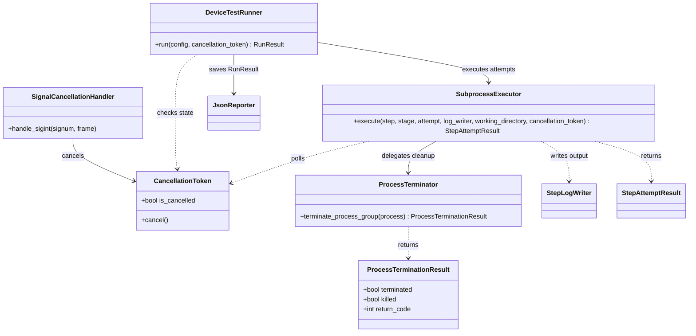
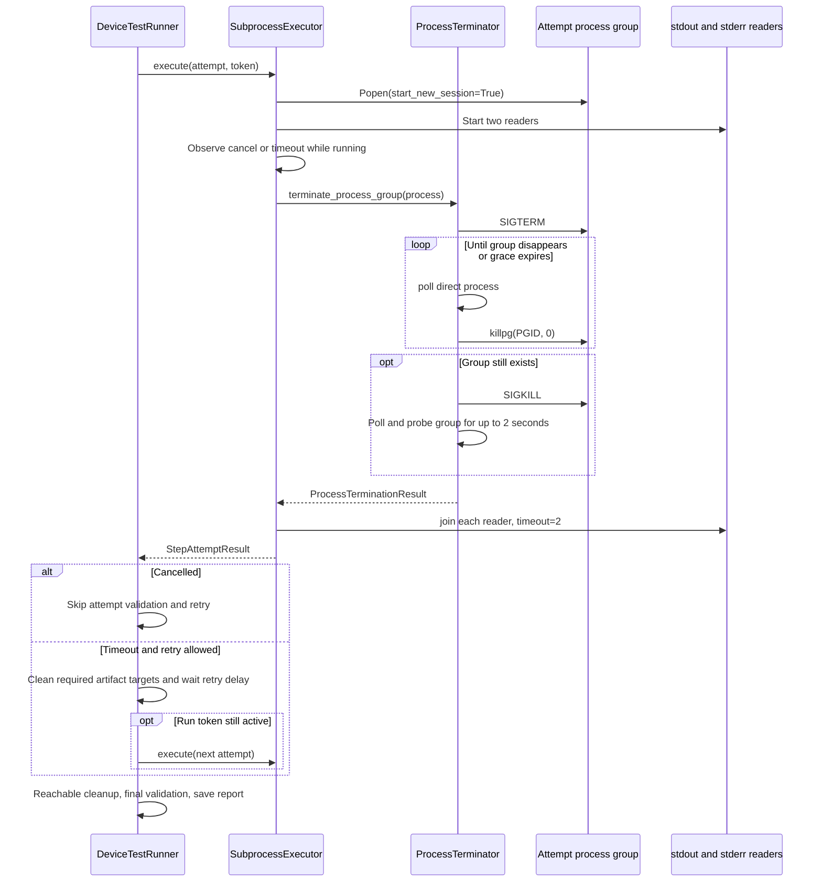

# Device Test Runner Architecture v1.6.1 — Safe Process Termination

本文件定義 v1.6.1 的程序清理架構，涵蓋 timeout、cancel、retry 與 SIGINT。介面、流程與限制以 v1.6.1 實作為準；後續版本的變更另立版本文件。

## 版本與介面

Runtime 與 `result.json` 的版本為 `1.6.1`。Result dataclass 欄位延續 v1.6.0，沒有新增 termination result 欄位到 JSON。套件版本同步與發佈狀態記錄於 [Definition of Done](../definition_of_done/definition_of_done_v1.6.1.md)。

`SubprocessExecutor(project_directory, failure_classifier, process_terminator)` 必須注入 `ProcessTerminator`。`execute(..., cancellation_token)` 與 `run(config, cancellation_token=None)` 的 token 用法不變。

```python
executor = SubprocessExecutor(
    project_directory=project_root,
    failure_classifier=FailureClassifier(),
    process_terminator=ProcessTerminator(grace_period_seconds=2.0),
)
```

## Process 與 process group

Process 是一個 OS 程序；process group 是一組可以一起接收 signal 的程序。Executor 用 `Popen(shell=True, start_new_session=True)` 啟動每次 attempt。沒有自行脫離群組的 child／grandchild 會留在同一個群組。

Command 在 run directory 執行，環境包含 `DEVICE_TEST_RUNNER_ROOT` 與 `RUN_ARTIFACT_DIR`。兩個 reader threads 分別保存 stdout 與 stderr。

每輪 polling 間隔為 0.1 秒，依序檢查：

1. 直接 process 是否已完成。
2. token 是否取消。
3. 是否超過 step 的 `timeout_second`。

因此已完成的程序優先；仍執行中且取消與 timeout 同時可見時，取消優先。正常完成不會主動呼叫群組清理。

## ProcessTerminator

`terminate_process_group(process)` 的流程：

1. 如果直接 process 已退出，直接回傳，不發出 signal。
2. 取得 PGID，對群組送出 SIGTERM。
3. 預設每 0.05 秒 `poll()` 回收直接子程序，並以 `killpg(PGID, 0)` 檢查群組；預設寬限時間為 2 秒。
4. 群組仍存在就送出 SIGKILL，再等最多 2 秒。
5. SIGKILL 後仍未確認群組消失，拋出 `RuntimeError`。

`ProcessLookupError` 表示群組不存在。探測時的 `PermissionError` 不當成已結束，會繼續等到 deadline。這不代表送出 SIGTERM／SIGKILL 的權限錯誤也會被忽略。

回傳的 `ProcessTerminationResult` 包含 `terminated`、`killed`、`return_code`。`terminated` 表示進入終止流程；Executor 並未把這個物件寫入報告。

## Reader、retry 與清理

Executor 在清理後依序 join stdout／stderr reader，每個 reader 最多等 2 秒。仍存活就拋出 `RuntimeError`，避免正常路徑無限等待。這些分段等待不是整次 run 的總時間上限。

成功處理取消時，attempt 為 `CANCELLED`，不做 attempt validation 或 retry。Timeout 為 `TIMEOUT`，只有 retry policy 允許且尚有次數才重試。Runner 同步等待 `execute()` 回傳後，才判斷驗證、artifact cleanup、delay 與下一次 attempt。

Executor 捕捉 `OSError`／`RuntimeError` 後，會嘗試清理仍存活的直接 process、join readers，再回傳 `PROCESS_ERROR`。如果這段補救再次拋出例外，例外仍會離開 executor；不能宣稱所有錯誤都會留下完整報告。

## CLI 與 lifecycle

* 第一次 Ctrl+C／SIGINT 呼叫 `token.cancel()`，走原本的受控取消流程。
* 第二次呼叫 handler 會拋出 `KeyboardInterrupt`；`main()` 在 run 的 try 區塊捕捉後回傳 130，finally 還原原本 SIGINT handler。
* 一般結果的 CLI exit code：PASSED 為 0、FAILED 為 1、CANCELLED 為 130。
* SIGTERM 沒有接到 token。第二次 Ctrl+C 可能中斷 cleanup 與 JSON 寫入。

取消路由沿用 v1.6.0：pre-cancel 或 global_setup 取消只到 global_teardown；進入 setup 區塊後取消，仍到 teardown 與 global_teardown。Cleanup attempt 使用新的 token；retry delay 仍讀原始 run token。Final validation 仍驗證全部 artifact rules，summary 以 CANCELLED 優先。

## UML 類別圖



## Timeout／cancel 循序圖

圖中是直接 process 仍在執行，且清理成功的路徑。例外與已退出的 early return 見上文。



## 支援範圍與限制

* 使用 POSIX 的 `getpgid`、`killpg`、SIGTERM／SIGKILL；v1.6.1 的本機驗證環境為 macOS，沒有 Windows 或 Linux CI 成功證據。
* 同群組的三層程序已有真實測試；自行 `setsid()`／脫離群組的 daemon 不在管理範圍內。
* 直接 process 在清理開始前已退出時會 early return。正常完成但留下背景後代的情境，不在 v1.6.1 的清理保證內。
* Zombie 回收、權限、OS 排程會影響群組消失時間；尚未驗證各平台的完整邊界。
* SIGINT 測試直接呼叫 handler，沒有證明終端送訊號、handler 安裝／還原與 CLI exit code 的端到端行為。
* Lifecycle 取消路由以 mock 驗證；未處理例外與第二次 Ctrl+C 不保證完成 teardown／report。

測試依據見 [Test Matrix](../test_matrix/test_matrix_v1.6.1.md)，發佈待辦見 [Definition of Done](../definition_of_done/definition_of_done_v1.6.1.md)。
