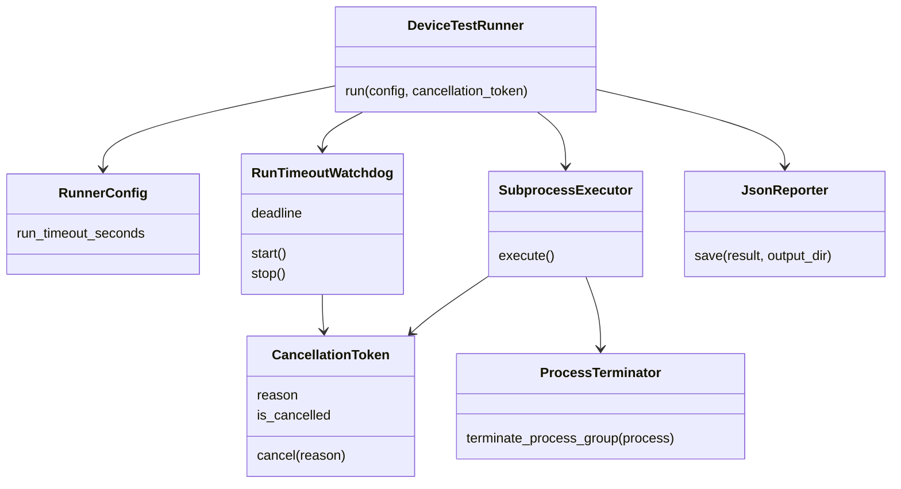
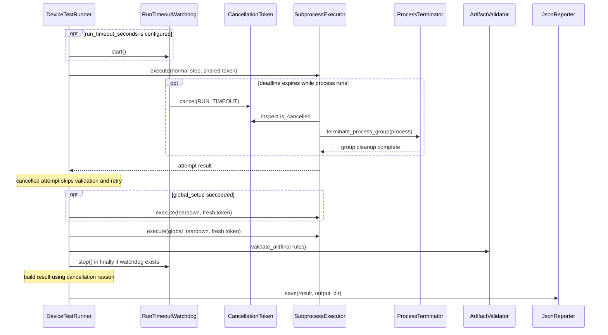

# Device Test Runner Architecture v1.6.2 — Run-level Timeout

本文件說明整次 run 的截止時間、取消原因與報告。基準為 `eea8507` 加上本次工作目錄 source／test 修正，對照 `v1.6.1` tag；不是已發佈版本的聲明。

## 設定與介面

YAML 頂層 `run_timeout_seconds` 可省略或設為 null，代表不設 run deadline；step 的 `timeout_second` 仍有效。數字必須有限且大於零；bool、字串、零、負數與非有限值被 ConfigLoader 拒絕。直接建構 RunnerConfig 不經 loader，watchdog 建構子僅檢查 `<= 0`，不提供相同的完整驗證。

`RunTimeoutWatchdog(timeout_seconds, cancellation_token)` 只可 start 一次，使用 monotonic 時鐘與 Event.wait。stop 設定事件並 join 執行緒。`CancellationToken.cancel(reason=USER_REQUEST)` 保留第一個原因；實際回傳是否接受的 bool，但目前型別標註仍是 `None`。

## 類別與依賴

## 執行流程

Watchdog 在 run directory 建立後、global_setup 前開始；retry 不會重設 deadline。一般 stage 邊界、executor polling 與 retry delay 都會讀取 token。於 retry delay 逾時不新增 attempt，也不將前一次 PROCESS_ERROR 改成 CANCELLED。Setup 逾時後，只要 global_setup 成功，就會執行 teardown；正常控制流程也會到達 global_teardown。

Watchdog 持續到 cleanup 與 final validation 結束，因此這些階段也可能設定 run 的取消原因；cleanup 使用新 token，依自己的 step timeout 執行。Artifact validation 本身不會被 token 中斷。finally 只保證 stop watchdog；非預期例外仍可能跳過 cleanup、final validation 或 report。Report 建構與寫入在 watchdog 停止之後。

## 報告與相容性

| 欄位／結果 | v1.6.2 行為 |
| --- | --- |
| metadata.runner_version | `1.6.2`，與 pyproject.toml 的 distribution version 一致 |
| metadata.cancel_reason | `user_request`、`run_timeout` 或 null |
| metadata.run_timeout_seconds | 設定數值或 null |
| metadata.run_timed_out | RUN_TIMEOUT 時為 true，其餘為 false |
| summary.status | RUN_TIMEOUT → TIMED_OUT；USER_REQUEST 或 cancelled steps → CANCELLED；失敗／跳過／required artifact 失敗 → FAILED；其餘 PASSED |
| attempt | Run timeout 中斷 command 為 CANCELLED、cancelled=true、timed_out=false；step timeout 仍是 TIMEOUT |
| RunResult.passed | 只在 summary.status 為 PASSED 時為 true |

`StepAttemptResult.passed` 已移除，使用 `success`。JsonReporter 透過 dataclasses.asdict 保存原始欄位與 attempt history。CLI 目前只對 CANCELLED 回傳 130、FAILED 回傳 1；TIMED_OUT 會落入回傳 0 的分支。這是現有缺口，不代表逾時成功，也尚無 CLI 整合驗證。

## Process group 與限制

Terminator 不再因 direct child 已退出就返回；getpgid 找不到 child 時，以原 PID 探測 group。此回退依賴 executor 的 start_new_session=True。已有 orphan fixture 驗證同群組後代被清理，但不涵蓋 detached descendants，也不保證 executor 在所有正常結束路徑主動呼叫清理。

這是停止一般工作的 deadline，不是整個 CLI 的硬性時間上限。Cleanup scope／獨立總預算、例外後部分報告、Linux 平台與真實 CLI signals 仍待驗證或後續版本實作。詳見 [完成條件](../definition_of_done/definition_of_done_v1.6.2.md)。
