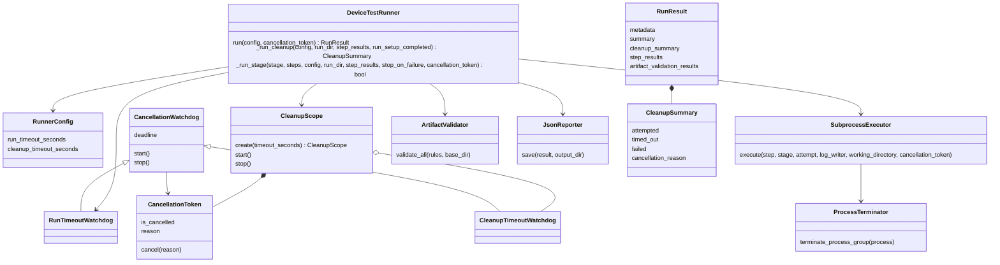
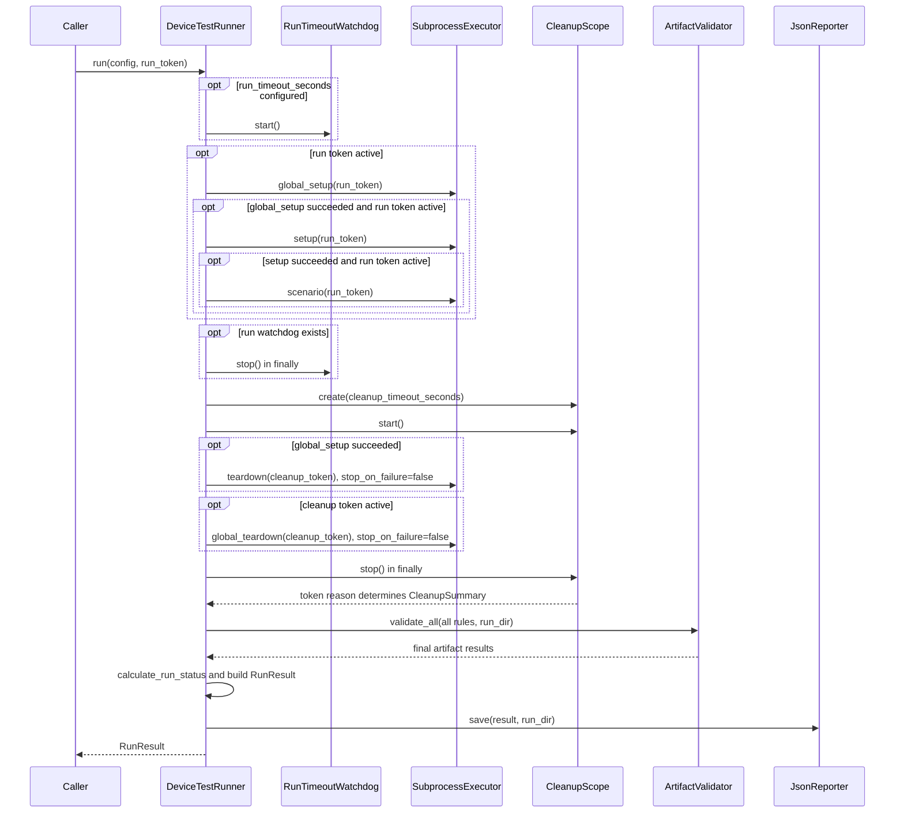

# Device Test Runner v1.6.3 Architecture

Version scope: Cancellation-Aware Cleanup. Source baseline: `f9337ec` plus the inspected working tree, compared with tag `v1.6.2`. This describes implementation, not a verified release.

## Purpose and components

Runner separates normal execution from cleanup. `ConfigLoader.load()` reads optional finite positive `run_timeout_seconds` and `cleanup_timeout_seconds`; missing/null values mean unlimited scope duration. Direct Python dataclass construction does not apply loader validation.

`DeviceTestRunner.run(config, cancellation_token=None)` creates the artifact directory, starts an optional run watchdog and executes global_setup, setup and scenario. It stops that watchdog in a finally block before starting cleanup. Global setup success determines whether teardown runs. Global teardown is attempted regardless of global setup success unless cleanup is already cancelled.

`CleanupScope.create(timeout_seconds)` creates a fresh token and optional CleanupTimeoutWatchdog. Teardown, global teardown and their retry delays share this token and deadline. Ordinary failure does not stop remaining cleanup steps. Scope cancellation prevents new work. Process termination and reader draining may extend past the deadline.

## Execution flow

A watchdog may cancel its token while an executor attempt or retry delay runs. Executor uses ProcessTerminator to stop the attempt group. Cancelled attempts skip validation and retry. Final validation still evaluates every configured rule after cleanup.

## Results and compatibility

`RunnerConfig.cleanup_timeout_seconds` is optional. `RunResult.cleanup_summary` is required for Python callers constructing results directly. JsonReporter serializes it with the rest of the dataclass. `attempted` means a cleanup stage route was entered, including an empty stage; it does not count launched processes. `timed_out` is true when the cleanup token reason is CLEANUP_TIMEOUT. `failed` includes ordinary cleanup failure and scope timeout.

Metadata keeps the original run reason, run timeout and `run_timed_out`; it does not include cleanup_timeout_seconds. Status priority is RUN_TIMEOUT → TIMED_OUT, USER_REQUEST → CANCELLED, cleanup failure → FAILED, cancelled steps → CANCELLED, failed/skipped steps → FAILED, required artifact failure → FAILED, otherwise PASSED.

The shared CancellationWatchdog supplies monotonic deadline and stop-event waiting for both scope watchdog subclasses. `ignore_cancellation` is not part of runner/executor interfaces; separate tokens provide the cleanup behavior.

## Limits

Unexpected exceptions in normal work stop the run watchdog but can bypass cleanup, validation and reporting. Cleanup exceptions stop its watchdog but can bypass reporting. A second SIGINT raises KeyboardInterrupt. Detached descendants and normally exiting parents with surviving background children retain the process limitations described in [Process Lifecycle](../process_lifecycle.md). TIMED_OUT still falls through to CLI exit code 0.

See [Cleanup guide](../cancellation_aware_cleanup.md), [test matrix](../test_matrix/test_matrix_v1.6.3.md) and [completion checklist](../definition_of_done/definition_of_done_v1.6.3.md).
