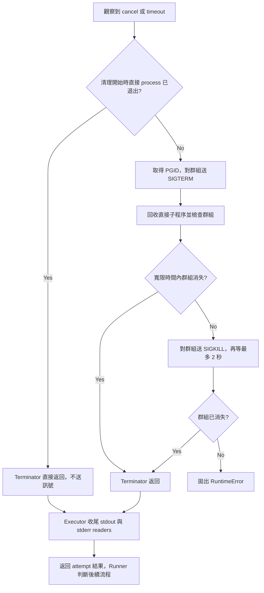

# Device Test Runner Process Lifecycle

Version: v1.6.1

## Purpose

本文件說明一次 attempt 如何啟動、停止與收尾，以及清理和 retry 的關係。閱讀順序是「程序 → 群組 → 輸出 → 下一次 attempt」。類別介面與 UML 見 [Architecture](architecture/architecture_v1.6.1.md)，測試案例見 [Test Matrix](test_matrix/test_matrix_v1.6.1.md)。

## Process model

Executor 用 `Popen(shell=True, start_new_session=True)` 執行命令，讓每次 attempt 有自己的 session 與 process group。沒有自行脫離群組的 child／grandchild，可以一起接收終止訊號。

```text
Device Test Runner
└── Attempt process group
    └── shell / test script（parent）
        └── child
            └── grandchild
```

Parent／child 是誰啟動誰的關係；process group 是一起接收 signal 的範圍。`killpg` 操作的是群組，不是沿著 parent／child 關係搜尋所有後代。

| 元件 | 責任 |
| --- | --- |
| `DeviceTestRunner` | 安排 lifecycle、判斷 retry、驗證 artifacts 與寫入報告 |
| `SubprocessExecutor` | 啟動一次 attempt，監看完成／取消／timeout，收集輸出 |
| `ProcessTerminator` | 對該 attempt 的程序群組送訊號，等待群組退出 |
| stdout／stderr reader threads | 讀取外部程序的兩條輸出串流，保存到結果與 log |

## Normal completion, timeout and cancellation

Executor 每輪依序檢查 process 完成、token 取消、step timeout。正常 polling 間隔為 0.1 秒。

| 情境 | Executor 行為 | 後續結果 |
| --- | --- | --- |
| 直接 process 已完成 | 離開監看迴圈，收尾 reader；不主動清理群組 | 依 exit code 分類；runner 再處理 artifact validation 與 retry policy |
| 程序仍執行且 token 已取消 | 呼叫群組清理，再收尾 reader | 清理成功時為 CANCELLED，不 retry |
| 程序仍執行且已超過 timeout | 呼叫群組清理，再收尾 reader | 清理成功時為 TIMEOUT，符合 retry policy 才重試 |

已觀察到完成的程序優先。如果程序仍執行中，取消與 timeout 同時可見，取消優先。以下流程描述清理成功的路徑；清理例外見後面的錯誤處理說明。

## Cleanup sequence



取得 PGID 或送出 signal 時，如果程序／群組已不存在，程式會處理 `ProcessLookupError`；不要求每次檢查之間程序狀態都保持不變。

### 為什麼不能只看 parent？

例如 parent 收到 SIGTERM 就結束，但 child 故意忽略 SIGTERM。此時 `process.poll()` 已經回傳 exit code，child 卻仍可能工作。

先前清理只等待直接 process 結束，會過早返回。現在進入群組終止流程後，會持續用 `os.killpg(PGID, 0)` 檢查群組，必要時升級 SIGKILL。這是本版的重要修正。

`signal 0` 只檢查存在與權限，不會終止程序。`ProcessLookupError` 表示群組不存在；探測遇到 `PermissionError` 則不能宣告清理完成，會繼續等待到 deadline。這項處理僅針對探測，不表示送出 SIGTERM／SIGKILL 的權限錯誤也會被忽略。

### 等待時間

| 設定／階段 | 目前值 | 說明 |
| --- | --- | --- |
| Step timeout | YAML 的 `timeout_second` | 命令執行逾時門檻，不包含完整清理完成的承諾 |
| Executor polling | 0.1 秒 | 檢查完成、取消與 timeout 的間隔 |
| SIGTERM grace period | 預設 2 秒 | 可由 `ProcessTerminator(grace_period_seconds=...)` 調整 |
| 群組探測間隔 | 預設 0.05 秒 | 可由 `poll_interval_seconds` 調整 |
| SIGKILL 後等待 | 最多 2 秒 | 目前寫在實作中，不是 YAML 設定 |
| Reader join | 每個最多 2 秒 | 依序等 stdout、stderr，並非兩個合計 2 秒 |

這些是分段等待，不是整次 run 的總 deadline。OS 排程、清理例外、lifecycle cleanup 與報告寫入也會影響完成時間。

## Output readers and retry

外部程序透過 pipe 把 stdout／stderr 交給 runner。Reader 等到資料讀完、輸出端關閉後才會結束。Child 若仍持有 pipe，parent 即使已退出，reader 仍可能等待。

因此成功清理路徑的順序是：

1. 停止群組並確認它消失。
2. 等 stdout／stderr reader 結束，保留已讀取內容。
3. Executor 返回 attempt 結果。
4. Runner 判斷是否重試，處理 required artifact targets 與 retry delay。
5. 符合條件才開始下一次 attempt。

真實 retry 測試在 Attempt 2 一開始就確認前次 parent 與 child PID 不存在，不會先 sleep 等它們消失。三層程序測試另外確認兩個 reader 已停止，且 stdout／stderr log 與結果一致。

程序清理與 lifecycle 的 `teardown` 是不同層級。前者停止一次 attempt 的 OS 程序；後者執行使用者設定的清理命令，例如還原裝置狀態。取消後仍依 runner 的 lifecycle 路由執行可到達的 teardown／global_teardown，各 cleanup attempt 使用新的 token。

## Cleanup errors

| 失敗位置 | 目前行為 |
| --- | --- |
| SIGKILL 後群組仍未消失 | Terminator 拋出 `RuntimeError("Process group did not exit after SIGKILL.")` |
| Reader join 後仍存活 | Executor 拋出 `RuntimeError("Output reader thread did not stop.")` |
| Executor 捕捉到 `OSError`／`RuntimeError` | 記錄錯誤，嘗試終止仍存活的直接 process 所屬群組並 join readers；補救成功後回傳 PROCESS_ERROR |
| 補救流程再次拋出例外 | 例外可能離開 executor，不能保證後續 teardown 或 JSON 報告完成 |

因此 timeout／cancel 觸發清理，不代表最終一定保留 TIMEOUT／CANCELLED 分類；清理失敗可能變成 PROCESS_ERROR，或直接以例外中斷流程。

## Ctrl+C and cancellation

第一次 Ctrl+C／SIGINT 呼叫 token.cancel，讓 executor 與 runner 走受控取消流程。第二次 handler 呼叫拋出 KeyboardInterrupt，可能中斷正在進行的清理與報告寫入。

`main.py` 在 run 的 try 區塊捕捉 KeyboardInterrupt 後回傳 130，並在 finally 還原原本 SIGINT handler。一般結果的 CLI exit code 為 PASSED → 0、FAILED → 1、CANCELLED → 130。

要區分兩個方向：Terminator 會送 SIGTERM 給 attempt 群組；但外部送 SIGTERM 給 runner 本身，目前沒有接成 token cancellation。

## Evidence and limits

[Test Matrix](test_matrix/test_matrix_v1.6.1.md) 記錄 parent／child／grandchild、忽略 SIGTERM、reader 收尾、log 保存與 retry 前清理的證據。Fixture、monkeypatch 與模擬方式見 [Test Guide](test_guide.md#v1-6-1)。

目前限制：

- 使用 POSIX process-group API；已有本機 macOS 測試紀錄，不能推論 Windows 支援或 Linux CI 已通過。
- 自行建立新 session／脫離群組的後代不在清理範圍。
- Terminator 開始時直接 process 已退出，會直接返回；這不保證其後代也已退出。
- 正常完成後留下背景後代的情境，沒有主動清理保證。
- 已退出但尚未回收的 zombie 可能仍保有 PID；群組消失時間受 OS 回收行為影響。
- SIGINT 測試直接呼叫 handler，尚未驗證真實終端訊號、handler 還原與 CLI exit code 的完整流程。
- 第二次 Ctrl+C、未處理例外與重複清理失敗，不保證完成 teardown 或保存完整報告。

本文件描述實作與既有測試證據，不新增測試執行紀錄；實際命令與結果見 [Definition of Done](definition_of_done/definition_of_done_v1.6.1.md)。
