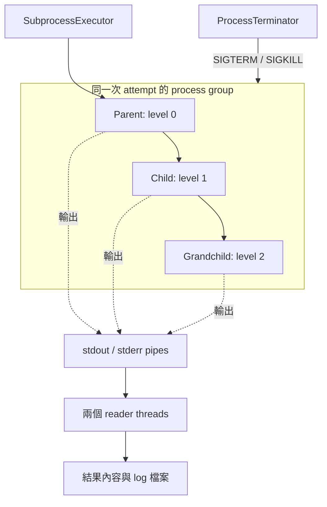

# Device Test Runner v1.6.1 Test Matrix

Version scope: Safe Process Termination. Baseline: Git tag `v1.6.0`; source reviewed at `0dbdc51`.

## Process lifecycle coverage

| Area | Scenario | Level | Expected result | Evidence |
| --- | --- | --- | --- | --- |
| Process | Already exited | Unit, real process + monkeypatch | No group signal; terminated/killed false | `test_process.py::test_terminated_process_does_not_need_cleanup` |
| Process | SIGTERM graceful stop | Unit, real process | Exits without SIGKILL | `test_process.py::test_process_group_terminates_gracefully` |
| Process | SIGTERM ignored | Unit, real process | SIGKILL after grace period | `test_process.py::test_process_is_killed_when_sigterm_is_ignored` |
| Process | PermissionError during group probe | Unit, fake process | Retry probe instead of declaring exit | `test_process.py::test_group_probe_permission_error_does_not_abort_cleanup` |
| Process Group | Child and grandchild stop | Integration | All three recorded PIDs disappear | `test_integration_cancellation.py::test_executor_cleans_entire_tree_and_drains_readers` |
| Executor | Normal completion | Unit, real command | Success, code zero, expected output | `test_executor.py::test_subprocess_executor_return_success` |
| Executor | Timeout cleans group | Integration | TIMEOUT and no surviving tree members | Tree test, timeout cases |
| Executor | Cancel cleans group | Integration | CANCELLED and no surviving tree members | Tree test, cancel cases |
| Executor | Cancel differs from timeout | Integration | Mutually exclusive flags and expected failure type | Tree test, all four cases |
| stdout | Output before cancellation saved | Integration | Each process output appears in result and log file | Tree test, cancel cases |
| stderr | Error before cancellation saved | Integration | Each process error appears in result and log file | Tree test, cancel cases |
| Threads | stdout reader stops | Integration | Recorded stdout thread is not alive | Tree test |
| Threads | stderr reader stops | Integration | Recorded stderr thread is not alive | Tree test |
| Retry | Timeout may retry | Unit + Integration | Configured timeout retries and next attempt passes | `test_runner.py::test_runner_retries_configured_timeout`; `test_integration_retry.py::test_retry_does_not_leave_previous_attempt_process` |
| Retry | Previous cleanup before next start | Unit + Integration | Mock event order matches; real attempt two immediately checks previous parent and child PIDs | `test_runner.py::test_retry_starts_only_after_previous_attempt_cleanup`; real retry test above |
| Retry | Cancel never retries | Unit | One cancelled attempt; policy refuses even explicit CANCELLED allow-list | `test_runner.py::test_cancelled_step_is_not_retried`; `test_retry.py::test_cancelled_is_never_retried` |
| Cancellation | Pre-cancel skips normal lifecycle | Unit, mock executor | Only global_teardown runs | `test_runner.py::test_cancel_before_run_only_runs_global_teardown` |
| Lifecycle | Teardown after cancel | Unit, mock executor | Setup/scenario cancellation reaches teardown with active token | `test_runner.py::test_cancellation_lifecycle_and_summary` |
| Lifecycle | Global teardown after cancel | Unit, mock executor | All parameterized cancellation routes reach global_teardown | Same lifecycle test |
| SIGINT | First Ctrl+C | Unit, direct handler call | Token cancelled without KeyboardInterrupt | `test_signals.py::test_first_sigint_cancels_token` |
| SIGINT | Second Ctrl+C | Unit, direct handler call | KeyboardInterrupt; token remains cancelled | `test_signals.py::test_second_sigint_raises_keyboard_interrupt` |

Unit files are under `tests/test_unit/`; integration files are under `tests/test_integration/`. The tree test has four cases: timeout/cancel × descendants accepting/ignoring SIGTERM. It waits for readiness before cancelling and cleans up even if an assertion fails.

## 閱讀指南：這一版為什麼要測 Process？

一次測試命令可能啟動不只一個程序。例如 Python 測試腳本啟動量測工具，量測工具又啟動另一個背景程式。Timeout 或取消後，如果只停止最外層腳本，裡面的程式可能仍在量測、寫檔或占用裝置。下一次 retry 就可能和前一次互相干擾。

這一版主要確認三件事：**該停止的程序已停止、已產生的 log 有保存、清理完成後才開始 retry。** 上方表格是需求總覽，下方說明各測試如何提供證據。

### 先認識測試會用到的名詞

| 名詞 | 在本專案中的意思 | 讀測試時要注意什麼 |
| --- | --- | --- |
| Process | OS 中正在執行的程式，例如一個 Python 腳本 | Python 的 `Popen` 物件是控制外部程序的物件，不是外部程序本身 |
| PID | 一個程序的識別編號 | 測試把 PID 寫入檔案，清理後再檢查它是否還存在 |
| Parent／child／grandchild | 程序啟動另一個程序，形成父、子、孫的關係 | Parent 結束，不表示 child 也會一起結束 |
| Process group／PGID | 可以一起接收 signal 的程序群組／群組編號 | `killpg` 對群組發訊號；它不會自動搜尋所有父子關係 |
| Session | OS 用來組織程序群組的範圍 | `start_new_session=True` 讓 attempt 建立自己的 session 與 process group |
| Signal | 通知程序採取動作的 OS 機制 | SIGTERM、SIGKILL、SIGINT 的用途不同，見下表 |
| stdout／stderr | 一般輸出／錯誤輸出兩條串流 | 程序終止後，已寫出的內容仍應保留在結果與 log |
| Pipe | 把外部程序輸出送給 runner 的通道 | Child 若仍持有輸出端，parent 結束後 reader 也可能還在等資料 |
| Reader thread | Runner 內負責讀取 stdout 或 stderr 的執行緒 | 本專案各有一個；thread 和外部 process 是不同的東西 |
| Reap／回收 | 父程序取得直接子程序的退出狀態 | `poll()`／`wait()` 可以回收直接子程序，不能因此推論所有後代都結束 |

PID 存在檢查有 OS 層級限制：已退出但尚未回收的 zombie 也可能仍有 PID。因此「查得到 PID」不一定表示它還在做工作；目前測試要求的是 PID 最後消失，跨平台回收行為仍需另外驗證。

| 操作 | 用途 | 本版的使用位置 |
| --- | --- | --- |
| SIGTERM | 請程序結束；程序可以安裝 handler 或忽略它 | 群組清理的第一步。預設動作可直接結束程序，不代表應用程式一定完成自己的清理 |
| SIGKILL | 強制停止，程序無法自行捕捉或忽略 | SIGTERM 寬限時間過後，群組仍存在時使用 |
| SIGINT | 終端按 Ctrl+C 通常產生的訊號 | 第一次要求取消；第二次 handler 呼叫拋出 `KeyboardInterrupt` |
| `os.kill(pid, 0)` | 檢查指定 PID 的存在與權限，不發出終止訊號 | 整合測試檢查舊程序是否消失 |
| `os.killpg(pgid, 0)` | 檢查指定群組的存在與權限，不發出終止訊號 | Terminator 等待群組退出 |

### 測試中的程序與輸出關係



[process_tree.py](../../tests/fixtures/process_tree.py) 使用同一支腳本建立三層程序。每一層記錄 PID、印出 stdout／stderr，再等待停止。`0.ready` 代表三層都完成初始化；cancel 測試等到它出現才取消，避免測到「child 還沒啟動就結束」的情況。

## Unit tests：先確認每個元件的責任

這裡的 Unit 是專案的檔案分類，**不代表全部使用假程序**。`test_process.py` 前三個測試會真的啟動 OS process；權限錯誤測試才用假物件，讓不容易穩定重現的狀況可重複測試。

### ProcessTerminator：怎麼停止程序？

檔案：[test_process.py](../../tests/test_unit/test_process.py)

| Test case | 測試安排 | 關鍵檢查 | 能防止的問題 |
| --- | --- | --- | --- |
| `test_terminated_process_does_not_need_cleanup` | 啟動 `true` 並等它結束，再呼叫 terminator | `terminated=False`、`killed=False`、code 為 0，沒有呼叫 `killpg` | 對已結束的直接程序重複發送訊號 |
| `test_process_group_terminates_gracefully` | 啟動一個會等待的 Python process，再要求終止 | Process 結束，`terminated=True`、`killed=False` | 正常接受 SIGTERM 的程序也被不必要地強制終止 |
| `test_process_is_killed_when_sigterm_is_ignored` | 程序安裝忽略 SIGTERM 的 handler，印出 ready 後才開始清理 | `killed=True`，process 已結束 | 程序忽略停止通知，runner 卻一直等待或留下背景工作 |
| `test_group_probe_permission_error_does_not_abort_cleanup` | 模擬 SIGTERM 成功、群組探測沒有權限、下一次探測群組已消失 | 呼叫順序為 SIGTERM → probe → probe，沒有 SIGKILL | 把一次探測的權限錯誤當成程序已結束，或立刻中斷清理 |

最後一個測試使用 pytest `monkeypatch` 暫時替換 `getpgid`／`killpg`，搭配 `FakeProcess` 與 list 記錄呼叫。PID `123` 是測試資料，不會拿去終止真實 OS 程序。測試結束後 pytest 會還原替換。

### Executor：逾時後有沒有交給 terminator？

檔案：[test_executor.py](../../tests/test_unit/test_executor.py)

`test_subprocess_executor_raised_timeout_error` 把時間與 process 都模擬出來，讓測試不用真的等待 timeout。它確認：

1. Executor 呼叫一次 `terminate_process_group(process)`。
2. 模擬終止後的 return code 是 `-SIGTERM`；負值代表被該 signal 終止。
3. 結果為 `TIMEOUT`，`timed_out=True`、`cancelled=False`、`success=False`。

這個測試驗證的是 **Executor 有委派清理並保留正確分類**。真正的 OS 群組是否停止，由 integration tests 驗證。正常完成則由 `test_subprocess_executor_return_success` 驗證 exit code 與輸出。

### Runner 與 SIGINT：流程順序是否正確？

| 檔案／案例 | 驗證方式 | 證據範圍 |
| --- | --- | --- |
| [test_runner.py](../../tests/test_unit/test_runner.py)：`test_retry_starts_only_after_previous_attempt_cleanup` | 假 executor 記錄 start、timeout、cleanup、return 等事件，確認第一次 cleanup 在第二次 start 之前 | 驗證 runner 的呼叫順序；沒有啟動真實 process |
| [test_signals.py](../../tests/test_unit/test_signals.py)：`test_first_sigint_cancels_token` | 直接呼叫一次 handler | Token 變成 cancelled，沒有拋出 KeyboardInterrupt |
| 同檔：`test_second_sigint_raises_keyboard_interrupt` | 先呼叫一次，再用 `pytest.raises` 檢查第二次 | 第二次確實拋出 KeyboardInterrupt，token 仍為 cancelled |

SIGINT 單元測試不會真的對 pytest 按 Ctrl+C，也不驗證終端訊號傳遞。這讓 handler 規則可以穩定測試，但不能代替 CLI 端到端測試。

## Integration tests：真的啟動程序，確認整段流程

### 從單一 child 到三層程序

檔案：[test_integration_cancellation.py](../../tests/test_integration/test_integration_cancellation.py)

| Test case | 主要檢查 | 與三層測試的關係 |
| --- | --- | --- |
| `test_executor_cancels_running_process` | 真實 command 被取消，分類為 CANCELLED，保留 started 輸出 | 基本取消流程 |
| `test_stdout_reader_thread_finishes_after_process_termination` | Executor 返回 cancelled，stdout 保留 start | 間接確認執行能收尾；沒有直接記錄 reader 狀態 |
| `test_stderr_is_drained_after_cancellation` | 取消前的 error-message 留在 result.stderr | 基本 stderr 保存 |
| `test_process_group_termination_cleans_child_processes` | Shell 啟動 child，清理後檢查 child PID 消失 | 直接驗證一層 child 清理 |
| `test_executor_cleans_entire_tree_and_drains_readers` | 三個 PID 消失、兩個 reader 已停止、輸出與 log 一致 | 補足 grandchild、忽略 SIGTERM、reader 存活狀態與 log 落盤證據 |

三層測試是一個函式，透過 `pytest.mark.parametrize` 執行四種情境：

| stop_reason | descendant_behavior | 實際情境 | 預期 |
| --- | --- | --- | --- |
| timeout | default | 到達 step timeout，後代正常接受 SIGTERM | TIMEOUT；全部停止 |
| timeout | ignore | 到達 step timeout，child／grandchild 忽略 SIGTERM | TIMEOUT；後代仍需被強制停止 |
| cancel | default | 三層準備好後取消，後代正常接受 SIGTERM | CANCELLED；全部停止 |
| cancel | ignore | 三層準備好後取消，child／grandchild 忽略 SIGTERM | CANCELLED；後代仍需被強制停止 |

每種情境都確認三層各自寫出的 stdout／stderr 保留在結果中，且檔案內容與結果一致；記錄下來的兩個 reader threads 都已不再執行。測試最後也會清理程序，避免測試失敗時留下背景工作。

### Retry：檢查的時間點很重要

檔案：[test_integration_retry.py](../../tests/test_integration/test_integration_retry.py)，fixture：[retry_process.py](../../tests/fixtures/retry_process.py)

`test_retry_does_not_leave_previous_attempt_process` 的流程：

1. Attempt 1 記錄自己的 PID，啟動 child 並記錄 child PID，接著等待到 timeout。
2. Runner 進入清理與 retry 流程。
3. Attempt 2 **一開始就檢查兩個舊 PID**，不先 sleep 等它們消失。
4. 兩個 PID 都不存在，才印出成功訊息並回傳 0；只要還有一個存在，fixture 就回傳失敗。
5. 測試確認第一次為 TIMEOUT、第二次成功，而且執行次數正好是兩次。

如果只在整個 run 結束後檢查 PID，舊程序可能在 Attempt 2 開始後才退出，測試仍會通過。把檢查移到 Attempt 2 開始時，才能攔住兩次 attempt 重疊的問題。

## 本次 Process 修正與回歸測試

以下區分產品清理問題與測試本身的問題，方便日後看到相同錯誤時查找。

| 問題 | 原因與修正 | 對應證據 |
| --- | --- | --- |
| Parent 結束，但 child／grandchild 還活著 | 原本只看直接 process 的 `poll()` 就返回。改成繼續探測整個群組，寬限時間後仍存在就 SIGKILL | 三層測試的兩個 `ignore` 情境；補強時曾重現 timeout／cancel 都因 reader 無法結束而失敗 |
| Reader 一直等不到輸出結束 | 存活後代可能仍持有 pipe。清理群組後 join 每個 reader，並檢查 thread 已停止 | 三層測試同時檢查 PID、thread、result 與 log；reader timeout 例外路徑本身尚無專用測試 |
| 探測群組出現 PermissionError | 「無權檢查」不等於「不存在」。目前繼續等待，直到群組消失或 deadline 到期 | `test_group_probe_permission_error_does_not_abort_cleanup` |
| Retry 測試太晚檢查舊 PID | Run 結束後才檢查，無法證明下一次開始前已清乾淨。改由第二次 fixture 立即檢查 parent 與 child | 真實 retry 整合測試與 runner 事件順序測試 |
| `Mock object cannot be interpreted as an integer` | Mock Popen 的 PID 被傳入真實 `os.getpgid`。Executor 單元測試改為同時注入假 terminator，驗證委派呼叫 | Executor timeout 單元測試；不是在產品程式中把 Mock 轉成整數 |
| `PosixPath is not JSON serializable` | Runner 測試的假 executor 把 Path 放進要求字串的 log path 欄位。改為 `str(path)` | Runner cleanup 順序測試可完成 JSON 寫入；並修正 `retrun` 事件名稱拼字 |
| Retry 測試尚未跑到清理就失敗 | 修正 `fixtures` 路徑、command 結尾引號、`LifecycleSteps`、計數器先轉 int 再加一，以及 `result.artifact_dir` | 真實 retry 測試現在能走完 timeout → cleanup → retry |
| 測試依賴系統存在 `python` 命令 | Process 測試改用 `sys.executable`，沿用執行 pytest 的 Python | 真實 SIGTERM／SIGKILL 單元測試 |

本次修正沒有把正常完成時的背景後代清理、任意 daemon 追蹤或所有例外下的報告保存一併實作。這些仍是下方 Coverage limits 的限制。

### 本次 AI 協作新增與補強的案例

以下記錄 AI 協作新增與修改的案例；驗證範圍見各案例說明。

| 類型 | 案例 | 新增或補強內容 |
| --- | --- | --- |
| 新增 | `test_executor_cleans_entire_tree_and_drains_readers` | 四種真實程序情境；新增 `process_tree.py` fixture；同時檢查三層 PID、兩個 reader 與兩份 log |
| 新增 | `test_group_probe_permission_error_does_not_abort_cleanup` | 可重複的權限探測回歸測試；後續改用 pytest monkeypatch、FakeProcess 與呼叫紀錄 |
| 新增 | `test_first_sigint_cancels_token` | 第一次 SIGINT handler 呼叫取消 token |
| 新增 | `test_second_sigint_raises_keyboard_interrupt` | 第二次 handler 呼叫拋出 KeyboardInterrupt |
| 補強 | `test_terminated_process_does_not_need_cleanup` | 除了結果旗標，也確認沒有送出群組訊號 |
| 補強 | `test_retry_does_not_leave_previous_attempt_process` | 修正測試設定；在第二次開始時檢查前次 parent／child，並驗證成功標記 |
| 修正 | `test_subprocess_executor_raised_timeout_error` | 假 terminator 配合假 process，驗證清理委派、退出狀態與 TIMEOUT 分類 |
| 修正 | `test_retry_starts_only_after_previous_attempt_cleanup` | 修正 log path 字串與事件拼字，讓既有順序斷言能執行完成 |

測試寫法另外補上中文分段註解與 Given／When／Then docstring。註解說明用途；判斷功能有沒有被驗證時，請以 `assert` 與真實／模擬的測試邊界為準。

## 如何執行這些測試

在專案根目錄執行 Process 與 SIGINT 單元測試：

```bash
poetry run pytest tests/test_unit/test_process.py tests/test_unit/test_signals.py -q
```

執行程序清理與 retry 整合測試：

```bash
poetry run pytest tests/test_integration/test_integration_cancellation.py tests/test_integration/test_integration_retry.py -q
```

只看三層程序的四種情境，`-v` 會列出各參數案例：

```bash
poetry run pytest tests/test_integration/test_integration_cancellation.py -k entire_tree -v
```

若使用現有 `.venv`，可將 `poetry run pytest` 換成 `.venv/bin/python -m pytest`。以上是執行方式，不是本次文件補充重新執行測試的紀錄；已觀察到的結果請見下方 Verification。

## Verification

See [Definition of Done](../definition_of_done/definition_of_done_v1.6.1.md) for this update's exact commands, environment and results. There are 162 test functions and 168 parameterized cases. This update adds Given／When／Then docstrings to 12 functions; executable test AST is unchanged.

## Coverage limits

* The tree test checks readers and log files through the executor. Runner lifecycle cancellation still uses mocks; it is not a full CLI cancellation test.
* The real retry test checks the previous parent and child before attempt two does work. It does not create a grandchild; the separate tree test covers three levels.
* SIGINT tests call the handler directly. Real signal delivery, handler restoration and CLI exit codes lack dedicated end-to-end assertions.
* No guarantee is established for detached descendants, normal completion with background children, zombie reaping on Linux, repeated cleanup errors or second-interrupt report finalization.
* Local passing tests do not establish Windows support, successful Ubuntu CI, a total shutdown deadline or GitHub Release publication.

## Pytest 用法

Fixture、mock、參數化與執行方式請見 [測試指南 v1.6.1](../test_guide.md#v1-6-1)。
